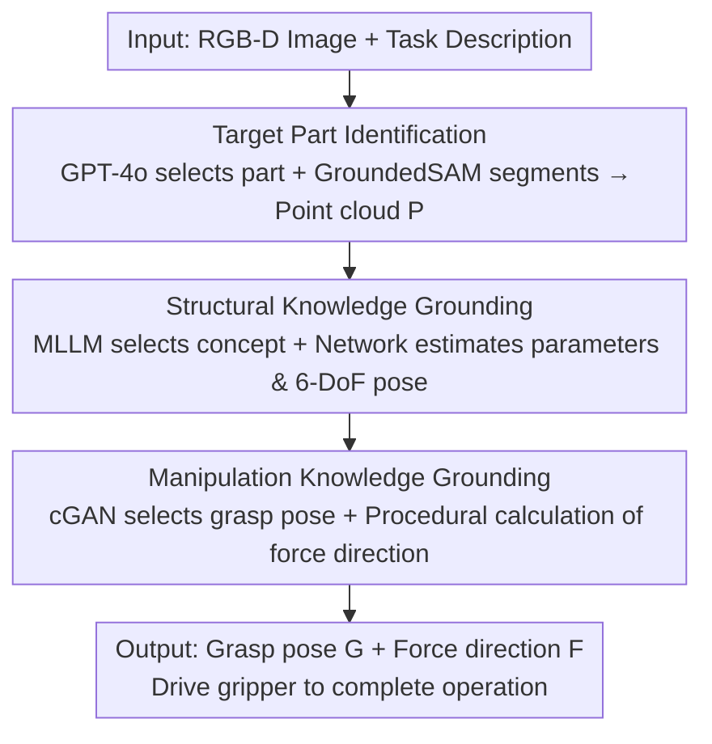

# Physically Ground Commonsense Knowledge for Articulated Object Manipulation with Analytic Concepts

**Conference**: CVPR 2026  
**Paper**: [CVF Open Access](https://openaccess.thecvf.com/content/CVPR2026/html/Wei_Physically_Ground_Commonsense_Knowledge_for_Articulated_Object_Manipulation_with_Analytic_CVPR_2026_paper.html)  
**Code**: None  
**Area**: Robotics / Embodied AI  
**Keywords**: Articulated Object Manipulation, Commonsense Knowledge Grounding, Analytic Concepts, MLLM, 6-DoF Pose Estimation

## TL;DR
This paper proposes "analytic concepts"—a procedural representation of object structure and manipulation knowledge defined via mathematical symbols, directly computable and simulatable by machines. It grounds semantic-level commonsense reasoned by MLLMs into the physical world to guide robots in manipulating articulated objects, achieving approximately a 27% improvement over A3VLM on unseen categories in simulation.

## Background & Motivation
**Background**: Articulated object manipulation (e.g., opening doors, turning faucets, lifting pot lids) requires agents to possess both visual perception and physical reasoning capabilities. Recent mainstream approaches leverage Multimodal Large Language Models (MLLMs): models like GPT-4o read task descriptions and RGB images, using commonsense to judge "where to interact and how to interact," and output semantic-level task plans to guide control policies (e.g., ManipLLM, A3VLM).

**Limitations of Prior Work**: MLLMs operate at the **semantic level**, while robot control operates at the **physical level**, leaving a significant gap between the two. On one hand, directly using natural language knowledge as feature input for policies makes it difficult for the policy to truly recognize physical concepts behind the knowledge (e.g., "handle perpendicular to the axis" does not naturally correspond to an executable force direction in vector space). On the other hand, LLMs are weak at high-precision numerical analysis, making it difficult to fine-tune a model that outputs sufficiently precise physical quantities (e.g., grasp poses, force directions) to support high-precision manipulation.

**Key Challenge**: MLLMs excel at **semantic-level commonsense reasoning**, while robots require **precise physical-level numerical values**. Natural language is ill-suited for describing precise physical structures, and MLLMs are poor at precise numerical calculation—there is a lack of an intermediate representation where both can align.

**Goal**: Construct a bridge to translate semantic knowledge reasoned by MLLMs into physical knowledge that robots can directly calculate and execute, while retaining the generalized commonsense reasoning capabilities of MLLMs.

**Key Insight**: The authors observe that a piece of commonsense knowledge essentially encapsulates the "essential commonalities shared by a set of similar entities." Can these commonalities be written **procedurally using mathematical symbols** in a form that is understandable by humans/MLLMs and directly computable/simulatable by machines?

**Core Idea**: Introduce analytic concepts as the bridge between semantic and physical levels—using primitive geometries (cylinders, cuboids, etc.) and mathematical procedures to define object structure and manipulability. MLLMs handle semantic decisions (which concept to choose, which grasp/force to apply), while analytic concepts translate these decisions into precise 6-DoF poses and force directions.

## Method

### Overall Architecture
Given an RGB-D image of a target object and a natural language task description, the robot must complete the physical interaction using a parallel jaw gripper. The entire pipeline decomposes the "semantic-to-physical" translation into three steps: **Target Part Identification → Structural Knowledge Grounding → Manipulation Knowledge Grounding**. Each step begins with a "Q&A"—where the MLLM makes semantic decisions (choosing parts, concepts, grasps, and force directions). These decisions are then handed over to downstream analytic concepts and parameter estimation networks to produce precise physical quantities. Finally, the robot moves the end-effector to complete the operation. This design allows the MLLM to focus only on its strength—semantic reasoning—while offloading all tasks requiring precise numerical values to the mathematical procedures within the analytic concepts.

### Key Designs

**1. Analytic Concepts: Formulating Commonsense as Computable Mathematical Procedures**

This is the foundation of the paper, addressing the pain point that "semantic knowledge cannot be precisely executed by robots." Each analytic concept consists of three parts: **concept identity**, **analytic structural knowledge**, and **analytic manipulation knowledge**. The concept identity is a unique symbol (e.g., `L_Handle`) accompanied by a concise synopsis, ensuring consistent understanding between humans and MLLMs. Analytic structural knowledge uses primitive geometries (Cylinder, Cuboid, Sphere...) as atoms, combined via mathematical procedures to characterize the commonalities of a category of spatial structures. For example, in an L-shaped handle definition, the axis is a cylinder `axis = Cylinder([A_l, A_d], [-(A_l+L_w)/2, -O, 0])`, and the lever is a cuboid `lever = Cuboid([L_l, L_w, L_h], [0,0,0])`, both subsequently `apply_pose`. These geometries have variable parameters (size, offset, pose), and different instances are represented by different parameter values. Analytic manipulation knowledge formulates each atomic action as a function taking structural parameters as input: grasp poses like `grasp_above(offset)` return `M_0.translate([0, offset, 0]).apply(pose)`, and force directions like `push_clockwise(theta)` are calculated via cross-products with the axis. The key benefit: as long as the MLLM selects the correct concept and action name at the semantic level, the remaining precise values are calculated by these mathematical processes, bypassing the LLM's weakness in numerical reasoning. The authors also verified scalability—volunteers with high school math levels took an average of 2 hours to create a new concept. Currently, 153 concepts have been built, with only a small portion needed to cover a large number of tasks.

**2. Structural Knowledge Grounding: MLLM Concept Selection + Network Parameter/Pose Estimation**

Having a concept library is not enough; abstract concepts must be "affixed" to specific physical objects. This step has two phases. First is **Target Part Identification**: GPT-4o reads the RGB image and task to answer "which part to interact with and its category." The semantic description is fed into Grounded-SAM to obtain a pixel-level segmentation mask, which is applied to the depth map to crop the target part's point cloud $P$. Category information is used to retrieve the corresponding concept group. Second is **Concept Recognition + Parameter Estimation**: the identities and synopses of concepts in the group are fed to the MLLM to determine "which concept best matches the spatial structure of the part," thus aligning semantic understanding with a specific analytic concept. Once a concept is selected, two types of parameters are estimated: (i) **structural parameters** defining the spatial structure, regressed using a Point-Transformer and MLP head (L2 loss); (ii) **6-DoF pose parameters** describing global translation and rotation. First, an encoder+MLP decodes $P$ into a point cloud $P^*$ in canonical space (chamfer distance loss), then the Umeyama algorithm with RANSAC outlier removal estimates the rigid transformation $T \in SE(3)$ from $P^*$ to $P$. Together, these steps precisely ground a mathematically defined concept onto a real object. Error analysis shows these steps—especially structural parameter estimation—are the primary bottleneck of the pipeline.

**3. Manipulation Knowledge Grounding: cGAN Grasp Selection + Procedural Force Calculation**

After structural grounding, manipulation knowledge can be translated into physical values. First, the MLLM answers "which grasp/force direction is most suitable" at the semantic level, followed by grounding. **Grasp Pose** selection is challenging: each grasp type (e.g., `grasp_above`) defines a **class** of poses sharing a pattern, with variable parameters determining the specific one. The authors use a Conditional GAN (cGAN) to select parameters—the generator $G$ produces candidate parameters from Gaussian noise $z$ conditioned on point cloud features, while the discriminator $D$ scores each candidate between $(0,1)$, selecting the highest score. During training, the discriminator is trained first $L_D = -\mathbb{E}_{x\sim p_{data^+}}[\log D(x|y)] - \mathbb{E}_{x\sim p_{data^-}}[\log(1-D(x|y))]$, followed by the generator $L_G = -\mathbb{E}_{z\sim p_z}[\log D(G(z|y))]$, with samples drawn from existing grasp parameters. The **Force Direction** $F$ (e.g., lift up, turn clockwise) is calculated procedurally from structural parameters and the grasp pose, requiring no further learning. Finally, the robot moves the gripper to grasp via $G$ and applies force along $F$. Ablations show that using the network to estimate grasp parameters outperforms random sampling in parameter space, proving the grasp knowledge captures the distribution of feasible grasps.

## Key Experimental Results

### Main Results
Simulations used the SAPIEN simulator with 972 objects suitable for single-gripper manipulation from PartNet-mobility (15 categories: 10 training / 5 testing). Evaluation metric: Success Rate (success if target joint motion exceeds threshold; 5 interaction budget). Compared against 5 representative methods, including SOTA A3VLM.

| Setting | Metric | Ours | A3VLM (Prev. SOTA) | Gain |
|------|------|------|----------|------|
| Training Categories AVG | Success Rate % | 42.5 | 37.4 | ~15.2% |
| Testing Categories AVG | Success Rate % | 40.8 | 32.1 | ~27.1% |
| Table (Complex Articulated) | Success Rate % | 50.6 | 40.0 | ~21.4% |
| Real World 8 Objects AVG | Success Rate | ≈0.78 | ≈0.60 | +0.1~0.3 for most tasks |

The proximity of results in training and testing categories indicates effective generalization to unseen objects—the authors attribute this to the ability of analytic concepts to cover universal commonalities and the MLLM's ability to find the best matching concept via synopses.

### Ablation Study

| Configuration | Key Metric | Description |
|------|---------|------|
| Grasp Params: Estimated vs. Random | Train 42.5 / Test 40.8 vs 40.2 / 38.6 | cGAN estimation outperforms random sampling, proving grasp knowledge utility. |
| End-Effector: Suction | Train 75.5 / Test 73.8 (A3VLM 72.4 / 66.4) | Still leads with suction; A3VLM drops significantly more when switching to grippers. |
| Bottleneck Analysis (GT replacement, Training) | None 42.5 → Struct Param 72.0 → 6-DoF 86.3 | Structural parameter (+20.8) and 6-DoF pose (+14.3) are the largest bottlenecks. |

### Key Findings
- **Physical Grounding is Key to Performance**: Where2Act/Where2Explore (pure visual affordance), GAPartNet (structural representation), and ManipLLM/A3VLM (MLLM reasoning) each only strengthened either "commonsense reasoning" or "structural representation." Ours achieves maximum gain by connecting both via analytic concepts.
- **Gripper Scenarios Show Larger Gap**: Success rates are similar for suction tasks, but for parallel grippers requiring precise grasping, methods relying purely on MLLM numerical reasoning drop significantly, highlighting the advantage of analytic concepts for precision.
- **Bottlenecks in Geometry Estimation, Not Semantic Decision**: GT replacement experiments show that replacing structural parameters/6-DoF poses with ground truth provides the largest gains, while concept identification and force direction calculation are rarely bottlenecks—indicating MLLM semantic choices are already reliable, and future work should focus on point cloud geometry estimation accuracy.

## Highlights & Insights
- **The "MLLM for semantics, Math for numerical" division is clever**: Outsourcing the LLM's weakness (precision) to computable analytic concepts retains generalization while gaining physical accuracy—a reusable "semantic-physical decoupling" paradigm.
- **Analytic Concepts are interpretable, simulatable, and low-cost for crowdsourcing**: Volunteers with high school math skills built concepts in 2 hours with consistent results, proving the representation is cognitively consistent and scalable for engineering.
- **Transferable Framework**: The approach of using "parameterized geometric primitives + mathematical procedures" can be transferred to bimanual manipulation, soft objects, or tool use by expanding the concept library and manipulation functions without changing the MLLM selection layer.

## Limitations & Future Work
- The authors acknowledge that the primary bottlenecks are structural and 6-DoF pose estimation—geometric errors lead to collisions or grasp failures.
- ⚠️ Analytic concepts depend on a predefined library (currently 153); complex or non-rigid structures that cannot be described by primitive geometries may be difficult to represent. Automated discovery/generation of concepts was not detailed.
- Manipulation knowledge is currently focused on single parallel grippers (and suction extensions). Complex scenarios like dexterous hands, bimanual coordination, or long-horizon tasks have not yet been validated.
- Improvement ideas: Use stronger point cloud geometry networks or multi-view/tactile feedback to overcome 6-DoF bottlenecks; explore allowing MLLMs to automatically generate analytic concepts to reduce human effort.

## Related Work & Insights
- **vs Where2Act / Where2Explore**: These learn pixel-wise affordance maps directly from 2D images/point clouds without explicit structure or commonsense. Ours provides physical structure priors and MLLM commonsense, showing stronger generalization to unseen categories.
- **vs GAPartNet**: GAPartNet uses 6-DoF poses of parts as structural representations with heuristic policies but lacks MLLM semantic reasoning. Ours combines structural representation with commonsense reasoning, where manipulation knowledge is parameterized via mathematical procedures rather than fixed heuristics.
- **vs ManipLLM / A3VLM**: These also use MLLMs but let the LLM directly predict affordance/bounding boxes, limited by weak numerical reasoning. Ours lets the MLLM handle semantic selection while numerical values are precisely calculated via analytic concepts, showing clear advantages in high-precision (gripper) scenarios (+27.1% relative gain in test categories).

## Rating
- Novelty: ⭐⭐⭐⭐⭐ The design of "analytic concepts" as a semantic-physical bridge is novel, cleanly decoupling the LLM's weaknesses.
- Experimental Thoroughness: ⭐⭐⭐⭐ Extensive simulation (15 categories) + real world (8 objects) + suction/gripper/bottleneck ablations; real-world scale is somewhat small.
- Writing Quality: ⭐⭐⭐⭐ Motivation and three-step pipeline are clearly explained with sufficient illustrations; some concept details are scattered in the appendix.
- Value: ⭐⭐⭐⭐⭐ Provides an interpretable, scalable paradigm for grounding MLLM commonsense into robot control, offering significant reference value for embodied manipulation.

<!-- RELATED:START -->

## Related Papers

- [\[ICCV 2025\] Adaptive Articulated Object Manipulation On The Fly with Foundation Model Reasoning and Part Grounding](../../ICCV2025/robotics/adaptive_articulated_object_manipulation_on_the_fly_with_foundation_model_reason.md)
- [\[CVPR 2026\] VideoWorld 2: Learning Transferable Knowledge from Real-world Videos](videoworld_2_learning_transferable_knowledge_from_real-world_videos.md)
- [\[CVPR 2026\] AffordGen: Generating Diverse Demonstrations for Generalizable Object Manipulation with Affordance Correspondence](affordgen_generating_diverse_demonstrations_for_generalizable_object_manipulatio.md)
- [\[CVPR 2026\] Learning to Control Physically-simulated 3D Characters via Generating and Mimicking 2D Motions](learning_to_control_physically-simulated_3d_characters_via_generating_and_mimick.md)
- [\[CVPR 2026\] TrajRAG: Retrieving Geometric-Semantic Experience for Zero-Shot Object Navigation](trajrag_retrieving_geometric-semantic_experience_for_zero-shot_object_navigation.md)

<!-- RELATED:END -->
