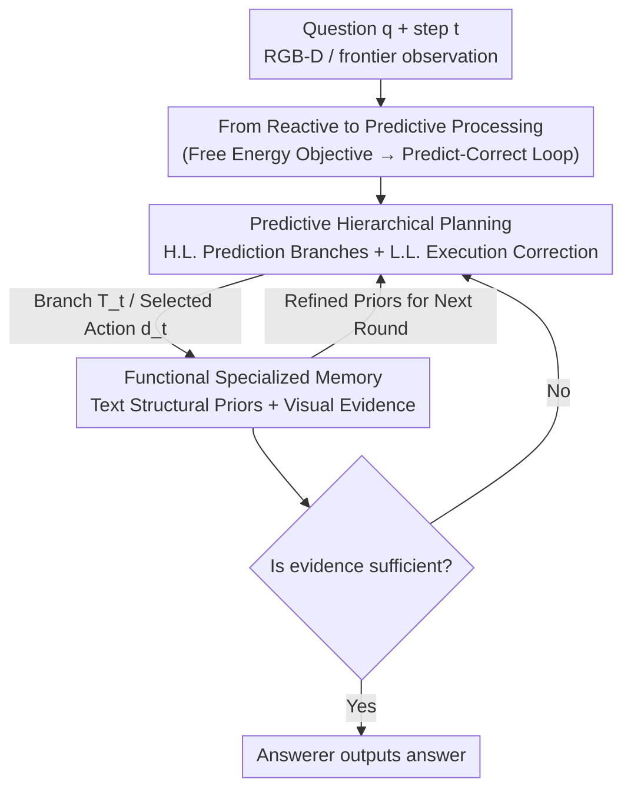

# Predict Before You Explore: Predictive Planning with Specialized Memory for Embodied Question Answering

**Conference**: CVPR 2026  
**Paper**: [CVF Open Access](https://openaccess.thecvf.com/content/CVPR2026/html/Yuan_Predict_Before_You_Explore_Predictive_Planning_with_Specialized_Memory_for_CVPR_2026_paper.html)  
**Code**: https://github.com/yuanrr/Pred-EQA  
**Area**: Embodied AI / Robotic Navigation  
**Keywords**: Embodied Question Answering (EQA), Predictive Planning, Hierarchical Planning, Specialized Memory, Active Inference

## TL;DR
Pred-EQA transforms Embodied Question Answering (EQA) from a "look-and-move" reactive exploration into a "predict-then-explore" loop of prediction and correction. A high-level planner predicts where evidence might be hidden to generate exploration branches with long-term intent; a low-level executor actively reduces uncertainty within these branches and prunes them upon prediction failure. Coupled with a dual-memory system that separates "stable structural priors" from "question-relevant visual evidence," the method achieves SOTA performance in both answer accuracy and exploration efficiency on A-EQA and Express-Bench.

## Background & Motivation
**Background**: EQA requires agents to navigate 3D scenes, collect visual evidence, and answer questions based on fragmented observations. With the advancement of VLMs in static scene understanding, the prevailing approach uses a VLM as a "semantic planner" to determine the next frontier based on current observations, while storing all past observations in a monolithic memory (e.g., scene graphs, semantic maps, or video memory).

**Limitations of Prior Work**: This approach suffers from two primary issues. First, planning is **reactive**: decisions are made step-by-step based only on the current view, lacking long-term intent across steps, which leads to inconsistent actions and "goal drift" (circular trajectories). Second, memory is **monolithic**: storing a massive amount of navigation data in a single structure causes sparse, critical evidence for answering questions to be drowned out by irrelevant frames, leading to interference during retrieval.

**Key Challenge**: The essence of EQA is **partial observability**—only a small portion of the scene is visible at each step, and the environment changes relative to the agent. This contradicts the "near-full observability and one-shot planning" assumptions common in LLM agents for tool-use or robot control; directly applying those methods leads to cascading errors due to incomplete information. Furthermore, there is an inherent trade-off when mixing "stable spatial structures" needed for navigation with "sparse semantic evidence" for QA in a single memory.

**Key Insight**: The authors leverage the perspective of **predictive processing / active inference** from cognitive science—humans do not passively respond to sensory inputs but actively predict future observations based on priors, correcting these priors when predictions fail. This "predict-correct" loop maintains coherent intent under limited or noisy views, and prediction naturally categorizes observations into "question-irrelevant stable priors" and "question-relevant evidence."

**Core Idea**: Reformulate EQA as "predicting before exploring." A high-level planner predicts evidence locations to form exploration branches, while a low-level executor performs uncertainty-reducing actions to validate or correct these predictions. Simultaneously, dual memories anchor stable priors and sparse evidence separately to achieve coherent trajectories under partial observability.

## Method

### Overall Architecture
Pred-EQA organizes EQA as a **recursive "Predict → Correct → Update" loop**, deployed within a multi-agent framework. The baseline utilizes only first-person RGB-D input and TSDF-based frontier extraction (without relying on object detectors, scene graphs, or semantic maps), ensuring reasoning emerges purely from interaction and accumulated observations. At each step $t$, the system performs three tasks: **Prediction** (the High-Level Planner predicts semantic exploration branches $T_t$ likely containing missing evidence, encoding long-term intent rather than reflections of the current view); **Correction** (the Executor tests branches sequentially to confirm or falsify predictions, pruning contradictory branches to drive exploration via prediction); and **Update** (updating two specialized memories—Textual Memory for stable semantic/spatial priors and Visual Evidence Memory for question-specific observations). The updated memories serve as refined priors for the next round. The process is orchestrated by Answerer, High-Level Planner, Executor, Recorder, and Manager agents; the Answerer outputs an answer once evidence is deemed sufficient, otherwise triggering further exploration.

### Key Designs

**1. From Reactive to Predictive Processing: Formulating "Predict-Correct" as an Optimization Objective**

This design addresses the fundamental question of why planning requires prediction. The authors model the agent's goal using the Variational Free Energy lower bound from active inference:

$$F(s, q, a) = D_{KL}\big(Q(\psi \mid s, q, a)\,\|\,P(\psi, s \mid q)\big) - \mathbb{E}_Q[\log P(a \mid \psi, s, q)].$$

Here, $Q(\psi)$ represents the agent's belief about the latent semantic structure $\psi$ given historical observations $s$, question $q$, and planned actions $a$. The KL term constrains internal beliefs to align with "task-conditioned spatial/semantic priors," encouraging **stable predictions** of unseen structures. The expected log-likelihood term favors actions that **reduce uncertainty**, pushing exploration towards locations where prediction errors are most informative. Minimizing $F$ naturally yields a predict-correct cycle: predict unseen views → act to verify → update beliefs upon discrepancy. This formula grounds two design principles: the KL term leads to Predictive Hierarchical Planning, and the information separation leads to Functional Specialized Memory.

**2. Predictive Hierarchical Planning: High-Level Predicting "Where Evidence Is," Low-Level "Reducing Uncertainty"**

This design resolves the issue where reactive planning treats each step as an isolated decision, making it prone to partial observability and goal drift. At step $t$, the **High-Level Predictive Planner** receives the question $q$ and text structural memory $H_t = \{h_1, \dots, h_{t-1}\}$. Its role is not to pick an immediate frontier but to **predict what information is missing and where that evidence might be**, outputting a structured prediction branch:

$$T_t = \{(\tau_i, \sigma_i, \alpha_i)\}_{i=1}^{M},$$

where $\tau_i$ is a hypothesized semantic prediction (e.g., "the kitchen might be at the end of this hallway"), $\sigma_i \in \{\text{pending, active, done}\}$ tracks progress, and $\alpha_i$ is a **refined annotation** used to update, confirm, or archive predictions inherited from $T_{t-1}$ (e.g., "irrelevant; kitchen already identified"). The VLM planner recursively maintains and revises hypotheses via $T_t \leftarrow \text{H.L.Planner}(q, H_t, T_{t-1})$. The **Low-Level Executor**, given $T_t$, selected snapshots $S'_t$, textual priors $H_t$, and frontiers $F_t$, selects the action $d_t$ that minimizes expected free energy based on three principles: ① Maximum Information Gain (choosing frontiers that best resolve branch uncertainty); ② Commonsense Guidance (using room-object priors to rank frontiers when visual cues are absent); and ③ Consistency-Driven (following high-level plans to maintain coherent trajectories).

**3. Functional Specialized Memory: Decoupling "Stable Structural Priors" and "Sparse Question Evidence"**

This design addresses "monolithic memory" issues where dense trajectory records overwhelm sparse key evidence. Pred-EQA splits memory into two systems based on predictive processing functions. **Textual Structural Memory** captures semantic regularities and spatial layouts that remain stable over time. Instead of raw frames, it stores symbolized entries $e_t = (\text{Step}_t, \text{Agent Type}_t, \text{Agent Content}_t, \text{Position}_t)$, aggregated by the Recorder into textual priors $h_t \leftarrow \text{Recorder}(\{e_{t,i}\}, q)$ and accumulated as $H_t$. **Visual Evidence Memory** retains only the "error signal" evidence used to verify or refute predictions. At each step, a VLM Manager filters raw snapshots into a question-relevant subset $S'_t \leftarrow \text{Manager}(q, S_t, H_t)$. A snapshot is kept only if it meets specific criteria: containing answer-related info, providing non-symbolic spatio-visual cues, or offering a non-redundant view of uncertain areas. Frontiers are only pruned if they have been visited and confirmed as irrelevant. This allows navigation to rely on clean structural priors while QA relies on refined visual evidence.

### A Full Example
Query: "What is hanging on the oven handle?". Initially, the high-level planner generates branches: `[pending] Hallway might lead to kitchen`, `[pending] Living area might lead to kitchen`, `[active] Oven might be on the counter`. The executor selects the hallway frontier based on information gain and commonsense. Upon arrival, visual evidence confirms the kitchen is found; the branches are corrected: `completed; kitchen found`, `irrelevant; kitchen found`. The "hallway/living area" predictions are archived, leaving only the "oven counter" branch active. The Manager stores "snapshots containing the oven handle" and discards irrelevant hallway frames. The Recorder logs "kitchen at the end of the hallway" in the textual memory. Subsequent rounds focus on the oven area until the Answerer provides the result.

## Key Experimental Results

### Main Results
Evaluated on A-EQA (subset of Open-EQA using GPT-4 for LLM-Match accuracy and LLM-SPL exploration efficiency) and Express-Bench ($C$, $C^*$, $E_\text{path}$, $d_T$). Both use HM3D real indoor scans. Pred-EQA is a pure VLM pipeline using Qwen3-VL via vLLM, with a maximum of 50 steps per episode.

| Dataset | Metric | Pred-EQA (Qwen3-VL 8B) | Prev. SOTA | Gain |
|--------|------|------|----------|------|
| A-EQA | LLM-Match ↑ | 53.3 | 52.6 (3D-Mem, GPT-4o) | +0.7 |
| A-EQA | LLM-SPL ↑ | 48.5 | 42.6 (MTU3D) | +5.9 |
| A-EQA | LLM-Match (Open 7B) | 46.2 (Qwen2.5-VL 7B) | 35.5 (ToolEQA*) | +10.7 |
| Express-Bench | $C^*$ ↑ | 70.54 | 65.77 (ToolEQA†) | +4.77 |
| Express-Bench | $C$ ↑ | 52.58 | 42.21 (ToolEQA†) | +10.37 |
| Express-Bench | $E_\text{path}$ ↑ | 47.66 | 25.82 (ToolEQA†) | +21.84 |

Notably, using a smaller open-source VLM (Qwen2.5-VL 7B), the method outperforms various closed-source agents using GPT-4o, indicating that gains stem from the **predictive architecture** rather than model scale. While $d_T$ (average geodesic distance) is not the lowest, the authors explain that Pred-EQA stops once sufficient evidence is gathered, rather than forcing a physical approach to the target object.

### Ablation Study
| Configuration (Qwen3-VL 8B) | LLM-Match ↑ | LLM-SPL ↑ | Description |
|------|---------|---------|------|
| Baseline (Multi-agent Reactive) | 45.7 | 39.5 | No predictive planning or specialized memory |
| + Predictive Planning | 50.8 | 45.1 | Planning only: +5.1 / +5.6 |
| + Specialized Memory | 47.8 | 42.2 | Memory only: +2.1 / +2.7 |
| + Both (Full) | 53.3 | 48.5 | Synergy: +7.6 / +9.0 |

Planning strategy comparison (Qwen3-VL, no specialized memory): Reactive Executor (45.7/39.5), TODO-list planning (47.7/39.9), and Predictive planning (50.8/45.1). This demonstrates that flat sub-goal lists become obsolete quickly in partially observable 3D environments, whereas predictive planning maintains coherent hypotheses.

### Key Findings
- **Modular Synergy**: On Qwen2.5-VL, adding planning and memory separately yields +3.5 and +1.5 LLM-Match. Combined, they yield +6.0 LLM-Match and +13.2 LLM-SPL. Predictive planning provides hypotheses while specialized memory preserves key evidence for verification.
- **Predictive > TODO-list > Reactive**: Fixed sub-goal lists lead to fragile trajectories due to "committing to soon-obsolete goals." Correctable branches are key to long-term consistency.
- **Strong Scalability**: LLM-Match improves monotonically from Qwen2.5-VL 3B (38.6) to Qwen3-VL 32B (56.3), showing robustness across model scales.
- **Significant Efficiency Gains**: The >20% improvement in $E_\text{path}$ on Express-Bench suggests that predictive guidance effectively reduces redundant detours.

## Highlights & Insights
- **Theoretical Grounding**: "Predictive planning + dual memory" is derived from a Free Energy objective rather than heuristic module stacking. The KL term, likelihood term, and information separation map directly to design choices.
- **Correctable Branch Annotation $\alpha_i$**: Using a simple annotation line allows the planner to revise or archive hypotheses across steps, creating an explicit state machine (pending/active/done) for long-term consistency.
- **Functional Memory Separation**: Textual memory for navigation priors and visual memory for sparse QA evidence. This "navigation vs. QA" division is applicable to other long-term embodied tasks like rearrangement.
- **Small Model Superiority**: Open-source 7B models exceeding GPT-4o agents strongly suggests that "architecture > scale" in the EQA domain.

## Limitations & Future Work
- Heavy dependence on VLM prediction quality: If the high-level planner generates plausible but incorrect hypotheses, it may lead to inefficiencies despite low-level correction.
- $d_T$ (geodesic distance) is not optimal, suggesting the architecture does not prioritize the physically shortest path, which may require adaptation for tasks like grasping.
- Evaluation still relies on LLM-as-a-judge (GPT-4/GPT-4o-mini), potentially introducing model bias. Experiments are limited to HM3D indoor scenes; generalization to outdoor or dynamic environments is unverified.

## Related Work & Insights
- **vs Reactive Frontier Methods (Explore-EQA / 3D-Mem)**: These methods pick frontiers locally and store all observations. Pred-EQA maintains explicit prediction branches and functional memory separation, improving A-EQA LLM-SPL from ~42 to 48.5.
- **vs TODO-list / Sub-goal Planning**: Flat lists become obsolete in 3D; Pred-EQA's branches can be incrementally falsified or archived, improving long-term consistency.
- **vs Tool-calling / Robot LLM Agents (ToolEQA / GraphEQA)**: Those methods often assume near-full observability and rely on external detectors. Pred-EQA is pure VLM-driven and explicitly models partial observability, outperforming ToolEQA on Express-Bench without detectors.

## Rating
- Novelty: ⭐⭐⭐⭐⭐ Reframing EQA via Predictive Processing provides a fresh perspective.
- Experimental Thoroughness: ⭐⭐⭐⭐ Comprehensive evaluation across two benchmarks and multiple scales, though focused on indoor scenes and LLM judges.
- Writing Quality: ⭐⭐⭐⭐ Clear mapping between theory and architecture.
- Value: ⭐⭐⭐⭐⭐ High practical significance for low-cost Embodied AI deployment.

<!-- RELATED:START -->

## Related Papers

- [\[CVPR 2026\] Extending Embodied Question Answering from Perception to Decision](extending_embodied_question_answering_from_perception_to_decision.md)
- [\[CVPR 2026\] Learning Predictive Visuomotor Coordination](learning_predictive_visuomotor_coordination.md)
- [\[CVPR 2026\] RoboAgent: Chaining Basic Capabilities for Embodied Task Planning](roboagent_chaining_basic_capabilities_for_embodied_task_planning.md)
- [\[CVPR 2026\] Do You Have Freestyle? Expressive Humanoid Locomotion via Audio Control](do_you_have_freestyle_expressive_humanoid_locomotion_via_audio_control.md)
- [\[CVPR 2026\] D3D-VLP: Dynamic 3D Vision-Language-Planning Model for Embodied Grounding and Navigation](d3d-vlp_dynamic_3d_vision-language-planning_model_for_embodied_grounding_and_nav.md)

<!-- RELATED:END -->
