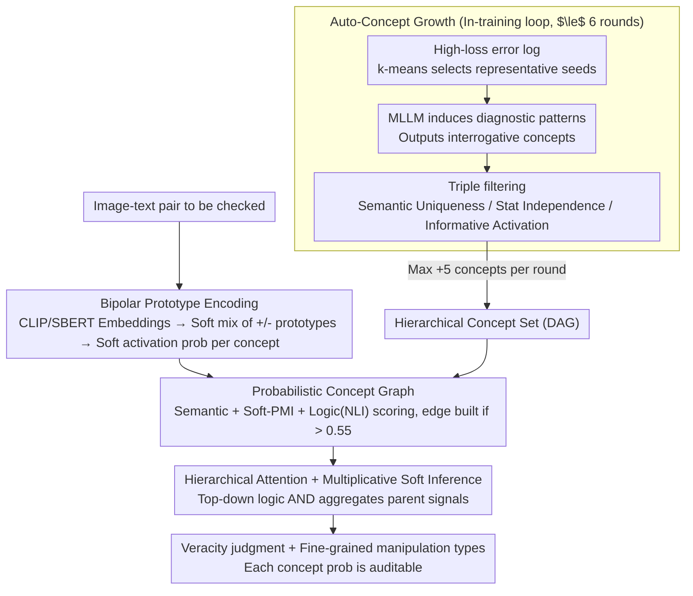

# Probabilistic Concept Graph Reasoning for Multimodal Misinformation Detection

**Conference**: CVPR 2026  
**arXiv**: [2603.25203](https://arxiv.org/abs/2603.25203)  
**Code**: [https://github.com/2302Jerry/pcgr](https://github.com/2302Jerry/pcgr)  
**Area**: Robotics  
**Keywords**: Multimodal misinformation detection, concept graph reasoning, probabilistic inference, explainable AI, automatic concept growth

## TL;DR

This paper reformulates multimodal misinformation detection (MMD) as a structured probabilistic reasoning problem based on a concept graph. It proposes the PCGR framework, which utilizes MLLMs to automatically discover and verify human-understandable concept nodes, constructing a hierarchical probabilistic concept graph. This achieves interpretable misinformation detection and comprehensively outperforms 13 baselines across three benchmarks.

## Background & Motivation

1. **Background**: Multimodal misinformation (fake news/rumors combining images and text) is increasingly prevalent. Existing detection methods mainly fall into two categories: (1) end-to-end black-box models (fusing image-text features for direct classification), which perform well but lack interpretability; (2) mechanism-driven models (based on manipulation types or retrieved evidence), which offer higher transparency but depend on fixed concept sets, making them difficult to adapt to new manipulation techniques.
2. **Limitations of Prior Work**: Black-box models cannot explain the decision-making process, making them difficult to trust. Existing explainable methods either rely on fixed human-defined concept sets (poor generalization) or only generate post-hoc explanations (disconnected from the actual reasoning process).
3. **Key Challenge**: Human fact-checkers use structured reasoning to judge the veracity of information (decomposition $\rightarrow$ individual verification $\rightarrow$ comprehensive judgment), but existing models lack this auditable reasoning process.
4. **Goal**: (a) How concept sets can automatically expand to adapt to new manipulation methods; (b) How to embed probabilistic reasoning into the model architecture rather than post-processing; (c) How to simultaneously support coarse-grained (true/false) and fine-grained (manipulation type) detection.
5. **Key Insight**: Inspired by the human fact-checking process, MMD is modeled as a sequence of "concept-level evaluation $\rightarrow$ hierarchical reasoning $\rightarrow$ comprehensive adjudication," where each concept is represented by a soft probability rather than a hard judgment.
6. **Core Idea**: Construct an automatically growing hierarchical probabilistic concept graph that embeds reasoning directly into the model architecture, ensuring that every transition concept state is auditable.

## Method

### Overall Architecture

PCGR reformulates multimodal misinformation detection as structured probabilistic reasoning on a "concept graph." Instead of direct classification using fused features, it first grows a set of human-readable judgment dimensions (each being an interrogative concept, e.g., "Does the text exaggerate the event?"). The activation probability for each image-text pair relative to these concepts is calculated and aggregated top-down according to the dependencies between concepts to derive the veracity judgment. The entire pipeline follows a "build-then-infer" approach: first, an MLLM automatically discovers and verifies concepts and organizes them into a hierarchical Directed Acyclic Graph (DAG); then, the instance to be checked is encoded into the concept space, calculating soft activation probabilities for each concept; finally, hierarchical soft reasoning is performed on the graph, aggregating uncertainty layer by layer into a final conclusion. The key is that the reasoning process is not a post-hoc explanation but the model architecture itself—the probability of every intermediate concept can be inspected and intervened upon.

### Key Designs

**1. Auto-Concept Growth: Evolving Judgment Dimensions with Manipulation Techniques**

Fixed concept sets cannot keep up with constantly evolving fabrication tactics. Thus, PCGR treats "discovering new concepts" as an internal training loop. It maintains an "error log" of high-loss samples and uses k-means clustering each round to select representative seed pairs. These are fed to an MLLM (e.g., GPT-5 / Qwen3-omni) acting as an "expert fact-checker." The model analyzes why these samples are misleading, induces reusable diagnostic patterns, and outputs concise interrogative concepts. New concepts are not all accepted; they must pass three filters: semantic uniqueness (cosine similarity with existing concepts $\le 0.8$ to avoid repetition), statistical independence (Pearson correlation $\le 0.9$ to avoid redundancy), and informative activation (expected activation probability within $[0.05, 0.95]$ to avoid trivial dimensions). With at most 5 new concepts per round for up to 6 rounds, the concept set expands without uncontrolled inflation.

**2. Bipolar Prototype Encoding: Distinguishing "No Evidence" from "Counter-Evidence"**

The activation probability of each concept cannot be treated simply as a binary classification output, as "failing to find supporting evidence" is distinct from "finding opposing evidence." PCGR maintains both positive and negative prototypes $h_i^+, h_i^-$ for each concept $c_k$, representing its activated and inactivated states respectively. The actual representation is a soft mixture of the two based on the activation degree: $h_i = \tau_i h_i^+ + (1-\tau_i) h_i^-$. During encoding, two independent CLIP streams extract image-text embeddings $v, t$, and Sentence-BERT extracts the concept description embedding $d_i$. A low-rank bilinear interaction then calculates the logit for each concept: $\ell_k = h_k \oplus \mu_k U^\top \text{diag}(\phi(e_k)) V^\top \nu_k$, $p_k = \text{Linear}(w_k \ell_k + b_k)$. This bipolar structure maps "lack of evidence" to an intermediate probability rather than a direct negative judgment, preventing subsequent aggregation from being misled by insufficient information.

**3. Probabilistic Concept Graph and Multiplicative Soft Inference: Aggregating Clues via "Logical AND"**

Concepts are not merely flattened; PCGR places image-text pairs at the base layer $\mathcal{L}_0$, with higher layers growing upward into a DAG. The existence of an edge is determined by three dependency signals: semantic dependency (cosine similarity of embeddings), statistical dependency (soft PMI, $\log \frac{\bar{p}_{ij}}{\bar{p}_i \bar{p}_j}$, measuring frequent co-activation), and logical dependency (entailment/contradiction scores from an NLI model):

$$s_{ij} = -\alpha\cos(h_i,h_j) + \beta\,\text{Soft-PMI} + \gamma r_{ij}^{ent} - \delta r_{ij}^{contr}$$

An edge is built only if $s_{ij}$ exceeds the threshold $\zeta=0.55$. Inference proceeds top-down, with high-level abstract hypotheses providing priors for low-level details. The final posterior probability for each concept aggregates parent signals multiplicatively: $\hat{p}_i = \lambda p_i \cdot (1-\lambda) \prod_{j \in Pa(i)} (\alpha_{ij} p_j)$, where father node weights $\alpha_{ij}$ are provided by top-down hierarchical attention. Multiplicative aggregation is used because misinformation judgment is essentially credible only when multiple consistent clues "hold simultaneously"—which is the semantics of a logical AND. Any single parent node providing a strong negation significantly lowers the score of the entire chain, making it more robust and providing better probability calibration than weighted sums.

### A Complete Example

To trace the pipeline using a fake news example: the input is a manipulated photo of a scene paired with exaggerated text. During encoding, the concept "Does the text exaggerate the event?" is activated due to the intense wording ($p\approx 0.8$), the concept "Is the image generated/edited?" is triggered by visual artifacts ($p\approx 0.7$), while "Are the image and text semantically consistent?" results in low consistency due to the mismatch (i.e., low probability of consistency, strong signal of inconsistency). In the concept graph, these three serve as parent nodes for the high-level hypothesis "This content is credible." During multiplicative aggregation, if any parent provides a strong negation (e.g., very low consistency probability), $\prod_{j\in Pa(i)}(\alpha_{ij}p_j)$ is significantly pulled down, and the "credible" posterior collapses to near 0, leading to a "fake" classification. Throughout this process, users can read node-by-node that "the combination of exaggerated text + forged image + image-text mismatch led to the fake judgment," rather than receiving a black-box score—this is the auditability provided by embedding reasoning into the architecture.

### Loss & Training

The total loss is a weighted sum of the detection objective and concept structure constraints: $L = (1-\eta) L_{veracity} + \eta L_{ortho}$. Here, $L_{veracity}$ is the binary cross-entropy detection loss, and $L_{ortho} = \sum_{i \neq j} \frac{q_i^\top q_j}{\|q_i\|^2 \|q_j\|^2}$ is a concept orthogonality regularization term that forces different concepts to learn non-redundant judgment dimensions (echoing the statistical independence filter in the growth stage). Training employs alternating optimization, allowing the concept generation module and the detection module to update in turns to avoid mutual interference. When data includes fine-grained labels (text manipulation / visual manipulation / cross-modal inconsistency), these labels serve as anchor concepts for $\mathcal{L}_0$ with additional supervision, allowing coarse-grained veracity judgments and fine-grained manipulation identification to share the same concept graph.

## Key Experimental Results

### Main Results (Coarse-grained Detection)

| Method | MiRAGeNews Acc | MiRAGeNews F1 | MMFakeBench Acc | MMFakeBench F1 | AMG Acc | AMG F1 |
|------|---------------|---------------|-----------------|---------------|---------|--------|
| GPT-5 | 56.8 | 54.0 | 58.8 | 57.2 | 59.9 | 57.9 |
| MGCA (Strongest baseline) | 72.3 | 66.6 | 74.1 | 71.3 | 78.2 | 76.8 |
| **PCGR (Ours)** | **80.2** | **70.9** | **80.6** | **73.5** | **84.3** | **79.8** |

### Ablation Study (AMG Dataset)

| Configuration | Description | Performance Gain/Drop |
|------|------|---------|
| w/o acg | Remove auto-concept growth | Mic-F1 and Mac-F1 decreased by ~12.9% and 12.5% (largest drop) |
| w/o dag | Replace hierarchical DAG with flat structure | Significant drop |
| w/o hat | Replace hierarchical attention with standard attention | Significant drop |
| w/o ma | Replace multiplicative aggregation with voting | Notable drop |
| w/o alt | Remove alternating training | Notable drop |
| w/o warm | Remove warmup phase | Moderate drop |
| w/o cf | Remove concept filtering | Moderate drop |

### Key Findings

- **Surpassing GPT-5**: PCGR significantly outperforms GPT-5 across all datasets (e.g., 80.2% vs 56.8% on MiRAGeNews), demonstrating that specialized detectors, despite having fewer parameters, can exceed general MLLMs through explicit reasoning architectures.
- **OOD Robustness**: PCGR remains stable on MiRAGeNews (where the test set includes unknown image generators and publishers), whereas most baselines show significant performance degradation.
- **Auto-Concept Growth as Major Contributor**: Removing ACG leads to the largest performance drop (~12.9%), confirming the critical role of continuous discovery of new concepts for adapting to novel manipulation methods.
- **Fine-grained Detection**: In fine-grained detection tasks for 4 categories in MMFakeBench and 6 categories in AMG, PCGR achieves the best Mic-F1 (68.6% and 75.6%), showing that the concept graph supports both coarse and fine-grained tasks.

## Highlights & Insights

- **Reasoning as Architecture**: PCGR embeds the reasoning process directly into the model architecture rather than relying on external prompting or post-hoc explanations. This makes the reasoning process auditable and intervenable—users can check the probabilities of individual concept nodes to understand why the model made a specific judgment.
- **Elegant Auto-Concept Growth**: The process of MLLM generation $\rightarrow$ triple filtering $\rightarrow$ verification enables continuous evolution of the concept set, avoiding the high cost of manual annotation while ensuring quality through filtering.
- **Rationality of Multiplicative Aggregation**: Using a multiplicative form to approximate a "logical AND" for aggregating concept probabilities is semantically sound—misinformation judgment requires multiple independent clues to hold simultaneously, and any single strong negative signal should "pull down" the final score.

## Limitations & Future Work

- Concept growth depends on the capabilities of the MLLM (e.g., GPT-5); if the MLLM is insensitive to a new manipulation technique, it may fail to generate effective concepts.
- Growth in the number of concepts may increase inference overhead, necessitating regular pruning of inactive concepts.
- Validated only on image-text pairs; temporal reasoning for video misinformation has not been addressed.
- The classification of the paper under the "robotics" area appears inaccurate; it should more appropriately belong to the Multimodal/Trustworthy AI domains.

## Related Work & Insights

- **vs Concept Bottleneck Models (CBMs)**: CBMs use fixed, flat concept spaces, which limits scalability for complex reasoning tasks. PCGR addresses these limitations through hierarchical DAGs and automatic growth.
- **vs Graph-of-Thought (GoT)**: GoT implements graph-structured reasoning in LLMs through prompting but relies on external prompts. PCGR embeds the probabilistic concept graph directly into model parameters without requiring external prompting.
- **vs HAMMER/MGCA**: HAMMER and MGCA are currently the strongest specialized models for MMD but still rely on end-to-end feature fusion. PCGR provides an additional reasoning structure via an explicit concept layer.

## Rating

- Novelty: ⭐⭐⭐⭐⭐ Reformulating MMD as probabilistic concept graph reasoning is a highly original framework design, and the auto-concept growth mechanism is also very novel.
- Experimental Thoroughness: ⭐⭐⭐⭐ Comparison across three datasets and 13 baselines, with detailed ablation and case studies, though lacking reasoning efficiency analysis.
- Writing Quality: ⭐⭐⭐⭐ The framework description is clear and the diagrams are of high quality, though the method section is formula-dense.
- Value: ⭐⭐⭐⭐ Practical value in the field of trustworthy AI/misinformation detection; explainability is a strong selling point.

<!-- RELATED:START -->

## Related Papers

- [\[AAAI 2026\] Reasoning About the Unsaid: Misinformation Detection with Omission-Aware Graph Inference](../../AAAI2026/social_computing/reasoning_about_the_unsaid_misinformation_detection_with_omission-aware_graph_in.md)
- [\[AAAI 2026\] T2Agent: A Tool-augmented Multimodal Misinformation Detection Agent with Monte Carlo Tree Search](../../AAAI2026/social_computing/t2agent_a_tool-augmented_multimodal_misinformation_detection_agent_with_monte_ca.md)
- [\[CVPR 2026\] Bridging Pixels and Words: Mask-Aware Local Semantic Fusion for Multimodal Media Verification](bridging_pixels_and_words_mask-aware_local_semantic_fusion_for_multimodal_media_.md)
- [\[ACL 2026\] Probing Multimodal Large Language Models on Cognitive Biases in Chinese Short-Video Misinformation](../../ACL2026/social_computing/probing_multimodal_large_language_models_on_cognitive_biases_in_chinese_short-vi.md)
- [\[ICML 2026\] IDO: Incongruity-Aware Distribution Optimization for Multimodal Fake News Detection](../../ICML2026/social_computing/ido_incongruity-aware_distribution_optimization_for_multimodal_fake_news_detecti.md)

<!-- RELATED:END -->
