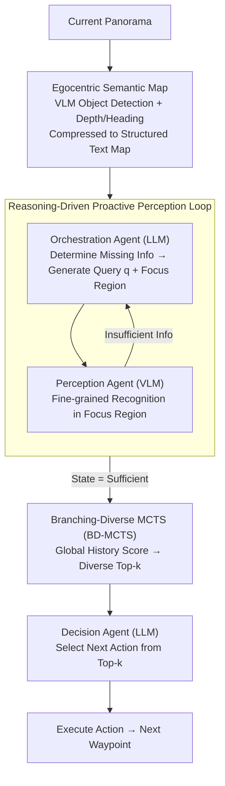

# ProFocus: Proactive Perception and Focused Reasoning in Vision-and-Language Navigation

**Conference**: CVPR 2026  
**arXiv**: [2603.05530](https://arxiv.org/abs/2603.05530)  
**Code**: None  
**Area**: Robotics / Vision-Language Navigation  
**Keywords**: VLN, proactive perception, MCTS, zero-shot navigation, LLM agent

## TL;DR
The study proposes ProFocus, a training-free progressive framework that achieves SOTA performance for zero-shot methods on R2R and REVERIE benchmarks. It utilizes proactive perception (converting panoramas to semantic maps + LLM-generated targeted visual queries) and focused reasoning (BD-MCTS to filter top-k high-value candidates from extensive historical waypoints).

## Background & Motivation
**Background**: Vision-and-Language Navigation (VLN) requires agents to navigate physical environments based on natural language instructions. While foundation model-based VLN methods show promise through post-training adaptation or zero-shot prompting, they generally suffer from two critical flaws.

**Limitations of Prior Work**: (1) Passive visual perception—VLM-driven methods process panoramic or multi-view visual inputs uniformly. Redundant information inflates the number of visual tokens, causing attention to disperse over irrelevant features and obscuring fine-grained cues related to instructions. (2) Non-focused reasoning—existing paradigms receive a large amount of unprioritized historical context containing past observations and waypoints. Long trajectory histories dilute attention, hindering precise reasoning.

**Key Challenge**: Navigation requires selective perception (acquiring only task-relevant information) and focused reasoning (focusing only on high-value historical waypoints), yet existing methods "process everything" in both aspects.

**Goal**: To investigate how to actively acquire task-relevant visual observations to reduce perceptual redundancy and how to focus reasoning on high-value waypoints within a vast historical context.

**Key Insight**: Establishing a closed-loop perception-reasoning cycle through LLM-VLM collaboration and using an MCTS variant to filter key waypoints from global history.

**Core Idea**: The LLM determines "what needs to be known" based on a semantic map and generates visual queries. The VLM performs fine-grained perception in specified regions. Finally, BD-MCTS identifies top-k high-value waypoints from the history for decision-making.

## Method

### Overall Architecture
ProFocus addresses two chronic issues in VLN: "seeing too much and remembering too vaguely." In standard methods, panoramas are fed into VLMs, diluting attention with redundant pixels, and long trajectory histories are piled onto LLMs, overwhelming reasoning with irrelevant waypoints. ProFocus decomposes one navigation step into a "perception-reasoning" closed loop, completed by three specialized agents in a relay: the Orchestration Agent $\mathcal{A}_{\mathrm{orch}}^{\boldsymbol{\theta}}$ (LLM) performs spatial reasoning to identify missing information and where to look; the Perception Agent $\mathcal{A}_{\mathrm{perc}}^{\boldsymbol{\phi}}$ (VLM) performs fine-grained recognition only in designated regions; and the Decision Agent $\mathcal{A}_{\mathrm{dec}}^{\boldsymbol{\psi}}$ (LLM) makes the final selection among the filtered high-value candidates. At each step, the panorama is compressed into a semantic map. The Orchestration Agent initiates rounds of "targeted questioning and focused observation" until information is sufficient. Finally, BD-MCTS selects top-k candidates from the global history for the Decision Agent to output the next action.

### Key Designs

**1. Egocentric Semantic Map: Compressing Pixels into LLM-Readable Text**

Feeding panoramas directly to VLMs results in massive visual token redundancy, and LLMs cannot interpret orientation from raw pixels. The semantic map approach segments the panorama into $K$ directional views, allowing the VLM to detect all objects $\{(\boldsymbol{b}_i, \textit{obj}_i)\}_{i=1}^{N_t}$ in parallel. Monocular depth estimation provides the depth $d_i$ for each object, and the heading angle is calculated based on the horizontal position of the bounding box:

$$h_i = \pi \cdot \frac{x_1 + x_2 - F}{F}$$

The entire observation is organized into a structured map $\mathcal{C}_t = \{(h_i, \textit{obj}_i(\boldsymbol{b}_i), d_i)\}_{i=1}^{N_t}$ and formatted as natural language. Consequently, the LLM receives bearing and distance text (e.g., "a door 2 meters ahead to the left") instead of pixels, enabling direct spatial reasoning and avoiding visual token expansion.

**2. Reasoning-Driven Proactive Perception Loop: Seeking Only What is Needed**

Passive perception processes all views regardless of task requirements, causing fine-grained cues to be lost in redundancy. ProFocus uses reasoning to drive perception: the Orchestration Agent synthesizes the semantic map, trajectory history, and instructions to identify missing information, generating a specific visual query $\boldsymbol{q}$ and a focus region $\boldsymbol{R}_{\text{focus}}^t$:

$$(\boldsymbol{q}, \boldsymbol{R}_{\text{focus}}^t) = \mathcal{A}_{\mathrm{orch}}^{\boldsymbol{\theta}}(\mathcal{C}_t, \boldsymbol{\tau}_t, \mathcal{I}, \mathcal{H}_{\text{query}})$$

The Perception Agent performs fine-grained recognition $\boldsymbol{a}_i^t = \mathcal{A}_{\mathrm{perc}}^{\boldsymbol{\phi}}(\boldsymbol{\mathcal{O}}_t|_{\boldsymbol{R}_{\text{focus}}^t}, \boldsymbol{q})$ only in this region, returning results to the Orchestration Agent. This "questioning-focused observation-sufficiency check" loop continues until the state $s_t = \text{sufficient}$. Compared to passive methods, this saves visual tokens and captures fine-grained attributes (e.g., "the color of the door") that passive scanning might miss.

**3. Branching-Diverse MCTS (BD-MCTS): Selecting Top-k from Global History**

Standard MCTS is designed to "choose one optimal action." However, as trajectories lengthen in VLN, waypoints accumulate, potentially diluting the Decision Agent's attention. BD-MCTS changes the objective to "selecting diverse top-k candidates." It maintains a search tree $\mathcal{T} = \langle \boldsymbol{V}_{\mathcal{T}}, \boldsymbol{E}_{\mathcal{T}}, Q, N \rangle$. During expansion, it uses the semantic value $V_{\text{sem}}(u)$ for initialization instead of expensive random rollouts. During backpropagation, it dynamically refines node values:

$$Q(v) \leftarrow Q(v) + \frac{R_t - Q(v)}{N(v)}$$

Finally, it aggregates path scores by combining cumulative semantic value with a physical distance penalty:

$$\text{Score}(v) = V_{\text{path}}(v) - \lambda \cdot \frac{d_{\mathcal{G}}(v_t, v)}{\max_{u} d_{\mathcal{G}}(v_t, u)}$$

The distance term ensures candidates are physically reachable, while the branching constraint (maximum 2 children per parent) forces top-k candidates to cover different exploration directions rather than clustering on a single path. Only these top-k high-value candidates enter the Decision Agent's context.

### Mechanism Example
Consider the instruction "Go to the kitchen and stop next to the fridge." The current panorama is segmented into $K$ views; the VLM detects objects (door, table, hallway) and adds depth/heading to form the semantic map: "a door 3m ahead-right, a table 2m left...". The Orchestration Agent notices the instruction mentions "kitchen" but the map lacks kitchen cues. It generates the query "Is there a kitchen behind the door?" focusing on the door view. The Perception Agent zooms in, identifies "fridge and stove visible behind the door," and the Orchestration Agent marks the info as $\text{sufficient}$. BD-MCTS then scores historical waypoints: candidates leading to the kitchen door score highest due to high semantic value and proximity, while a nearby hallway intersection is kept as a sub-optimal candidate for diversity. Finally, the top-k candidates are passed to the Decision Agent, which selects "Go to the kitchen door" without scanning the entire history.

## Loss & Training
ProFocus is a **completely training-free** framework. It requires no fine-tuning or model training. All three agents directly call off-the-shelf LLMs (Qwen3-Max / DeepSeek-V3) and VLMs (Qwen3-VL-Max / GLM-4.5V). This allows for plug-and-play capability with stronger foundation models.

## Key Experimental Results

### Main Results
Results on R2R validation unseen set:

| Method | NE↓ | OSR↑ | SR↑ | SPL↑ |
|:---|:---:|:---:|:---:|:---:|
| NavGPT (GPT-4) | 6.46 | 42.0 | 34.0 | 29.0 |
| MapGPT (GPT-4V) | 5.63 | 57.6 | 43.7 | 34.8 |
| MSNav (GPT-4o) | 5.24 | 65.0 | 46.0 | 40.0 |
| **Ours (ProFocus, Q3+Q3VL)** | **4.92** | **65.0** | **52.5** | **39.8** |
| **Ours (ProFocus, DS3+GLM)** | 5.21 | 63.0 | 50.0 | 41.2 |

### Ablation Study

| Configuration | SR↑ | SPL↑ | Description |
|:---|:---:|:---:|:---|
| NavGPT† (DS3) | 36.0 | 28.1 | No proactive perception, no focused reasoning |
| MapGPT† (GLM) | 41.4 | 30.8 | Passive perception based on VLM |
| ProFocus (DS3+GLM) | 50.0 | 41.2 | + Proactive perception + BD-MCTS |
| ProFocus (Q3+Q3VL) | 52.5 | 39.8 | Further Gain with stronger foundation models |

### Key Findings
- SR improved from 36.0% (NavGPT) to 52.5%, an absolute gain of 16.5 percentage points.
- Proactive perception enhances both efficiency and accuracy by reducing visual tokens and strengthening fine-grained attribute recognition.
- The diversity constraint in BD-MCTS is crucial for avoiding local optima.
- The training-free framework outperforms several trained methods in zero-shot settings.

## Highlights & Insights
- Distinct three-agent collaboration (Orchestration for planning, Perception for execution, Decision for reasoning) mirrors human cognitive processes in navigation.
- The performance gap between "proactive" and "passive" perception demonstrates that concise, focused visual information is superior to voluminous, redundant data.
- BD-MCTS introduces a prioritized memory access mechanism similar to human cognition—humans do not recall all historical states with equal weighting.
- The training-free nature allows the framework to benefit immediately from advancements in LLM/VLM capabilities.

## Limitations & Future Work
- API cost and latency—multiple LLM/VLM calls per step result in high overhead and slow execution.
- Dependency on the quality of object detection and depth estimation for semantic maps.
- Prompt sensitivity—performance may vary when switching foundation models, requiring prompt re-tuning.
- Limited benchmark scope—currently evaluated on R2R and REVERIE, excluding more challenging continuous environment navigation.

## Related Work & Insights
- **NavGPT**: Transforms panoramic scenes into text descriptions using passive perception.
- **MapGPT**: Utilizes VLM for map representations but still processes all views passively.
- **AO-Planner**: Uses SAM for visual reachability cues but lacks an active query mechanism.
- Insight: The paradigm of proactive perception mixed with focused reasoning can be generalized to other long-horizon reasoning tasks, such as dialogue systems or long-document QA.

## Rating
- Novelty: ⭐⭐⭐⭐ The combination of proactive perception loops and BD-MCTS is innovative.
- Experimental Thoroughness: ⭐⭐⭐⭐ Robust results on R2R and REVERIE with multiple model configurations.
- Writing Quality: ⭐⭐⭐⭐ Clear structure and rigorous formalization.
- Value: ⭐⭐⭐⭐ High utility as a training-free, general-purpose enhancement module for LLM/VLM navigation tasks.

<!-- RELATED:START -->

## Related Papers

- [\[CVPR 2026\] FantasyVLN: Unified Multimodal Chain-of-Thought Reasoning for Vision-and-Language Navigation](fantasyvln_unified_multimodal_chain-of-thought_reasoning_for_vision-and-language.md)
- [\[CVPR 2026\] AwareVLN: Reasoning with Self-awareness for Vision-Language Navigation](awarevln_reasoning_with_self-awareness_for_vision-language_navigation.md)
- [\[CVPR 2026\] Towards Open Environments and Instructions: General Vision-Language Navigation via Fast-Slow Interactive Reasoning](towards_open_environments_and_instructions_general_vision-language_navigation_vi.md)
- [\[CVPR 2026\] HTNav: A Hybrid Navigation Framework with Tiered Structure for Urban Aerial Vision-and-Language Navigation](htnav_a_hybrid_navigation_framework_with_tiered_structure_for_urban_aerial_visio.md)
- [\[CVPR 2026\] ActiveVLA: Injecting Active Perception into Vision-Language-Action Models for Precise 3D Robotic Manipulation](activevla_injecting_active_perception_into_vision-language-action_models_for_pre.md)

<!-- RELATED:END -->
