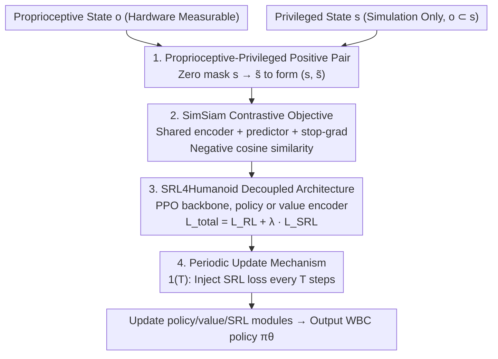

# PvP: Data-Efficient Humanoid Robot Learning with Proprioceptive-Privileged Contrastive Representations

**Conference**: CVPR 2026  
**Paper**: [CVF Open Access](https://openaccess.thecvf.com/content/CVPR2026/html/Yuan_PvP_Data-Efficient_Humanoid_Robot_Learning_with_Proprioceptive-Privileged_Contrastive_Representations_CVPR_2026_paper.html)  
**Code**: https://github.com/myismyname/SRL4Humanoid  
**Area**: Robotics / Embodied AI  
**Keywords**: Humanoid Robot, Whole-Body Control, State Representation Learning, Contrastive Learning, Reinforcement Learning

## TL;DR
PvP treats the "privileged state" available only during humanoid robot training as a "natural data augmentation" for proprioceptive observations. By pulling the two representations closer using SimSiam-style contrastive learning, it allows the policy encoder to learn compact and task-relevant representations **without requiring any manual augmentation**, thereby significantly improving the sample efficiency and final performance of Reinforcement Learning (PPO) in whole-body control tasks.

## Background & Motivation

**Background**: Whole-Body Control (WBC) of humanoid robots is central to coordinating dozens of joints to achieve balance, locomotion, and manipulation. In recent years, a mainstream approach is to use Reinforcement Learning (RL, especially PPO) to directly learn a policy from observations to joint actions, such as BeyondMimic for large-scale motion tracking and HugWBC for unified multi-gait control.

**Limitations of Prior Work**: RL has **extremely low sample efficiency** in WBC. Humanoid robots have complex dynamics, are underactuated, and operate under partial observability (POMDP). Moreover, the reward design is a weighted sum of various sub-terms (e.g., tracking accuracy, energy consumption, action smoothness), leading to high sampling complexity, slow training, and instability.

**Key Challenge**: The community uses State Representation Learning (SRL) to compress high-dimensional, noisy sensory inputs into compact representations to improve efficiency. However, both mainstream types of SRL have critical flaws. **Reconstruction-based** methods (such as predicting root linear velocity) preserve a large amount of task-irrelevant details to reconstruct the full state, leading to poor representation quality and generalization. **Single-modality contrastive** methods (such as PIM) operate only on the proprioceptive modality and fail to capture global environment-level information. Neither approach exploits a resource that is currently wasted during humanoid training: the **privileged state** (e.g., root pose, contacts, terrain, which are visible only to the simulator).

**Goal**: To design an SRL method that simultaneously leverages both proprioceptive and privileged information without introducing manual data augmentations or disrupting end-to-end training. This method should seamlessly integrate into PPO training to accelerate simulation training and ensure reliable real-world deployment.

**Key Insight**: The authors notice a critical subset relationship—the proprioceptive state $o$ is a subset of the privileged state $s$ ($o \subset s$). Consequently, the privileged state can be viewed as a "pseudo-augmentation" of the proprioceptive state: discarding the extra privileged information in $s$ reduces it to $o$. This naturally forms a pair of positive samples with a shared origin but different perspectives, which can be fed into contrastive learning. No manual design is needed for augmentation; it exists physically.

**Core Idea**: Perform SimSiam-style contrastive learning between proprioceptive states and privileged states (Proprioceptive-**v**ersus-**P**rivileged, PvP). This treats the privileged state as a "free augmentation" for the proprioceptive representation, enabling the policy encoder to learn task-relevant, noise-resistant, and compact representations.

## Method

### Overall Architecture

PvP aims to solve the problem of "how to enable the policy encoder to learn better state representations without adding manual augmentations or modifying the RL backbone." Overall, it consists of two components: the **PvP contrastive objective** (how to construct positive samples and compute the contrastive loss) and the underlying **SRL4Humanoid framework** (how to insert the SRL loss into PPO and when to update).

The data flow is structured as follows: at each timestep, the system receives both the proprioceptive state $o_t\in\mathbb{R}^n$ (joint positions/velocities, base angular velocity, and gravity vector, which are measurable on physical hardware) and the privileged state $s_t\in\mathbb{R}^m$ (including root pose/velocity, link poses, contact indicators, and terrain features, which are available only during training, satisfying $o\subset s$). By zero-masking the "privileged portions" of $s_t$, the system obtains $\tilde s_t$. Thus, $(s_t,\tilde s_t)$ forms a positive sample pair, which is fed into the **shared-weight** policy encoder through a SimSiam pipeline to calculate the contrastive loss. This contrastive loss is then weighted by $\lambda$ and added to the RL loss of PPO for joint optimization following a "periodic update" schedule. The policy network takes only the proprioceptive state to generate actions, while the value network uses the privileged state to perform value estimation, leaving SRL and RL completely decoupled.

### Key Designs

**1. Proprioceptive-Privileged Positive Pair Construction: Privileged State as Free Augmentation**

The core of contrastive learning lies in how to construct positive sample pairs. Visual contrastive methods like CURL and ATC rely on manual image augmentations (cropping, noise, random masking), but manually augmenting robot state vectors is neither natural nor easy to tune. Single-modality methods like PIM, on the other hand, cannot access environmental information. PvP's key insight leverages the physical relationship $o\subset s$: the privileged state $s$ inherently "contains" the proprioceptive state $o$, along with privileged details visible only during training (such as root linear velocity). Zero-masking the privileged section yields $\tilde s_t=\mathrm{ZeroMasking}(s_t)$, which essentially keeps only the proprioceptive observation. Consequently, $(s_t,\tilde s_t)$ forms a positive sample pair at the same timestamp but with different levels of information: one carries global privileged information, the other contains only proprioception. Pulling this pair closer forces the policy encoder to **infer privileged information from purely proprioceptive inputs**. This provides the policy an indirect path to privileged information and completely eliminates manual augmentations.

**2. SimSiam-style Contrastive Objective: No Negative Samples, Preventing Collapse via stop-gradient**

Once positive pairs are constructed, learning without collapsing (where the encoder maps all inputs to the same constant vector) becomes the next challenge. PvP adopts SimSiam directly, which requires no negative samples, momentum encoders, or large batches. Denoting the policy encoder as $f_\theta$ and the prediction head as $h_\psi$, the states for a positive pair are computed as:
$$z=f_\theta(s),\quad \tilde z=f_\theta(\tilde s),\quad p=h_\psi(z),\quad \tilde p=h_\psi(\tilde z)$$
The loss is formulated using symmetric negative cosine similarity and a stop-gradient on one branch:
$$\mathcal{L}_{\mathrm{PvP}}=D_{ncs}\big(p,\ \mathrm{sg}(\tilde z)\big)+D_{ncs}\big(\tilde p,\ \mathrm{sg}(z)\big)$$
where $D_{ncs}(p,z)=-\dfrac{p}{\lVert p\rVert_2}\cdot\dfrac{z}{\lVert z\rVert_2}$ is the negative cosine similarity, and $\mathrm{sg}(\cdot)$ denotes the stop-gradient operation. The stop-gradient is crucial to prevent collapse: it holds one branch as a constant "target" for the other to approach, preventing both branches from decaying to a trivial joint solution. This mechanism turns "augmenting proprioceptive representations with privileged information" into a lightweight, stable, and plug-and-play auxiliary objective, which is **highly generic across tasks** as it does not rely on hand-crafted augmentations.

**3. SRL4Humanoid Decoupled Architecture: Decoupled SRL and RL, Flexible Encoder Attachment**

To systematically study how SRL aids RL, a unified and pluggably-designed environment is needed. SRL4Humanoid employs PPO as its backbone: the policy network takes the proprioceptive state to generate actions, while the value network takes the privileged state to estimate values. **The SRL and RL processes are completely decoupled**—meaning the SRL loss can be attached to either the policy encoder or the value encoder. The joint optimization objective is defined as:
$$\mathcal{L}_{\mathrm{Total}}=\mathcal{L}_{\mathrm{RL}}+\lambda\cdot\mathcal{L}_{\mathrm{SRL}}$$
where $\lambda$ is a weight coefficient. This framework implements three types of SRL representing different paradigms (SimSiam contrastive, SPR dynamics modeling, and VAE reconstruction), facilitating fair horizontal comparison. Experiments demonstrate that attaching SRL to the **policy encoder** is more stable than attaching it to the value encoder: value encoder attachment leads to slower convergence and even causes training collapse in velocity tracking tasks (where action smoothness drops sharply before recovering).

**4. Periodic Update Mechanism: Avoiding Local Optima from Early Low-Quality Data**

By default, SRL and RL update synchronously, sharing the same batch of data. However, the authors find that continuously applying the SRL loss is not always beneficial and can sometimes slow down learning. This is because large-scale parallel RL produces large amounts of repetitive, low-quality, and homogeneous data early in training, causing the SRL module to **converge prematurely into local optima**, which limits its ability to guide policy learning later. To address this, PvP introduces a periodic update mechanism:
$$\mathcal{L}_{\mathrm{Total}}=\mathcal{L}_{\mathrm{RL}}+\mathbb{1}(T)\cdot\lambda\cdot\mathcal{L}_{\mathrm{SRL}}$$
where $\mathbb{1}(T)$ is an indicator function that equals 1 every $T$ timesteps, and 0 otherwise. This injects the SRL loss only once every $T$ steps. This down-weights early data to avoid premature convergence and saves computational resources. In the experiments, setting the update period to 50 is near-optimal for most SRL methods.

> ⚠️ Regarding the equation numbering in the paper, the joint objective is first introduced as Eq.(5): $\mathcal{L}_{\mathrm{Total}}=\mathcal{L}_{\mathrm{RL}}+\lambda\mathcal{L}_{\mathrm{SRL}}$, followed by Eq.(6) which introduces the periodic update version with the indicator function. The "Eq.(6)" referenced in the algorithm pseudocode refers to this periodic update version; **the original paper text shall prevail under any discrepancies**.

### Loss & Training
- **Total Objective**: $\mathcal{L}_{\mathrm{Total}}=\mathcal{L}_{\mathrm{RL}}+\mathbb{1}(T)\cdot\lambda\cdot\mathcal{L}_{\mathrm{SRL}}$, utilizing PPO as the RL backbone and GAE to estimate advantages.
- **PvP Loss**: Symmetric negative cosine similarity + stop-gradient (see Key Designs 2).
- **Training Pipeline** (Algorithm 1): Each episode begins by sampling rollouts with the current policy and computing returns via GAE. During the inner epochs, a mini-batch $B$ is sampled from the rollouts, which is used to simultaneously compute the policy/value losses and the SRL loss. Finally, the policy network, value network, and SRL modules are updated according to the total objective.
- **Key Hyperparameters**: SRL weight $\lambda$, update interval $T$ (tested 1/50/100, where 50 is optimal in most cases), and training data ratio (10%/50%/100%, constructed using random masking and resampling of proprioceptive segments).

## Key Experimental Results

The experimental platform is the LimX Oli full-sized humanoid robot (31 DOFs) running on IsaacLab, using a single RTX 4090 (24GB). Two tasks are tested: **LimX-Oli-31dof-Velocity** (flat terrain velocity tracking, commands randomly resampled every 10 seconds with x-axis linear velocity $(-0.5,1.0)$ m/s, y-axis $(-0.3,0.3)$ m/s, and z-axis angular velocity $(-1.0,1.0)$ rad/s) and **LimX-Oli-31dof-Mimic** (mimicking 20 pre-recorded human motion clips, up to 43 seconds/4300 frames per clip). Five configurations are compared: PPO, PPO+VAE, PPO+SPR, PPO+SimSiam, and PPO+PvP.

> ⚠️ The original results are presented in learning curves/bar charts (normalized score 0–1, containing mean±standard deviation) without precise numerical tables; the following tables summarize trends from Figures 5–10 of the paper. **The absolute values in the original figures shall prevail**.

### Robot Platform Specifications (LimX Oli)

| Part | Specification | Part | Specification |
|------|------|------|------|
| Height | 165 cm | Weight | 55 kg |
| Shoulder Width | 55 cm | Arm Length | 70 cm |
| Active DoF | 31 | Head DoF | 2 |
| Single Arm DoF | 7 | Waist DoF | 3 |
| Single Leg DoF | 6 | — | — |

### Main Results: Performance of Five Configurations on Both Tasks (Trend Summary, Q1)

| Method | Velocity Tracking (Learning Speed / Final Score) | Motion Mimicry (Final Performance) | Key Observations |
|------|------------------------------|----------------------|----------|
| PPO (vanilla) | Baseline | Baseline | No SRL, slowest convergence |
| PPO+VAE | Limited gain | **Degraded** (below PPO) | Pure reconstruction keeps irrelevant details, hurting performance |
| PPO+SPR | Limited gain | Outperforms PPO | Dynamics modeling offers modest benefits |
| PPO+SimSiam | Limited gain | Outperforms PPO | Single-modality contrastive, moderate benefits |
| **PPO+PvP** | **Significant acceleration** | **Highest** | Dual-modality contrastive, most obvious speedup in velocity tracking, comprehensively leading in action mimicry KPIs |

Supplementary Observation: Regarding the **action smoothness** penalty term in velocity tracking, PvP converges the fastest, which implies both accelerated learning in simulation and gentler action execution for safer real-world deployment. In the motion mimicry task, PvP yields the highest tracking indices in three categories: waist pitch orientation, foot distance, and joint positions.

### Ablation Study: Update Interval and Data Ratio (Q2 / Q3)

| Ablation Dimension | Configuration | Velocity Tracking | Motion Mimicry |
|----------|------|----------|----------|
| Update Interval $T$ | 1 / 50 / 100 | Minimal impact | Noticeable impact, **$T=50$ is optimal for most cases** |
| Training Data Ratio | 10% / 50% / 100% | Curves almost overlap | Higher ratios are better; **SimSiam and PvP benefit the most** |
| Policy vs. Value SRL Attachment | Policy Encoder vs. Value Encoder | **Training collapse** observed on Value Encoder side | Slower convergence on Value Encoder side |

### Key Findings
- **Privileged Information is the Source of Key Gain**: The primary difference between PvP and the single-modality SimSiam is the introduction of privileged states for contrastive learning. This yields the most prominent speedup in velocity tracking and the highest score in the imitation task, indicating that "using privileged states to augment proprioceptive representations" is indeed effective.
- **Reconstruction-based SRL Can Backfire**: VAE actually performs worse than vanilla PPO on the motion mimicry task. This validates the premise that "reconstructing the full state preserves task-irrelevant details," and simply reconstructing sensory data is insufficient to improve efficiency.
- **SRL Should Be Attached to the Policy Encoder**: Attaching SRL to the value encoder results in slower convergence and even training collapse in velocity tracking. Attaching it to the policy encoder is much more stable and effective.
- **Early Data Needs Down-weighting**: Periodic updates ($T=50$) show significant improvements in tasks with higher control precision demands like motion mimicry, confirming that "early low-quality data can trap the SRL module into local optima."
- **Negligible Computational Overhead**: The SRL module runs entirely on the GPU; a single RTX 4090 card is sufficient, without impacting overall training throughput.
- **Real-World Viability**: Sim2Sim is first evaluated in MuJoCo (which is closer to reality than IsaacLab), followed by physical deployment on the LimX Oli humanoid for both velocity tracking and motion mimicry tasks.

## Highlights & Insights
- **Redefining the "Privileged State" as Free Data Augmentation**: In prior work, privileged information was primarily leveraged in teacher-student distillation or the critic network. PvP recognizes that the subset relationship $o \subset s$ inherently qualifies the privileged state as a "pseudo-augmentation" of proprioception. This bypasses the most labor-intensive step of tuning hand-crafted augmentations in contrastive learning. This paradigm is highly transferable to any multi-source observation scenario where certain modalities are available during training but absent during deployment.
- **SimSiam Instead of InfoNCE Streamlines Engineering**: Generating negative samples for state vectors is highly cumbersome. SimSiam's negative-sample-free architecture paired with a stop-gradient perfectly suits robot state contrastive tasks with low integration overhead.
- **Periodic Updates Highlight the Pitfalls of Joint SRL+RL Training**: In highly parallelized RL, homogeneous and low-quality data early in training can cause auxiliary SRL modules to fit prematurely. This insight is alarmingly valuable for any work that treats SRL as an auxiliary task, and can be mitigated by a simple indicator function.
- **SRL4Humanoid Places Three Paradigms in a Unified Framework**: Undergoing evaluation within the same framework provides a benchmark for fair comparison, offering reusable infrastructure for the community.

## Limitations & Future Work
- **Limitations Acknowledged by Authors**: Only a few SRL methods have been validated so far, and more SRL techniques could be incorporated in the future. The current work only uses proprioceptive and privileged states without sensory modalities like RGB or depth, which they plan to extend to perception-driven humanoid control.
- **Self-Identified Limitations**: The results are presented almost exclusively as learning curves with normalized scores, **lacking precise numerical tables and statistical significance tests**. Comparing "which is better" across tasks remains highly qualitative, and normalized scores across different tasks are not directly comparable.
- **Dependency of Privileged Information on Simulators**: The method inherently relies on simulator-restricted privileged states, and the zero-masking assumes strict alignment between the proprioceptive segment within $s$ and $o$. If privileged distributions shift during sim-to-real, the robustness of representations that "infer privileged states" remains to be investigated.
- **Potential Technical Improvements**: Replacing zero-masking with learnable modality dropout ratios or grouping masks across different privileged components could further improve representation quality. Additionally, the interval $T$ is currently a fixed hyperparameter; adaptive scheduling (e.g., decaying the injection frequency as training progresses) may yield superior outcomes.

## Related Work & Insights
- **vs. Reconstruction-based SRL (e.g., world model reconstruction / root velocity prediction)**: These methods reconstruct the entire state, preserving task-irrelevant details and leading to poor representation quality and generalization. PvP uses contrastive learning to directly extract task-relevant features. In the experiments, VAE even degrades on the motion mimicry task.
- **vs. PIM (Single-modality Contrastive)**: PIM operates only on a single proprioceptive modality and fails to gather environment-level information. PvP introduces privileged states for cross-modal contrastive representations, tracking fuller environmental information.
- **vs. CURL / ATC (Visual Contrastive SRL)**: These methods rely on manual image augmentations to build positive pairs. PvP utilizes the physical subset relationship $o \subset s$ to construct "manual-augmentation-free" positive pairs, which is a cleaner fit for robot state vectors.
- **vs. Any2Track (SRL for Motion Tracking)**: Any2Track uses dynamics-aware world models to extract predictive features for resisting perturbation. PvP adopts a contrastive representation philosophy and fully decouples SRL from RL as an easily mountable framework.

## Rating
- Novelability: ⭐⭐⭐⭐ The perspective of "privileged state as free augmentation" is elegant and insightful, though fundamentally it is a transition of SimSiam into a new application setup.
- Experimental Thoroughness: ⭐⭐⭐⭐ The combination of multiple tasks, extensive ablations, and physical deployment verification is comprehensive, though it lacks precise numerical tables and statistical significance tests.
- Writing Quality: ⭐⭐⭐⭐ The chain of motivation-methodology-experiments is highly coherent, with clean equations and flow descriptions.
- Value: ⭐⭐⭐⭐ It provides a reusable SRL4Humanoid framework alongside several joint-training practical guidelines, offering solid utility for data-efficient humanoid learning.

<!-- RELATED:START -->

## Related Papers

- [\[CVPR 2026\] SIR: Structured Image Representations for Explainable Robot Learning](sir_structured_image_representations_for_explainable_robot_learning.md)
- [\[CVPR 2026\] Beyond Mimicry: Learning Whole-Body Human-Humanoid Interaction from Human-Human Demonstrations](beyond_mimicry_learning_whole-body_human-humanoid_interaction_from_human-human_d.md)
- [\[CVPR 2026\] IGen: Scalable Data Generation for Robot Learning from Open-World Images](igen_scalable_data_generation_for_robot_learning_from_open-world_images.md)
- [\[CVPR 2026\] Video2Robo: 3DGS-based Synthetic Data from One Video Enables Scalable Robot Learning](video2robo_3dgs-based_synthetic_data_from_one_video_enables_scalable_robot_learn.md)
- [\[AAAI 2026\] Coordinated Humanoid Robot Locomotion with Symmetry Equivariant Reinforcement Learning Policy](../../AAAI2026/robotics/coordinated_humanoid_robot_locomotion_with_symmetry_equivariant_reinforcement_le.md)

<!-- RELATED:END -->
