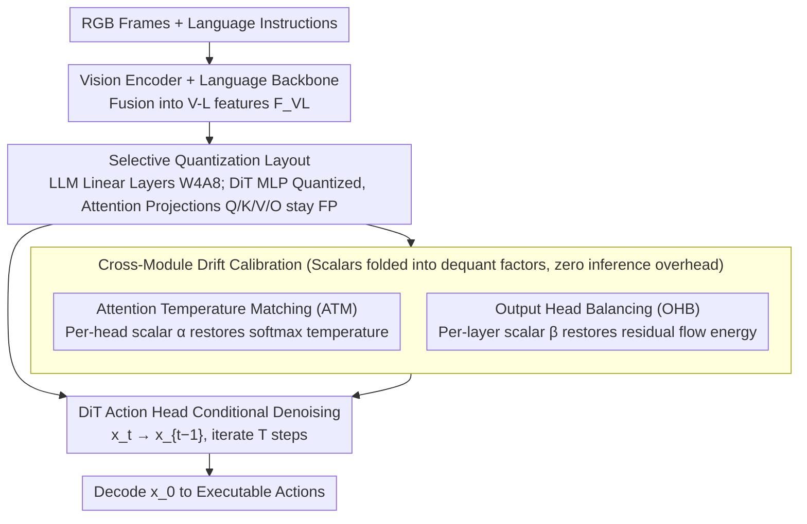

# QuantVLA: Scale-Calibrated Post-Training Quantization for Vision-Language-Action Models

**Conference**: CVPR 2026  
**arXiv**: [2602.20309](https://arxiv.org/abs/2602.20309)  
**Code**: None  
**Area**: Robotics  

## TL;DR

QuantVLA is proposed as the first training-free post-training quantization (PTQ) framework for Vision-Language-Action (VLA) models. By employing a selective quantization layout and two lightweight calibration mechanisms—Attention Temperature Matching (ATM) and Output Head Balancing (OHB)—it achieves approximately 70% memory savings at W4A8 precision while exceeding the task success rate of the full-precision baseline.

## Background & Motivation

1.  **VLA Model Deployment Bottlenecks**: VLA models (e.g., π0.5, GR00T N1.5) unify visual perception, language understanding, and action generation. However, as model size increases, computational and memory requirements expand drastically, hindering practical deployment on robotic embedded platforms.
2.  **Limitations of Prior Work in Efficiency**: Methods like EfficientVLA, VLA-Cache, and MoLe-VLA primarily optimize vision encoders or language layers (via pruning, caching, or routing). Almost no method directly quantizes the Diffusion Transformer (DiT) action head, which is a major contributor to computation and memory.
3.  **Inapplicability of General PTQ Methods**: PTQ methods designed for LLM/VLMs, such as SmoothQuant and DuQuant, struggle with heterogeneous activation distributions caused by tight multimodal coupling in VLAs. Direct application leads to severe performance degradation (e.g., the success rate of π0.5 drops from 97.1% to 76.3% with DuQuant).
4.  **Vulnerability of DiT Action Heads**: Scale drift introduced by quantization alters the effective temperature of attention logits and the energy of the residual flow. These systematic biases accumulate through residual connections and LayerNorm in deep DiT layers, causing unstable action generation.
5.  **First Systematic Analysis**: This work provides the first systematic theoretical analysis of quantization sensitivity in VLA models, revealing two failure modes of cross-module drift: temperature shift and energy drift, and designs targeted solutions accordingly.

## Method

### Overall Architecture

QuantVLA aims to compress VLA models to low bits without degrading task success rates. A diffusion-based VLA consists of three components: a vision encoder (e.g., SigLIP2, DINOv2) to convert RGB frames into image tokens, a language backbone to convert instructions into text tokens, and a DiT action head conditioned on fused vision-language features $F_{\text{VL}}$, robot proprioception, and diffusion timestep $t$ to denoise action latents step-by-step:

$$x_{t-1} = f_\theta(x_t, F_{\text{VL}}, t)$$

After $T$ steps, the final $x_0$ is decoded into executable actions. The quantization base follows the reversible re-parameterization of DuQuant (applying channel-wise smoothing $\Lambda$, block-orthogonal rotations $\hat{R}_{(1)}, \hat{R}_{(2)}$, and sawtooth channel permutations to flatten outliers), but the authors found that direct application fails.

The root cause is identified through first-order error propagation analysis: quantization errors in DiT do not dissipate but accumulate into two types of systematic drift. One is **temperature drift**—where quantization error $\varepsilon_{\text{up}}$ propagates to Q and K, changing the variance of attention logits and effectively shifting the softmax temperature away from the full-precision teacher:

$$\Delta L \approx \frac{1}{\sqrt{d}} \left( (\varepsilon_{\text{up}} W_q) K_T^\top + Q_T (\varepsilon_{\text{up}} W_k)^\top \right) + \Delta L_{\text{local}}$$

The other is **energy drift**—where after multi-head concatenation and output projection, the magnitude of attention output changes systematically, altering the residual injection gain and the operating point of LayerNorm:

$$\Delta O \approx J_{\text{softmax}}(L_T) \Delta L \, V_T W_{o,T} + A_T \varepsilon_{\text{up}} W_v W_{o,T} + A_T V_T \delta W_o + \Delta O_{\text{local}}$$

The framework addresses these issues by using a selective quantization layout to keep the most vulnerable layers in floating point, and two lightweight scalars to pull temperature and energy back to the teacher's operating point.

### Key Designs

**1. Selective Quantization Layout: Not all layers should be quantized; vulnerable attention projections stay FP**

All linear layers in the LLM part are compressed to W4A8 (4-bit weight, 8-bit activation), but in the DiT action head, only the MLP is quantized while attention projections $W_q, W_k, W_v, W_o$ remain in floating point. This trade-off corresponds to the drift analysis: attention projections are the sources of temperature and energy drift, determining softmax distribution stability and residual gain. Quantizing them amplifies errors and propagates them deeper. Ablation results show that quantizing the entire DiT (including attention projections) causes the average success rate of π0.5 to drop from 97.1% to 71.6%, with long-horizon tasks falling from 93.5% to 39.0%. Quantizing only the MLP maintains a success rate of 95.4%. The cost is slightly higher memory (1.28GB vs. 1.17GB for full quantization), but the stability gained is worth the trade-off.

**2. Attention Temperature Matching (ATM): Recalibrating attention temperature with a per-head scalar**

To address temperature drift, ATM calculates a scalar $\alpha$ for each attention head to align the variance of the quantized model's logits with the teacher:

$$\alpha_{\text{raw}} = \frac{\text{Std}(L_T)}{\text{Std}(L_Q) + 10^{-6}}, \qquad \alpha = \text{clip}(\alpha_{\text{raw}}, \alpha_{\min}, \alpha_{\max})$$

The corrected quantized logits are $L_Q = L_T / \alpha$, bringing the effective softmax temperature back to the teacher's level. Crucially, $\alpha$ is folded into dequantization scaling factors after calibration, adding zero operator overhead during inference—essentially correcting the drifted attention distribution for free.

**3. Output Head Balancing (OHB): Restoring residual flow energy with per-layer scalars**

To address energy drift, OHB calculates a scalar $\beta$ for each layer to match the energy after output projection using RMS:

$$\beta_{\text{raw}}(l) = \frac{\text{RMS}(Z_{T,l})}{\text{RMS}(Z_{Q,l)} + 10^{-6}}, \qquad \beta(l) = \text{clip}(\beta_{\text{raw}}(l), \beta_{\min}, \beta_{\max})$$

After correction, $Z_Q = Z_l / \beta(l)$, restoring the residual injection gain and LayerNorm operating point. This prevents drift from snowballing in deep DiT layers. Both ATM and OHB use a conservative strategy: a neutral band $\varepsilon = 0.03$ filters minor differences (setting $\alpha=1$ if $|\log \alpha| < \varepsilon$), and a clipping range of $\pm 0.4$ prevents abnormal heads/layers from pushing scalars to extreme values. Both require only a small amount of unlabeled calibration data and no retraining.

## Main Results

Evaluations were conducted in the LIBERO simulator, including four task suites: Spatial (spatial reasoning), Object (object manipulation), Goal (instruction-goal alignment), and Long (long-horizon decomposition and error accumulation control).

### Table 1: Ablation of Selective Quantization Layout (without ATM/OHB)

| Model | Precision | Quant Range | Spatial | Object | Goal | Long | Avg | Memory(GB) |
|------|------|----------|---------|--------|------|------|-----|----------|
| π0.5 | FP16 | Baseline | 98.5% | 99.0% | 97.5% | 93.5% | 97.1% | 4.27 |
| π0.5 | W4A8 | LLM only | 98.0% | 98.5% | 97.5% | 92.0% | 96.5% | 1.58 |
| π0.5 | W4A8 | DiT only | 81.5% | 94.5% | 71.5% | 39.0% | 71.6% | 3.85 |
| π0.5 | W4A8 | Full LLM+DiT | 86.0% | 97.5% | 71.5% | 50.0% | 76.3% | 1.17 |
| π0.5 | W4A8 | LLM+DiT(MLP) | 98.0% | 97.0% | 94.5% | 92.0% | 95.4% | 1.28 |
| GR00T N1.5 | FP16 | Baseline | 92.0% | 92.0% | 86.0% | 76.0% | 86.5% | 2.02 |
| GR00T N1.5 | W4A8 | LLM+DiT(MLP) | 90.0% | 86.0% | 80.0% | 74.0% | 82.5% | 0.91 |

Key Finding: Quantizing the full DiT (including attention projections) leads to a catastrophic drop (Long task drops from 93.5% to 39.0%), whereas quantizing only the MLP maintains near-baseline performance.

### Table 2: Complete QuantVLA Results

| Model | Method | Precision | Spatial | Object | Goal | Long | Avg | Memory(GB) | Gain |
|------|------|------|---------|--------|------|------|-----|----------|----------|
| π0.5 | FP16 Baseline | FP16 | 98.5% | 99.0% | 97.5% | 93.5% | 97.1% | 4.27 | - |
| π0.5 | DuQuant(LLM+DiT) | W4A8 | 86.0% | 97.5% | 71.5% | 50.0% | 76.3% | 1.17 | 72.6% |
| π0.5 | QuantVLA(LLM) | W4A8 | 98.5% | 99.0% | 96.5% | 96.5% | 97.6% | 1.58 | 63.0% |
| π0.5 | **QuantVLA** | **W4A8** | **98.5%** | **98.0%** | **98.0%** | **96.0%** | **97.6%** | **1.28** | **70.0%** |
| GR00T N1.5 | FP16 Baseline | FP16 | 92.0% | 92.0% | 86.0% | 76.0% | 86.5% | 2.02 | - |
| GR00T N1.5 | DuQuant(LLM+DiT) | W4A8 | 66.0% | 70.0% | 68.0% | 76.0% | 70.0% | 0.74 | 63.4% |
| GR00T N1.5 | **QuantVLA** | **W4A8** | **96.0%** | **92.0%** | **90.0%** | **74.0%** | **88.0%** | **0.91** | **55.0%** |

On π0.5, QuantVLA achieves a 97.6% average success rate at W4A8 precision, **exceeding** the FP16 baseline of 97.1%, while reducing memory from 4.27GB to 1.28GB (70% reduction). Similar improvements over the baseline are observed for GR00T N1.5 (88.0% vs. 86.5%), with 55% memory savings.

### Table 3: Different Quantization Precisions and Denoising Steps

| Set-up | Spatial | Object | Goal | Long | Avg |
|------|---------|--------|------|------|-----|
| π0.5 FP16 | 98.5% | 99.0% | 97.5% | 93.5% | 97.1% |
| π0.5 W4A8 | 98.5% | 98.0% | 98.0% | 96.0% | 97.6% |
| π0.5 W4A4 | 98.5% | 98.5% | 93.5% | 90.5% | 95.3% |
| GR00T N1.5 8 steps | 96.0% | 92.0% | 90.0% | 74.0% | 88.0% |
| GR00T N1.5 16 steps | 96.0% | 94.0% | 84.0% | 80.0% | 88.5% |

Robustness is demonstrated even under aggressive W4A4 precision, maintaining a 95.3% average success rate.

## Highlights & Insights

- **First VLA PTQ Framework**: Achieves successful post-training quantization for VLA models, including DiT action heads, filling a significant research gap.
- **Theory-Driven Design**: Explicitly reveals temperature and energy drift as two failure mechanisms via first-order error propagation analysis. ATM and OHB are theoretically grounded rather than purely empirical.
- **Outperforming Baselines after Quantization**: π0.5 achieves a 97.6% success rate at W4A8, surpassing the 97.1% of FP16; a similar trend is seen in GR00T N1.5, suggesting quantization acts as a form of regularization.
- **Fully Training-Free**: Requires only small amounts of unlabeled calibration data. ATM/OHB scalars are folded into dequantization factors, introducing zero additional overhead and maintaining the original architecture and operator scheduling.
- **Generalization**: Validated across two representative VLA models (π0.5 and GR00T N1.5) and supports various precisions (W4A8, W4A4) and denoising step configurations.

## Limitations & Future Work

- **Limited Evaluation Scenarios**: Validation is restricted to the LIBERO simulator and Simpler benchmark. Lack of real-robot deployment means Sim-to-Real transfer effects are unknown.
- **Unquantized DiT Attention**: The selective layout keeps DiT attention projections in floating point, limiting further memory compression. Quantizing these layers without performance loss remains an open problem.
- **Calibration Data Dependency**: although calibration data requirements are small and unlabeled, the impact of the calibration data distribution on generalization has not been deeply analyzed.

## Rating

- ⭐⭐⭐⭐ Novelty: First successful application of PTQ to VLA models and DiT action heads; failure mechanisms clearly revealed through theoretical analysis.
- ⭐⭐⭐⭐ Value: Training-free, zero inference overhead, 70% memory saving; highly valuable for robotics deployment.
- ⭐⭐⭐ Experimental Thoroughness: Comprehensive ablations across two models and multiple precisions, though lacking real-robot validation.
- ⭐⭐⭐⭐ Writing Quality: Rigorous theoretical analysis; the logical chain from sensitivity analysis to method design is clear and complete.

<!-- RELATED:START -->

## Related Papers

- [\[CVPR 2026\] MoEActok: A MoE-based Action Tokenizer for Vision-Language-Action Models](moeactok_a_moe-based_action_tokenizer_for_vision-language-action_models.md)
- [\[CVPR 2026\] Adaptive Action Chunking at Inference-time for Vision-Language-Action Models](adaptive_action_chunking_at_inference-time_for_vision-language-action_models.md)
- [\[CVPR 2026\] ACoT-VLA: Action Chain-of-Thought for Vision-Language-Action Models](acot-vla_action_chain-of-thought_for_vision-language-action_models.md)
- [\[CVPR 2026\] Cross-Hand Latent Representation for Vision-Language-Action Models](cross-hand_latent_representation_for_vision-language-action_models.md)
- [\[CVPR 2026\] SaPaVe: Towards Active Perception and Manipulation in Vision-Language-Action Models for Robotics](sapave_active_perception_manipulation_vla_roboti.md)

<!-- RELATED:END -->
