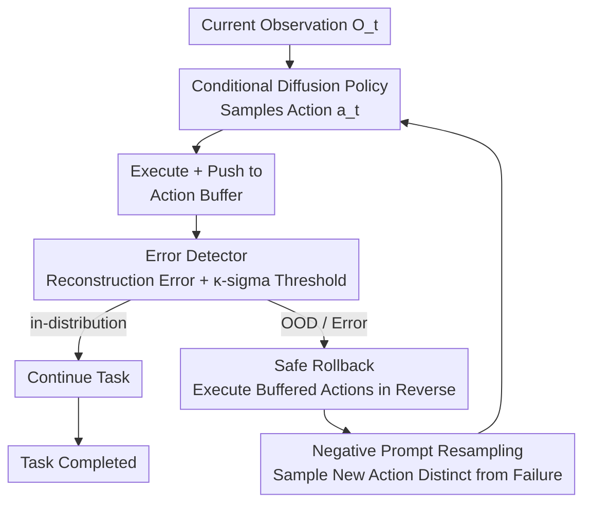

# REACH: Explicit Recovery Behavior for Diffusion Policies

**Conference**: CVPR 2026  
**Paper**: [CVF Open Access](https://openaccess.thecvf.com/content/CVPR2026/html/Ke_REACH_Explicit_Recovery_Behavior_for_Diffusion_Policies_CVPR_2026_paper.html)  
**Code**: None  
**Area**: Robotics / Embodied AI / Diffusion Policies  
**Keywords**: Diffusion Policy, Negative Prompting, OOD Detection, Error Recovery, Robotic Manipulation

## TL;DR
REACH equips diffusion policies with "self-correction" capabilities: an autoencoder-based error detector monitors the execution process. Once it detects that the robot has entered an OOD (failure-prone) state, the robot rolls back along the action buffer to the last safe state. It then feeds the failed action sequence as a **negative prompt** into the diffusion sampler, forcing the policy to sample a "distinctly different" and more robust action at the same decision point, thereby consistently boosting success rates in both simulation and real-robot manipulation.

## Background & Motivation
**Background**: Diffusion Policy has become the mainstream paradigm for robot imitation learning. It can learn complex, multi-modal action distributions from demonstration data, generating multiple "seemingly reasonable" actions for the same observation.

**Limitations of Prior Work**: However, "multi-modality" is a double-edged sword—the multiple reasonable actions sampled for the same observation are **not equally robust**. A certain action might lead the robot into a "robustness blind spot": it looks fine currently, but executing it drives subsequent states into out-of-distribution (OOD) regions unseen by the policy, resulting in task failure. This flaw only exposes itself *after* the action is executed and cannot be distinguished beforehand.

**Key Challenge**: Standard diffusion policies are "one-shot" deals—sampling, executing, and never looking back. There is neither a mechanism to judge whether an action leads to failure, nor a mechanism to roll back and reselect after falling into a trap, let alone a mechanism to guarantee that the same bad action won't be reselected after returning to the starting point.

**Goal**: The authors decompose the problem into three research questions: ① How to identify actions leading to robustness blind spots? ② How to recover after entering non-robust states? ③ How to guide the policy to avoid the exact same error and sample more robust actions after returning to the original decision point?

**Key Insight**: The authors draw inspiration from **negative prompting** in generative models—in text-to-image generation, negative prompts can "push" the generated results away from unwanted features. Since diffusion policies are essentially diffusion models, the failed action sequences can be treated as negative prompts to push the sampler away from the "failure-inducing" direction.

**Core Idea**: By using a triad of "error detection + safe rollback + negative prompt resampling," the diffusion policy is transformed from open-loop execution to **closed-loop self-correction with hindsight**—detecting errors to trigger rollback, and using the recent failed action as a negative condition during rollback to guide the policy's sampling toward a different, superior action.

## Method

### Overall Architecture
REACH (Recovery through Error-Aware Corrective Hindsight) operates through the coordination of three components: a conditional diffusion policy $\pi$, an error detector, and an "action-prompt" buffer. During runtime, it forms a step-by-step closed loop: the current observation $O_t$ is fed into the diffusion policy to sample action $a_t$, which is executed and pushed into the action buffer. Simultaneously, the observation is passed through an autoencoder to calculate the reconstruction error, determining whether the current state is in-distribution or OOD. If no error is reported, it continues along the "green path" toward the task goal. Once an OOD is detected, a **safe rollback** is triggered—the robot executes the recent actions in reverse along the buffer to return to the last known safe (in-distribution) state. Then, the failed trajectory is used as a **negative prompt** to resample, forcing the policy to sample a new action distinctly different from the failed one, retrying until the task succeeds. This entire mechanism is plug-and-play for any diffusion policy and does not require task-specific retraining.

### Key Designs

**1. Autoencoder Error Detector: Using Reconstruction Error as an OOD Alarm**

To achieve closed-loop error correction, the first step is to judge whether the current state is dangerous *before* an actual failure occurs. However, there are no "failed/abnormal" samples in the training data—which is a classic one-class classification problem. Drawing inspiration from Random Network Distillation, the authors use a feedforward autoencoder $E_\phi, D_\phi$ trained only on **normally executed successful observations** to optimize the pixel-wise reconstruction error. Let $i^k\in[0,1]$ be the normalized intensity of the $k$-th pixel of the image, and $\hat i^k$ be the reconstructed value. The loss is:

$$L_n(i,\hat i)=\frac{1}{K}\sum_{k=1}^{K}(i^k-\hat i^k)^2$$

The intuition is: the autoencoder learns the core features of the training distribution, **so reconstruction errors are small for inputs resembling the training data, and large for unseen patterns**. At runtime, the author models the historical error at each step as a Gaussian distribution $s(\mathbf{x})\sim\mathcal{N}(\mu,\sigma^2)$, and uses a $\kappa$-sigma threshold

$$\tau=\mu+\kappa\sigma$$

for decision: when $s(\mathbf{x}_t)>\tau$, an error is triggered to initiate rollback; otherwise, it is deemed normal. This provides the error gate with a **calibrated yet lightweight** simple rule for inference without requiring any OOD samples.

**2. Safe Rollback Maneuver: Generating "Rewind" Sequences by Action Space Type**

Once an error is detected, the robot needs to be rolled back from the bad state to the last safe state. However, "how to rewind" depends on how actions are defined. The authors categorize action spaces into absolute actions (specifying the target state in the global coordinate system) and relative actions (specifying increments relative to the current state). The rewind methods for both differ. For **absolute action spaces**, the rollback sequence is simply the forward sequence in reverse chronological order:

$$\mathcal{W}_r=\{\mathbf{w}_f^T,\mathbf{w}_f^{T-1},\ldots,\mathbf{w}_f^1\}$$

Since each action is itself an absolute target pose, simply walking backward works. For **relative action spaces**, because each step is an increment on SE(3), simple reversal is insufficient; inversion on Lie groups is required. Let the initial pose be $A^0$, and the accumulated pose at step $t$ be $\mathbf{A}^t=A^0 a_f^1 a_f^2\cdots a_f^t$. The rollback sequence $\mathbf{A}_r^t$ must satisfy $\mathbf{A}^t\mathbf{A}_r^t=A^0$, meaning $\mathbf{A}_r^t=a_r^t a_r^{t-1}\cdots a_r^1$—i.e., each step's increment is inverted and then composed in reverse chronological order to guarantee a return to the original pose. Distinguishing between these two spaces is crucial, otherwise blindly reversing relative actions will drive the robot to completely incorrect positions.

**3. Negative Prompt Guidance: Treating Failed Actions as Negative Prompts to Push Action Sampling Away**

Returning to a safe state only solves "escaping the bad state." If the policy resamples the exact same bad action at the same decision point, it will fall into an infinite loop. This is where negative prompting comes into play. The authors design the diffusion policy as a **conditional diffusion model conditioned on both observations and actions**, allowing classifier-free guidance (CFG) extension for negative conditions just like in text-to-image: given a positive condition $c$ (desired) and a negative condition $c_{neg}$ (the failed action sequence in the buffer), the guided noise prediction is:

$$\tilde{\boldsymbol{\epsilon}}_\theta(\mathbf{x}_t,t,c,c_{neg})=\boldsymbol{\epsilon}_\theta(\mathbf{x}_t,t,c)+w\cdot\big(\boldsymbol{\epsilon}_\theta(\mathbf{x}_t,t,c)-\boldsymbol{\epsilon}_\theta(\mathbf{x}_t,t,c_{neg})\big)$$

It pushes the generation process aligned with the positive condition $c$, while **moving away from** the direction aligned with the negative condition $c_{neg}$. The guidance scale $w$ controls the strength of the "push." The prompt and the policy output actions are isomorphic and are encoded into the feature space using Fourier features. During training, the policy randomly switches between base-prompts and specific-prompts to learn to "understand" prompts. This way, after rolling back, the newly sampled action is explicitly pushed away from the previous failure pattern, enabling exploration towards more robust solutions. And all of this **does not require task-specific retraining** and can be added to any diffusion policy.

## Key Experimental Results

The experiments revolve around three claims: ① The prompting mechanism can effectively manipulate policy actions; ② The error detector can reliably identify suboptimal/OOD behaviors; ③ The complete system improves task performance compared to standard diffusion policies. Validation is conducted on Robomimic, MimicGen simulation benchmarks, and real xArm robots.

### Main Results (Simulation, Success Rate)

| Task | Diffusion Policy | Conditional DP | REACH (OOD-detect) | Description |
|------|------|------|------|------|
| Can (Paired) | 60.8±1.4 | 64.2±3.8 | **85.0±0** (S=4.5) | Significant improvement after training the detector with PH data |
| Can (MH) | — | — | **67.5±0** (S=4.5) | Consistent improvement compared to baseline |
| Square (MH) | 0.98/0.84 | 0.96/0.86 | 0.97/0.88 | max/mean success rate |
| PushT | 0.91/0.84 | 0.93/0.88 | 0.93/0.89 | Contact-rich block pushing task |

In more challenging tasks on MimicGen (Coffee D2 / Hammer D1 / Three Pc. Assembly D2 / Threading D2) (100/200 demonstrations), REACH also consistently outperforms BC-RNN, Diffusion Policy, and Conditional DP.

### Real-Robot Experiments (Success Rate)

| Task | Diffusion Policy | REACH (w/o detector) | REACH (w/ detector) | Gain |
|------|------|------|------|------|
| Pick Cup | 58% | 66% | **74%** | +16% |
| Banana in Bowl | 48% | 57% | **68%** | +20% |
| Stack Bricks | 32% | 30% | **42%** | +10% |

### Key Findings
- **The error detector is key to the pipeline**: The detector's performance is highly dependent on the source of the training data. On the Can task, the detector trained on PH (Proficient Human) data brings a significant improvement to the policy trained on paired data, showing that detector quality directly determines the correction benefits.
- **There is a sweet spot for the guidance scale**: Generally, a larger guidance strength $w$ leads to a higher final success rate (Can(Paired) rises from 74% at S=0 to 85% at S=4.5), but **performance drops beyond the saturation point**—excessively strong negative guidance degrades performance.
- **Fixed base prompts may harm long-horizon tasks**: On the real-robot Stack Bricks task, the variant with only conditional prompting (w/o detector) performs slightly worse than the baseline (30% vs 32%), indicating that for long-horizon, high-precision tasks, fixed prompts may provide insufficient or even suboptimal guidance. A closed-loop correction with the error detector is necessary to stabilize the control.
- **Negative guidance indeed "pushes away" actions**: Quantifying the deviation angle via repeated inferences on the same observation shows that the deviation angle $\theta_2$ with negative guidance is consistently larger than the original random deviation angle $\theta_1$, and increases with the guidance scale, directly validating the manipulation effect of negative prompts.

## Highlights & Insights
- **Porting text-to-image negative prompting to action space**: The most ingenious point is recognizing that "diffusion policy is also a diffusion model," meaning the off-the-shelf mechanism of CFG negative guidance can be ported to robot action generation for free—failed trajectories are naturally the best negative prompts without needing manual design.
- **Closed-loop hindsight instead of open-loop execution**: Most diffusion policies execute in an open-loop manner without hindsight. REACH introduces a "detect $\rightarrow$ rollback $\rightarrow$ resample" closed loop, converting "failures only exposed after the fact" into correctable signals. This idea is transferable to any sequential decision-making task with reversible actions.
- **Separate inversion for absolute/relative actions**: Rollback looks simple, but the authors point out that relative actions must be step-wise inverted and composed on SE(3) to truly return to the original pose, an engineering detail where many "rollback" schemes fail.
- **Plug-and-play, no retraining**: The entire mechanism does not change the training of the underlying policy and can be attached to any diffusion policy with low deployment cost.

## Limitations & Future Work
- **As acknowledged by the authors**: The lack of real RGB datasets for complex tasks limits the validation of complex scenarios mostly to simulation, rendering empirical evidence of generalization somewhat limited; the current representation capability of the autoencoder detector is weak and may fail under highly complex visual conditions.
- **The detector is a single point of failure**: The quality of the error detector directly determines the overall performance (as experiments have shown extreme sensitivity to the training data source). Using the reconstruction error of a simple feedforward autoencoder as an OOD signal is prone to false positives or false negatives in real environments with heavy visual clutter or lighting changes.
- **Rollback assumes reversible actions**: Safe rollback relies on the ability to precisely "rewind" actions, which may be unrealistic for contact-rich or irreversible manipulations (such as pouring water or deforming objects) returning to the previous safe state.
- **Future Directions**: The authors plan to replace the autoencoder with stronger vision models to capture richer visual cues and evaluate on harder real-robot tasks; additionally, the sweet spot of the guidance scale is currently hand-tuned and adaptive adjustment could be considered.

## Related Work & Insights
- **vs Standard Diffusion Policy**: Standard diffusion policies execute sampled actions in an open-loop manner without judging action robustness or rolling back. REACH adds OOD detection + rollback + negative resampling on top of it, actively filtering out bad action modes from the multimodality. The difference lies in "whether there is an after-the-fact closed-loop correction."
- **vs Guided Diffusion / Hybrid RL Policies**: Those methods use reward signals, goal conditions, or Q-learning during training or inference to improve action quality, often requiring task-specific training. REACH directly applies negative prompt guidance in the action space, improving safety under covariate shift without retraining.
- **vs Classic Failure Detection & Recovery (MPC / Reset Policy / Fault-Tolerant Control)**: Classic methods rely on learned dynamics models or runtime monitoring to perform MPC recovery, or learn an independent recovery/reset policy. REACH does not learn a separate recovery policy; instead, it reuses the same diffusion policy + buffer-based rewinding + negative conditioning, allowing the same generator to be shared for recovery and re-decision.

## Rating
- Novelty: ⭐⭐⭐⭐ First systematic transfer of text-to-image negative prompting to the action error correction loop of diffusion policies, offering a novel perspective.
- Experimental Thoroughness: ⭐⭐⭐ Both simulation and real-robot evaluations are present, but real-robot tasks are relatively short-horizon and simple, and complex RGB datasets are lacking. The authors themselves acknowledge the limited validation.
- Writing Quality: ⭐⭐ The ideas are clear, but the CVF version suffers from cluttered formula formatting, OCR issues in tables, and coarse notation definitions (e.g., messy numbering for rollback formulas).
- Value: ⭐⭐⭐⭐ Plug-and-play error correction capability can be added to any diffusion policy without retraining, which is highly practical for robot manipulation deployment.

<!-- RELATED:START -->

## Related Papers

- [\[ICLR 2026\] Contractive Diffusion Policies](../../ICLR2026/robotics/contractive_diffusion_policies.md)
- [\[ICLR 2026\] Demystifying Robot Diffusion Policies: Action Memorization and a Simple Lookup Table Alternative](../../ICLR2026/robotics/demystifying_robot_diffusion_policies_action_memorization_and_a_simple_lookup_ta.md)
- [\[ICLR 2026\] Abstracting Robot Manipulation Skills via Mixture-of-Experts Diffusion Policies](../../ICLR2026/robotics/abstracting_robot_manipulation_skills_via_mixture-of-experts_diffusion_policies.md)
- [\[ICML 2026\] Online Self-Training for Co-Adaptation in Hierarchical Diffusion Policies](../../ICML2026/robotics/online_self-training_for_co-adaptation_in_hierarchical_diffusion_policies.md)
- [\[ICML 2026\] Lagrangian Perturbation Diffusion Steering: Latent Reinforcement Learning for Generative Policies](../../ICML2026/robotics/lagrangian_perturbation_diffusion_steering_latent_reinforcement_learning_for_gen.md)

<!-- RELATED:END -->
