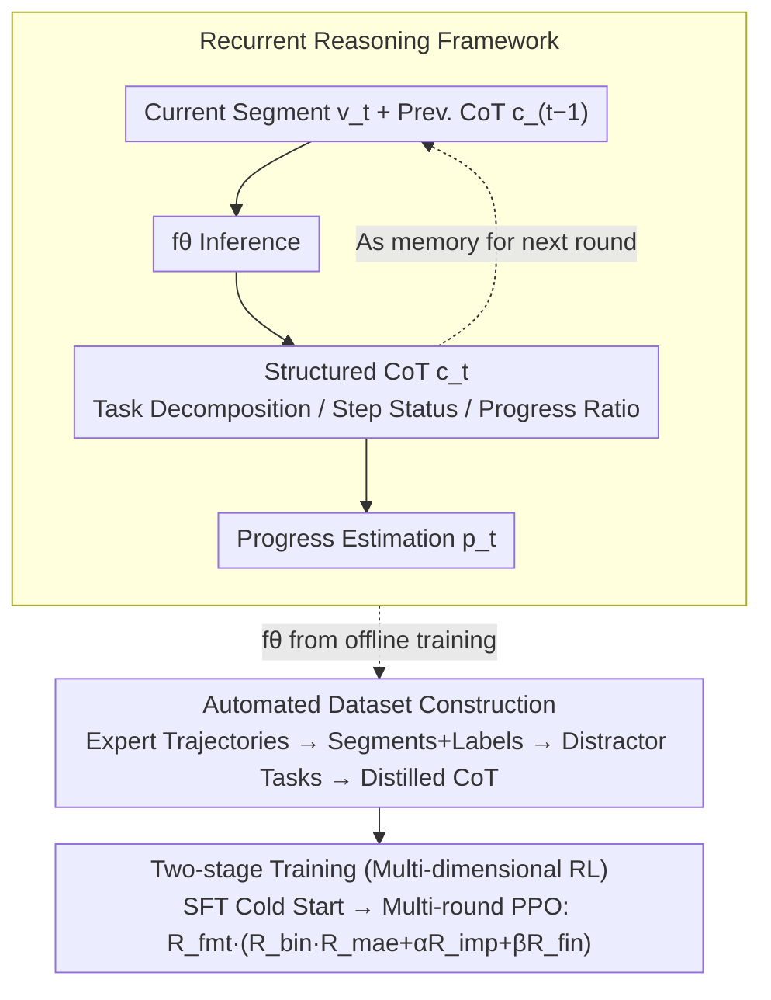

# Recurrent Reasoning with Vision-Language Models for Estimating Long-Horizon Embodied Task Progress

**Conference**: CVPR 2026  
**arXiv**: [2603.17312](https://arxiv.org/abs/2603.17312)  
**Code**: [HuggingFace](https://huggingface.co/)  
**Area**: Robotics  
**Keywords**: Task Progress Estimation, Embodied AI, Recurrent Reasoning, Chain-of-Thought, Reinforcement Learning

## TL;DR
Ours proposes R²VLM, which processes local video segments step-by-step through a recurrent reasoning framework and maintains a dynamically updated CoT to record task decomposition and completion status. Combined with multi-dimensional RL rewards, it achieves SOTA in long-horizon embodied task progress estimation and supports downstream applications such as policy learning, reward modeling, and active assistance.

## Background & Motivation
**Background**: Embodied agents need to accurately estimate the execution progress of multi-step long-horizon tasks to support long-range planning and context-aware decision-making.

**Limitations of Prior Work**: 
   - Methods like GVL and ROVER only utilize the video understanding capabilities and large context windows of VLMs, neglecting their reasoning potential.
   - Processing long video trajectories (often thousands of frames) entails huge computational overhead, making them unsuitable for real-time deployment.
   - Tasks contain multiple time-dependent subtasks, requiring reasoning capabilities to align visual observations with logical dependencies.

**Key Challenge**: Excessive overhead of full video processing vs. lack of global context in local segments; video understanding alone is insufficient for handling complex temporal logical dependencies.

**Goal**: Efficiently, accurately, and interpretably estimate long-horizon embodied task progress.

**Key Insight**: Emulate human behavior—"watch a segment, think a bit, and remember key information"—by processing video segments recurrently and maintaining structured memory.

**Core Idea**: Recurrent reasoning + dynamic CoT as a memory carrier across time steps, avoiding full video processing while maintaining global context.

## Method

### Overall Architecture
R²VLM addresses the problem of accurately reporting the percentage completion of a multi-step task given a long video of thousands of frames, without feeding the entire video into the VLM. It mimics the human approach of "watching a segment, thinking, and remembering key information"—slicing the video into short 4s/2s segments, performing recurrent reasoning segment by segment, and using a constantly rewritten CoT as memory passed across segments.

In each round, the model receives the current segment $v_t$, the task description $\tau$, and the previous CoT $c_{t-1}$, outputting an updated CoT $c_t$ and a progress estimate $p_t$:

$$c_t,\; p_t = f_\theta(\tau,\, v_t,\, c_{t-1})$$

In this way, the model only processes a small segment of visuals per round, while the global context is entirely carried by $c_{t-1}$, saving computation without losing history. To ensure $f_\theta$ learns to reason according to this structure and provides reliable progress values, the paper introduces an automated dataset construction pipeline (distilling expert trajectories into "segment + CoT" training data) and uses two-stage training (SFT cold start + multi-round PPO reinforcement). The overall data flow is as follows:

### Key Designs

**1. Recurrent Reasoning Framework: Replacing full video processing with segment-wise iteration, using CoT to relay global context**

Addressing the contradiction between "high overhead of full video" and "lack of global vision in local segments," R²VLM allows reasoning to roll forward segment by segment along the timeline. In the first round without history, the model uses the VLM's inherent commonsense to decompose the task into sub-steps, generating an initial CoT $c_0$. For each subsequent segment, the model dynamically revises this decomposition based on the visuals—merging, splitting, or reordering steps if the actual execution deviates from the plan—and refreshes the completion status of each step. This offers three-fold benefits: the CoT explicitly writes out the reasoning chain for the progress value, enhancing accuracy and interpretability; the previous CoT acts directly as global context, so the model knows the task status without re-examining thousands of frames; and by inheriting reasoning conclusions, logic remains consistent across segment transitions.

**2. Structured CoT: Enforcing a fixed format for memory rather than free-form text**

The key to CoT acting as a reliable memory carrier is its mandatory three-part structure: (i) task decomposition, listing the sequence of sub-tasks; (ii) key step analysis, labeling each sub-task as completed or pending; (iii) progress estimation, calculating $p_t$ as the ratio of "completed steps / total steps." Notably, the decomposition is not fixed—embodied environments often offer only partial observability, and the initial decomposition may not align with real execution, thus allowing rewriting in each round. Defining progress by step ratio rather than time ratio is crucial because step durations vary significantly in long-horizon tasks; step counts better reflect the true task structure.

**3. Automated Dataset Construction: Distilling expert trajectories into "segment+CoT" training data and using distractor tasks to prevent shortcutting**

Since data for "progress estimation with CoT guidance" was nearly non-existent, the authors built an automated pipeline to convert expert trajectories from ALFRED (simulation) and Ego4D (real-world) into training samples in three steps: First, slicing videos into 4s/2s segments with 4 frames per segment and assigning progress labels based on the ratio of completed steps. Second, generating distractor tasks—since purely random tasks fail due to lack of definable progress, they used constrained prompts to force distractor tasks to match the original task for the first $n_r$ steps before diverging, ensuring progress is precisely controlled by $\min(n_r/n,\dots)$ and forcing the model to reason based on logic rather than visual shortcuts. Third, distilling CoT training data—information on decomposition, steps, and progress already exists as annotations, which are fed to a large model to produce high-quality structured CoTs. This yielded 11,499 trajectories / 124,821 dialogues for ALFRED and 13,965 / 127,694 for Ego4D, with manual verification retention rates of 93% and 74%, respectively.

**4. Two-stage Training and Multi-dimensional RL Rewards: Mimicking format then refining values and self-correction via five signals**

Training proceeds in two stages: SFT using the "segment+CoT" data to teach the model structured reasoning (cold start), followed by multi-round PPO reinforcement learning using an early SFT checkpoint. SFT alone only ensures the model "writes like that" but does not guarantee accurate progress values or cumulative self-correction. The authors designed a multiplicative-additive reward signal covering five dimensions: $R_{fmt}$ checks if think/answer tags are valid (Binary 1/0); $R_{bin}$ checks if the prediction falls within the correct step interval (1.0 for correct, 0.25 for adjacent) for coarse alignment; $R_{mae}$ applies fine-grained numerical constraints via $\max(1 - |p_t - p_t^{gt}|/\delta_1,\, 0)$; $R_{imp}$ rewards if "current round error is smaller than the previous," measuring self-correction (normalized to an asymmetric range $[-1, 0.8]$ to penalize error increases); and $R_{fin}$ constrains correct task completion judgment. The combination is:

$$R_{overall} = R_{fmt} \cdot \left( R_{bin} \cdot R_{mae} + \alpha R_{imp} + \beta R_{fin} \right)$$

Placing $R_{fmt}$ as a multiplier ensures rewards are zeroed if the format is invalid, prioritizing parsability. $R_{bin} \cdot R_{mae}$ ensures fine-grained MAE rewards are only issued when coarse alignment is correct, improving stability. PPO was chosen over GRPO because the recurrent setting contains unique $c_{t-1}$ for each trajectory, making it impossible to sample multiple candidates for the "same input" as required by GRPO.

### A Complete Example
Consider an ALFRED trajectory for "Heat a cup in the microwave." At round 0, without visuals, the model uses commonsense to decompose the task into 4 steps: ① find cup, ② pick up cup, ③ open microwave, ④ place and start. Initial CoT marks all as "pending," $p_0 = 0\%$. In segment 1, the arm picks up the cup; the model marks ①② as "completed," updating progress to $2/4 = 50\%$. In segment 2, a refrigerator appears instead of a microwave—the model revises the decomposition, realizing the agent might retrieve another item first, splitting step ④ into "retrieve-place-start," changing the total steps to 5 and recalculating progress to $2/5 = 40\%$. In segment 3, the microwave opens, completing ③, and progress rises to $3/5 = 60\%$. Throughout, the model never reviews previous frames, relying entirely on the rewritten CoT to remember that the cup is held and the plan has changed.

## Key Experimental Results

### Main Results

| Model | Size | ALFRED $p_{mae}$↓ | ALFRED $bin$↑ | Ego4D $p_{mae}$↓ | Ego4D $bin$↑ |
|------|------|:---------:|:---------:|:---------:|:---------:|
| GPT-5 | - | 18.35 | 0.505 | 25.04 | 0.259 |
| Gemini-2.5-Pro | - | 16.27 | 0.481 | 28.22 | 0.217 |
| Qwen2.5-VL-72B | 72B | 24.88 | 0.342 | 26.88 | 0.254 |
| **R²VLM (SFT+RL)** | **7B** | **6.34** | **0.758** | **11.88** | **0.526** |

### Ablation Study

| Configuration | ALFRED $p_{mae}$↓ | Description |
|------|:---------:|------|
| SFT only | 7.52 | Basic supervised fine-tuning |
| + RL (w/o $R_{imp}$) | 6.89 | Lacks cross-round improvement signal |
| + RL (w/o $R_{bin}$) | 7.11 | Lacks coarse-grained step constraint |
| **Full R²VLM** | **6.34** | Optimal combination of all rewards |

### Key Findings
- The 7B R²VLM comprehensively outperforms GPT-5 and Gemini-2.5-Pro, reducing MAE by over 65%.
- The Improvement Reward contributes significantly to multi-round reasoning, highlighting the value of self-correction in recurrent frameworks.
- It demonstrates strong generalization across three downstream tasks: progress-augmented policy learning, reward modeling, and active assistance.
- Recurrent reasoning significantly outpaces global methods in inference speed by avoiding full video processing.

## Highlights & Insights
- **Recurrent Reasoning + CoT as Memory**: Extends CoT from a one-time reasoning tool to a structured memory carrier across time steps, maintaining global consistency while avoiding long-video computation. This is transferrable to any VLM task requiring long time horizons.
- **Improvement Reward Design**: Rewarding the reduction of error across rounds directly measures the model's self-correction capability, a unique design for multi-round reasoning scenarios.
- **Automated Data Generation Pipeline**: Efficiently converts expert trajectories into video segments + CoT training data, including clever distractor task generation strategies.
- **Multi-downstream Validation**: Beyond progress estimation, it proves its utility as an RL reward model and an active assistance system.

## Limitations & Future Work
- The quality of CoT step decomposition heavily relies on the VLM's commonsense reasoning; complex and novel tasks may result in inaccurate decompositions.
- There is still a significant performance gap between simulated (ALFRED) and real-world (Ego4D) environments.
- Each segment has a fixed length (4s/2s); dynamic adjustment of segment granularity was not considered.
- Evaluated only on Qwen2.5-VL-7B; performance on larger or more powerful models remains unverified.

## Related Work & Insights
- **vs GVL / ROVER**: These rely on VLM ICL and large context windows without explicit reasoning, limiting performance in complex tasks. R²VLM improves significantly via recurrent reasoning and RL.
- **vs Hierarchical Reward Methods**: Traditional methods require manual task hierarchy design; R²VLM automatically learns decomposition and reasoning strategies through training.

## Rating
- Novelty: ⭐⭐⭐⭐ Clever design of recurrent reasoning + CoT memory.
- Experimental Thoroughness: ⭐⭐⭐⭐⭐ Two datasets, four metrics, and three downstream applications.
- Writing Quality: ⭐⭐⭐⭐ Clear structure and detailed methodology.
- Value: ⭐⭐⭐⭐⭐ Significant implications for progress estimation and reward modeling in Embodied AI.

<!-- RELATED:START -->

## Related Papers

- [\[CVPR 2026\] PALM: Progress-Aware Policy Learning via Affordance Reasoning for Long-Horizon Robotic Manipulation](palm_progress-aware_policy_learning_via_affordance_reasoning_for_long-horizon_ro.md)
- [\[CVPR 2026\] Progress-Think: Semantic Progress Reasoning for Vision-Language Navigation](progress-think_semantic_progress_reasoning_for_vision-language_navigation.md)
- [\[CVPR 2026\] RoboAgent: Chaining Basic Capabilities for Embodied Task Planning](roboagent_chaining_basic_capabilities_for_embodied_task_planning.md)
- [\[CVPR 2026\] QuantVLA: Scale-Calibrated Post-Training Quantization for Vision-Language-Action Models](quantvla_scale-calibrated_post-training_quantization_for_vision-language-action_.md)
- [\[CVPR 2026\] SRPO: Self-Referential Policy Optimization for Vision-Language-Action Models](srpo_self-referential_policy_optimization_for_vision-language-action_models.md)

<!-- RELATED:END -->
