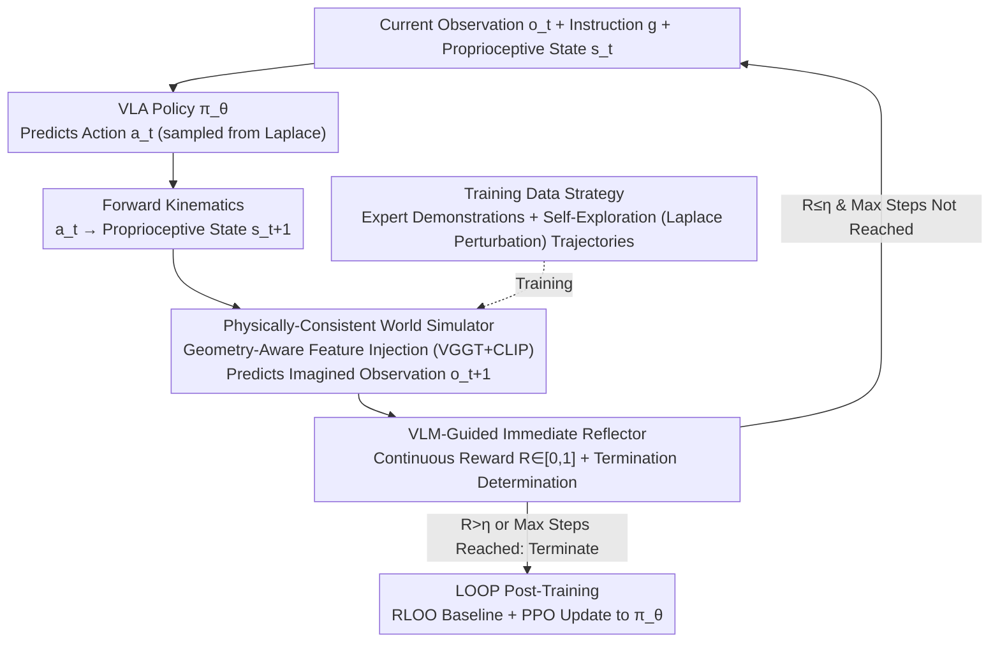

# RehearseVLA: Simulated Post-Training for VLAs with Physically-Consistent World Model

**Conference**: CVPR 2026  
**arXiv**: [2509.24948](https://arxiv.org/abs/2509.24948)  
**Paper**: [CVF Open Access](https://openaccess.thecvf.com/content/CVPR2026/html/Xiao_RehearseVLA_Simulated_Post-Training_for_VLAs_with_Physically-Consistent_World_Model_CVPR_2026_paper.html)  
**Code**: https://github.com/amap-cvlab/world-env  
**Area**: Robotics / Embodied AI  
**Keywords**: VLA, World Model, RL Post-Training, Robotic Manipulation, Data Efficient

> ⚠️ Naming Note: The framework name in the arXiv version (2509.24948) is **World-Env**, while the CVF-accepted version has been retitled to **RehearseVLA**. Both refer to the same paper, and the main text continues to use the framework name World-Env consistently used throughout the paper.

## TL;DR
RehearseVLA (World-Env) utilizes a "physically-consistent video world model" as a virtual training playground, allowing VLA policies to safely undergo RL post-training within imagined future observations. Coupled with a VLM reflector that provides continuous rewards and real-time task completion determination, it lifts the average success rate on LIBERO from 74.85% to 79.6% under the extreme data scarcity of only 5 expert demonstrations per task.

## Background & Motivation
**Background**: Vision-Language-Action (VLA) models map language instructions to robotic actions end-to-end. The mainstream approach is to fine-tune pre-trained VLMs using imitation learning (IL / SFT), such as OpenVLA, OpenVLA-OFT, and π₀.

**Limitations of Prior Work**: Imitation learning heavily relies on large-scale high-quality demonstrations, leading to performance collapse under data scarcity. Relying on reinforcement learning (RL) to compensate faces a dilemma: real-world RL interactions are **non-resettable** (once object states are changed in high-risk scenarios like industrial environments, they are difficult or impossible to restore), high in trial-and-error costs, and irreproducible. Conversely, switching to traditional simulators avoids physical risks but incurs substantial setup efforts, sim-to-real gaps, and difficulties in adapting to new objects and dynamic scenes. Additionally, existing VLAs **lack reliable task-completion detection**, continuing actions even after a task is successfully completed (e.g., continuing "over-scoop" after placing an object), which often destroys the already completed states and lowers the success rate.

**Key Challenge**: There is a contradiction between the desire to "use RL to solve data scarcity" and the need for "an RL interaction environment that is repeatedly resettable, sufficiently realistic, and capable of understanding semantics." The real world is realistic but non-resettable, while traditional simulators are resettable but lack generalization and semantics.

**Goal**: To find an "ideal testing ground" that avoids real-world risks, is more flexible than traditional simulators, possesses richer semantic understanding, and seamlessly provides dense, termination-aware rewards for RL.

**Key Insight**: The authors observe that **video world models** perfectly fill this gap. Equipped with action-conditioned future frame prediction and persistent implicit scene representations, they can generate visually plausible future image sequences, serving as a zero-cost, infinitely-resettable, and semantically rich virtual environment.

**Core Idea**: To replace real/simulated interactions with rollouts from a "physically-consistent world model," and replace binary success signals with continuous rewards from a "VLM reflector" for real-time termination. This enables safe RL post-training for VLAs under extremely few demonstrations.

## Method

### Overall Architecture
World-Env shifts the post-training of VLAs entirely into a "virtual rehearsal playground" consisting of a world model to run in a closed loop. A single rollout proceeds as follows: given the current RGB observation $\mathbf{o}_t$, language instruction $\mathbf{g}$, and proprioceptive state $\mathbf{s}_t$ (6D end-effector pose + 1D gripper), the VLA policy $\pi_\theta$ predicts a continuous action $\mathbf{a}_t$. The action deterministically computes the next proprioceptive state $\mathbf{s}_{t+1}$ via **forward kinematics**. The **world simulator** then predicts the next imagined observation $\mathbf{o}_{t+1}$ conditioned on $\mathbf{s}_{t+1}$. This imagined observation, alongside $\mathbf{s}_{t+1}$, is fed back into the policy to predict the next action. This autoregressive rolling continues until the maximum number of steps is reached or the **VLM reflector** determines task success and emits a termination signal. The rewards obtained along the entire trajectory are then used for RL optimization of $\pi_\theta$. Once trained, the world simulator is **frozen throughout**, and only the policy is updated.

### Key Designs

**1. Physically-Consistent World Simulator + Geometry-Aware Feature Injection: Making Imagined Future Frames "Physically Plausible"**

RL rollouts rely entirely on the future observations predicted by the world model. If these frames are physically implausible (e.g., object penetration, geometry distortion, long-term drift), the policy will learn suboptimally in a "hallucinated environment". The simulator takes the **action map** as a pixel-level condition: $\mathbf{s}_{t+1}$ is projected onto the image plane, using foreground markers to encode projected poses (position + orientation), with the background unified to black to maximize visual contrast and minimize interference with the scene content. The action map is then injected into a U-Net denoising diffusion network along with historical observations sampled from a memory pool. Since action conditions alone cannot guarantee geometric consistency, the authors propose **geometry-aware feature injection**: extracting complementary features from two pre-trained encoders—VGGT, which is capable of preserving fine-grained geometric structure and spatial layout of reference images, and CLIP, which captures high-level semantics and context. These features are injected into the denoising U-Net through multi-resolution cross-attention. This dual-path injection ensures that generated frames respect both local geometric fidelity and global semantic consistency, thereby improving temporal coherence and physical plausibility in long-term predictions.

**2. Simulator Training Data Strategy: Supplementing the Training Distribution with "Failed/Suboptimal States" via Self-Exploration + Laplace Perturbation**

Training the world model solely on the expert success demonstrations of LIBERO limits its exposure to "successful paths". Once the VLA predicts deviant actions during rollouts and reaches states never visited by experts, the simulator fails to correctly model the subsequent object states, leading to tracking failures. To address this, the authors have the SFT-trained OpenVLA-OFT policy collect data via **self-exploration** in the LIBERO simulator. They also train an extra **scale head** to predict the log-scale parameter $\boldsymbol{\beta}_t$ of a Laplace distribution, utilizing the actions of OpenVLA-OFT $\boldsymbol{\mu}_t$ as the location parameter. Perturbed actions are then sampled from $\mathbf{a}_t\sim\text{Laplace}(\boldsymbol{\mu}_t,\boldsymbol{\beta}_t)$ and executed, gathering a massive number of $(\mathbf{o}_t,\mathbf{s}_t,\mathbf{a}_t,\mathbf{s}_{t+1},\mathbf{o}_{t+1})$ transition pairs containing both **successes and failures**. By mixing these self-exploration trajectories with original human success trajectories, the world model experiences sufficient suboptimal states, enabling robust modeling of robotic arm tracking and interaction results even when the VLA makes prediction errors.

**3. VLM-Guided Immediate Reflector: Continuous Rewards + Real-Time Termination, Curing Advantage Collapse of Sparse Binary Rewards**

Previous methods relying on simulators to provide binary success signals (success 1 / failure 0) suffer from two major trade-offs: first, a **lack of termination awareness**, where policies continue redundant actions and disrupt already completed states; second, when rollouts in a batch are **homogeneous** (all successes or all failures), the policy gradients calculated with binary rewards collapse to zero, leading to a complete lack of learning signal and drastically reduced training efficiency. The reflector addresses this by employing a frozen vision encoder + a frozen LLM + a lightweight reward head $\mathcal{R}_0$ (denoted in text as $\mathcal{R}_\theta$) to output step-by-step continuous rewards based on imagined observation videos $\mathbf{o}_{1:t}$ and instruction $\mathbf{g}$:

$$R(\mathbf{o}_{1:t},\mathbf{g})=\sigma(\mathcal{R}_\theta(h_t))\in[0,1],$$

where $h_t$ is the multimodal embedding obtained by pooling the LLM at step $t$, and $R$ estimates the probability that "the task has been completed up to step $t$". The reward head is trained using frame-by-frame binary labels with BCE loss: $\mathcal{L}=\text{BCE}(R(\mathbf{o}_{1:t},\mathbf{g}),y_t)$. Once $R>\eta$ (with the threshold $\eta=0.5$), termination is triggered, halting actions immediately to avoid redundant movements after success. Continuous rewards reflect fine-grained task progress, ensuring non-trivial advantage estimations and eliminating the burden of intentionally balancing successful/failed rollouts during data collection.

**4. LOOP-Based VLA Post-Training: Sparse Trajectory-Level Rewards + RLOO Baseline + PPO Updates**

After receiving rewards from the reflector, the authors employ **LOOP** (Leave-One-Out PPO, combining the advantage estimation of RLOO with PPO updates) for policy optimization. During RL, the rewards are applied sparsely: the entire trajectory only receives a scalar reward $R_n=R(\mathbf{o}_{1:t_{\text{end}}},\mathbf{g})$ at the **termination step** (or the final step $T$ if not terminated). Generating $N$ rollouts for the same initial state, the RLOO baseline takes the average reward of the remaining trajectories to calculate the leave-one-out advantage:

$$b_n=\frac{1}{N-1}\sum_{j\neq n}R_j,\qquad A_n=R_n-b_n.$$

Both the policy and behavior policy treat the action/scale heads as inducing stochastic action distributions (the product of independent Laplace distributions across dimensions). The importance ratio $r_{t,n}=p_\theta/p_\phi$ is computed per timestep, and the policy is updated using the clipped PPO objective (where advantage $A_n$ is broadcasted back to all timesteps):

$$\mathcal{L}_{\text{PPO}}=-\min\big(r_{t,n}A_n,\ \text{clip}(r_{t,n},1-\epsilon,1+\epsilon)A_n\big).$$

### Loss & Training
- **World Simulator**: Diffusion denoising training, geometry-aware feature injection (VGGT + CLIP cross-attention), frozen after training.
- **Reflector Reward Head**: Frame-by-frame binary label + BCE loss.
- **VLA Post-Training**: LOOP (RLOO baseline + clipped PPO, $\epsilon=0.1$), $N=8$ rollouts per iteration, sparse trajectory-level rewards.
- **Hyperparameters / Compute**: 8×H20 (96GB) GPUs trained for approximately 48 hours; VLM backbone uses LoRA (rank 32, lr $1\times10^{-4}$), action/scale heads fully trained (lr $1\times10^{-5}$); batch size 4.

## Key Experimental Results

### Main Results
Four LIBERO task suites evaluated on the full test sets using only **5 demonstrations** for training per task.

| Method | Goal | Object | Spatial | Long | Average |
|------|------|--------|---------|------|------|
| π₀ | 67.6 | 68.4 | 80.2 | 28.2 | 61.1 |
| π₀+FAST | 59.2 | 76.8 | 59.2 | 24.8 | 55.0 |
| OpenVLA | 73.2 | 55.0 | 82.4 | 32.2 | 60.7 |
| UniVLA | 82.0 | 76.2 | 84.4 | 56.4 | 74.75 |
| OpenVLA-OFT | 84.0 | 74.2 | 84.2 | 57.0 | 74.85 |
| **OpenVLA-OFT + Ours Post-Training** | **86.4** | **86.6** | **87.6** | **57.8** | **79.6** |

Compared to the simulator-based RL method RIPT-VLA (86.2/83.4/88.6/58.4), Ours achieves comparable success rates. However, the key advantage is that it **can be directly deployed to the real world** (whereas RIPT-VLA is confined to simulation). In 4 real-world tasks (clean table / putting green, red, orange toys), Ours consistently outperforms OpenVLA-OFT (e.g., clean table 30 vs. 20, put green toy 50 vs. 30).

### Ablation Study
Table 5: Effects of Simulator Extra Training Data and Reflector Reward Head (LIBERO success rate).

| Extra Data | Reward Head | Goal | Object | Spatial | Long |
|:---:|:---:|------|--------|---------|------|
| ✗ | ✗ | 68.4 | 75.2 | 73.2 | 42.2 |
| ✓ | ✗ | 79.8 | 81.8 | 78.4 | 44.6 |
| ✗ | ✓ | 68.8 | 76.4 | 74.4 | 43.8 |
| ✓ | ✓ | **86.4** | **86.6** | **87.6** | **57.8** |

Termination mechanism (Table 4, all methods evaluated without ground-truth termination feedback, reckoning success rate only upon reaching maximum steps): Ours averages 74.9 vs. OpenVLA-OFT 63.05, UniVLA 65.4, validating that real-time termination avoids destroying completed states with redundant movements post-success.

### Key Findings
- **Extra Data is the Main Driver**: Enabling only Extra Data yields the largest average gain (Goal 68.4 $\rightarrow$ 79.8), demonstrating that the world model must observe failed/suboptimal states to stabilize when the VLA errors out. Enabling only the Reward Head yields almost no gain (68.4 $\rightarrow$ 68.8), yet the **synergy** of both leads to a major breakthrough ($\rightarrow$ 86.4) — the reward head becomes meaningful only when built on high-fidelity simulation.
- **Continuous Rewards Solve Advantage Collapse**: While binary rewards collapse to zero and leave no learning signal when rollouts are homogeneous, continuous $[0,1]$ rewards guarantee non-trivial advantages, also eliminating the need to actively balance successful/failed samples.
- **The True Value of the Termination Mechanism**: Figure 8 illustrates a case where "placing the wine bottle onto the cabinet top" succeeded but subsequently failed due to delayed termination, proving that dynamic termination is a necessity rather than an embellishment.
- **Fast Convergence**: Outperforms the SFT baseline within 20 training steps on multi-goal tasks.

## Highlights & Insights
- **Treating Video World Models as "Resettable RL Training Grounds"**: Compared to the real world (non-resettable) and traditional simulators (semantically deficient, high sim-to-real gap), the world model is zero-cost, supports infinite rollouts, and possesses inherent semantic understanding. It serves as an ingenious vehicle for VLA RL under data scarcity.
- **Geometry-Aware Feature Injection (Dual-Path VGGT + CLIP)**: The geometric branch ensures physical plausibility, while the semantic branch secures contextual consistency, systematically overcoming long-term prediction drift in the world model. This complementary "geometry + semantics" injection paradigm can be extended to any action-conditioned video generation.
- **Continuous Rewards Overcoming Advantage Collapse**: Turning success detection from a binary $0/1$ decision into a continuous $[0,1]$ probability provides dense learning signals and naturally achieves real-time termination. This two-in-one approach is highly reusable in other sparse-reward RL scenarios.
- **"Feed Failures to the Simulator too"**: Utilizing Laplace perturbation to actively collect suboptimal/failed transitions makes the world model robust to OOD actions. This serves as a vital reminder that we cannot only feed expert success trajectories when training dynamics models.

## Limitations & Future Work
- **Dependence on High-Quality Training Data**: Both the world simulator and the reflector require diverse training data to achieve high-fidelity simulation and accurate evaluation. The authors hope general world models in the future will alleviate this dependence.
- **Slow Training**: Generating trajectories frame-by-frame via the simulator introduces a computational bottleneck, slowing policy optimization compared to parallelized methods. More efficient simulation is required to resolve this.
- **Self-Evaluation Supplement**: Experiments are primarily conducted on LIBERO and 4 real-world tasks. The physical fidelity of the world model itself is supported only by qualitative figures (Figure 6) and indirect downstream success rates, lacking quantitative metrics for the physical consistency of predicted frames. The real-world evaluation (10 trajectories per task, over 4 tasks) is relatively small in scale.
- **Avenues for Improvement**: Replacing expensive frame-by-frame diffusion rollouts with single-step/few-step prediction in latent space to accelerate training; introducing explicit physical/geometric consistency constraints on predicted frames for closed-loop supervision.

## Related Work & Insights
- **vs. RIPT-VLA (Simulator-Based RL)**: Both conduct RL post-training for VLAs and achieve comparable results on LIBERO, but RIPT-VLA relies on traditional simulators and is locked to simulated environments. In contrast, Ours uses a world model + VLM continuous rewards, enabling direct real-world transfer without setup overhead.
- **vs. OpenVLA-OFT (SFT Baseline)**: This work takes OpenVLA-OFT as the initial policy and applies RL post-training within the world model. It obtains a +4.75 average gain on LIBERO and excels in real-world tasks, demonstrating that "rehearsing in an imagined environment" effectively mitigates SFT's shortcomings in data-sparse regimes.
- **vs. Classical Model-Based RL (Dreamer Series)**: Early world model RL relied heavily on on-policy data and generalization to specific environments was limited. This work trains an offline world model with diffusion video generation and freezes it, specifically serving general VLA manipulation tasks.

## Rating
- Novelty: ⭐⭐⭐⭐ The combination of "world model as a resettable RL playground + VLM continuous reward for real-time termination" precisely targets the pain points of data scarcity and safety. Geometry-aware injection and failure data augmentation are cleverly designed.
- Experimental Thoroughness: ⭐⭐⭐⭐ Comprehensive evaluation on LIBERO and real-world tasks alongside three sets of ablation studies (data/reward head/termination); however, the real-world scale is small, and the world model's physical consistency lacks quantitative evaluation.
- Writing Quality: ⭐⭐⭐⭐ Clear motivation, method, and experimental logic; formulas and figures are well-presented. The arXiv/CVF double-naming can be slightly confusing.
- Value: ⭐⭐⭐⭐ Provides a practical, real-world-deployable solution for VLA post-training under resource constraints. The concepts of geometry + semantic injection and continuous rewards offer valuable transferable insights.

<!-- RELATED:START -->

## Related Papers

- [\[CVPR 2026\] QuantVLA: Scale-Calibrated Post-Training Quantization for Vision-Language-Action Models](quantvla_scale-calibrated_post-training_quantization_for_vision-language-action_.md)
- [\[CVPR 2026\] Learning to Control Physically-simulated 3D Characters via Generating and Mimicking 2D Motions](learning_to_control_physically-simulated_3d_characters_via_generating_and_mimick.md)
- [\[CVPR 2026\] Chain of World: World Model Thinking in Latent Motion (CoWVLA)](chain_of_world_world_model_thinking_in_latent_motion.md)
- [\[CVPR 2026\] Motus: A Unified Latent Action World Model](motus_a_unified_latent_action_world_model.md)
- [\[CVPR 2026\] Affordance Field Intervention: Enabling VLAs to Escape Memory Traps in Robotic Manipulation](affordance_field_intervention_enabling_vlas_to_escape_memory_traps_in_robotic_ma.md)

<!-- RELATED:END -->
