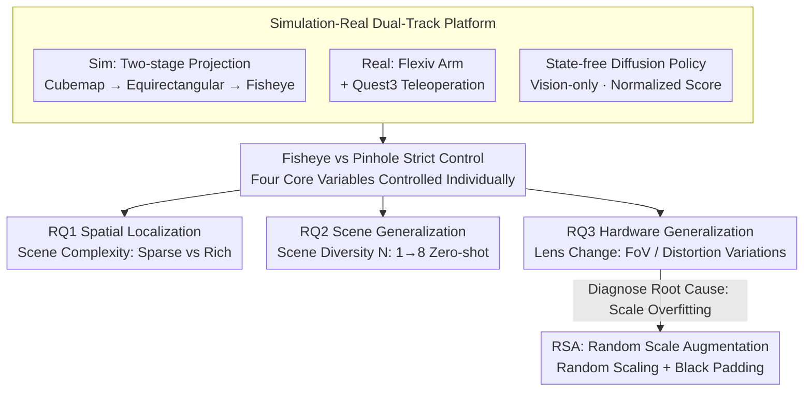

# Rethinking Camera Choice: An Empirical Study on Fisheye Camera Properties in Robotic Manipulation

**Conference**: CVPR 2026  
**arXiv**: [2603.02139](https://arxiv.org/abs/2603.02139)  
**Authors**: Han Xue, Min Nan, Xiaotong Liu, Wendi Chen, Yuan Fang, Jun Lv, Cewu Lu, Chuan Wen (Shanghai Jiao Tong University, Southeast University, USTC, etc.)
**Project Page**: [robo-fisheye.github.io](https://robo-fisheye.github.io/)
**Area**: Robotics
**Keywords**: Fisheye Camera, Robotic Manipulation, Imitation Learning, Field of View (FoV), Generalization

## TL;DR

This work presents the first systematic empirical study on the properties of wrist-mounted fisheye cameras in imitation learning for robotic manipulation. It addresses three core questions regarding spatial localization, scene generalization, and hardware generalization, revealing the advantages and limitations of wide field-of-view (FoV). Furthermore, it proposes Random Scale Augmentation (RSA) to mitigate the scale overfitting issue during cross-camera transfer.

## Background & Motivation

The application of fisheye cameras with ultra-wide FoV ($FoV > 180^\circ$) in robotic manipulation is growing rapidly. However, the academic understanding of how fisheye cameras affect policy learning lags behind their practical deployment.

**Limitations of Prior Work**:
- The impact of strong radial distortion introduced by fisheye cameras on visual encoders remains unclear.
- There is a lack of quantitative analysis regarding the actual benefits of wide FoV under various scene complexities.
- Policy transfer across different fisheye lenses (hardware generalization) suffers from systematic failures, and the root cause is unexplored.
- A systematic benchmark encompassing both simulation and reality to guide large-scale fisheye data collection is missing.

**Goal**: To establish the first systematic empirical research framework to answer three key research questions:

**RQ1 - Spatial Localization**: Can wide FoV enhance the spatial localization capability of policies?

**RQ2 - Scene Generalization**: How do fisheye cameras affect generalization to novel backgrounds?

**RQ3 - Hardware Generalization**: Can policies be transferred across different fisheye lenses?

## Method

### Overall Architecture

Rather than proposing a new model, this paper systematically validates the engineering choice of using fisheye versus pinhole cameras for wrist mounts. The authors developed a dual simulation-reality platform to conduct controlled experiments. They examine whether wide FoV enhances spatial localization (RQ1), how it affects generalization to new scenes (RQ2), and the feasibility of cross-lens transfer (RQ3). The root cause of failure in RQ3 was identified as scale overfitting, which is addressed using the Random Scale Augmentation (RSA) strategy.

### Key Designs

**1. Simulation-Real Dual-Track Platform: Controlling Camera Variables**
The challenge in isolating camera effects is that changing hardware often introduces confounding variables. For the real-world setup, a Flexiv Rizon 4 arm with a DH AG-160-95 gripper was used with Meta Quest 3 for teleoperation. In simulation (MuJoCo), a two-stage projection pipeline was implemented: rendering six virtual cameras into a cubemap, expanding to an equirectangular panorama, and finally projecting into a fisheye view. A state-free Diffusion Policy (ResNet-18 for sim, CLIP ViT for real) was employed to decouple camera effects from proprioception.

**2. RQ1 Spatial Localization: Linking FoV to Scene Complexity**
**Key Insight**: The value of a fisheye camera lies in capturing more static environment features as visual anchors. To test this, the authors compared performance in sparse (solid background) and rich (textured cloth/clutter) environments. Using a state-free policy forced reliance on visual localization. Results showed that the fisheye camera plus a rich scene allows high-precision manipulation via vision alone, effectively encoding spatial relationships implicitly. In sparse scenes, the advantage of wide FoV disappears as there are no anchors to reference.

**3. RQ2 Scene Generalization: FoV as Implicit Data Augmentation**
**Mechanism**: Fisheye cameras provide a wider field of view that changes more significantly as the wrist moves. This acts as an implicit scene-level data augmentation. Fixing the total data (e.g., 200 trajectories) and increasing the number of training scenes $N$ (from 1 to 8), the fisheye policy achieved near-perfect zero-shot generalization ($0.988$) on unseen backgrounds at $N=8$, whereas pinhole performance significantly lagged or even degraded.

**4. RQ3 Hardware Generalization and RSA: Addressing Scale Overfitting**
**Design Motivation**: Policies tend to memorize the absolute pixel scale of objects under a specific lens. When the lens is changed, objects appear larger or smaller, leading the policy to misinterpret scale as depth (e.g., larger scale interpreted as closer, leading to undershooting). **RSA (Random Scale Augmentation)** sampled a scale factor $s$ (e.g., $0.7 \sim 1.3$) during training. If $s > 1$, the image is downscaled and padded with black borders (zoom-out effect), forcing the network to learn relative spatial relationships (e.g., target relative to gripper) rather than absolute pixel sizes.

## Key Experimental Results

### Table 1: RQ1 - Real-World Spatial Localization (Normalized Score, State-free Policy)

| Task | Camera Type | Sparse Scene | Rich Scene | Gain |
|---|---|---|---|---|
| Pick Cup | Fisheye (State-free) | 0.525 | 0.800 | **+0.275** |
| Fold Towel | Fisheye (State-free) | 0.100 | 0.700 | **+0.600** |
| Hang Chinese Knot | Fisheye (State-free) | 0.200 | 0.500 | **+0.300** |

Fisheye cameras in rich scenes significantly outperformed those in sparse scenes across all tasks, with a maximum gain of **+0.600** in "Fold Towel". In simulation, the Success Rate (SR) for fisheye in rich scenes was 0.66, compared to 0.34 for pinhole (Gain: **+0.32**).

### Table 2: RQ3 - RSA Scale Sensitivity Analysis (Sim, Normalized Score)

| Scale Factor $S$ | Effect | Baseline | RSA |
|---|---|---|---|
| 0.70 | Extreme Zoom-in | 0.000 | **0.900** |
| 0.85 | Moderate Zoom-in | 0.950 | **1.000** |
| 1.00 | Training Scale | 1.000 | 1.000 |
| 1.15 | Moderate Zoom-out | 0.750 | **0.975** |
| 1.30 | Extreme Zoom-out | 0.650 | **1.000** |

The baseline performance decays sharply in a "V-shape" when the scale shifts, dropping to zero at $S=0.70$. RSA maintains a robust performance above 0.9 across the entire scale range.

### Key Findings

**RQ2 Scene Generalization (Real-World Pick Cup)**:

| Training Scenes $N$ | Pinhole | Fisheye |
|---|---|---|
| 1 | 0.081 | 0.556 |
| 4 | 0.238 | 0.869 |
| 8 | 0.181 | **0.988** |

The scaling curve for fisheye is much steeper than pinhole, reaching near perfection at $N=8$.

**RQ3 Real-World Hardware Transfer**:

| Lens | FoV | Scale Change | Baseline | RSA |
|---|---|---|---|---|
| Training Lens | 180° | 1.0x | 1.000 | 1.000 |
| Narrow Lens | 150° | ~1.2x (Zoom-in) | 0.500 | **0.950** |
| Wide Lens | 220° | ~0.8x (Zoom-out) | 0.003 | **0.600** |

The baseline fails almost completely (0.003) on the wide lens, while RSA recovers performance to 0.600.

## Highlights & Insights

- **First Systematic Empirical Study**: Fills the gap in systematic analysis regarding the impact of fisheye cameras on robotic manipulation policy learning.
- **Role of Scene Complexity**: Reveals that the "fisheye advantage" is contingent on visually rich environments where wide FoV can leverage static anchors for localization.
- **Implicit Data Augmentation**: Wide FoV naturally introduces significant viewpoint variations during wrist movement, providing a form of scene-level implicit augmentation.
- **Diagnosis of Scale Overfitting**: Identifies scale overfitting as the root cause for cross-camera transfer failure and provides the RSA strategy as a simple, drop-in solution.
- **Practical Guidelines**: Provides actionable advice for large-scale fisheye data collection: collect in rich environments, maximize scene diversity, and use RSA during training.

## Limitations & Future Work

- **Wrist-view Only**: Experiments were confined to wrist-mounted cameras; third-person or multi-view setups were not explored.
- **Task Scope**: Limited to 3 real and 6 simulation tasks; complex scenarios like multi-stage dexterous manipulation or high-precision assembly were not covered.
- **RSA Constraints**: Transfer to high-FoV (220°) lenses only reached 0.600, suggesting that focal length differences aren't fully solved.
- **Distortion Correction**: Geometric rectification prior to training was not explored as a potential path for hardware generalization.
- **Imitation Learning Focus**: The study focused on IL; the efficacy of RSA in reinforcement learning (RL) or online adaptation paradigms remains unknown.

## Related Work & Insights

- **Fisheye Cameras in Robotics**: Previous works like FisheyeStereoNet and OmniFusion focused on perception (depth estimation), lacking systematic analysis of policy learning.
- **Camera Choice in Manipulation**: Systems like UMI/ALOHA or augmentations like RoVi-Aug primarily use pinhole models.
- **Domain Adaptation**: RSA can be viewed as domain randomization in the scale dimension, specifically tuned for hardware lens variations.
- **Positioning**: This work bridges the gap in the "Camera -> Perception -> Policy" chain by being the first to study the choice of camera model from a policy performance perspective.

## Rating

- Novelty: ⭐⭐⭐⭐ 
- Experimental Thoroughness: ⭐⭐⭐⭐⭐ 
- Writing Quality: ⭐⭐⭐⭐ 
- Value: ⭐⭐⭐⭐ 

<!-- RELATED:START -->

## Related Papers

- [\[AAAI 2026\] Sim-to-Real: An Unsupervised Noise Layer for Screen-Camera Watermarking Robustness](../../AAAI2026/robotics/sim-to-real_an_unsupervised_noise_layer_for_screen-camera_watermarking_robustnes.md)
- [\[CVPR 2026\] Rethinking Intermediate Representation for VLM-based Robot Manipulation](rethinking_intermediate_representation_for_vlm-based_robot_manipulation.md)
- [\[CVPR 2026\] INSIGHT Bench: Towards Grounded IN-SItu Guidance for Robotic Manipulation](insight_bench_towards_grounded_in-situ_guidance_for_robotic_manipulation.md)
- [\[CVPR 2026\] Learning Surgical Robotic Manipulation with 3D Spatial Priors](learning_surgical_robotic_manipulation_with_3d_spatial_priors.md)
- [\[CVPR 2026\] Rethinking Visual Rearrangement from A Diffusion Perspective](rethinking_visual_rearrangement_from_a_diffusion_perspective.md)

<!-- RELATED:END -->
