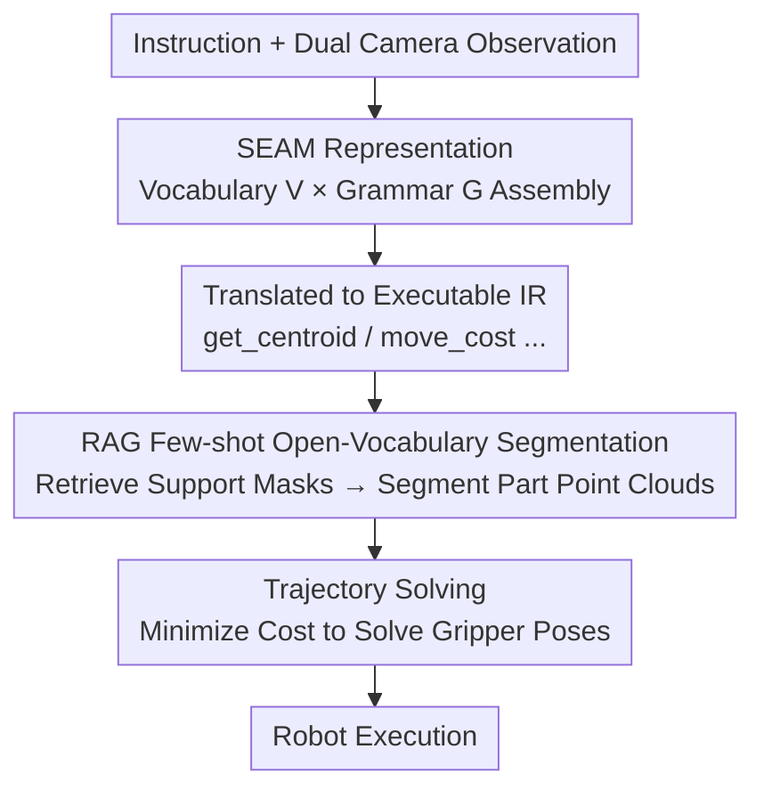

# Rethinking Intermediate Representation for VLM-based Robot Manipulation

**Conference**: CVPR 2026  
**Paper**: [CVF Open Access](https://openaccess.thecvf.com/content/CVPR2026/html/Tang_Rethinking_Intermediate_Representation_for_VLM-based_Robot_Manipulation_CVPR_2026_paper.html)  
**Code**: None  
**Area**: Robotics / Embodied AI  
**Keywords**: VLM Robot Manipulation, Intermediate Representation, Context-Free Grammar, Open-vocabulary Segmentation, RAG

## TL;DR
Addressing the task of "VLM translating human instructions into executable intermediate representations," this work draws inspiration from Context-Free Grammar (CFG) to decompose intermediate representations into **Vocabulary + Grammar**. It designs the SEAM representation, which is both comprehensible for VLMs and generalizable to unseen tasks, paired with a RAG-based few-shot open-vocabulary part segmentation module. Real-robot success rates are approximately 15% higher than the previous SOTA.

## Background & Motivation
**Background**: There are two main paradigms for robot manipulation using VLMs. One is VLA (end-to-end fine-tuning of VLMs to output actions), which requires massive action-labeled data. The other is VLM-only—where the VLM translates a human instruction $L$ and visual input $I$ into an **intermediate representation** $R=\text{VLM}(L,I)$, which is then passed to a solver to determine gripper poses. This paper focuses on the latter, with the core debate being the optimal form of this intermediate representation.

**Limitations of Prior Work**: Intermediate representation designs alternate between two extremes. **High-level representations** (e.g., predefined skill vocabulary like `grasp_edge / move_above / put` as in Instruct2Act) are intuitive for VLMs but too rigid—new tasks like "cutting a carrot with a knife" require manual injection of terms like `grasp_center / cut / move_perpendicular`. **Low-level representations** (e.g., using primitives like keypoints or axes in ReKep/OmniManip) offer better generalization, but require VLMs to write long, brittle code with explicit constraints/costs, often leading to generation errors.

**Key Challenge**: There exists a trade-off in intermediate representations between **VLM-comprehensibility** and **action-generalizability**—the closer to natural language, the easier to understand but less universal; the closer to low-level geometry, the more universal but harder for the VLM to generate correctly. The authors quantify this trade-off through experiments.

**Key Insight & Core Idea**: Inspired by **Context-Free Grammar (CFG)**—where a language uses "finite vocabulary + finite recursive productions" to compose infinite sentences—the authors decompose the intermediate representation $\tilde R=(V,G)$ into a **semantic vocabulary $V$** (a small set of semantically rich operations) and a **compositional grammar $G$** (constraints on how these terms are assembled). This shifts the VLM's task from "writing code" to "assembling semantic blocks according to grammar." In short: **By using a small-yet-refined semantic vocabulary + typed grammar, code generation is demoted to semantic assembly, simultaneously achieving comprehensibility and generalizability.**

## Method

### Overall Architecture
Given the current observation and task instruction, the pipeline is as follows: ① The VLM, constrained by SEAM's vocabulary $V$ and grammar $G$, **assembles** the instruction into an intermediate representation (e.g., `move_cost(get_centroid('teapot lid'), get_centroid('teapot opening'), [0,0,0.05])`); ② Fine-grained parts specified in the representation ("teapot lid", "teapot opening") are localized using a **RAG database** to retrieve supporting images/masks, followed by a few-shot segmentation network to segment these parts in the current scene; ③ The resulting point clouds from segmentation are substituted into the SEAM representation (which is executable Python code that computes a numerical cost). An optimization solver then determines the target gripper rotation and translation to obtain the execution trajectory. This pipeline decouples "language understanding → geometric localization → action solving," letting the VLM handle its strength (semantic assembly) while delegating geometric precision to segmentation and optimization.

### Key Designs

**1. SEAM: Decomposing Intermediate Representation into Semantic Vocabulary + Typed Grammar**

This directly addresses the aforementioned trade-off. Drawing an analogy to the CFG 4-tuple $(V,\Sigma,R,S)$, the authors redefine the intermediate representation as $\tilde R=(V,G)$. The vocabulary $V$ is a set of **semantically consistent and intuitive** operations (e.g., `get_axis`, `get_centroid`, `get_height`, `move_cost`, `parallel_cost`, `perpendicular_cost`, `rotate_cost`, `orbit_cost`, `gripper_close/open`). The grammar $G$ is a set of productions with a **type system** (e.g., `object→pt`, `object→vec`, `pt,pt→cost`, `vec,vec→cost`, `cost→cost+cost`, `pt→pt±pt`). To "cut a carrot," the VLM no longer invents code from scratch but instead composes: `perpendicular_cost(get_axis("carrot"), get_axis("knife blade")) + move_cost(get_centroid("knife"), get_centroid("knife blade"), offset=[0,0,0.1])`.

Why does this bridge the gap? Each term in the vocabulary resides within the VLM's semantic space and abstracts away low-level implementation (e.g., `get_axis` internally uses PCA for the principal axis) while only exposing necessary parameters—ensuring **comprehensibility**. Meanwhile, the type constraints of the grammar allow a small set of orthogonal, minimal terms to legally compose a vast number of unseen actions—ensuring **generalizability**. The authors explicitly list six design principles: VLM-Readability, Proper Abstraction, Conciseness, Reliability, Proper Minimalism, and Composability. Compared to ReKep's approach of "letting the VLM write VPython for constraints," SEAM hard-codes error-prone geometric calculations within the vocabulary, leaving only semantic assembly to the VLM, which significantly reduces error rates.

**2. RAG-based Few-shot Open-Vocabulary Part Segmentation: Localizing Terms like "teapot opening" to Pixels**

Semantic terms like `get_centroid('teapot opening')` are only useful if fine-grained parts like a "teapot opening" can be accurately segmented. Existing open-vocabulary segmentation often fails here—OV-Seg and Grounded SAM2 tend to segment whole objects rather than interactive parts, and LISA struggles with hinges, openings, or affordances. The authors construct a database $D=\{(K_i,P_i)\}_{i=1}^N$, where $K_i$ is a set of key phrases describing a part ("cup opening" might map to {cup opening, cup rim, cup edge}), and $P_i=\{(I_j^S,M_j^S)\}$ are support images with corresponding binary part masks. At inference, given a query image $I^Q$ and a description `desc`, **Levenshtein edit distance** (robust to minor phrasing differences) is used to match `desc` to the closest key phrase and retrieve the support pairs. A few-shot segmentation network then acts as a Mapper, using attention similarity between support and query features to map the support mask $M^S$ to a query mask $M^Q$. This avoids retraining for new parts, enabling localization via retrieval + few-shot learning with an inference time of only 0.6 seconds—the fastest among compared methods.

**3. Cost-Minimization Trajectory Solving: Mapping Semantic Representations to SO(3) Poses**

The SEAM representation is executable Python code that outputs a **numerical cost**, measuring how well the point cloud $P$ matches the representation. During solving, parts moving with the gripper ($P^m$) and static parts ($P^s$) are distinguished. Since the gripper and the grasped object are rigidly connected and share the same transformation, solving for the target rotation $R\in SO(3)$ and translation $t\in\mathbb{R}^3$ is formulated as an optimization problem:

$$\min_{R,t}\ \text{cost}\!\left(P^s\cup\big(RR_0^{-1}(P^m-t_0)+t\big)\right)+\alpha\|t-t_0\|^2+\beta\|\text{euler}(RR_0^{-1})\|_1$$

Where $R_0, t_0$ are the initial gripper poses, and the latter two terms are regularizers ($\alpha, \beta$ weights) that encourage the gripper to complete the action with minimal translation and rotation. This step transforms the "semantically assembled IR" into executable continuous actions. Because the cost is directly defined by vocabulary semantics, the solver does not require task-specific manual constraints.

## Key Experimental Results

Hardware utilized: UR5 + gripper, dual Intel RealSense D435 cameras placed oppositely (views are stitched, and Qwen-VL selects the most unobstructed view for segmentation). VLM: Qwen3-VL-30B-A22B deployed on an A100; segmentation uses Swin-B features + pretrained matcher.

### Main Results: Real-robot Success Rate (8 Tasks)
Comparison with VoxPoser / CoPa / ReKep / OmniManip, with 10 trials per task and randomized initial object poses, distinguishing between closed-loop and open-loop (⚠️ Table alignment follows the original paper; some cells may be missing).

| Setting | VoxPoser | CoPa | ReKep | OmniManip | SEAM (Ours) |
|------|----------|------|-------|-----------|-------------|
| Total Success (Closed-loop) | 18.6% | 28.8% | — | 68.8% | **83.8%** |
| Total Success (Open-loop) | — | — | — | 52.5% | **63.8%** |

On a task-by-task basis, SEAM significantly leads in tasks requiring precise alignment, such as "putting a pen in a holder," "capping a teapot," "pressing a red button," and "opening a jar" (e.g., 10/10 success for button pressing and 8/10 for jar opening in closed-loop). The overall closed-loop success rate is approximately **15 percentage points** higher than the strongest baseline, OmniManip.

### Efficiency & Metrics

| Segmentation Inference Time | LISA | OV-Seg | Grounded SAM | SEAM (Ours) |
|------|------|--------|--------------|-------------|
| Time (sec) | 0.9 | 10.2 | 0.88 | **0.6** |

The authors also propose two new metrics to quantify the quality of the intermediate representation: Action Generalizability $\text{AG}=1-\frac{|V|}{T}$ (where $|V|$ is the number of unique vocabulary operations required to translate all instructions, and $T$ is the total number of tasks; lower $|V|$ implies higher generalization); and VLM Comprehensibility $\text{VC}=\frac{N_{\text{succ}}}{T}$ (the ratio of tasks where the VLM correctly generates the representation). On 33 randomly generated manipulation tasks using Qwen3-VL for generation and DeepSeek for evaluation, the results show: High-level methods (Instruct2Act) have high VC but low AG, while low-level methods (ReKep/OmniManip) have high AG but low VC. **SEAM achieves a balance across both metrics.**

### Key Findings
- Clear division of labor: SEAM representation ensures the "VLM can generate correctly," while RAG segmentation ensures "parts can be accurately localized." In alignment-sensitive tasks like "capping a teapot," accurate segmentation of the rim is critical—other methods only localize the center or internal points, causing the lid to be misaligned or collide.
- Efficiency as a highlight: SEAM's segmentation takes 0.6s, an order of magnitude faster than OV-Seg (10.2s), proving the RAG few-shot approach is both accurate and time-efficient.
- Quantified trade-off contribution: This work is the first to use AG / VC as computable metrics to objective the subjective design of intermediate representations.

## Highlights & Insights
- **Applying CFG to Robot IR**: The linguistic perspective of "Vocabulary + Grammar" unifies the debate between high-level and low-level representations. This clean abstraction explains the shortcomings of previous methods and offers a practical compromise: "Small Vocabulary + Typed Grammar." This logic is transferable to any scenario where an LLM generates structured executable representations (e.g., tool use, API orchestration).
- **Type System as Guardrails**: Typed constraints in the grammar, such as `pt,pt→cost`, essentially provide a compile-time check for the VLM's generation space, forcing it to produce only legal combinations. This is far more reliable than pure prompting.
- **RAG Few-shot Segmentation**: By using edit distance for retrieval and a Mapper for few-shot mapping, the system avoids retraining for new parts. The 0.6s latency is highly practical for real-robot closed-loop control.

## Limitations & Future Work
- The authors acknowledge two types of failures: limited spatial understanding by the VLM leading to incorrect direction generation, and perception deficiencies where occlusions or missing views result in incomplete point clouds.
- Vocabulary $V$ and Grammar $G$ are still manually designed. While more efficient than manual skill definitions, their sufficiency for entirely new action types (e.g., fine-grained manipulation requiring force feedback) remains to be seen. Experiments were conducted in a "single-arm, no-tactile, no-force-feedback" setting.
- In the quantitative metrics, VC is evaluated by DeepSeek; the reliability of this LLM-as-judge approach ⚠️ is subject to details in the original paper and appendix. AG only considers unique operations, which may not fully reflect the true difficulty of generalization.
- ⚠️ There are discrepancies in the task descriptions ("six rigid + six articulated tasks" vs. "eight tasks"); refer to the original paper for the specific task set.

## Related Work & Insights
- **vs. ReKep**: ReKep translates instructions into actions using keypoints and multi-stage optimization. While generalizable, it requires the VLM to write long, brittle VPython code for explicit constraints. SEAM hard-codes geometric logic into the vocabulary, allowing the VLM to focus on more stable semantic assembly, leading to higher success rates in alignment tasks.
- **vs. OmniManip**: OmniManip uses axis/keypoint primitives to build spatial constraints. It is also low-level and requires the VLM to select the correct axes and correctly assemble the representation. SEAM abstracts away the complexity of directional alignment via semantic terms like `get_axis`, yielding a ~15% higher closed-loop success rate.
- **vs. Instruct2Act (High-level API)**: Relying on predefined action APIs makes it easy for VLMs to understand but results in a rigid vocabulary; new tasks require new words. SEAM uses a small, orthogonal vocabulary + grammar, matching high-level comprehensibility while offering much higher action generalizability.

## Rating
- Novelty: ⭐⭐⭐⭐⭐ Architecting robot IR using CFG and quantifying the "Generalization vs. Comprehensibility" trade-off is a highly original perspective.
- Experimental Thoroughness: ⭐⭐⭐⭐ Includes 8 real-robot tasks, efficiency metrics, and IR quality quantification, though task scale is small and some table descriptions vary.
- Writing Quality: ⭐⭐⭐⭐ Motivation and abstractions are clear; diagrams are intuitive; however, some experimental settings could be more consistent.
- Value: ⭐⭐⭐⭐⭐ The "Structured Semantic Assembly + Typed Grammar Guardrails" approach is valuable for any task involving LLM/VLM generation of executable representations.

<!-- RELATED:START -->

## Related Papers

- [\[ICLR 2026\] RoboInter: A Holistic Intermediate Representation Suite Towards Robotic Manipulation](../../ICLR2026/robotics/robointer_a_holistic_intermediate_representation_suite_towards_robotic_manipulat.md)
- [\[CVPR 2026\] Rethinking Camera Choice: An Empirical Study on Fisheye Camera Properties in Robotic Manipulation](rethinking_camera_choice_an_empirical_study_on_fisheye_camera_properties_in_robo.md)
- [\[CVPR 2026\] StaMo: Unsupervised Learning of Generalizable Robot Motion from Compact State Representation](stamo_unsupervised_learning_of_generalizable_robot_motion_from_compact_state_rep.md)
- [\[CVPR 2026\] Rethinking Visual Rearrangement from A Diffusion Perspective](rethinking_visual_rearrangement_from_a_diffusion_perspective.md)
- [\[CVPR 2026\] Language-Grounded Decoupled Action Representation for Robotic Manipulation (LaDA)](lada_robotic_manipulation.md)

<!-- RELATED:END -->
