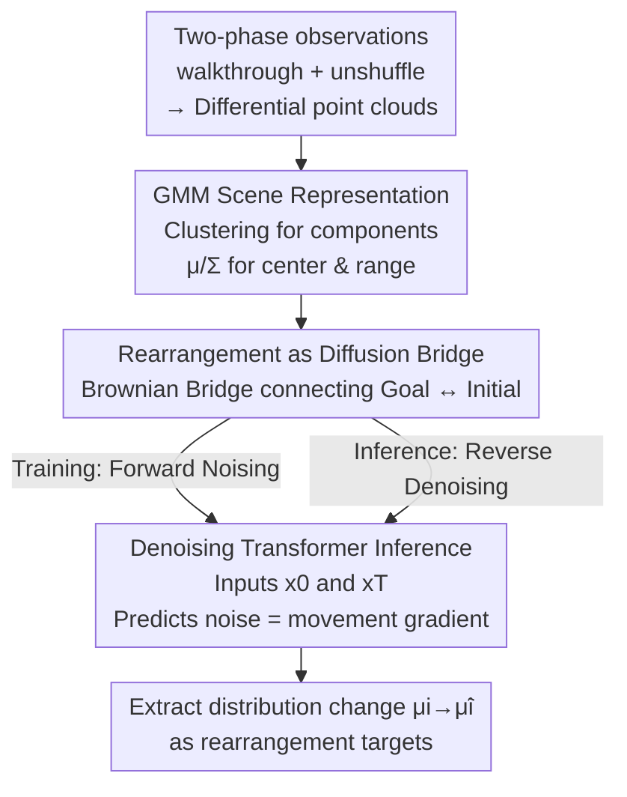

# Rethinking Visual Rearrangement from A Diffusion Perspective

**Conference**: CVPR 2026  
**Paper**: [CVF Open Access](https://openaccess.thecvf.com/content/CVPR2026/html/Qi_Rethinking_Visual_Rearrangement_from_A_Diffusion_Perspective_CVPR_2026_paper.html)  
**Code**: None  
**Area**: Robotics / Embodied AI  
**Keywords**: Visual Rearrangement, Diffusion Bridge, Gaussian Mixture Model, Embodied AI, Denoising Transformer

## TL;DR
This work reinterprets the embodied rearrangement task of "restoring a cluttered room" as a diffusion bridge process—where shuffling is forward diffusion and restoration is reverse denoising. By representing object states as Gaussian Mixture Models (GMM) and using a Denoising Transformer to iteratively infer movements, the method improves the success rate on RoomR from 14.2% to 17.8%.

## Background & Motivation
**Background**: Visual rearrangement is one of the most challenging tasks in embodied AI: an agent first explores a room in its "goal state" to memorize the layout (walkthrough phase), then the room is randomly shuffled, and the agent is returned to restore it (unshuffle phase). Existing approaches follow two paradigms: end-to-end reinforcement learning using parameterized policies to memorize states, or modular methods that decompose the task into perception and planning by explicitly comparing goal and initial scene representations to infer displacements.

**Limitations of Prior Work**: Both paradigms essentially treat the initial and goal states as two isolated data distributions, performing differential comparison to infer targets in a single step. This faces two major issues: high sensitivity to perception noise where slight point cloud inaccuracies lead to incorrect conclusions, and the large gap between states where direct differencing attempts to find a "shortest path" across distributions, making accurate and optimal inference difficult.

**Key Challenge**: These methods focus solely on the endpoints and fail to exploit the evolutionary process of how the goal state transitioned into the initial state. Furthermore, the objective of rearrangement is not to place objects at exact coordinates but to balance position accuracy and task completion. The acceptable goal state is actually a set $S^* = S_1^* \times \dots \times S_n^*$ (defined by 3D bounding box IoU thresholds); approximating this with single-point coordinates inappropriately constrains the inference space.

**Key Insight**: Inspiration is drawn from diffusion processes in non-equilibrium thermodynamics. If Shannon entropy is used to measure scene "disorder," then shuffling (entropy increase) and restoration (entropy decrease) correspond to molecular diffusion driven by concentration gradients and its inverse. By modeling shuffling and restoration as a Markov stochastic process described by Langevin equations, it can be proven that the evolution of object distribution and information entropy satisfies the diffusion equation. In other words, room state changes are naturally modeled as a diffusion process.

**Core Idea**: Replace differential comparison with a diffusion bridge for rearrangement—treating shuffling as forward diffusion and restoration as reverse denoising. High-confidence movement trends for each object are inferred iteratively in the latent space of a GMM using a Denoising Transformer, rather than comparing isolated states in a single step.

## Method

### Overall Architecture
The proposed method, Diffusion Rearrangement, is a modular framework. It takes the goal and initial room configurations as input and outputs state changes (displacements) for each object. The pipeline consists of three stages: first, egocentric depth observations are collected along identical trajectories in both phases to construct global point clouds, from which "moved/protruding" regions are extracted as differential point clouds. These are clustered and fitted into a Gaussian Mixture Model (GMM), where means and covariances represent object centers and spatial ranges. This distribution is fed into a Brownian bridge diffusion model. During training, it undergoes forward noising; during inference, a Denoising Transformer iteratively predicts noise (equivalent to movement gradients) to shift the initial distribution back to the goal distribution. Finally, the displacement $\mu_i \to \tilde\mu_i$ is read from the distribution parameters.

### Key Designs

**1. Redefining Rearrangement as a Brownian Bridge Process: Evolutionary Trajectories**

To address the low confidence of large-span differential comparisons, the method connects the goal and initial states via a diffusion bridge. Shuffling is viewed as forward diffusion and restoration as reverse denoising. Unlike generative diffusion (e.g., DDPM) where one end is pure noise, this task-specific bridge connects two **meaningful structured states**: the goal state $x_0$ and the initial state $x_T$. Intermediate states correspond to valid room configurations. A Brownian bridge characterizes the distribution at time $t$:

$$p\left(x_t \mid x_0, x_T\right)=\mathcal{N}\left(\left(1-\tfrac{t}{T}\right) x_0+\tfrac{t}{T} x_T,\ \tfrac{t(T-t)}{T} I\right)$$

It locks to the goal at $t=0$ and the initial state at $t=T$. The forward transition kernel is $q(x_t\mid x_0,x_T)=\mathcal{N}(x_t;(1-m_t)x_0+m_t x_T,\ \delta_t I)$ where $m_t=t/T$. This is effective because each denoising step only infers a small local change with high confidence, approximating the global change through many small steps, similar to gradient descent.

**2. GMM for Scene Representation: Modeling Acceptable Sets**

To handle perception noise and the "set-based" nature of the goal, the room state $x_t=[x_t^1,\dots,x_t^n]$ is represented as a GMM: $p(x_t)=\sum_{i=1}^n \pi_i\,\mathcal{N}(x_t\mid\mu_i,\Sigma_i)$. Each component corresponds to an object, with mean $\mu_i$ as the center and covariance $\Sigma_i$ describing the acceptable position range. GMMs are chosen because they remain GMMs under Gaussian multiplication (preserving the distribution form during the bridge process), naturally map to object boundaries, and are robust to noise. Inference is constrained to the vicinity of "acceptable states," avoiding the over-generalization of scene graphs or the over-constraint of instance matching.

**3. Dual-End Denoising Transformer: Matching-Free Inference**

To avoid error-prone explicit object matching, an encoder-only Transformer serves as the denoising network. GMM parameters are encoded into a 512-D latent space as tokens, with time $t$ injected via sinusoidal embeddings. Self-attention captures relationships between object distributions, and an MLP decodes parameter changes. Since the Transformer processes sequences where input and output objects correspond 1-to-1, **no matching algorithm is required**. The training objective is simplified from ELBO to estimating $x_t-x_0$:

$$\mathcal{L}_{rearrange}=\left\| x_t - x_0 - \epsilon_\theta(x_t,t)\right\|^2$$

A specific adaptation: while standard BBDMs do not have the target $x_0$ during inference, rearrangement has both $x_0$ and $x_T$ as known inputs. Sampling is modified to $x^*_{t-1}=\mu_\theta(x^*_t,x_0,x_T,t)+\sqrt{\tilde\delta_t}\,\epsilon$, explicitly bringing the goal observation into the reverse process to constrain every denoising step.

### Loss & Training
For each task, data is collected using an exploration policy to fit paired $x_0, x_T$. Timesteps $t\sim\mathrm{Uniform}(1,\dots,T)$ and noise $\epsilon\sim\mathcal{N}(0,I)$ are sampled for the forward process $x_t=(1-m_t)x_0+m_t x_T+\sqrt{\delta_t}\epsilon$. Gradient descent is performed on the rearrangement loss. Input point clouds receive light Gaussian perturbation for robustness. Optimizer: Adam (lr=0.001), batch 64, 6-layer Transformer with 8 heads, trained for 25,000 steps on an A40. Inference uses DDIM with $S=200$ steps.

## Key Experimental Results

### Main Results
Evaluated on the RoomR dataset in AI2-THOR (80 rooms, 4000 training tasks, 1-5 objects moved per task). Four metrics: Suc (Success: all objects restored), FS (Fixed Strict: object-level success), Mis (Misplaced ratio), and E (Relative energy).

| Dataset | Method | Suc(%)↑ | FS(%)↑ | Mis↓ | E↓ |
|--------|------|---------|--------|------|-----|
| RoomR | MaSS | 4.7 | 16.5 | 1.018 | 1.016 |
| RoomR | TIDEE | 11.7 | 28.9 | 0.734 | 0.715 |
| RoomR | CAVR (Prev. SOTA) | 14.2 | 33.1 | 0.707 | 0.714 |
| RoomR | **Ours** | **17.8** | **38.8** | **0.641** | **0.643** |
| ProcTHOR | CAVR (Prev. SOTA) | 4.9 | 17.0 | 0.849 | 0.851 |
| ProcTHOR | **Ours** | **8.4** | **24.7** | **0.806** | **0.814** |

Compared to the previous SOTA (CAVR), the proposed method increases the success rate by 3.6% and FS by 5.7% on RoomR. It also shows superior generalization on the larger ProcTHOR dataset.

### Ablation Study

| Configuration | Suc(%)↑ | FS(%)↑ | Mis↓ | E↓ | Description |
|------|---------|--------|------|-----|------|
| Direct Matching + GMM | 6.5 | 19.4 | 0.837 | 0.860 | Matching by GMM weights |
| Kuhn-Munkres + GMM | 12.8 | 29.7 | 0.730 | 0.732 | Bipartite matching instead of denoising |
| Denoising + coordinate | 16.7 | 37.1 | 0.664 | 0.669 | Center coordinates only |
| Denoising + feature | 17.2 | 37.9 | 0.652 | 0.658 | PointNet++ geometric features |
| **Denoising + GMM (Full)** | **17.8** | **38.8** | **0.641** | **0.643** | Complete model |

Sampling steps analysis: optimal performance is reached at 200 steps. Robustness tests show that with $\sigma=0.01\text{m}$ Gaussian noise on depth, Suc only drops from 17.8% to 17.5%, proving GMM representation provides inherent noise resistance.

### Key Findings
- **Denoising model is the core contributor**: Replacing the Transformer with KM matching drops Suc from 17.8% to 12.8%, as similarity-based matching cannot capture inter-object relationships or evolution processes.
- **GMM representation outperforms points/features**: GMMs (encoding both center and range) outperform pure coordinates (FS 37.1%) and PointNet++ features (FS 37.9%).
- **Sampling sweet spot**: Best results at 200 steps; excessive steps lead to slight degradation, suggesting the bridge does not require extremely long denoising chains for this task.

## Highlights & Insights
- **Interdisciplinary Redefinition**: The analogy between room shuffling/restoration and molecular diffusion/non-equilibrium thermodynamics provides a solid theoretical foundation for replacing "differential comparison" with "process modeling."
- **Task-Specific Diffusion Bridge**: Unlike generative models, this bridge connects two known structured states. Explicitly injecting $x_0$ into the sampling process ensures every step is constrained by real observations, making it more reliable for state evolution than pure generative diffusion.
- **GMM for "Acceptable Sets"**: Modeling targets as distributions aligns perfectly with the task definition (IoU thresholds) rather than requiring exact coordinate matching, appropriately bounding the inference space.

## Limitations & Future Work
- **Dependency on Differential Point Clouds**: The GMM fitting relies on point cloud quality. Depth sensor noise, while partially mitigated, remains a bottleneck.
- **Low Absolute Success Rate**: A Suc of 17.8% on RoomR indicates the task is far from solved. The method provides a relative improvement rather than a complete solution.
- **Decoupled Exploration**: The method requires a separate exploration policy to collect data. Joint optimization of exploration and rearrangement is a potential future direction.
- **Clustering Dependency**: Determining the number of GMM components depends on clustering; errors in this stage propagate through the pipeline.

## Related Work & Insights
- **vs. CAVR (Point Cloud Matching)**: Both use differential point clouds, but CAVR relies on explicit matching. This work uses a diffusion bridge in GMM latent space, improving robustness and surpassing CAVR on all metrics.
- **vs. TIDEE (Scene Graphs/2D Occupancy)**: TIDEE uses coarse scene graphs which often over-generalize targets. This work's GMM representation provides finer control, leading to significantly higher FS and E scores.
- **vs. Generative Diffusion (DDPM/BBDM)**: While generative models start from pure noise, this task-specific bridge connects meaningful states and uses goal observations to guide a constrained, interpretable evolution.

## Rating
- Novelty: ⭐⭐⭐⭐⭐ High. Re-defining rearrangement via thermodynamics and diffusion bridges is a self-consistent and fresh perspective.
- Experimental Thoroughness: ⭐⭐⭐⭐ Good. Multiple datasets and comprehensive ablations, though absolute performance remains low.
- Writing Quality: ⭐⭐⭐⭐ Clear motivation and derivation; formulas are complete, though notation is dense.
- Value: ⭐⭐⭐⭐ Provides a transferable paradigm for "bridging two known states" applicable to trajectory/state inference tasks.

<!-- RELATED:START -->

## Related Papers

- [\[CVPR 2026\] Rethinking Intermediate Representation for VLM-based Robot Manipulation](rethinking_intermediate_representation_for_vlm-based_robot_manipulation.md)
- [\[CVPR 2026\] Semantic Audio-Visual Navigation in Continuous Environments](semantic_audio-visual_navigation_in_continuous_environments.md)
- [\[CVPR 2026\] Rethinking Camera Choice: An Empirical Study on Fisheye Camera Properties in Robotic Manipulation](rethinking_camera_choice_an_empirical_study_on_fisheye_camera_properties_in_robo.md)
- [\[CVPR 2026\] Visual-RRT: Finding Paths toward Visual-Goals via Differentiable Rendering](visual-rrt_finding_paths_toward_visual-goals_via_differentiable_rendering.md)
- [\[CVPR 2026\] EgoRoC: Towards Egocentric Robotic Control via Task-Agnostic Visual Alignment](egoroc_towards_egocentric_robotic_control_via_task-agnostic_visual_alignment.md)

<!-- RELATED:END -->
