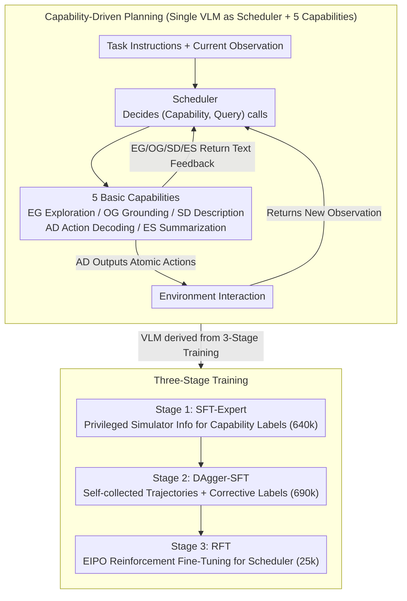

# RoboAgent: Chaining Basic Capabilities for Embodied Task Planning

**Conference**: CVPR 2026  
**arXiv**: [2604.07774](https://arxiv.org/abs/2604.07774)  
**Code**: [https://github.com/woyut/RoboAgent_CVPR26](https://github.com/woyut/RoboAgent_CVPR26)  
**Area**: Robotics  
**Keywords**: Embodied Task Planning, Capability Chaining, Vision-Language Models, Reinforcement Learning, Multi-stage Training  

## TL;DR

RoboAgent is proposed as a capability-driven embodied task planning framework that employs a single VLM to simultaneously function as a scheduler and five basic capabilities (Exploration Guidance, Object Grounding, Scene Description, Action Decoding, and Experience Summarization). Through a three-stage training process (SFT + DAgger + Expert-guided RL), it achieves SOTA performance on EB-ALFRED and ALFWorld.

## Background & Motivation

1. **Background**: Embodied Task Planning (ETP) requires agents to execute sequences of atomic actions based on visual observations and language instructions to complete complex tasks in environments. While VLMs excel in multimodal understanding, their performance in embodied planning involving multi-turn interactions, long-horizon reasoning, and extended context analysis remains limited.

2. **Limitations of Prior Work**: (1) Intermediate thoughts generated via direct Chain-of-Thought (CoT) reasoning lack standardized formats and direct supervision, making it difficult to ensure the correctness and utility of the reasoning; (2) Methods relying on closed-source models or external tools cannot be trained end-to-end; (3) Standard RL struggles to learn effective policies in exploration scenarios with sparse rewards.

3. **Key Challenge**: Complex planning implicitly involves multiple intermediate processes (intent understanding, commonsense reasoning, environment analysis, action modeling, and progress monitoring), yet existing methods conflate these into a single step, hindering fine-grained supervision.

4. **Goal**: To decompose complex planning into a series of fundamental vision-language sub-problems, allowing a single VLM to achieve controllable and transparent reasoning through explicit capability calls.

5. **Key Insight**: Define a set of vision-language capabilities critical for embodied scenarios, where a scheduler determines when to call which capability. Each capability maintains its own context and generates intermediate reasoning results or environment interactions.

6. **Core Idea**: Replace "free-form CoT" with a "structured capability calling chain" using a single VLM that acts as both the scheduler and various capability roles, supported by a multi-stage training process utilizing internal simulator information.

## Method

### Overall Architecture

RoboAgent addresses how a VLM performs long-horizon planning in an embodied environment without outputting an unsupervised, free-form CoT. The approach decomposes "planning" into two roles handled by the same underlying VLM (Qwen2.5-VL-3B): the upper layer is the **Scheduler**, and the lower layer consists of 5 **Capabilities**. The Scheduler reads task instructions and historical context to decide which capability to call and what query to pass, outputting a sequence of `[(Capability Name, Query)]`. The designated capability receives the query and current observation image to either output atomic actions for direct environment interaction or output text feedback to the Scheduler. The Scheduler updates its context accordingly and decides the next call, repeating until the task is complete. This chain does not rely on external tools or closed-source models, enabling end-to-end training. To develop this single VLM, a progressive three-stage process is used: SFT-Expert → DAgger-SFT → Expert-guided RFT (Reinforcement Fine-Tuning) using the proposed EIPO algorithm.

### Key Designs

**1. Decomposing Planning into 5 Vision-Language Sub-problems**

The primary issue with free-form CoT is that "intermediate thoughts" lack standardized formats and direct supervision. RoboAgent defines a set of capabilities corresponding to VLM strengths: **Exploration Guidance (EG)** uses commonsense to predict target directions when the object is not visible; **Object Grounding (OG)** performs open-vocabulary detection; **Scene Description (SD)** describes the current state of the target object; **Action Decoding (AD)** translates instructions into atomic actions; and **Experience Summarization (ES)** reviews recent actions and analyzes failures. Only AD produces actions without text feedback, while the other four provide text feedback without actions. This "Action vs. Feedback" division ensures the Scheduler always receives structured intermediate information, making each step diagnosable and supervised.

**2. Three-stage Training: From Format Mastery to Distribution Correction to Generalization**

Models relying solely on imitation learning fail due to distribution shifts, while sparse rewards make pure RL difficult. Training is thus split into three segments: **Stage 1 (SFT-Expert)** teaches basic formats and skills using simulator privileged information (scene graphs, masks) to generate labels (640k samples). **Stage 2 (DAgger-SFT)** deploys the Stage 1 model to collect self-generated trajectories, using semantic matching to align calls with ground-truth to create corrective labels (690k samples), essentially fixing distribution shifts. **Stage 3 (RFT)** applies reinforcement fine-tuning specifically to the Scheduler, using the completion of sub-plans as rewards across 25k diverse trajectories to enhance generalization.

**3. Expert-guided Iterative Policy Optimization (EIPO)**

Instead of using PPO/GRPO to estimate returns via Monte Carlo sampling—which is noisy in sparse reward settings—EIPO directly maximizes the advantage function of the **expert** $A_{\pi^*}(s,a)$. Since the expert policy is deterministic, $A_{\pi^*}$ can be calculated precisely. Following a GRPO-style group mean as a baseline, actions that are "relatively better" within a group receive positive gradients:

$$J(\pi) = \mathbb{E}_{s \sim D}\, \frac{1}{G} \sum_{i=1}^{G} \big[\, r(a^i, s)\, \hat{A}_{\pi^*}(s, a^i) \,\big]$$

The stability stems from the expert's optimality ensuring $A_{\pi^*}(s,a) \leq 0$; sub-optimal actions are automatically discouraged with clear directional signals. Step-level advantages provide denser signals than episode-level rewards, leading to faster convergence.

### A Complete Example: Pick a Cup and Place it on the Table

For a task like "Put the cup on the table," if the cup is not visible, the Scheduler calls **EG**, which suggests searching toward the cabinet based on commonsense. The Scheduler then directs **AD** to decode navigation actions. After moving, the Scheduler calls **OG** to detect the cup. If found, **SD** describes the cup's state ("in the sink, reachable"), and **AD** decodes the pick-up action. Finally, **ES** reviews the success of the pick-up before the Scheduler plans the navigation to the table. Throughout this chain, the Scheduler processes structured feedback rather than vague internal monologues, allowing for evidence-based decision-making.

### Loss & Training

Stages 1 and 2 utilize standard cross-entropy loss for SFT. Stage 3 employs the EIPO algorithm with a learning rate of 5e-6, batch size of 512, and 120 policy update iterations. The entire model is trained on 4 H800 GPUs. The base model is Qwen2.5-VL-3B. Stage 1 uses a learning rate of 1e-5 and batch size of 32 for 2 epochs.

## Key Experimental Results

### Main Results

| Benchmark | Method | Base Model | Avg. SR |
|------|------|--------|---------|
| EB-ALFRED | Claude-3.7-Sonnet (zero-shot) | - | 67.7 |
| EB-ALFRED | WAP | Qwen2.5-VL-7B | 62.7 |
| EB-ALFRED | **Ours** | **Qwen2.5-VL-3B** | **67.0** |
| ALFWorld (Vision) | SEEA-R1 | Qwen2.5-VL-7B | 36.0 |
| ALFWorld (Vision) | **Ours** | **Qwen2.5-VL-3B** | **77.6** |
| ALFWorld (Text) | DynaMind | Qwen2.5-7B | 92.5/89.1 |
| ALFWorld (Text) | **Ours** | **Qwen2.5-VL-3B** | **92.1/94.0** |

In the ALFWorld visual environment, RoboAgent achieves a 77.6% SR, significantly outperforming existing RL methods (the runner-up SEEA-R1 reaches only 36.0%), representing a gain of 41.6 percentage points.

### Ablation Study

| Training Config | ALFWorld SR | EB-ALFRED SR | Description |
|---------|-------------|--------------|------|
| SFT-expert | 44.8 | 62.0 | Expert trajectory SFT only |
| +DAgger (aug. gen.) | 73.1 | 64.3 | Adds DAgger with model-generated data |
| +RFT (aug. exp.) | 74.6 | 65.7 | Adds RFT with augmented expert data |
| +RFT (aug. syn.) | **77.6** | **67.0** | Full model with synthetic data RFT |

### Key Findings

- **DAgger phase provides the largest contribution**: SR on ALFWorld increases from 44.8 to 73.1 (+28.3), demonstrating that corrective supervision on self-collected trajectories is vital for bridging distribution shifts.
- **EIPO converges faster than GRPO**: Within the same number of iterations, EIPO achieves a higher SR on ALFWorld, validating the stability advantage of step-level advantage functions.
- **Cross-modal generalization**: The same visual model adapts directly to text-only environments, reaching 92.1/94.0 (seen/unseen), rivaling text-specific methods and suggesting the framework learns modality-agnostic planning.
- **OOD Generalization**: Ours outperforms other open-source transfer models on EB-Habitat (22.3) and LoTa-WAH (22.1), though a gap remains compared to the closed-source GPT-4o (59.0).

## Highlights & Insights

- **The "Capability as Interface" concept is highly inspiring**: Unlike free-form CoT, structured capability calls make intermediate reasoning supervised, diagnosable, and replaceable—a major paradigm for VLM agent design.
- **Utilizing simulator privileged information for data construction**: Using scene graphs and masks to build high-quality labels for capabilities is a clever knowledge distillation strategy.
- **Single Model, Multi-role**: Sharing one 3B VLM for both the scheduler and all capabilities reduces deployment complexity significantly compared to multi-model or tool-dependent systems.
- **Generalizability of the EIPO algorithm**: Leveraging the determinism of expert policies to obtain precise advantage estimates is applicable to any RL scenario with a reliable expert.

## Limitations & Future Work

- Training was conducted only in AI2-THOR/ALFRED simulators; real-world generalization remains unverified.
- The 5 capabilities are pre-defined and cannot yet be dynamically expanded or adaptively selected based on tasks.
- OOD results show a significant gap in cross-simulator generalization (approx. 37 points behind GPT-4o zero-shot).
- The 3B model may be limited in complex reasoning; larger models could offer further improvements.
- Future work could consider self-discovery and combination mechanisms for capabilities.

## Related Work & Insights

- **vs. SEEA-R1**: SEEA-R1 uses a 7B model + RL for 36.0% SR on ALFWorld; RoboAgent reaches 77.6% with 3B, proving structured calls are more effective than free CoT.
- **vs. Closed-source Zero-shot (Claude/GPT-4o)**: RoboAgent (67.0) is close to Claude-3.7-Sonnet (67.7) on EB-ALFRED and far exceeds GPT-4o (24.0) on ALFWorld Vision, showing fine-tuned small models can rival large models.
- **vs. Progressive Planning (MPO/DynaMind)**: While these methods decompose tasks into sub-goals, RoboAgent decomposes the reasoning process into capabilities, providing a finer supervision interface.

## Rating

- Novelty: ⭐⭐⭐⭐ The capability-driven framework is novel; EIPO makes theoretical contributions, though capability definitions are somewhat manual.
- Experimental Thoroughness: ⭐⭐⭐⭐⭐ 4 benchmarks (2 in-domain + 2 OOD), 3 modalities (Vision/Text/OOD), comprehensive stage ablations, and EIPO vs. GRPO comparisons.
- Writing Quality: ⭐⭐⭐⭐ Clear framework descriptions and intuitive training visualizations, though formula derivations are dense.
- Value: ⭐⭐⭐⭐⭐ Provides a replicable and scalable paradigm for embodied VLM agents; the 77.6% SR on ALFWorld is currently the strongest result.

<!-- RELATED:START -->

## Related Papers

- [\[CVPR 2026\] Recurrent Reasoning with Vision-Language Models for Estimating Long-Horizon Embodied Task Progress](recurrent_reasoning_with_vision-language_models_for_estimating_long-horizon_embo.md)
- [\[ICML 2026\] Embodied Task Planning via Graph-Informed Action Generation with Large Language Models](../../ICML2026/robotics/embodied_task_planning_via_graph-informed_action_generation_with_large_language_.md)
- [\[CVPR 2026\] Iterative Closed-Loop Motion Synthesis for Scaling the Capabilities of Humanoid Control](iterative_closed-loop_motion_synthesis_for_scaling_the_capabilities_of_humanoid_.md)
- [\[ICLR 2026\] REI-Bench: Can Embodied Agents Understand Vague Human Instructions in Task Planning?](../../ICLR2026/robotics/rei-bench_can_embodied_agents_understand_vague_human_instructions_in_task_planni.md)
- [\[NeurIPS 2025\] Towards Reliable Code-as-Policies: A Neuro-Symbolic Framework for Embodied Task Planning](../../NeurIPS2025/robotics/towards_reliable_code-as-policies_a_neuro-symbolic_framework_for_embodied_task_p.md)

<!-- RELATED:END -->
