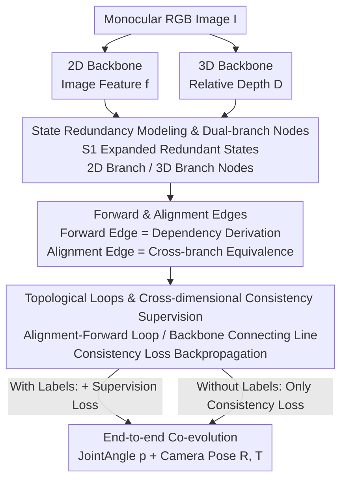

# RoboTAG: End-to-end Robot Pose Estimation via Topological Alignment Graph

**Conference**: CVPR 2026  
**Paper**: [CVF Open Access](https://openaccess.thecvf.com/content/CVPR2026/html/Liu_RoboTAG_End-to-end_Robot_Pose_Estimation_via_Topological_Alignment_Graph_CVPR_2026_paper.html)  
**Code**: To be confirmed  
**Area**: Robotics / Embodied AI  
**Keywords**: Robot Pose Estimation, 3D Prior, Topological Alignment Graph, Cross-dimensional Consistency Supervision, Unlabeled Alignment

## TL;DR
To address the pain points of monocular RGB robot pose estimation—specifically its high reliance on annotations and the loss of spatial priors when compressing 3D problems into 2D—RoboTAG organizes camera-robot system state variables into a "Topological Alignment Graph" featuring 2D and 3D branches. By identifying "closed loops" within the graph to impose 2D-3D consistency supervision, the two backbone networks co-evolve. This allows training on unlabeled in-the-wild images, achieving SOTA on 5 out of 9 DREAM benchmarks with an average AUC of 76.9%.

## Background & Motivation
**Background**: Estimating robot pose (joint angles + camera extrinsic parameters) from monocular RGB images is a fundamental task for robotics and computer vision. It supports human-robot interaction, multi-robot collaboration, and automatic labeling of robot videos in the wild. Prevailing approaches (RoboPose, RoboPEPP, Holistic Pose, etc.) typically attach prediction heads to 2D visual backbones to directly regress joint angles and keypoints.

**Limitations of Prior Work**: These methods suffer from two common issues. First, they **rely heavily on annotated data**, yet real-world data with precise joint angle and camera pose labels is extremely scarce, leading to models trained on synthetic data that struggle with the sim-to-real gap. Second, they **reduce an inherently 3D problem to the 2D domain**, ignoring readily available geometric priors in pre-trained 3D models and suffering from the spatial ambiguity inherent in 2D representations. Furthermore, methods like RoboPEPP/DREAM rely on PnP to solve camera poses from predicted 2D keypoints; if keypoints are occluded or noisy, the PnP solution collapses.

**Key Challenge**: Scarcity of labels and the lack of 3D geometric information stem from the same root: **the 2D branch predicts each state in isolation and applies supervision separately**. Without a structure for cross-validation between branches, the models cannot use 3D priors to resolve 2D ambiguity, nor can they find additional supervision signals when labels are missing.

**Goal**: Inject 3D priors into pose estimation and create a supervision mechanism that works even without labels, without introducing additional annotations.

**Key Insight**: The authors observe that redundant relationships—mathematically equivalent or derivable—exist between the state variables of a camera-robot system (e.g., joint angles and 3D keypoints determine each other; projecting 3D keypoints yields 2D keypoints). If these variables are treated as nodes and their dependencies/equivalences as edges in a graph, the principle that "the same quantity calculated via different paths should be equal" provides a natural form of self-supervision without requiring external labels.

**Core Idea**: Use a topological graph with dual 2D and 3D branches (RoboTAG) to organize all system states. Define "closed loops" in the graph and impose 2D-3D consistency constraints on equivalent nodes at both ends. This allows the 2D and 3D backbones to co-evolve through loop gradients.

## Method

### Overall Architecture
Given a monocular RGB image $I$ of a robot with $n$ joints, the system is defined by $\mathcal{S}_0 = \{p, R, T\}$, where $p$ represents joint angles (configuration) and $R, T$ denote the camera's rotation and translation relative to the robot base. The goal is to estimate $\hat{\mathcal{S}}_0 = \{\hat{p}(I), \hat{R}(I), \hat{T}(I)\}$ from $I$.

The process is as follows: The image passes through a 2D backbone (extracting image features $f$) and a 3D backbone (extracting relative depth $D$) simultaneously. Starting from $f$ and $D$, a set of "forward edges" derives state nodes for the 2D and 3D branches (joint angles, 2D/3D keypoints, point clouds, camera pose, etc.) based on variable dependencies. "Alignment edges" then connect equivalent nodes representing the **same physical quantity** across the two branches. These edges form "closed loops," where nodes connected by alignment edges must be consistent, thus imposing 2D-3D consistency losses. The entire graph is end-to-end trainable: with labels, supervision losses are added; without labels, only loop consistency losses are used. Gradients flow back through the loops to train the neural networks on the forward edges and the two backbones.

### Key Designs

**1. State Redundancy Modeling & Dual-branch Nodes: Explicitly Listing Equivalent Quantities**

The fundamental problem with isolated state prediction is the lack of cross-branch validation. RoboTAG **deliberately creates redundancy** by expanding the minimal state $\mathcal{S}_0=\{p,R,T\}$ to $\mathcal{S}_1 = \{p, R, T, \kappa_2, \kappa_3, pts\}$ (adding 2D keypoints $\kappa_2$, 3D keypoints $\kappa_3$, and point clouds $pts$). Since $\mathcal{S}_0$ fully determines the system, these additional values in $\mathcal{S}_1$ are redundant. This redundancy provides the constraint space where "the same quantity calculated via different paths must be equal." Based on this, 3D branch nodes $\{V_n^3\}=\{D, D', p, \kappa_3, pts\}$ and 2D branch nodes $\{V_n^2\}=\{f, \lambda, p, R, T, \kappa_2, \kappa_3, pts\}$ are defined, where $D$ is the relative depth and $D'=\lambda\cdot D$ is the absolute depth corrected by a depth aligner $\lambda$. Both branches hold "homonymous" quantities like $p, \kappa_3, pts$, laying the groundwork for cross-branch alignment.

**2. Forward & Alignment Edges: Explicitly Encoding Dependency and Equivalence**

Edges in the graph are of two types. **Forward edges** characterize dependencies: $\mathcal{E}^{\text{forward}}_{\mathcal{V}_i,\mathcal{V}_j}=1$ when $\partial\mathcal{V}_i/\partial\mathcal{V}_j \neq 0$ (e.g., joint angles $p$ and 3D keypoints $\kappa_3$ depend on each other). These dependencies are implemented by one of three operator types: **pure transforms** (mathematical equivalence, such as projecting 3D keypoints to 2D keypoints $\kappa_{2,proj}$), **robot prior models** (using URDF and forward kinematics to calculate $\kappa_{3,fk}$ and $pts_{fk}$ from $p, R, T$), or **neural networks** (fitting implicit relationships, such as predicting $\{p^2, R, T, \kappa_2^2, \kappa_3^2, pts^2, \lambda\}$ from $f$). **Alignment edges** characterize cross-branch equivalence: they are set to 1 when $\mathcal{V}_i \Longleftrightarrow \mathcal{V}_j$ (nodes representing the same physical quantity). For example, $p^2\Leftrightarrow p^3$, $\kappa_3^2\Leftrightarrow\kappa_3^3\Leftrightarrow\kappa_{3,fk}^3\Leftrightarrow\kappa_{3,fk}^2$, and $pts^2_{fk}\Leftrightarrow pts^3_{fk}\Leftrightarrow pts^3_{unproj}$. These edges clearly encode "how to compute" and "what should be equal" into the topological structure.

**3. Topological Loops & Cross-dimensional Consistency Supervision: Self-Supervision without Labels**

Edges form "closed loops." The paper defines two supervisable structures: **Alignment-Forward Loops** (containing exactly one alignment edge and multiple forward edges, forming a geometric loop) and **Backbone Connecting Lines** (lines starting at the 3D backbone $D$ and ending at the 2D backbone $f$, also containing exactly one alignment edge, treating backbones as nodes connected by forward edges). These loops form a basis for a subspace in the topological space (the authors select a set of fundamental cycle bases $B$ such that $H_1(G,\mathbb{Z}_2)=\text{span}_{\mathbb{Z}_2}(B)$). By imposing a consistency loss on the two ends of an alignment edge within a loop, the model is forced to keep them equal, and gradients backpropagate through the entire loop to train the neural networks on the forward edges. For backbone connecting lines, gradients flow directly into the 3D and 2D backbones, driving **co-evolution**. The consistency loss $\mathcal{L}_{\text{align}}$ is a weighted sum of $\ell_2$ differences between $p^3$ and $p^2$, $\kappa_3^3$ and $\kappa_3^2$, and others, alongside Chamfer distances between $pts^3_{unproj}$ and $pts^3_{fk}/pts^2_{fk}$. The total loss is $\mathcal{L}_{\text{tot}}=\mathcal{L}_{\text{align}}+\mathcal{L}_{\text{supervised}}$. Crucially, $\mathcal{L}_{\text{align}}$ **requires no labels**—it can be computed using only images, allowing RoboTAG to utilize unlabeled real-world data and solve the data bottleneck. Camera poses, constrained by multiple loops from different directions, are predicted directly by the 2D branch **without PnP**, making them more robust to occlusions or missing keypoints.

### Loss & Training
Training occurs in two phases. **Supervision Phase**: On the labeled synthetic DR-train set, both $\mathcal{L}_{\text{align}}$ and $\mathcal{L}_{\text{supervised}}$ are used. The latter involves weighted $\ell_2$/Chamfer differences between predicted values ($p^3, R^2, T^2, \kappa_2^2, \kappa_{2,proj}^2, pts$, etc.) and their ground truth. Training uses a learning rate of $1.2\times10^{-4}$, a global batch size of 128, for 80 epochs with a 0.95 decay rate. **Alignment Phase**: When using real images (e.g., Panda 3C) without annotations, only the loop consistency loss is applied. No new labels are introduced. The learning rate is reduced to $1.0\times10^{-6}$, with a batch size of 128 for 20 epochs. The 2D backbone is initialized with Holistic Pose’s rootnet (pre-trained on DepthNet), and the 3D backbone uses pre-trained DepthAnything-V2 Tiny; all weights are trainable. Convergence took approximately 3 days on 8 L40S GPUs.

## Key Experimental Results

### Main Results
Evaluation follows the DREAM benchmark, using the Area Under the Curve (AUC ↑) for the ADD of predicted vs. ground truth joint positions in the image. Panda 3C-* and ORB are real images, while others are synthetic. Since the supervision training set is DR, other evaluation sets are considered **Out-of-Distribution (OOD)**.

| Dataset (Partial) | RoboPose | RoboPEPP | Holistic Pose | RoboTAG (Ours) |
|-------------------|----------|----------|---------------|----------------|
| Mean AUC          | 71.3     | 74.0     | 75.7          | **76.9**       |
| Panda DR          | 70.4     | 75.3     | 82.2          | **83.1**       |
| Panda 3C-AK (Real)| 77.6     | 78.5     | 76.0          | 75.7           |
| Panda Photo       | 82.9     | 83.0     | 82.7          | 82.5           |
| Kuka DR           | 80.2     | 76.2     | 75.1          | 75.0           |
| Baxter DR         | 32.7     | 34.4     | 58.8          | **58.8**       |

RoboTAG achieves a mean AUC of 76.9%, 1.2% higher than the runner-up, and reaches SOTA on 5 out of 9 benchmarks. It demonstrates stronger generalization on OOD sets (real + synthetic photos). The authors note that while the hybrid alignment framework is slightly weaker than pure supervision on DR sets highly similar to training data, the gains on OOD sets are more critical for real-world deployment. Regarding latency, RoboTAG's single forward pass takes 35 ms, close to 2D baselines (23/27 ms) and significantly faster than optimization-based methods (200 ms+).

### Ablation Study
Mean joint angle error (Degrees ↓, Panda) and module ablation (AUC ↑):

| Configuration | Metric | Description |
|---------------|--------|-------------|
| Panda DR · Joint Error | 3.6 (Ours) vs 3.8 (RoboPEPP) | SOTA for most of the first 5 joints |
| Panda Photo · Joint Error | 3.3 (Ours) vs 3.2 (RoboPEPP) | Comparable to RoboPEPP |
| 2D Baseline (2D Branch only) | — | No 3D branch or graph structure |
| + 2D-3D Feature Fusion | +0.45% | Adds 3D backbone + Hiwin attention, no graph/alignment |
| + Full TAG (Alignment) | +1.6% more | Adds loops + 2D-3D consistency loss |

### Key Findings
- **TAG alignment is the primary source of improvement**: Simply fusing 3D features provides only a 0.45% gain, whereas the full TAG loop consistency supervision adds another 1.6%. This indicates that the value lies in using topological loops to enforce 3D priors rather than just having a 3D backbone.
- **Joints closer to the base are more accurate**: Proximal joints (e.g., J1) significantly impact 3D position and are more strictly supervised by the 3D branch. Distal joints (J6/gripper) show weaker 3D feature response and higher error, though their impact on overall pose is less critical.
- **Avoiding PnP improves robustness**: DREAM/RoboPEPP collapse if keypoints are occluded since they rely on PnP. RoboTAG predicts camera pose directly from the 2D branch under multi-loop constraints, proving more stable against noise and extreme viewpoints.

## Highlights & Insights
- **The "Redundancy as Supervision" concept is clever**: By explicitly listing derivable states as nodes and enforcing equality across different calculation paths, the model generates unlabeled supervision. Utilizing homology/cycle bases from graph theory for consistency constraints is a transferable paradigm.
- **Topological graphs unify 2D/3D representation synergy**: Separately encoding forward edges (computation) and alignment edges (equivalence) allows loop gradients to drive co-evolution of two backbones rather than simple feature concatenation.
- **Transferability**: This "redundancy modeling + loop consistency" approach can be applied to any multi-modal/multi-branch estimation task where multiple paths lead to the same quantity (e.g., multi-view geometry, cross-sensor calibration).

## Limitations & Future Work
- **Insufficient accuracy for distal joints**: Joints furthest from the base (e.g., joint 6) exhibit larger deviations due to weak 3D feature response. Improving end-effector accuracy is listed as future work.
- **Weaknesses in DR in-distribution**: When the evaluation set is highly similar to the training set, alignment losses may dilute pure supervision effects. A hybrid framework is not always superior in every scenario.
- **Reliance on Robot Prior Model (URDF)**: Part of the forward edges depend on known URDF and forward kinematics, which might limit applicability to robots without precise geometric models.
- ⚠️ Specific details regarding the homological basis representation of loops and the exact values of loss weights $\alpha_i/\beta_i$ are not fully detailed in the main text; refer to the supplementary material for reproduction.

## Related Work & Insights
- **vs RoboPose**: RoboPose uses iterative render-and-compare to refine joint angles and camera pose, which is computationally expensive. RoboTAG achieves 35 ms latency and avoids iterative optimization via 3D priors and loops.
- **vs RoboPEPP**: RoboPEPP uses MAE pre-training to enhance understanding of the robot-camera system but remains in the 2D domain and relies on PnP for camera recovery, where keypoint errors accumulate. RoboTAG predicts camera pose directly and uses 3D branch constraints, offering better OOD stability.
- **vs Holistic Pose (rootnet/[1])**: Holistic Pose uses a 2D backbone to directly predict 3D keypoints, a difficult task for a prediction head. RoboTAG adds a 3D backbone-guided loop to this task, resulting in higher accuracy.
- **vs RoboKeyGen**: This uses a diffusion model to lift 2D keypoints to 3D, but it is not evaluated on general benchmarks like DREAM and is not open-source, precluding direct comparison.

## Rating
- Novelty: ⭐⭐⭐⭐⭐ Reframes robot pose estimation as a "Topological Alignment Graph + Loop Consistency" problem and generates self-supervision from redundant states.
- Experimental Thoroughness: ⭐⭐⭐⭐ Covers 3 robot types, real + synthetic data, ablation studies, and latency analysis, though it lacks comparison with more semi-supervised baselines.
- Writing Quality: ⭐⭐⭐⭐ Framework and graph definitions are clear, though equations are dense and some symbols require the supplementary material for full clarity.
- Value: ⭐⭐⭐⭐⭐ Directly addresses the robotics data bottleneck; its ability to utilize unlabeled in-the-wild images for auto-labeling is significant for real-world deployment.

<!-- RELATED:START -->

## Related Papers

- [\[CVPR 2026\] LEAD: Minimizing Learner-Expert Asymmetry in End-to-End Driving](lead_minimizing_learner-expert_asymmetry_in_end-to-end_driving.md)
- [\[CVPR 2026\] End-to-End Language-Action Model for Humanoid Whole Body Control](end-to-end_language-action_model_for_humanoid_whole_body_control.md)
- [\[CVPR 2026\] A Cross-view Fusion Framework for Robust 6-DoF Grasp Pose Estimation](a_cross-view_fusion_framework_for_robust_6-dof_grasp_pose_estimation.md)
- [\[NeurIPS 2025\] SutureBot: A Precision Framework & Benchmark for Autonomous End-to-End Suturing](../../NeurIPS2025/robotics/suturebot_a_precision_framework_benchmark_for_autonomous_end-to-end_suturing.md)
- [\[CVPR 2025\] TinyNav: End-to-End TinyML for Real-Time Autonomous Navigation on Microcontrollers](../../CVPR2025/robotics/tinynav_end-to-end_tinyml_for_real-time_autonomous_navigation_on_microcontroller.md)

<!-- RELATED:END -->
