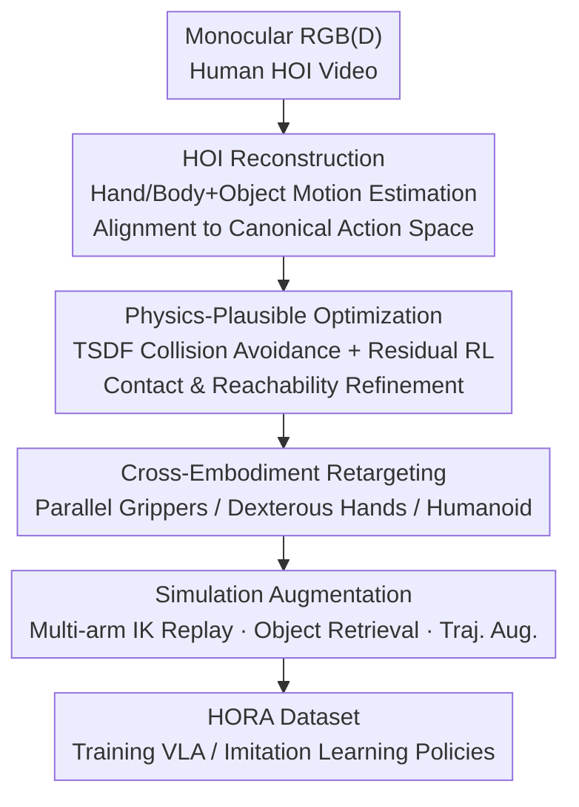

# RoboWheel: A Data Engine from Real-World Human Demonstrations for Cross-Embodiment Robotic Learning

**Conference**: CVPR 2026  
**Paper**: [CVF Open Access](https://openaccess.thecvf.com/content/CVPR2026/html/Zhang_RoboWheel_A_Data_Engine_from_Real-World_Human_Demonstrations_for_Cross-Embodiment_CVPR_2026_paper.html)  
**Code**: None (Project page only: https://zhangyuhong01.github.io/Robowheel)  
**Area**: Robotics / Embodied AI  
**Keywords**: Data Engine, Hand-Object Interaction Reconstruction, Cross-Embodiment Retargeting, Physics-Plausible, VLA

## TL;DR
RoboWheel automatically converts monocular RGB(D) videos of "human-hand-object interaction" into robot supervision data suitable for training VLA / imitation learning policies. Through high-precision reconstruction, physics-plausible optimization, cross-embodiment retargeting, and simulation-domain augmentation, it generates the HORA dataset with 150,000 trajectories, providing the first quantitative proof that HOI videos can serve as effective supervision for robotic learning.

## Background & Motivation
**Background**: The most effective supervision for embodied agents is "how humans interact with the world," but obtaining robot-executable data is expensive. Current mainstream methods rely on teleoperation and studio Motion Capture (MoCap), which require specialized hardware and manual curation, resulting in poor diversity and difficult cross-embodiment migration.

**Limitations of Prior Work**: Meanwhile, a vast amount of Hand-Object Interaction (HOI) videos exist in internet datasets, containing real-world manipulation strategies that are seldom converted into robotic training data. Three bottlenecks exist: noisy monocular reconstruction, physically implausible reconstructed trajectories (interpenetration, contact floating), and morphological mismatches between human hands and robot embodiments (grippers / dexterous hands / humanoids).

**Key Challenge**: While perception methods based on SMPL-H/MANO and 6D object poses can recover geometry and motion from monocular views, they suffer from inconsistent contact estimation, interpenetration under occlusion, non-smooth trajectories, and violations of kinematic/dynamic constraints. A gap remains between "reconstructing rough geometry" and "providing robot supervision" that requires physical plausibility and executability. Purely synthetic data fails to reflect real perception and contact distributions.

**Goal**: To develop a scalable processing pipeline that achieves three objectives: (i) large-scale, continuous acquisition of physics-plausible robot-object interaction trajectories; (ii) flexible retargeting to various heterogeneous robot embodiments while preserving interaction semantics; (iii) integration of multiple data augmentations for scalability.

**Key Insight**: Human hand motion is an "embodiment-agnostic" universal motion representation. By reconstructing it accurately, refining it for physical plausibility, and projecting it onto different robot embodiments, one can extract cross-embodiment supervision from ordinary videos.

**Core Idea**: An end-to-end data engine following "Video → Reconstruction → Retargeting → Augmentation → Data" to transform human manipulation videos into cross-embodiment training data using only a monocular RGB(D) camera.

## Method

### Overall Architecture
RoboWheel is a unidirectional pipeline: the input is monocular RGB(-D) video of human hand-object interaction, and the output is multi-modal robotic trajectory data for VLA / imitation learning models. The process comprises four stages: initial reconstruction of hand and object motion in a global coordinate system; refinement using TSDF and residual reinforcement learning for physics-plausible trajectories; retargeting to heterogeneous embodiments (grippers, dexterous hands, humanoids); and finally, domain randomization and augmentation in Isaac Sim. This chain functions as a "data flywheel."

### Key Designs

**1. Monocular HOI Reconstruction: Recovering Hand and Object in World Coordinates**

To address the noise and scale issues of monocular reconstruction, the authors integrate SOTA estimators into a unified framework. Given video frames $\{I_t\}_{t=1}^T$, hand poses $h_t=(\theta_h(t), R^w_h(t), t^w_h(t))$ or full-body SMPL-H parameters are estimated. For objects, masks $m_t$ and depth $D_t$ are extracted to create texture-less meshes $\hat{M}_o$ via 3D generators. Rescaling to real-world dimensions $M_o = s_o\hat{M}_o$ is performed using depth back-projection. Keypoint-driven tracking estimates the 6D pose stream. Consistency is achieved by estimating camera intrinsics and transforming all interactions into a global world coordinate system, specifically aligned to a **canonical action space** $\mathcal{A}$, enabling unified processing of heterogeneous sources.

**2. Physics-Plausible Optimization: TSDF and Residual RL**

Reconstructed geometry often suffers from hand-object penetration or floating. This stage ensures physical plausibility in two steps: first, a Truncated Signed Distance Function (TSDF) $\phi_o(x;t)$ is used for collision-free initialization by minimizing $\phi_o^2$ for hand vertices $V_h^{palm}$. Second, a **residual RL policy** refines trajectories to ensure physical consistency and reachability. The RL state $s_t=(h_t, p_t, \dot{h}_t, \dot{p}_t, C_t)$ includes pose, velocity, and contact forces $C_t$. The reward function is:

$$r_t = \lambda_{geo}\Phi_{geo}(\|\Delta h_t\| + \|\Delta p_t\|) + \lambda_{dyn}\Phi_{dyn}(\|\Delta\dot{h}_t\| + \|\Delta\dot{p}_t\|) + \lambda_{con}\Phi_{con}(C_t)$$

where $\Delta$ denotes the error between current and target states. This optimization improves the Replay Success Rate (SR) from 78.7% to 93.6% (+14.9).

**3. Cross-Embodiment Retargeting: Mapping to Grippers, Hands, and Humanoids**

To bridge the gap between human hands and robot embodiments: For **parallel grippers**, 3D hand joints are mapped to end-effector poses $\{T_g(t), g(t)\}$. A kNN classifier identifies "power grasp" vs "pinch grasp." For "power grasps," a stable palm coordinate system is constructed from MCP joints; for "pinch grasps," the axis is defined by the index-thumb line. Gripper state is determined by tracking object keypoint displacement via CoTracker, which is more robust than masks. For **dexterous hands**, kinematic similarity and contact-preserving constraints are used. For **humanoids**, full-body SMPL-H is mapped via IK and dynamics-aware optimization. Replay success is automatically verified using Qwen2.5-VL using wrist and third-person views.

**4. Simulation Augmentation: Scaling Data via the Flywheel**

Augmentations are performed in the canonical space $\mathcal{A}$ to maintain contact semantics. **Multi-arm Replay**: UR5/UR5e, Franka Panda, KUKA iiwa, Kinova Gen3, and Sawyer arms are instantiated in Isaac Sim, with end-effector trajectories $T_g(t)$ solved into joint trajectories $q_t$ via cuRobo's GPU-accelerated IK. **Object Retrieval**: Top-K alternative objects are retrieved using Chamfer distance, AABB IoU, and text-shape semantic embeddings. **Trajectory Augmentation**: Trajectories are sliced into hold/open segments and augmented with rigid-body transformations. These methods, combined with background randomization and cluttered scenes, form the data flywheel.

### Loss & Training
The physics-plausible stage trains the residual RL policy using the reward $r_t$. The TSDF term penalizes palm vertex penetration. In the augmentation stage, IK solving minimizes the cuRobo goal cost $C_{goal}$ subject to joint limits $q_{min}\preceq q\preceq q_{max}$ and self-collision constraints $C_{coll}(q)\le 0$. MANO fitting for the MoCap subset utilizes a multi-constraint joint optimization involving tactile contact, wrist calibration, and anatomical priors.

## Key Experimental Results

### Main Results
Downstream policy verification (Tab. 3, Real-robot success rate %, grouped by difficulty, tele.=10 teleoperation trajectories | HORA=10 HORA trajectories): Training with HORA data achieves performance comparable to teleoperation. Adding 5k HORA trajectories for pre-training significantly outperforms both, especially on complex tasks.

| Difficulty | Metric | RDT (tele.\|HORA) | Pi0 (tele.\|HORA) | RDT+5kHORA | Pi0+5kHORA |
|------------|--------|-------------------|-------------------|------------|------------|
| Easy (Avg) | SR     | 66.3 \| 47.5      | 68.8 \| 58.8      | 75.0       | 76.3       |
| Hard (Avg) | SR     | 35.0 \| 25.0      | 40.0 \| 31.3      | 47.5       | **58.8**   |

Retargeting scheme comparison (Tab. 5, Direct real-robot replay success rate %): The proposed retargeting achieves the highest success rates.

| Method | Macro Avg SR |
|--------|--------------|
| GAT-Grasp | 50.0 |
| yoto | 66.7 |
| **Ours** | **91.7** |

### Ablation Study
Reconstruction quality ablation (Tab. 2, evaluated on HO-Cap; Replay SR is success rate):

| Config | Obj CD↓ | Jitter↓ | Rot Const↓ | Replay SR↑ | Description |
|--------|---------|---------|------------|------------|-------------|
| HOLD (Baseline) | 7.5 | 3.47 | - | - | SOTA HOI Reconstruction |
| Ours w/o TSDF & RL | 5.4 | 3.34 | 5.1 | 78.7 | Reconstruction only |
| Ours TSDF only | 5.4 | 0.84 | 3.2 | 85.2 | Anti-penetration added |
| Ours RL only | 6.2 | 4.13 | 3.1 | 61.7 | RL without TSDF fails |
| **Ours TSDF + RL** | **5.1** | 0.92 | **1.9** | **93.6** | Full model (+14.9 SR) |

Data augmentation robustness (Tab. 4, RDT under distribution shift):

| Scene | HORA Avg | HORA-aug Avg | Gain |
|-------|----------|--------------|------|
| Unseen Object | 3.75/10 | 4.25/10 | +0.5 |
| Cluttered Scene | 4.00/10 | 4.50/10 | +0.5 |
| Unseen Backgrd | 1.50/10 | 4.00/10 | **+2.5** |

### Key Findings
- **TSDF and RL are complementary**: Using RL without anti-penetration (TSDF) drops the replay success rate to 61.7% (lower than the baseline 78.7%). Initializing with collision-free geometry before RL refinement is essential.
- **HORA data can replace teleoperation**: With equivalent trajectory counts, HORA-trained policies achieve success rates comparable to teleoperation despite the sim-to-real gap.
- **Augmentation significantly improves background robustness**: Background randomization mitigates catastrophic degradation, improving success rates by 25% for unseen backgrounds.

## Highlights & Insights
- **Embodiment-agnostic motion as leverage**: Treating human hand motion as a universal intermediate representation allows a single reconstruction to be retargeted to various robots, reducing costs significantly.
- **Two-stage optimization (Hard + Soft)**: Using geometric constraints (TSDF) for feasible region initialization followed by RL refinement is a robust paradigm for trajectory optimization under physical constraints.
- **Keypoint-based grasping logic**: Tracking object keypoint displacement for gripper states is more robust than mask-based methods under severe hand-object occlusion.
- **Automated cleaning with VLMs**: Using Qwen2.5-VL for success filtering and caption generation automates the data quality control and labeling process.

## Limitations & Future Work
- **Dexterous hand and humanoid validation are preliminary**: Most downstream experiments focused on 6/7-DoF gripper arms; effectiveness for more complex embodiments requires further quantification.
- **Sim-to-real gap**: Although mitigated by domain randomization, absolute success rates in extreme distribution shifts (e.g., unseen backgrounds) remain at 40%.
- **Dependency on multiple estimators**: The pipeline relies on a chain of SOTA estimators; failure in any component (depth, 3D generation, etc.) propagates downstream.
- Future work: Extensive evaluation of dexterous/humanoid embodiments, hybrid real-sim training, and end-to-end joint optimization.

## Related Work & Insights
- **vs Teleoperation / Studio MoCap**: Traditional methods are embodiment-specific and expensive. RoboWheel extracts embodiment-agnostic representations from ordinary videos at the cost of sim-to-real gaps.
- **vs HOLD/HOI Reconstruction**: HOLD primarily handles single frames or contact-only phases. RoboWheel ensures physical plausibility and temporal stability across approach/retreat phases.
- **vs Open X-Embodiment**: While cross-embodiment datasets show positive transfer, they still require robot-collected data. RoboWheel sources data from more abundant "human videos" via reconstruction and retargeting.

## Rating
- Novelty: ⭐⭐⭐⭐ Systematic conversion of HOI videos to cross-embodiment robot supervision.
- Experimental Thoroughness: ⭐⭐⭐⭐ Diverse benchmarks, but humanoid/dexterous hand results are preliminary.
- Writing Quality: ⭐⭐⭐⭐ Clear pipeline and logic.
- Value: ⭐⭐⭐⭐ Significant for reducing the cost of embodied AI data collection with the HORA dataset.

<!-- RELATED:START -->

## Related Papers

- [\[CVPR 2026\] TraceGen: World Modeling in 3D Trace Space Enables Learning from Cross-Embodiment Videos](tracegen_world_modeling_in_3d_trace_space_enables_learning_from_cross-embodiment.md)
- [\[CVPR 2026\] Beyond Mimicry: Learning Whole-Body Human-Humanoid Interaction from Human-Human Demonstrations](beyond_mimicry_learning_whole-body_human-humanoid_interaction_from_human-human_d.md)
- [\[CVPR 2026\] GraspGen-X: Cross-Embodiment 6-DOF Diffusion-based Grasping](graspgen-x_cross-embodiment_6-dof_diffusion-based_grasping.md)
- [\[CVPR 2026\] VideoWorld 2: Learning Transferable Knowledge from Real-world Videos](videoworld_2_learning_transferable_knowledge_from_real-world_videos.md)
- [\[ICLR 2026\] D-REX: Differentiable Real-to-Sim-to-Real Engine for Learning Dexterous Grasping](../../ICLR2026/robotics/d-rex_differentiable_real-to-sim-to-real_engine_for_learning_dexterous_grasping.md)

<!-- RELATED:END -->
