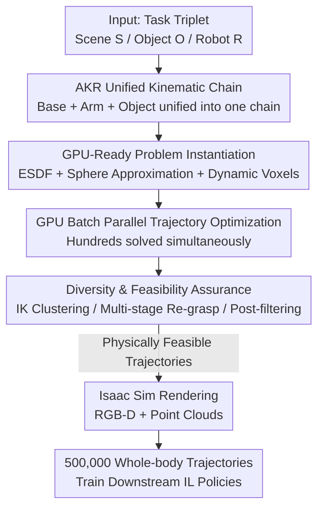

# Scalable Trajectory Generation for Whole-Body Mobile Manipulation

**Conference**: CVPR 2026  
**Paper**: [CVF Open Access](https://openaccess.thecvf.com/content/CVPR2026/html/Niu_Scalable_Trajectory_Generation_for_Whole-Body_Mobile_Manipulation_CVPR_2026_paper.html)  
**Code**: https://automoma.pages.dev/ (Project Page)  
**Area**: Robotics / Embodied AI  
**Keywords**: Whole-body mobile manipulation, trajectory generation, GPU-accelerated motion planning, augmented kinematic representation, imitation learning

## TL;DR
AutoMoMa unifies the mobile base, robotic arm, and the manipulated object into a single "Augmented Kinematic Representation (AKR)," then offloads trajectory optimization and collision detection to the GPU for batch parallelism. This enables the automatic synthesis of 500,000 physically feasible whole-body coordinated trajectories at a rate of 5,000 per GPU-hour (approximately 80x faster than CPU baselines), proving that the fundamental bottleneck previously hindering whole-body mobile manipulation policy learning was data scale rather than algorithms.

## Background & Motivation
**Background**: For robots to operate in real, unstructured rooms, "whole-body coordination" is essential—the base and arm must move simultaneously to complete tasks such as opening doors, pushing chairs, or opening dishwashers. Unlike fixed-base tabletop manipulation, mobile manipulation adds the base's full-room mobility to the search space, expanding the configuration dimension to around 10 Degrees of Freedom (3 for the base + 7 for the arm). Under strict joint, articulation, and collision constraints, valid solutions are extremely sparse in this high-dimensional space. Learning reliable whole-body policies requires several orders of magnitude more data than fixed-base tasks.

**Limitations of Prior Work**: Existing methods for large-scale data generation are inadequate. Teleoperation (e.g., Mobile ALOHA) collects high-fidelity whole-body demonstrations, but manual operation, fatigue, and hardware constraints limit data volume to hundreds or thousands of samples. Reinforcement learning (RL) in simulation involves high exploration costs and a significant sim-to-real gap. Planning-based methods ensure physical feasibility, but CPU implementations are prohibitively slow—the CPU solver for the AKR framework can only produce 60 trajectories per hour. Consequently, existing datasets are forced to compromise between "scale, diversity, and kinematic fidelity."

**Key Challenge**: The AKR framework, which unifies base/arm/object modeling, is theoretically the most suitable foundation for this task, but it is severely bottlenecked by the throughput of CPU solvers, preventing it from scaling to the volumes required for training generalized policies. In other words, the gap is not in modeling theory, but in the "bridge" between "high-fidelity kinematic modeling" and "modern parallel hardware throughput."

**Goal**: Build a scalable pipeline that significantly increases the throughput of whole-body coordinated trajectory generation by several orders of magnitude while maintaining AKR's physical and kinematic fidelity. The pipeline should cover multiple scenarios, various articulated objects, and multiple robot embodiments. Furthermore, use downstream policy experiments to answer "how much data is actually enough."

**Core Idea**: Utilize GPU-parallelized trajectory optimization and collision detection to batch the AKR planning process. This maintains the kinematic rigor of individual trajectories while solving hundreds or thousands simultaneously, raising the output from approximately 60 to 5,000 trajectories per GPU-hour.

## Method

### Overall Architecture
The input to AutoMoMa is a task triplet $(S, O, R)$—scene $S$, object set $O$, and robot body $R$. The output is a large batch of physically feasible whole-body trajectories with synchronized multimodal observations (RGB-D + point clouds). The pipeline consists of four stages: **Task Specification** (defining environment/object/robot context) → **Problem Instantiation** (converting raw geometry into GPU-ready primitives: ESDF distance fields + sphere-approximated colliders + assembled AKR chains) → **Trajectory Generation** (solving constrained optimization in the unified AKR configuration space to produce coordinated motions) → **Rendering** (using Isaac Sim to render each waypoint into synchronized RGB-D and point clouds). The two primary pillars of contribution are the **AKR Unified Kinematic Chain** and **GPU Batch Parallel Optimization**, ensuring physical fidelity and scale, respectively.

### Key Designs

**1. AKR Unified Kinematic Chain: Welding Base, Arm, and Object for Joint Optimization**

The difficulty of whole-body mobile manipulation lies in the kinematic coupling between the base, arm, and object. Decoupled planning (base movement followed by arm movement) often results in physically inconsistent trajectories. AutoMoMa adopts and implements the Augmented Kinematic Representation (AKR): combining the robot kinematic tree, the object kinematic tree, and the transformation from the end-effector to the object grasp point into **a single serial kinematic chain**. This involves two key operations: first, introducing a **virtual base** modeled with two orthogonal translational joints and one rotational joint to represent planar motion, making base maneuvering a joint on the chain. Second, attaching the object to the end-effector via a **virtual joint** encoding the grasp pose, and performing **kinematic inversion** for articulated objects—flipping the object's kinematic root from the environment anchor (e.g., a fixed cabinet base) to the grasp point. This allows the entire chain to start from the world coordinate system, pass through the base → arm → object, and terminate at the object's environment anchor. This inversion requires rigorous recalculation of all transformations and joint definitions relative to the sub-chain coordinates to prevent collision geometry misalignment.

The AKR state is defined as $x = [q_B^T, q_M^T, q_O^T]^T \in \mathcal{X}_{free}$, where $q_B \in \mathbb{R}^3$ is the base pose, $q_M \in \mathbb{R}^n$ is the arm configuration, and $q_O \in \mathbb{R}^m$ is the state of the articulated object. Once unified, planning reduces to "finding a constrained trajectory $x_{1:T}$ in $\mathcal{X}_{free}$" subject to a set of constraints:

$$h_{chain}(x[t]) = 0,\quad \|f_{task}(x[T]) - g_{goal}\|_2^2 \le \xi_{goal},\quad x_{min} \le x[t] \le x_{max}$$

where $h_{chain}$ enforces environmental articulated constraints (e.g., a handle must rotate around an axis), $f_{task}$ maps the final state to the task goal space within tolerance $\xi_{goal}$, and position/velocity/acceleration are subject to upper and lower bounds ($\|\Delta x[t]\|_\infty \le \Delta x_{max}$, etc.). By treating the object as a "kinematic extension of the robot," base movement, arm manipulation, and object motion are jointly considered in a single optimization, enabling the production of truly coordinated whole-body motion.

**2. GPU-Ready Problem Instantiation: Transforming Scene Geometry into GPU Primitives**

AKR solves "how to model," but moving the planning to GPUs requires transforming scene geometry into a format suitable for large-scale parallel queries. Three steps are taken: first, scenes are converted into **Euclidean Signed Distance Fields (ESDFs)** to accelerate distance queries, restricting queries to an axis-aligned bounding box defined by the object’s start and end states to save computation. Second, all link geometries are approximated with **fitted spheres**—a representation tailored for high-throughput GPU collision detection. Meshes are slightly shrunk before fitting to prevent overestimation, and sphere clusters are realigned with the original mesh after voxelization. Third, a **dynamic voxel strategy** addresses shifting collision semantics: during the approach phase, environment voxels intersecting the object are cleared and replaced with high-resolution meshes to avoid discretization errors blocking valid grasp poses; during the manipulation phase, the object is treated as a link on the AKR chain, and its original static environment mesh is removed, retaining only voxels strictly outside the object’s current volume to eliminate false-positive collisions.

**3. GPU Batch Parallel Trajectory Optimization: From One at a Time to Thousands**

This is the source of the 80x acceleration. AutoMoMa formalizes trajectory generation as a constrained optimization problem in the unified AKR configuration space, with an objective function that minimizes total path length and roughness:

$$J(x_{1:T}) = \sum_{t=1}^{T-1} \|W_v \,\Delta x[t]\|_2^2 + \sum_{t=2}^{T-1} \|W_a \,\Delta \dot{x}[t]\|_2^2,\qquad x^\star_{1:T} = \arg\min_{x_{1:T}} J(x_{1:T})$$

Diagonal weight matrices $W_v$ and $W_a$ are used to adjust the coordination strategy (e.g., prioritizing base stability during interaction). Goals are defined by object type: $SE(3)$ poses for rigid bodies and specific joint configurations for articulated objects. Crucially, the entire optimization and collision detection process is batched onto the GPU to **solve hundreds of planning problems simultaneously**. This allows AutoMoMa to reach 5,000 trajectories per GPU-hour, transforming AKR from a theoretically sound but computationally impractical method into a powerful data engine.

**4. Diversity & Feasibility Assurance: IK Clustering, Multi-stage Re-grasping, and Filtering**

Speed must be matched by diversity and quality. AutoMoMa utilizes three techniques: start and end configurations are obtained by solving **Inverse Kinematics (IK)** for object states. To balance coverage and cost, similar IK solutions are **clustered** in joint space, keeping only representative candidates to ensure a broad distribution of base placements. For complex tasks where a single continuous grasp is impossible due to kinematic limits or collisions (e.g., opening a dishwasher in a narrow space), a **multi-stage strategy** is used, sampling an intermediate state $\phi_{mid}$ and splitting the trajectory into $[\phi_0 \to \phi_{mid}]$ and $[\phi_{mid} \to \phi_T]$ with a collision-free re-grasp in between. Finally, **post-processing filters** validate constraints at every waypoint: for static articulated objects, deviation from the environment anchor is checked; trajectories exceeding thresholds are discarded to ensure a stable, physically sound dataset.

### Rendering
The final stage is completed in NVIDIA Isaac Sim. Synchronized egocentric and fixed-view RGB-D cameras are placed in the environment. For each waypoint $x[t]$, RGB and depth maps are rendered and projected into 3D point clouds in the simulation world coordinate system, pairing each joint space configuration with its geometric and visual context. The rendering framework is extensible, allowing for custom camera placements and replaying trajectories under different lighting or sensor modalities.

## Key Experimental Results

### Dataset Comparison
AutoMoMa achieves "scale + diversity + high-fidelity joint-space trajectories," providing genuine whole-body coordination.

| Dataset | Robot | Episodes | Whole-body | Scenes | Collection Method |
|---------|-------|----------|------------|--------|-------------------|
| RT-1 [4] | Google Robot | 73,499 | Yes | 10 | VR Teleop (EE pose only) |
| BC-Z [18] | Google Robot | 39,350 | Yes | 2–3 | VR Teleop (EE pose only) |
| Mobile ALOHA [13] | Mobile ALOHA | 276 | Yes | 5 | Master-Slave Teleop (Joint) |
| DobbE [36] | Hello Stretch | 5,208 | Yes | 216 | Tool-based Teleop (EE pose) |
| TidyBot [44] | TidyBot | 24 | No | 104 | Scripted Primitives |
| **Ours (AutoMoMa)** | Multi-robot | **500,000** | **Yes** | **330** | **Auto Planning (Joint position)** |

### Data Scaling Experiments (DP3 Policy, Microwave Door Task)
Using the SOTA 3D diffusion method DP3, the success criterion is the door reaching the target angle within 300 steps.

| Experiment Dimension | Setup | Key Findings |
|----------------------|-------|--------------|
| Fixed vs. Mobile Base | Up to 3,200 episodes | Fixed base reaches 100% success with < 800 episodes; Mobile base (seen) saturates at ~70%. |
| Scene Diversity | 1 → 30 scenes, 1k episodes/scene | Unseen success rate increases steadily with the number of scenes; geometric diversity drives generalization. |
| Trajectory Density | 30 scenes, 750 → 30,000 episodes | Seen/unseen performance generalizes consistently up to ~75% success. |
| Architecture Generalization | DP3 / DP / ACT | All architectures benefit from increased density; DP3 is optimal due to 3D modality. |

### Key Findings
- **Data Scarcity is the Real Bottleneck**: Even for single articulated objects, SOTA methods require tens of thousands of demonstrations to reach ~80% success, proving that data scale, not algorithms, is the primary constraint for whole-body mobile manipulation.
- **Base Mobility Exponentially Increases Difficulty**: A mobile base adds 10-DoF coupling, resulting in performance saturation at ~70% even with 3,200 episodes in a single scene, whereas a fixed base reaches 100% with under 800.
- **Single-scene Density $\neq$ Understanding**: Increasing density in a single scene leads to "manifold memorization" rather than scene understanding; generalization requires cross-scene geometric diversity.
- **Diversity and Density are Complementary**: Increasing scene count and increasing per-scene density provide comparable gains.

## Highlights & Insights
- **"Unified Chain + GPU Batching" as a Scaling Paradigm**: The AKR principle is not new, but parallelizing it with GPU-ready geometry (ESDF/spheres) achieves an 80x speedup, demonstrating how to scale theoretically sound but computationally slow planning methods.
- **Motion Inversion for Coupled Dynamics**: Inverting the kinematic root of articulated objects allows the optimization to treat the object as a part of the robot, ensuring true coordination rather than separate planning for the base and arm.
- **Dynamic Voxel Strategy**: This practical detail for sphere-based collision detection prevents discretization errors from obstructing valid grasps.
- **Research Methodology**: Reversing the focus from algorithmic refinement to data volume ("fix the data first, then see how far SOTA goes") provides a significant empirical contribution to the field.

## Limitations & Future Work
- **Reliance on Known Geometry**: The pipeline requires pre-known scene and object models, lacking support for human-robot interaction or deformable objects.
- **Geometric Approximation Errors**: Sphere-based colliders occasionally introduce errors, leading to execution failures.
- **Object Variance**: Success rates vary depending on object-specific articulated constraints, suggesting that data scale cannot overcome all physical reachability limits.
- **Simulation-Centric**: While validated on a UR5-Ridgeback platform, the bulk of evaluation is in Isaac Sim.

## Related Work & Insights
- **vs. Mobile ALOHA / Teleoperation**: Teleoperation provides real high-fidelity demos but is limited by human fatigue; AutoMoMa scales whole-body data to 500,000 episodes via automation.
- **vs. CPU AKR Planner**: Both use the same modeling principle; AutoMoMa's GPU backend enables the large-scale datasets necessary for training generalizable policies.
- **vs. Deep RL**: While RL explores automatically, it is sample-inefficient and often overfits; AutoMoMa uses planning to guarantee physical feasibility and proves that IL can generalize if data is sufficient.

## Rating
- Novelty: ⭐⭐⭐⭐ (Systematic engineering innovation by parallelizing AKR).
- Experimental Thoroughness: ⭐⭐⭐⭐ (Solid scaling experiments across architectures and objects).
- Writing Quality: ⭐⭐⭐⭐ (Clear logic and well-explained kinematic construction).
- Value: ⭐⭐⭐⭐⭐ (500k trajectories and the "data bottleneck" proof offer massive community value).

<!-- RELATED:START -->

## Related Papers

- [\[CVPR 2026\] End-to-End Language-Action Model for Humanoid Whole Body Control](end-to-end_language-action_model_for_humanoid_whole_body_control.md)
- [\[CVPR 2026\] Beyond Mimicry: Learning Whole-Body Human-Humanoid Interaction from Human-Human Demonstrations](beyond_mimicry_learning_whole-body_human-humanoid_interaction_from_human-human_d.md)
- [\[ICLR 2026\] WholeBodyVLA: Towards Unified Latent VLA for Whole-Body Loco-Manipulation Control](../../ICLR2026/robotics/wholebodyvla_towards_unified_latent_vla_for_whole-body_loco-manipulation_control.md)
- [\[CVPR 2026\] IGen: Scalable Data Generation for Robot Learning from Open-World Images](igen_scalable_data_generation_for_robot_learning_from_open-world_images.md)
- [\[ICML 2026\] WestWorld: Scalable Trajectory World Models with Knowledge Encoding](../../ICML2026/robotics/westworld_a_knowledge-encoded_scalable_trajectory_world_model_for_diverse_roboti.md)

<!-- RELATED:END -->
## Related Papers

- [\[CVPR 2026\] End-to-End Language-Action Model for Humanoid Whole Body Control](end-to-end_language-action_model_for_humanoid_whole_body_control.md)
- [\[CVPR 2026\] Beyond Mimicry: Learning Whole-Body Human-Humanoid Interaction from Human-Human Demonstrations](beyond_mimicry_learning_whole-body_human-humanoid_interaction_from_human-human_d.md)
- [\[CVPR 2026\] IGen: Scalable Data Generation for Robot Learning from Open-World Images](igen_scalable_data_generation_for_robot_learning_from_open-world_images.md)
- [\[NeurIPS 2025\] DexFlyWheel: A Scalable Self-Improving Data Generation Framework for Dexterous Manipulation](../../NeurIPS2025/robotics/dexflywheel_a_scalable_and_self-improving_data_generation_framework_for_dexterou.md)
- [\[CVPR 2026\] DynBridge: Bridging Imagination and Control through Interaction Dynamics for Robot Manipulation](dynbridge_bridging_imagination_and_control_through_interaction_dynamics_for_robo.md)

<!-- RELATED:END -->
