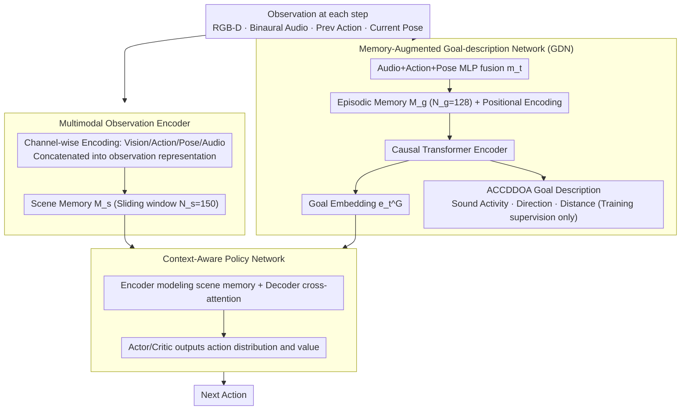

# Semantic Audio-Visual Navigation in Continuous Environments

**Conference**: CVPR 2026  
**arXiv**: [2603.19660](https://arxiv.org/abs/2603.19660)  
**Code**: [https://github.com/yichenzeng24/SAVN-CE](https://github.com/yichenzeng24/SAVN-CE)  
**Area**: Robotics  
**Keywords**: Audio-Visual Navigation, Continuous Environments, Memory Augmentation, Goal Reasoning, Embodied AI

## TL;DR
This paper proposes the SAVN-CE task, extending semantic audio-visual navigation to continuous 3D environments. It introduces MAGNet (Memory-Augmented Goal-description Network), which achieves robust goal reasoning after the target sound ceases by fusing historical context with self-motion cues, resulting in an absolute success rate improvement of up to 12.1%.

## Background & Motivation
1. **Background**: Audio-visual navigation (AVN) enables embodied agents to utilize auditory and visual cues to navigate to sounding targets in unknown environments. Semantic Audio-Visual Navigation (SAVN) further requires targets to be semantically meaningful objects (e.g., "a creaking chair") rather than arbitrary locations.
2. **Limitations of Prior Work**: Existing methods rely on precomputed Room Impulse Responses (RIRs), requiring terabytes of storage, and restrict agent movement to discrete grid points (1-meter resolution, 4 fixed orientations), which severely limits the realism of the task.
3. **Key Challenge**: Discrete environments result in spatially discontinuous observations, preventing free exploration. In continuous environments, target sounds may be intermittently silent or stop entirely, leading to a loss of target information.
4. **Goal**: (a) How to achieve free-moving audio-visual navigation in continuous environments? (b) How to maintain a stable target representation when the target sound disappears? (c) How to simultaneously infer the spatial location and semantic category of the target?
5. **Key Insight**: The authors observe that self-motion cues (previous action + current pose) can infer dynamic changes in the relative position of the target, while episodic memory can maintain temporal continuity of the target representation after the sound vanishes.
6. **Core Idea**: Use a memory-augmented Transformer encoder to fuse binaural audio, self-motion cues, and episodic memory to achieve continuous target tracking after sound cessation.

## Method

### Overall Architecture
The core challenge MAGNet addresses is that in continuous 3D environments, the sound of a target may be intermittently silent or stop completely. Traditional methods lose target orientation once the sound disappears. The proposed approach maintains "target information from the moment sound was heard" over time using an episodic memory and a self-motion reasoning chain. Specifically, at each step, RGB-D, binaural audio, the previous action, and the current pose are encoded into a unified embedding. One copy is stored in scene memory for the policy, while another is sent to the Goal Description Network (GDN) to infer the target's location and identity. The target embedding output by the GDN is then fed into a Transformer encoder-decoder policy network, which combines historical scene memory to decide the next action. The three modules (observation encoder, GDN, and policy network) work end-to-end to maintain the ability to track the target even after the sound stops.

### Key Designs

**1. Multimodal Observation Encoder: Compressing heterogeneous sensory signals into a memory-compatible vector**

In continuous environments, the time step is reduced to 0.25s, making observations much denser than in discrete grids. The encoder must be efficient while retaining long-term history. The approach uses channel-wise encoding followed by concatenation: RGB and depth maps each pass through a ResNet-18, the previous action passes through an embedding layer, the normalized pose $[x/d, y/d, \sin\theta, \cos\theta, t/t_{max}]$ passes through a fully connected layer, and the binaural waveform is converted into a complex spectrogram via STFT to extract 4-channel acoustic features (average magnitude spectrum, sine/cosine of ICP phase difference, ILD) before passing through 3 convolutional layers. Phase difference and ILD (Interaural Level Difference) are crucial as they directly encode the left-right orientation of the sound source. All embeddings are concatenated into a single frame representation and stored in a sliding window scene memory with capacity $N_s=150$, providing context for the policy and raw material for temporal modeling.

**2. Memory-Augmented Goal-description Network (GDN): Inferring the target via self-motion and memory after sound cessation**

This is the core module addressing the "intermittent/disappearing sound" pain point. The intuition is: even without sound, as long as the agent knows where the target was and how it moved, it can calculate the target's current relative position. At each step, binaural audio, action, and pose embeddings are fused into $m_t$ via an MLP and pushed into an episodic memory of capacity $N_g=128$. The memory sequence, with positional encoding, is fed into a **causal** Transformer encoder (using a causal mask to prevent future information leakage). It outputs two elements: a goal embedding $e_t^G$ for the policy network, and a goal description $y_{ct} = [a_{ct}R_{ct}, d_{ct}]$ in ACCDDOA format, which packs sound activity status $a_{ct}$, direction unit vector $R_{ct}$, and normalized distance $d_{ct}$ into a compact vector for training supervision. This identifies the target reliably during silence because self-motion cues provide deterministic geometric updates—TurnLeft/TurnRight shifts the target's azimuth by exactly $\pm15°$, and MoveForward changes both azimuth and distance. The fine-grained action space (0.25m forward / 15° turn) keeps positional changes small, ensuring the target trajectory in memory remains smooth and trackable.

**3. Context-Aware Policy Network: Allowing the decision-making process to see the full history rather than just the current frame**

In partially observable continuous environments, relying only on the current frame can lead to jittery decisions. Thus, the policy network uses a Transformer to chain history together. The encoder takes the scene memory $M_{s,t}$ to model temporal dependencies, and the decoder uses the current observation embedding as a query and the encoded memory as key/value pairs. Cross-attention yields a context-aware latent state $s_t$. $s_t$ is then passed to actor and critic fully connected layers to output action distributions and state values. This allows the policy to use the GDN's goal embedding to "know where to go" while incorporating observations from previous steps to maintain coherent navigation decisions even when sound is intermittent.

### Case Study: How to continue tracking after sound goes silent
Suppose at step $t$, the agent hears a "creaking chair" at approximately $+30°$ azimuth and $0.5$ normalized distance. The GDN pushes this fused feature into episodic memory and outputs $a_{ct}=1$ (active), a direction vector pointing front-right, and a distance of $0.5$. At $t+1$, the sound suddenly stops. The binaural features no longer contain orientation information, but the agent performs a TurnRight. The GDN does not rely on current audio; instead, it reads the target description from step $t$ in episodic memory and applies the self-motion geometric update—TurnRight subtracts $15°$ from the target azimuth, correcting it to approximately $+15°$ while the distance remains nearly unchanged. Even if silence persists for several steps, the memory + self-motion chain extrapolates the target's relative orientation, allowing the policy to continue moving toward the goal rather than rotating in place due to silence—this is why MAGNet is more robust than SAVi (which relies on weighted historical aggregation) in silent scenarios.

### Loss & Training
- The GDN is trained online using MSE loss with oracle ACCDDOA labels, utilizing causal attention to prevent leakage.
- The policy network is trained using DD-PPO, following the two-stage paradigm of SAVi.
- Rewards: +10 for success, intermediate rewards for changes in geodesic distance to the goal, and a -0.01 time penalty per step.
- Each iteration performs 150-step rollouts, training for approximately 14 days on 128 CPUs and 4 A800 GPUs.

## Key Experimental Results

### Main Results

| Method | SR↑ | SPL↑ | SNA↑ | DTG↓ | SWS↑ |
|------|-----|------|------|------|------|
| AV-Nav | 21.3 | 17.8 | 13.1 | 10.7 | 4.0 |
| SMT+Audio | 24.8 | 21.0 | 16.8 | 10.1 | 5.3 |
| SAVi | 25.6 | 21.2 | 17.3 | 10.1 | 6.0 |
| **MAGNet** | **37.7** | **32.9** | **27.4** | **8.0** | **10.6** |
| Oracle1 | 41.4 | 37.8 | 31.0 | 6.3 | 13.0 |
| Oracle2 | 75.0 | 63.7 | 51.9 | 4.2 | 48.4 |

In the Clean environment, MAGNet achieves a 12.1% absolute SR Gain over SAVi, with SWS improving by 4.6%.

### Ablation Study

| Configuration | SR↑ | SPL↑ | SWS↑ |
|------|-----|------|------|
| w/o GDN | 32.4 | 27.9 | 6.3 |
| GDN w/o Memory | 33.9 | 29.8 | 8.9 |
| GDN w/o Self-motion | 34.3 | 30.4 | 7.8 |
| Full MAGNet | **37.7** | **32.9** | **10.6** |

### Key Findings
- Removing the GDN drops SR by 5.3%, yet it still outperforms all baselines, suggesting the policy network itself is quite strong.
- The contribution of episodic memory (+3.8% SR) is greater than that of self-motion cues (+1.9% SR), but their combination yields the best results.
- Performance drops for all methods in Distractor environments. While MAGNet's SR drops from 37.7 to 19.3, the DSR (distractor touch rate) reaches 7.8%, indicating that acoustically similar distractors are a major bottleneck.
- The massive gap between Oracle2 and Oracle1 (75.0 vs. 41.4) highlights that the loss of target information after sound cessation is the core challenge.

## Highlights & Insights
- **Unified Target Description in ACCDDOA Format**: Fusing sound activity, direction of arrival unit vectors, and distance into a compact vector representation elegantly combines the SELD task with navigation.
- **Physical Interpretability of Self-motion Cues**: TurnLeft/TurnRight precisely changes the target azimuth by ±15°. This explicit geometric relationship makes it easier for the network to learn target position updates after sound vanishes.
- **Continuous Environment Dataset Construction**: Sound start times are sampled uniformly from [0, 5]s, and durations follow a Gaussian distribution (mean 15s, std 9s). The average oracle action count in the test set is 78.49 (compared to 26.52 in discrete settings), significantly increasing task difficulty.

## Limitations & Future Work
- The large gap between Oracle2 and MAGNet (75.0 vs. 37.7) suggests significant room for improvement in the GDN.
- High DSR in distractor environments indicates insufficient capability to distinguish acoustically similar distractors.
- Only single-target navigation is supported; future work could extend this to multi-target or dynamic target scenarios.
- High training costs (14 days, 128 CPUs + 4 GPUs) limit the scale of experiments.

## Related Work & Insights
- **vs. SAVi**: SAVi relies on a weighting factor $\lambda$ to aggregate historical estimates. This work replaces it with Transformer episodic memory, performing better after sound stops.
- **vs. VLN-CE**: VLN-CE provides explicit goals via language instructions. SAVN-CE requires inferring the target from partial perceptions, making it more challenging.

## Rating
- Novelty: ⭐⭐⭐⭐ The combination of continuous environments and memory-augmented GDN is relatively novel, though individual component designs are standardized.
- Experimental Thoroughness: ⭐⭐⭐⭐⭐ Comprehensive ablations, GDN evaluation, factor analysis, and trajectory visualizations.
- Writing Quality: ⭐⭐⭐⭐ Clear structure and well-defined tasks.
- Value: ⭐⭐⭐⭐ Provides a more realistic continuous environment benchmark for audio-visual navigation.

<!-- RELATED:START -->

## Related Papers

- [\[ICCV 2025\] NavMorph: A Self-Evolving World Model for Vision-and-Language Navigation in Continuous Environments](../../ICCV2025/robotics/navmorph_a_self-evolving_world_model_for_vision-and-language_navigation_in_conti.md)
- [\[CVPR 2026\] TrajRAG: Retrieving Geometric-Semantic Experience for Zero-Shot Object Navigation](trajrag_retrieving_geometric-semantic_experience_for_zero-shot_object_navigation.md)
- [\[CVPR 2026\] Towards Open Environments and Instructions: General Vision-Language Navigation via Fast-Slow Interactive Reasoning](towards_open_environments_and_instructions_general_vision-language_navigation_vi.md)
- [\[CVPR 2026\] Bridging the 2D-3D Gap: A Hierarchical Semantic-Geometric Map for Vision Language Navigation](bridging_the_2d-3d_gap_a_hierarchical_semantic-geometric_map_for_vision_language.md)
- [\[CVPR 2026\] Do You Have Freestyle? Expressive Humanoid Locomotion via Audio Control](do_you_have_freestyle_expressive_humanoid_locomotion_via_audio_control.md)

<!-- RELATED:END -->
