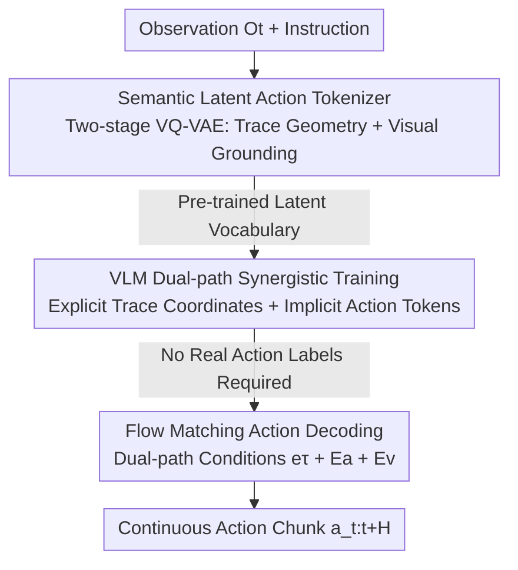

# SemanticVLA: Towards Semantic Reasoning over Action Memorization via Synergistic Explicit Trace and Latent Action Planning

**Conference**: CVPR 2026  
**Paper**: [CVF Open Access](https://openaccess.thecvf.com/content/CVPR2026/html/Ni_SemanticVLA_Towards_Semantic_Reasoning_over_Action_Memorization_via_Synergistic_Explicit_CVPR_2026_paper.html)  
**Code**: None  
**Area**: Embodied AI / VLA  
**Keywords**: Vision-Language-Action, Explicit Trace Reasoning, Implicit Action Token, VQ-VAE, Flow Matching

## TL;DR
SemanticVLA adopts a dual-path design of "explicit trace reasoning + implicit action tokens" to effectively leverage the native spatial grounding capabilities of VLMs for robotic manipulation. It achieves a 97.0% success rate on LIBERO and 65.1% on SimplerEnv WidowX, demonstrating significantly higher stability in instruction rewriting, long-horizon, and reasoning-intensive tasks compared to baselines.

## Background & Motivation

**Background**: The mainstream VLA (Vision-Language-Action) paradigm follows a "two-system" approach—a pre-trained VLM serves as System 2 for high-level reasoning, while a downstream action expert (Diffusion/Flow Matching) acts as System 1 for low-level motor control, interfaced via latent embeddings produced by the VLM.

**Limitations of Prior Work**: The authors observe an awkward vulnerability in current VLAs: they can execute straightforward instructions like "put the sponge on card 5" but fail on semantically equivalent but different phrasing such as "put the sponge at the answer to the math problem on the whiteboard." This suggests models are **memorizing action patterns** rather than truly understanding semantics. Performance drops sharply with instruction rewriting and tasks requiring reasoning.

**Key Challenge**: This fragility stems from two structural issues. First, the gradient backpropagation of the action loss through VLM parameters optimizes the VLM toward "pattern matching for specific tasks," destroying its inherent compositional understanding. Second, the interface between the VLM and the action expert relies on opaque latent embeddings without explicit supervision; under pure action supervision, these representations quickly drift toward "fitting actions," degrading the pre-trained foundation model into a heavy-parameter fusion encoder. Existing remedies involve trade-offs: co-training (mixing in general multimodal data) "preserves" reasoning but fails to "utilize" it effectively, while latent action methods inject semantics but risk memorizing action patterns.

**Goal + Key Insight**: The objective is to design an interface that invokes native VLM reasoning while providing stable, semantically grounded guidance to the action expert. The key observation is: **trace prediction naturally fits the spatial grounding capability of VLMs**. Explicitly writing "where the end-effector should go" as a sequence of coordinates reuses the spatial localization the VLM learned during vision-language pre-training, acting as an interpretable "thought process" for manipulation planning.

**Core Idea**: A synergistic complementary path design using "explicit trace reasoning" (where to go, interpretable but numerically sensitive) and "implicit latent action tokens" (how to manipulate, visually grounded but abstract). Traces provide spatial supervision and scaffolding for the latents, while latents compensate for the coordinate imprecision of traces through visual attention, enabling the model to operate via semantic reasoning rather than action memorization.

## Method

### Overall Architecture

SemanticVLA addresses how to transmit VLM reasoning capabilities to robotic actions without being corrupted by action supervision. The pipeline consists of three sequential stages: first, offline training of a semantic vocabulary for "trace → implicit action tokens" (without involving language or actions); second, training the VLM to simultaneously predict explicit trace coordinates and these latent tokens (**without requiring real action labels**); and finally, connecting an action expert to decode these discrete representations into continuous action chunks via flow matching. The guiding principle is that the VLM only provides clean semantic guidance through "structured trace coordinates + compact latent tokens" and is **never directly exposed to raw action supervision** to prevent the erosion of its reasoning capabilities.

The flow from top to bottom represents "Input → Three Contribution Stages → Output Actions," where the three key designs correspond to the intermediate nodes.

### Key Designs

**1. Semantic Latent Action Tokenizer: Grounding Compact Action Tokens via Traces instead of Language**

The pain point is direct: existing latent action tokens are either learned from raw actions (lacking manipulation semantics) or from visual reconstruction (entangling task-irrelevant appearance changes). Using language to inject semantics (e.g., UniVLA) tends to overfit specific phrasing and suffers from temporal misalignment between trace-level descriptions and token-level representations. The authors' insight is that **traces are naturally better conditional anchors**: each trace and its corresponding action window are strictly aligned in time, and since traces are geometric invariants, they remain stable across different linguistic phrasings, encoding manipulation semantics through spatial structure.

This is implemented as a **two-stage VQ-VAE**. The first stage performs geometric abstraction on coordinate sequences: given trace $\tau=(p_1,\dots,p_L)$, $p_i=(u_i,v_i)\in[0,1]^2$, features are extracted via a temporal convolutional encoder $\phi^{trace}_{enc}$ and quantized as $q_{trace}=\arg\min_k\lVert z_{trace}-c^{trace}_k\rVert^2$. The reconstruction loss ensures the codebook learns pure geometric primitives like "grasping arcs" or "placing motions" invariant to appearance/lighting/layout. The second stage performs visual grounding: visual features $h_{visual}$ from observations $o_t, o_{t+H}$ are extracted via DINOv2 and fused with the geometric codebook item $c^{trace}_{q_{trace}}$ through cross-attention. This allows the geometric prior to dynamically attend to task-related visual regions and suppress background noise, resulting in the final latent token $e_a=c^a_{q_a}$. To ensure both geometric structure and visual semantics are preserved, **dual reconstruction supervision** is used: a trace decoder $\phi^{spatial}_{dec}$ ensures geometric precision, while a visual decoder $\phi^{visual}_{dec}$ ensures semantic understanding; both decoders are discarded after pre-training. The overall objective is $\mathcal{L}_{LAT}=\mathcal{L}^a_{vq}+\mathcal{L}^{trace}_{recon}+\mathcal{L}^{visual}_{recon}$. This sequential design of "geometry first, then visual grounding" ensures tokens know both "where to move" (geometric prior) and "how to operate" (visual features) without relying on language, thereby avoiding linguistic variability bias.

**2. VLM Synergistic Training: Complementary Explicit Trace and Implicit Tokens without Raw Actions**

With the token vocabulary established, the VLM must link the two paths. The key is their complementarity: traces reuse the VLM's pre-trained spatial understanding for interpretable planning, while latent tokens provide compact, visually grounded execution representations to compensate for the numerical sensitivity of traces. **This synergistic stage does not require real robotic actions**; supervision comes entirely from spatial traces and the pre-trained latent vocabulary.

The trace path follows the MolmoAct approach, treating traces as **normalized 2D coordinate sequences generated autoregressively via the VLM's native language interface**: $p(\tau\mid o_t,\ell_t)=\prod_{j=1}^L p(p_j\mid o_t,\ell_t,\tau_{<j})$, supervised by cross-entropy loss $\mathcal{L}_{trace}$. This explicitly unfolds spatial planning as a "thought process" without architectural changes. For the latent path, the VLM vocabulary is expanded with a set of special tokens $\{\text{ACT}\_1,\dots,\text{ACT}\_K\}$ indexing into the pre-trained codebook. After generating the trace, a sequence of latent action tokens is predicted autoregressively for action chunking: $p(q_{1:N}\mid o_t,\ell_t,\tau)=\prod_{i=1}^N p(q_i\mid o_t,\ell_t,\tau,q_{<i})$. Total loss is $\mathcal{L}_{VLM}=\mathcal{L}_{trace}+\mathcal{L}_{latent}$. Thus, traces provide explicit goals for VLM spatial reasoning, and latent tokens compensate for trace imprecision through visual attention to task-relevant context. Conversely, the trace scaffolding helps the latent tokens filter visual variations and focus on manipulation-relevant regions—both paths benefit mutually, and VLM capability is preserved with minimal vocabulary expansion.

**3. Flow Matching Action Decoding: Dual-path Fusion with Weak Regularization**

The VLM outputs discrete latent token indices $q_{1:N}$ and explicit trace coordinates $\tau$, but robot execution requires continuous action chunks $a_{t:t+H}\in\mathbb{R}^{H\times D}$. A lightweight flow matching decoder bridges this gap by **consuming conditions from both paths**: for the latent path, it takes the VLM's last-layer hidden states $E_a=\{h_{q_1},\dots,h_{q_N}\}$ corresponding to instructions (encoding multimodal reasoning over vision, spatial planning, and language); for the trace path, predicted coordinates $\tau$ pass through a **frozen** trace encoder $\phi^{trace}_{enc}$ to produce $e_\tau$ (extracting pure spatio-temporal dynamics invariant to visual appearance). The decoder operates on noisy actions $a_t$ at denoising time $t\in[0,1]$ as $v_\theta(a_t,t,e_\tau,E_a,E_v)\to a_{t:t+H}$, where $e_\tau$ provides geometric guidance, $E_a$ provides semantic grounding, and $E_v$ provides visual context, predicting the velocity field to generate actions via iterative denoising through cross-attention.

In the final stage, end-to-end fine-tuning is performed with the objective $\mathcal{L}_{finetune}=\lambda_{VLM}\mathcal{L}_{VLM}+\mathcal{L}_{flow}$. Here, $\lambda_{VLM}$ acts as **weak supervision**—its role is to maintain the dual-path reasoning established in the synergistic stage and prevent the VLM from degrading into simple "action fitting" during fine-tuning. Simultaneously, the VLM is fine-tuned using LoRA while the flow decoder is trained from scratch globally, allowing the VLM to retain high-level spatial reasoning while the decoder focuses on low-level motor control. This weak regularization is consistent with the global principle of "preventing action gradients from polluting the VLM."

### Loss & Training

The three-stage training corresponds to the three designs: Stage 1 pre-trains the semantic latent tokenizer on TraceX-240K for 50k steps (batch 512) to learn pure geometric primitives; Stage 2 synergetically trains the VLM on the same data to jointly predict traces and latent tokens for 100k steps (batch 256) without decoding actions; Stage 3 fine-tunes end-to-end on downstream benchmarks, enabling the flow matching decoder with weak regularization to protect the VLM. The VLM backbone is initialized from Prismatic-7B (following UniVLA, integrating SigLIP + DINOv2 + LLaMA-2), using 16 H200 GPUs. The dataset **TraceX-240K** was self-constructed—collecting 240k robot traces from Open X-Embodiment (Bridge V2 / Fractal / BC-Z) and DROID, using Molmo-72B for keyframe sampling and CoTracker interpolation to obtain dense, time-aligned trace sequences.

## Key Experimental Results

### Main Results

SemanticVLA ranks first in both LIBERO (Franka) and SimplerEnv WidowX simulation suites:

| Benchmark | Metric | SemanticVLA | Runner-up | Gain |
|-----------|--------|-------------|-----------|------|
| LIBERO | Avg. Success Rate | **97.0** | UniVLA 95.2 | +1.8 |
| LIBERO-Long | Long-horizon Success | **94.4** | UniVLA 92.0 | +2.4 |
| SimplerEnv WidowX | Avg. Success Rate | **65.1** | MolmoAct 51.4 | +13.7 |
| WidowX Put Spoon | Success Rate | **83.6** | MolmoAct 70.3 | +13.3 |

On a real Franka robot, covering long-horizon composite tasks (meal prep, table sorting) and reasoning-intensive tasks (math, spelling), it achieves a 62.3% average success rate, leading significantly:

| Model | Long-Meal | Long-Sort | Reason-Math | Reason-Spell | Avg |
|-------|-----------|-----------|-------------|--------------|-----|
| OpenVLA | 16 | 10 | 6 | 3 | 8.8 |
| UniVLA | 47 | 41 | 27 | 16 | 32.8 |
| MolmoAct | 59 | 47 | 36 | 19 | 40.3 |
| π0 | 63 | 54 | 43 | 32 | 48.0 |
| **Ours** | **77** | **69** | **58** | **45** | **62.3** |

### Ablation Study

Isolation of the role of trace-guided pre-training under LIBERO instruction rewriting (Fig. 6):

| Configuration | Latent Accuracy | Rewritten Success | Description |
|---------------|-----------------|-------------------|-------------|
| Full SemanticVLA | 93.6% | 87.6% | Full dual-path |
| w/o Explicit Trace | 85.6% | 79.2% | Predict latent from VLM embedding, -8.4% |
| UniVLA Latent | — (>12% lower) | 71.3% | Latent without trace supervision |

Real-world verification of latent stability in traces across three generalization axes (Fig. 7):

| Configuration | Rewritten Ling. Success | Description |
|---------------|-------------------------|-------------|
| Full SemanticVLA | 56 | Full dual-path |
| w/o Latent Action Planning | 48 | Removed latent path |
| MolmoAct | 33 | Raw action tokens via vocab expansion |
| HAMSTER | 30 | Direct condition on raw coordinates |

### Key Findings
- **Trace-guided pre-training is the source of latent semantics**: In controlled comparisons without explicit trace reasoning, the proposed latent achieves >12% higher accuracy/success than UniVLA's, proving trace supervision injects richer semantic grounding and the geometric scaffold acts as a strong inductive bias to filter task-irrelevant variations.
- **The two paths are genuinely complementary**: Removing the explicit trace drops rewriting robustness from 87.6% to 79.2% (traces help distinguish "true understanding vs pattern matching"); removing the latent drops linguistic rewriting from 56 to 48 (latents stabilize trace numerical sensitivity).
- **Strongest robustness to instruction rewriting**: SemanticVLA drops only 9.4% under LIBERO rewriting, compared to 18.4% for OpenVLA and 23.9% for UniVLA; MolmoAct (with explicit reasoning) drops 11.9%, confirming that explicit reasoning improves linguistic generalization.
- **Expanding VLM vocabulary with action tokens harms reasoning**: MolmoAct's approach of adding raw action tokens directly into the VLM vocabulary corrupts language capabilities via gradient interference—supporting the design choice of using latent tokens + flow matching decoders for modal isolation.

## Highlights & Insights
- **Using traces as the "reconstruction target" for latent actions is ingenious**: Where others use language (biased) or pure vision (entangled appearance) for semantics, the trace acts as a precise geometric carrier providing both semantic grounding and visual alignment, while being strictly time-aligned with action windows.
- **The "explicit interpretable + implicit robust" complementary paradigm is transferable**: Explicit coordinates handle "interpretability and VLM reasoning reuse," while implicit tokens handle "visual grounding and numerical noise resistance." This "one path explains, one path secures" logic can be applied to other tasks requiring interpretable intermediate representations.
- **The principle of "keeping action gradients away from the VLM" is consistent**: From the three-stage process isolating action decoding to the $\lambda_{VLM}$ weak regularization and LoRA usage, the entire engineering pipeline maintains a self-consistent logic of preserving foundation model capabilities.

## Limitations & Future Work
- Dependency on TraceX-240K trace quality: The authors acknowledge that using Molmo-72B keyframe sampling and CoTracker interpolation leaves room for improvement via "more semantic keyframe extraction."
- Traces are 2D normalized coordinates: Whether this is sufficient for fine 3D/depth reasoning or robust to camera viewpoint changes is addressed indirectly via DINOv2 grounding; direct 3D evaluation is missing.
- Training costs are high (16x H200, 150k steps total): Sensitivity to hyperparameters like latent vocabulary size $K$ or action chunk length is not fully explored.
- Real-world evaluation (20 rollouts/5 variants per task) is limited; reasoning task success (45%~58%) is leading but not yet practical.

## Related Work & Insights
- **vs MolmoAct**: Both generate traces as auxiliary reasoning. Differences: MolmoAct adds **raw action tokens** to the vocabulary, which corrupts linguistic reasoning (33% success on rewriting); Ours uses latent tokens + flow matching to maintain modal isolation (56% success).
- **vs UniVLA**: UniVLA uses task language as an intermediate modality, but linguistic bias persists. Ours uses **spatial traces** as explicit reconstruction targets, providing a precise geometric carrier that outperforms UniVLA's latent accuracy/success by >12%.
- **vs TraceVLA / HAMSTER**: TraceVLA overlays historical traces as visual prompts (passive, no planning); HAMSTER directly conditions on predicted coordinates (error accumulation). Ours uses implicit latent tokens as a "safety net" for traces.
- **vs π0 / GR00T**: These rely on massive pre-training but use opaque latent embedding interfaces. Ours achieves performance parity or superiority on WidowX by invoking VLM native reasoning via grounded latents and explicit traces without scaling data to the same extreme.

## Rating
- Novelty: ⭐⭐⭐⭐⭐ Dual-path "explicit trace + implicit latent" synergy and using traces as latent reconstruction targets is novel and self-consistent.
- Experimental Thoroughness: ⭐⭐⭐⭐⭐ Two simulation suites + real-world + rewriting robustness + bidirectional ablation.
- Writing Quality: ⭐⭐⭐⭐ Motivations and three-stage logic are clear, though notation for multiple VQ-VAE modules is dense.
- Value: ⭐⭐⭐⭐⭐ Directly addresses the "memorization vs reasoning" pain point in VLA; both the method and TraceX-240K dataset have high utility.

<!-- RELATED:START -->

## Related Papers

- [\[CVPR 2026\] Fast-ThinkAct: Efficient Vision-Language-Action Reasoning via Verbalizable Latent Planning](fast-thinkact_efficient_vision-language-action_reasoning_via_verbalizable_latent.md)
- [\[CVPR 2026\] TRM-VLA: Temporal-Aware Chain-of-Thought Reasoning and Memorization for Vision-Language-Action Models](trm-vla_temporal-aware_chain-of-thought_reasoning_and_memorization_for_vision-la.md)
- [\[CVPR 2026\] Action-Sketcher: From Reasoning to Action via Visual Sketches for Robotic Manipulation](action-sketcher_from_reasoning_to_action_via_visual_sketches_for_robotic_manipul.md)
- [\[CVPR 2026\] Motus: A Unified Latent Action World Model](motus_a_unified_latent_action_world_model.md)
- [\[CVPR 2026\] Learning a Unified Latent Action Space from Videos with Action-centric Cycle Consistency](learning_a_unified_latent_action_space_from_videos_with_action-centric_cycle_con.md)

<!-- RELATED:END -->
