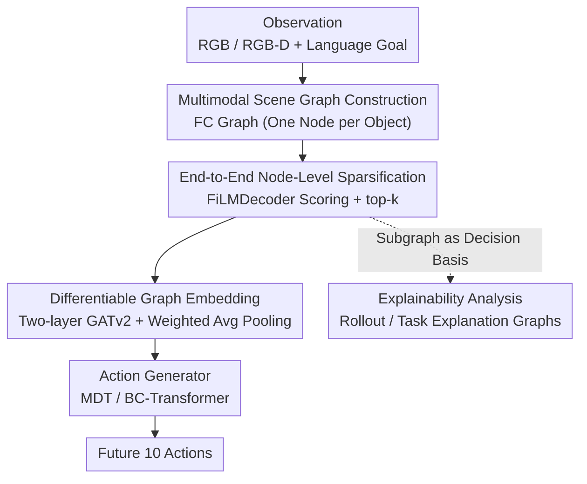

# SIR: Structured Image Representations for Explainable Robot Learning

**Conference**: CVPR 2026  
**Paper**: [CVF Open Access](https://openaccess.thecvf.com/content/CVPR2026/html/Mattes_SIR_Structured_Image_Representations_for_Explainable_Robot_Learning_CVPR_2026_paper.html)  
**Code**: https://github.com/intuitiverobots/SIR_Model  
**Area**: Robotics / Embodied AI  
**Keywords**: Imitation Learning, Scene Graph, Graph Sparsification, Explainability, Goal-Conditioned Policy

## TL;DR
SIR transforms robotic observations into a fully connected scene graph and employs an end-to-end learnable sparsification module to retain only task-relevant nodes. This "thinned subgraph" serves as the state representation for the policy—improving success rates on RoboCasa from 14.81% to 19.5% while providing intrinsic explainability. This allows for the identification of spurious correlations and positional biases within datasets.

## Background & Motivation
**Background**: Goal-Conditioned Imitation Learning (GCIL) has recently advanced through attention-based or diffusion-based policies (e.g., MDT). The standard approach uses a convolutional backbone or a vision foundation model to compress images into a learned visual embedding, which is then fed into an action generator.

**Limitations of Prior Work**: These visual embeddings are opaque dense vectors that conflate all image information. They lack explicit structure and fail to identify which objects influenced specific actions. This leads to two consequences: extreme sensitivity to distractors and a total lack of interpretability for failure analysis.

**Key Challenge**: There is a fundamental tension between "compactness" and "interpretability/structure" in image embeddings. Higher compression for network input typically results in lower transparency regarding what has been encoded. Existing graph-based methods either follow planning routes (relying on TAMP and manual key-point updates), treat graphs only as auxiliary inputs, or are limited to simple point cloud graphs with few nodes (e.g., Compose by Focus), failing to use structured scene graphs as direct states for step-wise policies.

**Goal**: (1) Systematically verify which image modalities should be used as node features to best represent scenes for robot policies; (2) Learn a sparsification method to filter task-relevant subgraphs and analyze model decision-making.

**Key Insight**: The authors bet on scene graphs (SG) as an intermediate representation. SGs naturally unify symbolic information (object labels), geometric cues (bounding boxes/point clouds), and high-level visual features into a readable structure. A critical observation is that if a model is *only* allowed to see a few nodes in a sparse subgraph, that subgraph *is* the explanation, as it constitutes the sole information available for action generation.

**Core Idea**: Replace opaque image embeddings with end-to-end learned sparse scene subgraphs as the state representation for GCIL policies, making explainability intrinsic rather than post-hoc.

## Method

### Overall Architecture
SIR is a GCIL model that takes a single-frame observation (RGB or RGB-D) and a language goal as input to output 10 future actions. It decomposes scene perception into four serial modules: first, a **fully connected scene graph** is extracted (one node per object); second, a learnable module scores each node and retains the top-k highest-scoring nodes to form a **task-relevant subgraph**; third, a two-layer GATv2 embeds this subgraph into a state vector; finally, the state vector and a CLIP-encoded language goal are fed into an action generator (MDT or BC-Transformer). The scene graph extraction is frozen, while the subsequent modules are trained end-to-end.

The essence of the pipeline is that nodes "discarded" by the sparsification module contribute nothing to the final embedding—ensuring the retained subgraph represents all scene information actually used by the model.

### Key Designs

**1. Multimodal Scene Graph Construction: Combining Symbolic, Geometric, and Visual Cues**
SIR first uses ground truth or predicted segmentation masks to isolate every object in the scene, treating each as a node in a fully connected graph (FC-Graph). Initial node features can be concatenated from four modalities: **Label** (one-hot), **Cropped-Image-Feature** (encoded via ResNet18 pre-trained on bounding box reconstruction), **BB-Coordinates** (normalized 2D coordinates), and **Point-Cloud-Feature** (encoded via PointNet). Experimentally, the combination of Cropped-Image-Feature + BB-Coordinates offers the best trade-off between accuracy and inference speed.

**2. End-to-End Node-Level Sparsification: Eliminating Irrelevant Nodes Before Message Passing**
Unlike existing GNN pooling (e.g., DiffPool, SAGPool) which selects nodes *after* or *during* message passing (allowing information from "discarded" nodes to leak into the embedding), SIR insists on sparsification *before* message passing. 

A two-layer Transformer-Decoder (**FiLMDecoder**) scores each node $\text{NS}(n)$ conditioned on the language goal using AdaLN. The top-$k$ nodes are selected, and node weights are defined as:
$$\text{NW}(n) = \begin{cases} \text{NS}(n), & n \in \text{subgraph} \\ 0, & \text{otherwise} \end{cases}$$
To prevent score collapse, a **soft histogram loss** is introduced to encourage scores to distribute uniformly across $[0,1]$. An L1 loss is also applied to node weights to favor instruction-relevant nodes.

**3. Differentiable Graph Embedding: Ensuring Structural Infidelity**
To ensure the "deletion" of nodes is differentiable and physically blocks information flow, SIR uses two layers of GATv2 with three modifications: (1) Passing gradients from $\text{NS}(n)$ directly to $\text{NW}(n)$; (2) Scaling edge weights by $\text{EdgeWeight}(u,v) = \text{NW}(u)\cdot\text{NW}(v)$ to block messages from discarded nodes; (3) Applying weighted average pooling:
$$\text{GraphEmbedding} = \frac{\sum_{n \in V} \text{NW}(n)\cdot X_n}{\sum_{n \in V} \mathbb{1}_{[\text{NW}(n) > 0]}}$$
This combination ensures that discarded nodes have zero contribution to the final state.

**4. Intrinsic Explainability: Auditing Dataset Biases via Subgraph Consistency**
The authors define the occurrence rate $p_{p,n}$ of a node $n$ across a rollout. By aggregating these into "task explanation graphs," they categorize subgraphs into: ① Expected, ② Containing distractors, or ③ Lacking critical nodes. Insights often come from categories ② and ③. For example, in the CloseDrawer task (81% success), the "Drawer" node appeared in only 11% of subgraphs, while "Oven" appeared consistently, exposing a reliance on spurious correlations.

### Loss & Training
The three modules (Sparsification, Graph Embedding, Action Generation) are trained jointly. Beyond the imitation learning loss, the sparsification module uses a soft histogram loss (weight 0.1) and an L1 weight loss. Each configuration is evaluated across 100 rollouts.

## Key Experimental Results

### Main Results
Success rates (%) on 24 RoboCasa atomic tasks using MDT:

| Observation Repr. | Doors(4) | Drawers(2) | Knobs(2) | Levers(3) | Buttons(3) | Avg(24) |
|----------|----------|-----------|----------|-----------|-----------|---------|
| Image (baseline) | 25.13 | 49.75 | 7.25 | 23.67 | 17.00 | 14.81 |
| Fully-Connected-Graph | 28.62 | 39.25 | 14.00 | 40.00 | 18.83 | 16.98 |
| **SIR (Ours)** | **30.25** | 46.25 | **16.50** | **48.50** | **21.83** | **19.50** |

SIR outperforms the image baseline significantly in Doors, Levers, Knobs, and Buttons. Lower performance in Drawers is attributed to the dataset biases discovered during explainability analysis.

### Ablation Study
Sparsification methods (RoboCasa, Avg-24 Success %):

| Method | Avg(24) | Description |
|-----------|---------|------|
| None (FC) | 16.98 | No sparsification |
| Random Node Removal | 5.48 | Performance collapse |
| Naive NR (No hist loss) | 9.60 | Score collapse |
| Threshold | 17.17 | Fixed threshold retention |
| TopK (No L1/FiLM) | 18.44 | Generic top-k |
| **SIR** | **19.50** | Full model |

### Key Findings
- **Soft histogram loss is vital**: Removing it drops performance from 19.5% to 9.6% due to score collapse.
- **Robustness to distractors**: When 3-9 distractors are added, image baselines drop by 3.3%, while SIR remains stable or even improves in specific tasks.
- **Explainability as a diagnostic tool**: High success doesn't always imply correct reasoning. SIR revealed that in CloseSingleDoor, the model ignores the door and follows a fixed trajectory due to positional bias in the data.

## Highlights & Insights
- **"Subgraph as Explanation"**: Explainability is an architectural constraint rather than post-hoc attribution. This is more rigorous than standard GNN pooling where information leaks prior to selection.
- **Differentiable Top-K**: The three-pronged approach (direct gradient passing, edge weighting, weighted pooling) provides a blueprint for making discrete selection differentiable in graph tasks.
- **Model "Mis-focus" as a Data Probe**: A powerful paradigm shift—using explainability not to show model intelligence, but to expose "dirty" data and spurious correlations.
- **Multi-view Fusion**: Provides a robust comparison between Split-View and Fusion Graph approaches for multi-camera setups.

## Limitations & Future Work
- **Dependency on Segmentation**: SIR relies on masks to discretize the scene; robustness to segmentation failure or unconstrained environments is not fully explored.
- **Manual $k$ Hyperparameter**: The number of retained nodes $k$ is humans-specified per task based on relevant object counts. A fully adaptive $k$ is not yet implemented.
- **Qualitative Metrics**: Explainability assessment relies on qualitative visualization and consistency metrics rather than a quantitative "explanation accuracy" benchmark.
- **Low Absolute Success**: An Avg-24 of 19.5% indicates the benchmark's difficulty and suggests a long road to practical utility.

## Related Work & Insights
- **vs. Compose by Focus**: SIR handles larger graphs, integrates multimodal features, and serves as a generalized state representation rather than just a point cloud component.
- **vs. Instant Policy**: SIR is not restricted to point clouds and introduces learnable sparse subgraphs for explainability.
- **vs. Plan-based Graphs**: SIR demonstrates that low-level graph representations can drive step-wise GCIL without high-level symbolic planning or manual key-points.
- **vs. GNN Pooling**: SIR is one of the first methods to learn node removal *before* message passing, ensuring zero information leakage from discarded nodes.

## Rating
- Novelty: ⭐⭐⭐⭐⭐ "Sparsification before message passing" for intrinsic explainability is a highly cohesive and novel contribution.
- Experimental Thoroughness: ⭐⭐⭐⭐ Extensive ablations and distractor tests, though absolute success rates remain low and explainability is mostly qualitative.
- Writing Quality: ⭐⭐⭐⭐⭐ Clear logical flow driven by research questions; the dataset bias analysis is particularly compelling.
- Value: ⭐⭐⭐⭐ The paradigm of using model attention as a probe for dataset auditing has significant cross-domain utility.

<!-- RELATED:START -->

## Related Papers

- [\[AAAI 2026\] Theory of Mind for Explainable Human-Robot Interaction](../../AAAI2026/robotics/theory_of_mind_for_explainable_human-robot_interaction.md)
- [\[CVPR 2026\] Video2Robo: 3DGS-based Synthetic Data from One Video Enables Scalable Robot Learning](video2robo_3dgs-based_synthetic_data_from_one_video_enables_scalable_robot_learn.md)
- [\[CVPR 2026\] CoMo: Learning Continuous Latent Motion from Internet Videos for Scalable Robot Learning](como_learning_continuous_latent_motion_from_internet_videos_for_scalable_robot_l.md)
- [\[CVPR 2026\] DynBridge: Bridging Imagination and Control through Interaction Dynamics for Robot Manipulation](dynbridge_bridging_imagination_and_control_through_interaction_dynamics_for_robo.md)
- [\[CVPR 2026\] GeniNav: Generative Model Driven Image-Goal Navigation via Imagination-Guided Consistency Flow Matching](geninav_generative_model_driven_image-goal_navigation_via_imagination-guided_con.md)

<!-- RELATED:END -->
