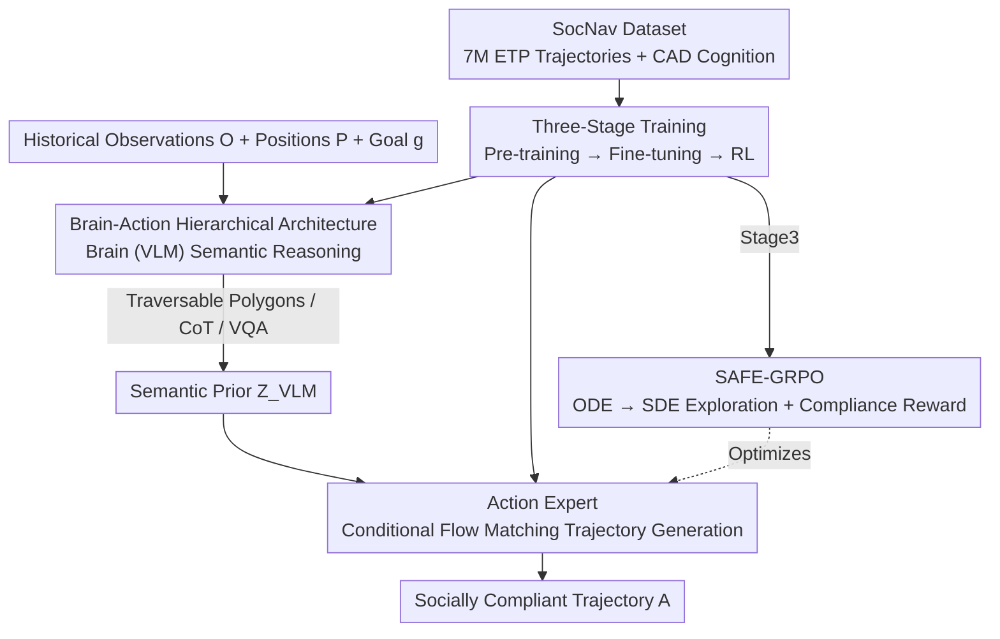

# SocialNav: Training Human-Inspired Foundation Model for Socially-Aware Embodied Navigation

**Conference**: CVPR 2026  
**Paper**: [CVF Open Access](https://openaccess.thecvf.com/content/CVPR2026/html/Chen_SocialNav_Training_Human-Inspired_Foundation_Model_for_Socially-Aware_Embodied_Navigation_CVPR_2026_paper.html)  
**Code**: https://amap-eai.github.io/SocialNav/ (Project Page)  
**Area**: Robotics / Embodied Navigation  
**Keywords**: Social Navigation, Embodied AI, Flow Matching, Reinforcement Learning, Vision-Language Model

## TL;DR
SocialNav employs a hierarchical foundation model consisting of a "brain (VLM reasoning) + action expert (flow matching trajectory generation)." Combined with a 7-million-sample cognitive-trajectory dataset and the first flow-based reinforcement learning method for navigation, SAFE-GRPO, it enables robots to navigate not just along the shortest path, but in a "socially compliant" manner—resulting in a +38% success rate and +46% social compliance rate compared to the SOTA.

## Background & Motivation
**Background**: Visual navigation has evolved from early SLAM systems to end-to-end learning methods like GNM / ViNT / NoMaD. To enhance generalization, recent works (e.g., CityWalker, MBRA) have begun scaling training trajectories using massive web videos or simulation platforms, while some utilize VLMs to enhance semantic understanding.

**Limitations of Prior Work**: Most existing methods focus solely on "shortest path planning + obstacle avoidance," treating navigation as a purely geometric/efficiency problem. As a result, trajectories that are geometrically "optimal" can be socially inappropriate in the real world: crossing streets improperly, walking on lawns, or intruding into restricted areas. For an embodied agent like a robotic guide dog, such trajectories are unacceptable.

**Key Challenge**: Social compliance is not merely about "obstacle avoidance," but rather about "understanding social norms." Even if social priors are implicitly embedded in demonstration data, pure behavior cloning only learns superficial mimicry without capturing the underlying causal structure of compliant behaviors, leading to failures in novel scenarios. Meanwhile, high-level reasoning in VLMs is often decoupled from low-level action generation: they can reason but cannot act, or act without reasoning.

**Goal**: To build a unified foundation model that can understand social norms (high-level semantics), generate compliant trajectories accordingly (low-level control), and explain the reasoning behind its navigation choices in natural language, similar to humans.

**Key Insight**: Decoupling navigation into tightly coupled "brain-action" branches—using a VLM as the brain for interpretable semantic reasoning, and a flow matching expert as the cerebellum to translate semantic priors into executable robot trajectories. Additionally, realizing that "imitation alone is insufficient," explicit reinforcement learning with compliance rewards is required for the model to internalize rules rather than merely mimic behaviors.

**Core Idea**: A hierarchical brain-action architecture + large-scale cognitive-trajectory data + the first flow-based navigation RL (SAFE-GRPO), utilizing "compliance-aware rewards" to truly embed social norms into the policy.

## Method

### Overall Architecture
The task is formulated as vision-based, history-conditioned point-goal navigation. At time $t$, the agent receives a sequence of the last $n$ frames of monocular observations $O_{t-n:t}$, their corresponding 2D positions $P_{t-n:t}$, and a target goal $g\in\mathbb{R}^2$, and outputs the next $m$ actions $A_{t+1:t+m}=\pi_\theta(O_{t-n:t},P_{t-n:t},g)$ (by default, $n=m=5$).

The entire model features a "brain-action" hierarchical structure. The **Brain Module** (VLM) first performs autoregressive text reasoning to output interpretable semantic products (traversable polygons, Chain-of-Thought (CoT) explanations, or VQA answers) and passes the final-layer features $Z_{VLM}$ as a semantic condition to the **Action Expert**. The Action Expert uses conditional flow matching to "translate" this semantic prior into robot trajectories. This design decouples high-level reasoning from low-level control while maintaining a strong semantic connection via $Z_{VLM}$. The model's capabilities are supported by two pillars: the 7-million-sample **SocNav Dataset** (featuring both cognitive and trajectory modalities) and a three-stage training pipeline optimized with **SAFE-GRPO** reinforcement learning to integrate social compliance.

### Key Designs

**1. Brain-Action Hierarchical Architecture: Binding "Reasoning" and "Acting" via Semantics**

The limitation is straightforward—VLMs excel at semantic reasoning but cannot output continuous trajectories, while end-to-end policies can navigate but lack rule understanding. SocialNav divides these into two tightly coupled branches. The **Brain Module** is a VLM ($\pi_{VLM}$ implemented using Qwen2.5-VL 3B) that performs generative autoregressive reasoning to produce three types of interpretable outputs: "socially traversable areas" represented as polygons (e.g., sidewalks, crosswalks, stairs), step-by-step navigation CoT text explanations, and VQA answers to enhance scene understanding. The **Action Expert** specializes in end-to-end trajectory generation, conditioned on the final-layer semantic features $Z_{VLM}$ of the VLM:

$$Z_{VLM}=\pi_{VLM}(O_{t-n:t},P_{t-n:t},g),\quad A_{t+1:t+m}=\pi_{flow}(x_t,t;Z_{VLM})$$

The key lies in this $Z_{VLM}$ channel: high-level reasoning and low-level control are decoupled (using their respective optimal paradigms: autoregressive vs. flow matching), but semantic flow remains continuous—the Action Expert always "knows what social rules the brain sees." This enables the model to both perceive and reason, translating these insights into compliant trajectories.

**2. SocNav Dataset: Cognitive and Trajectory Pyramids with 7 Million Samples**

Existing embodied navigation corpora lack both "cognitive knowledge" and "action intuition," making it impossible to train reasoning and control simultaneously. The authors build the SocNav Dataset, consisting of two complementary pillars. The **Expert Trajectories Pyramid (ETP)** is a three-layer trajectory pyramid: the bottom layer $D_{video}$ contains 2 million pseudo-trajectories extracted from global city walk videos (reconstructed via dense 3D reconstruction $\pi^3$, MoGe metric scale alignment, and point-goal sampling along paths); the middle layer $D_{sim}$ contains 1.7 million high-fidelity simulation trajectories, including the authors' newly built SocialGS (3,400 3DGS-reconstructed real scenes covering malls, streets, and offices) and SocCity (a 3.37 km² Isaac Sim dynamic city with vehicle and pedestrian flows); the top layer $D_{real}$ contains 340,000 real robot trajectories (SCAND/Huron/Recon/CityWalker) to provide physical realism and sensor consistency. The **Cognitive Activation Dataset (CAD)** provides "cognition": 1.2 million human-annotated socially traversable polygon identifications, 825,000 navigation CoTs generated by Qwen2.5-VL-72B, and 1 million general VQAs. Combined, they bring scale, realism, and cognition into a unified framework as the basis for subsequent social compliance alignment.

**3. Three-Stage Progressive Training: Navigating, Adapting, and Aligning**

Social compliance cannot be injected all at once. The authors utilize a three-stage progressive training pipeline. **Stage 1 Pre-training**: Joint end-to-end training on ETP ($D_{video}+D_{sim}$) and CAD ($D_{cog}$) to bootstrap VLM navigation, train the flow model to predict low-level waypoints, optimize reasoning through CoT/VQA, and learn "traversable area" perception via polygon prediction. **Stage 2 Fine-tuning**: Fine-tuning exclusively on high-quality real robot trajectories $D_{real}$, with the **VLM frozen and only the Action Expert optimized**—this preserves the brain's semantic/social reasoning while adapting the flow model to real-world dynamics and spatial scales, reducing the sim-to-real gap. **Stage 3 Reinforcement Learning**: Explicitly aligning with human social conventions using SAFE-GRPO (detailed in Design 4). This sequence of "general skill learning → physical adaptation → social alignment" prevents sample-inefficient exploration caused by a lack of priors during initial RL.

**4. SAFE-GRPO: First Flow-Based Navigation RL with Compliance-Aware Rewards**

Imitation learning struggles with causal reasoning in social scenarios. To address this, the authors propose Socially-Aware Flow Exploration GRPO. The main challenge is that flow policies are deterministic ODEs, which inherently prevent exploration. Inspired by Flow-GRPO, SAFE-GRPO converts the deterministic ODE into a stochastic SDE to introduce exploration:

$$dx_t=v_{flow}(x_t,t;Z_{VLM})\,dt+\sigma_t\,dw_t$$

where $\sigma_t$ controls the exploration magnitude, and $v_{flow}$ is the velocity field of the flow policy. Unlike unstructured random exploration, stochasticity is **only injected during flow integration**, while the semantic condition $Z_{VLM}$ from the "brain" remains fixed throughout. This implicit prior encodes high-level spatial and social cues, ensuring exploration is "constrained and semantically aligned" rather than wandering blindly under sparse rewards. The reward function explicitly favors compliance:

$$R=R_{social}+\lambda_{expert}R_{expert}+\lambda_{smooth}R_{smooth}+\lambda_{eff}R_{eff}$$

The primary reward $R_{social}$ is computed from a semantic occupancy map $M_{occ}$, encouraging a safety margin from all non-traversable areas; $R_{expert}$ encourages proximity to expert trajectories; $R_{smooth}$ penalizes unsmooth motion; and $R_{eff}$ rewards efficient goal arrival. Collision-free and socially valid trajectories receive high rewards, allowing the model to internalize the underlying rules of compliance rather than just copying superficial behaviors. This stage is trained on SocCity due to its precise road network annotations which yield reliable reward feedback.

### Loss & Training
- **Brain**: Qwen2.5-VL 3B; **Action Expert**: Diffusion Transformer with $L=12$ layers, $H=12$ heads, hidden dimension $D=1536$, and $K=5$ denoising steps during inference.
- Pre-training: End-to-end full model, AdamW, 3 epochs, 96×H20 GPUs, batch size 192, lr $5\times10^{-5}$.
- Fine-tuning: Action Expert only, 32×H20 GPUs, batch size 256, lr $1\times10^{-5}$.
- SAFE-GRPO: Action Expert only, 16×H20 GPUs, rollout batch size 128, lr $5\times10^{-7}$.

## Key Experimental Results

Evaluation is conducted under three setups: the CityWalker open-loop benchmark, a self-built SocNav closed-loop benchmark, and real robot deployment. A custom social compliance metric **DCR (Distance Compliance Rate)** is defined: upon success ($s=1$), $\mathrm{DCR}=d_{compliant}/d_{actual}$ (distance navigated within compliant areas / total distance traversed), and 0 on failure; **TCR (Time Compliance Rate)** is defined similarly. Success Rate (SR) is defined as "reaching within 3m of the goal with fewer than 3 collisions."

### Main Results

Open-loop CityWalker benchmark (lower MAOE is better, values represent the mean across all sample columns):

| Method | Turn | Crossing | Proximity | All |
|------|------|----------|-----------|-----|
| GNM | 31.1 | 14.8 | 14.7 | 12.1 |
| ViNT | 31.1 | 15.4 | 14.8 | 12.6 |
| NoMaD | 35.1 | 18.5 | 18.1 | 12.1 |
| CityWalker | 26.6 | 14.1 | 14.3 | 11.5 |
| **SocialNav (Full)** | **20.1** | **8.8** | **8.9** | **7.8** |

Closed-loop SocNav benchmark (navigation performance + social compliance, higher is better):

| Method | SR↑ | RC↑ | SPL↑ | DCR↑ | TCR↑ |
|------|-----|-----|------|------|------|
| GNM* | 43.3 | 62.4 | 37.0 | 26.5 | 28.7 |
| ViNT* | 45.6 | 66.2 | 39.5 | 31.4 | 33.8 |
| NoMaD* | 41.1 | 60.5 | 35.4 | 29.5 | 31.6 |
| CityWalker | 47.8 | 64.7 | 44.7 | 36.1 | 36.6 |
| SocialNav* | 65.0 | 78.4 | 62.3 | 58.0 | 56.7 |
| **SocialNav (Full)** | **86.1** | **91.2** | **77.4** | **82.5** | **82.9** |

Compared to the runner-up CityWalker, the proposed method yields: SR **+38.3**, RC +26.5, SPL +32.7. DCR/TCR (82.5/82.9) are **more than double** those of CityWalker (36.1/36.6), and the gains in social compliance do not come at the cost of navigation efficiency.

Real robot deployment (successes out of 20 trials per environment):

| Method | Street Intersection | Park | Mall | Mean SR |
|------|---------|------|------|---------|
| GNM* | 9/20 | 10/20 | 8/20 | 45.0 |
| ViNT* | 7/20 | 12/20 | 8/20 | 45.0 |
| NoMaD* | 9/20 | 11/20 | 10/20 | 50.0 |
| CityWalker | 12/20 | 13/20 | 12/20 | 62.5 |
| **SocialNav (Full)** | **18/20** | **16/20** | **17/20** | **85.0** |

### Ablation Study
The paper compares `SocialNav*` (imitation learning on $D_{real}$ only, under the same setup as NoMaD*/GNM*/ViNT*) against `SocialNav (Full)` (full data + three-stage training + SAFE-GRPO) to dissect the architectural components:

| Configuration | SR↑ | DCR↑ | TCR↑ | Description |
|------|-----|------|------|------|
| SocialNav (Full) | 86.1 | 82.5 | 82.9 | Full model |
| SocialNav* (IL on Dreal only) | 65.0 | 58.0 | 56.7 | Removes large-scale ETP/CAD data + RL stage |
| CityWalker | 47.8 | 36.1 | 36.6 | Strongest baseline |

### Key Findings
- **Architecture Strength**: Even when trained with imitation learning on $D_{real}$ alone, SocialNav* (SR 65.0) significantly outperforms all baselines under the same setup (41~48). This indicates that the brain-action hierarchical architecture and semantic conditioning provide substantial gains regardless of the data scale or RL training.
- **Social Compliance Depends on RL & Full Data**: Moving from SocialNav* to the Full model shows a massive improvement of SR +21.1, DCR +24.5, and TCR +26.2. The large-scale cognitive-trajectory data combined with SAFE-GRPO is critical for doubling the compliance rate, supporting the hypothesis that imitation alone is insufficient and explicit rule-based reinforcement is necessary.
- **Real-World Generalization**: Despite not being exposed to the closed-loop deployment environments, the model achieves an average SR of 85.0% in real-world deployment (outperforming CityWalker's 62.5% by 22.5%), demonstrating successful sim-to-real transfer.

## Highlights & Insights
- **Binding "Reasoning" and "Acting" via Semantics**: VLMs perform autoregressive reasoning, and flow matching handles continuous control. These two highly suitable paradigms perform their respective duties while continuously exchanging semantic representations via $Z_{VLM}$. This is a clean approach to addressing the decoupling of VLM reasoning and embodied action, which can be generalized to any VLA task mapping high-level semantics to low-level continuous actions.
- **Formulating Social Compliance as Optimizable Rewards**: Quantitative metrics such as DCR/TCR (measuring the proportion of travel within socially compliant regions) and semantic occupancy map-based $R_{social}$ translate abstract "propriety" into concrete signals optimisable by RL. This is the most impressive step of the paper.
- **Semantically Constrained Exploration (ODE → SDE)**: Injecting stochastic noise only into the flow integration while keeping semantic conditions fixed makes RL exploration semantically constrained rather than blind. This technique is applicable to any combination of flow policies and reinforcement learning.
- **Data Pyramid**: Structuring data into three layers—internet videos (breadth) $\rightarrow$ simulation (edge cases) $\rightarrow$ physical robots (realism), combined with a reconstruction pipeline for video pseudo-trajectories, provides a highly reusable pipeline for scaling point-goal data.

## Limitations & Future Work
- **Reliance on Labeled Semantic Priors**: Socially traversable polygons and road networks in SocCity rely heavily on manual/heuristic labeling. The quality of the reward $R_{social}$ is constrained by label coverage, which may cause failures in out-of-distribution social scenarios.
- **Weighted Multi-term Reward Optimization**: The reward function $R$ contains four weighted terms. Balancing these $\lambda$ weights requires extensive manual tuning. The paper places detailed formulas in the appendix without providing sensitivity analyses in the main text, meaning evidence regarding the individual contributions of these terms remains limited. ⚠️ Precise weights should refer to the original paper and its appendix.
- **High Computational Cost**: Pre-training on 7 million samples with 96×H20 GPUs is extremely expensive. Additionally, running a 3B VLM + DiT Action Expert real-time on physical robots incurs computational overhead that warrants consideration.
- **Future Directions**: Shifting social norms from "manual supervision" to "automatic mining from human feedback" or enabling the Brain module to update compliance rules online could further reduce manual labeling dependence.

## Related Work & Insights
- **vs. CityWalker / ViNT / GNM / NoMaD**: These methods focus on shortest-path navigation and obstacle avoidance. They are either image-goal driven or purely geometric, thus lacking social semantics. SocialNav explicitly models social compliance via a VLM "brain" and converts compliance into an optimisable objective, widening the gap in compliance metrics twofold.
- **vs. Pure Flow-Matching VLA (Behavior Cloning)**: While flow matching models excel at representing multi-modal action distributions in VLAs, they are typically limited to behavior cloning and lack causal understanding. SocialNav builds SAFE-GRPO on top of the flow policy, introducing explicit rule internalization.
- **vs. Flow-GRPO / GRPO**: While drawing inspiration from "generative models + online RL for human preference alignment" and the ODE-to-SDE transition, this work is the first to ground these concepts in embodied navigation and design compliance-aware rewards tailored specifically to navigation.

## Rating
- Novelty: ⭐⭐⭐⭐⭐ First flow-based navigation RL + hierarchical brain-action foundation model + quantitative compliance metrics. A highly systematic innovation.
- Experimental Thoroughness: ⭐⭐⭐⭐ Evaluated across three settings (open-loop, closed-loop, real-world deployment) with massive data, but detailed ablation of reward terms is relegated to the appendix.
- Writing Quality: ⭐⭐⭐⭐ Clear motivation, well-structured diagrams, and clear equations. The representation of the reward details in the main text is slightly brief.
- Value: ⭐⭐⭐⭐⭐ Translating abstract "social compliance" into trainable objectives is majorly valuable for deploying embodied navigation in real scenario applications (e.g., guiding, delivery, robotic guide dogs).

<!-- RELATED:START -->

## Related Papers

- [\[ICLR 2026\] Embodied Navigation Foundation Model](../../ICLR2026/robotics/embodied_navigation_foundation_model.md)
- [\[CVPR 2026\] Recurrent Reasoning with Vision-Language Models for Estimating Long-Horizon Embodied Task Progress](recurrent_reasoning_with_vision-language_models_for_estimating_long-horizon_embo.md)
- [\[CVPR 2026\] Towards Human-Like Robot Handwriting via Contour-Aware Generation](towards_human-like_robot_handwriting_via_contour-aware_generation.md)
- [\[CVPR 2026\] Towards Training-Free Scene Text Editing](towards_training-free_scene_text_editing.md)
- [\[CVPR 2026\] GeniNav: Generative Model Driven Image-Goal Navigation via Imagination-Guided Consistency Flow Matching](geninav_generative_model_driven_image-goal_navigation_via_imagination-guided_con.md)

<!-- RELATED:END -->
