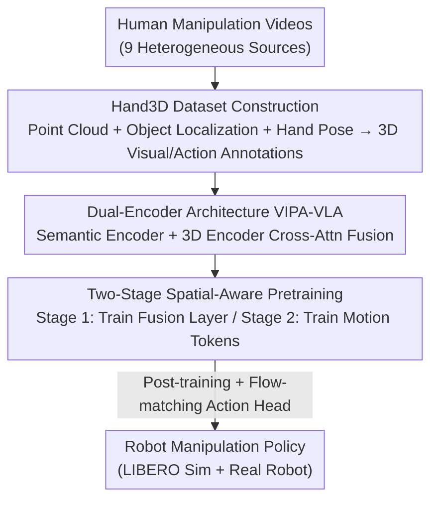

# Spatial-Aware VLA Pretraining through Visual-Physical Alignment from Human Videos

**Conference**: CVPR 2026  
**Paper**: [CVF Open Access](https://openaccess.thecvf.com/content/CVPR2026/html/Feng_Spatial-Aware_VLA_Pretraining_through_Visual-Physical_Alignment_from_Human_Videos_CVPR_2026_paper.html)  
**Code**: None (Project Page: https://beingbeyond.github.io/VIPA-VLA)  
**Area**: Robotics / Embodied AI (VLA Pretraining)  
**Keywords**: VLA, Spatial-Aware Pretraining, Human Videos, Visual-Physical Alignment, Robot Manipulation

## TL;DR
To bridge the perception-action gap where VLA models "use 2D vision to drive 3D physical actions," this paper proposes a "Spatial-Aware Pretraining" phase before learning robot policies. By extracting 3D visual and 3D action annotations from large-scale human manipulation videos as supervision, the dual-encoder model **VIPA-VLA** aligns 2D semantic vision with 3D space. Consequently, without using a single frame of robot data for pretraining, it achieves a 92.4% average success rate on LIBERO and significantly outperforms strong baselines on real robots.

## Background & Motivation
**Background**: Vision-Language-Action (VLA) is the current mainstream paradigm for general robot policies—using pretrained Vision-Language Models (VLM) as a backbone, tokenizing actions or attaching an action expert, and then fine-tuning on robot data. Works like GR00T-N1 and π0/π0.5 perform large-scale VLA pretraining using massive multimodal internet data alongside robot data, demonstrating strong generalization capabilities.

**Limitations of Prior Work**: However, the input for most VLAs remains 2D vision (RGB images/video frames), while actions occur in 3D physical space. These models perceive pixels but must execute 3D actions with real-world scales, such as "move hand 5cm forward and grasp downward," leading to a weak correspondence between the two. This results in poor spatial grounding and limited generalization across different scenes.

**Key Challenge**: VLMs excel at "visual-semantic" alignment (identifying what is in the image), whereas VLAs additionally require "visual-physical" alignment (mapping pixels to 3D geometric locations and determining how actions affect the environment). Existing VLAs typically skip the step of "teaching the model to understand 3D space" by fine-tuning VLMs directly on robot data; thus, 2D perception and 3D actions are never truly integrated.

**Key Insight**: Human manipulation videos naturally contain the correspondence between "2D observations ↔ 3D physical actions"—how humans reach, grasp, and move objects in various visual scenes provides ready-made evidence for 3D actions. Moreover, human videos are far easier to collect and cover a wider range of scenarios than robot data. Although there is an embodiment gap between human hands and robot arms, the information regarding "how actions are executed in 3D space" is cross-embodiment universal.

**Core Idea**: Insert a "Spatial-Aware VLA Pretraining" phase before robot policy learning (post-training). Extract 3D visual/action annotations from human videos to train the model to align 2D vision with 3D spatial understanding (referred to as visual-physical alignment), allowing the model to learn robot policies with a 3D grounding prior.

## Method

### Overall Architecture
The method revolves around a three-stage pipeline: First, construct the **Hand3D** dataset (containing 3D visual and action annotations) from human videos. Second, perform two-stage spatial-aware pretraining using these annotations to train a dual-encoder model **VIPA-VLA**. Finally, perform post-training on robot data with an attached flow-matching action head to output executable actions. The key to the entire pipeline is that the pretraining phase uses zero robot data, relying solely on human videos to align the three layers of "2D semantic vision → 3D space → action" progressively.

### Key Designs

**1. Hand3D Dataset: Converting Human Videos into 3D Visual + Action Supervision with Real-world Scale**

This serves as the data supply for the entire paradigm, addressing the pain point that "VLAs lack supervision signals mapping 2D pixels to 3D physical space." The authors aggregate videos from 9 heterogeneous human manipulation sources (Arctic, HOI4D, OAKINK2, EgoDex, etc.), unify all hand annotations to the MANO parametric hand model, and create two types of annotations:

- **3D Visual Annotations (Hand3D-visual)**: Dense point clouds $P=\{(x_i,y_i,z_i)\}_{i=1}^N$ are estimated per frame using Cut3R (chosen for its robustness in dynamic scenes and human-object interactions). Object 3D locations are determined using Gemini-2.5-flash + GroundingDINO for 2D boxes combined with depth. For the hand, 21 3D joints are calculated using MANO and projected back to the image plane $(u,v)=\Pi(K[R|t](x,y,z)^\top)$, where $\Pi(x',y',z')=(x'/z',y'/z')$, with visibility filtering for out-of-frame joints. **Critical Scale Calibration**: Relative scales in monocular point clouds do not match physical reality. Since actions must be executed at a real scale, the authors use absolute hand joint depths $J_h^z$ to match estimated point cloud depths $\tilde J_h^z$, estimating a scaling factor $s=\mathrm{median}_{k\in\Omega}(j_k^z/\tilde j_k^z)$ to calibrate the point cloud to $sP$. This places the hand and objects in a unified, real-world 3D coordinate system. Finally, Gemini generates 4 types of VQA: spatial relations, task completion, hand movements, and camera movements. The first three encode 3D relations as `(direction, distance)`—distance is Euclidean norm, and direction is discretized into language tokens like right/left, up/down, forward/backward via a threshold $\gamma$. Approximately 4K clips yield 300K instruction-answer pairs.
- **3D Action Annotations (Hand3D-action)**: Wrist trajectories $(x_t,y_t,z_t)$ are discretized into a sequence of motion tokens $(m_x^1,m_y^1,m_z^1,\dots)$ using uniform binning. Paired with text instructions (following UniHand), samples with negligible hand displacement are filtered out from 4M pairs, resulting in 1M fine-grained motion supervision samples.

Thus, dense, continuous 3D geometry is compressed into "linguistic, supervisable" compact labels, enabling the model to perceive static spatial configurations and reason about dynamic changes like hand movements and task progress.

**2. VIPA-VLA Dual-Encoder + Cross-Attention Fusion: Supplementing Semantic Vision with 3D Geometry**

Addressing the limitation that "a single semantic vision encoder understands high-level semantics but lacks 3D spatial structure," the authors add a 3D vision encoder (Cut3R) alongside a conventional semantic vision encoder. The former produces spatial embeddings $V_{spa}$ and the latter semantic embeddings $V_{sem}$. A fusion layer is implemented via cross-attention: **semantic features serve as queries, while 3D spatial features serve as keys/values**, outputting fused visual representations $V_f$. This allows semantic vision to "query" corresponding geometric information, binding the complementary features. Furthermore, to allow the model to understand fine-grained 3D motion trajectories from human videos, the authors extend the LLM's token embedding space to include a set of motion tokens for discretized 3D physical space, allowing "actions" to be modeled and predicted through the LLM's language channel.

**3. Two-Stage Spatial-Aware Pretraining: Progressive Alignment from Spatial Perception to Action**

Addressing the difficulty of "simultaneously aligning 2D semantics, 3D space, and actions," the authors split pretraining into two steps, unfreezing only the most relevant parts at each stage:

- **Stage 1 (Fusion Layer Training)**: All pretrained parameters (encoders and LLM) are frozen; only the randomly initialized cross-attention fusion layer is trained using 3D visual VQA data. The goal is to align $V_{sem}$ with $V_{spa}$ and teach the model to reason about 3D spatial relationships. Ablations show significant gains even by only training the fusion layer.
- **Stage 2 (Motion Token Training)**: The LLM vocabulary is expanded to include motion tokens. With frozen semantic and spatial encoders, only the LLM is trained to predict motion tokens conditioned on fused vision and text. This yields fine-grained spatial reasoning and action-level understanding—learning the mapping between "visual cues ↔ physical motion patterns."

Through these two stages, VIPA-VLA aligns 2D semantic perception, 3D spatial understanding, and action reasoning progressively, providing a 3D grounding prior for downstream robot policy learning.

### Loss & Training
Robot data is only introduced during the post-training phase: A Diffusion Transformer (DiT) action head is attached, and actions are learned via flow matching. Condition $h_{cond}=\mathrm{VLM}_\phi(v,l,Q_a)$ is extracted from the VLM base ($Q_a$ is a fixed action query using the corresponding hidden state as the DiT condition). A noisy trajectory $\tilde a_t^{(\tau)}=(1-\tau)\epsilon+\tau a_t$ is constructed via linear interpolation between Gaussian noise $\epsilon$ and ground-truth action $a_t$, where $\tau\sim U(0,1)$. This is concatenated with the robot state embedding $s_t$ and fed into the DiT to predict the instantaneous flow vector $v_\theta$, aiming to approximate the oracle vector $a_t-\epsilon$:

$$\mathcal{L}_{FM}=\mathbb{E}_{a_t,\tau,\epsilon,v,l}\big[\|v_\theta-(a_t-\epsilon)\|_2^2\big]$$

During post-training, only the LLM backbone and action head $f_\theta$ are updated. The backbone is initialized with InternVL3.5-2B. Pretraining learning rate is 1e-5, post-training is 5e-5, trained on 8×A800.

## Key Experimental Results

### Main Results (LIBERO Simulation, 4 Task Suites × 500 trials)
Notably, VIPA-VLA **uses zero robot data during pretraining** (marked as ✗ in the Robo-PT column) yet matches or exceeds π-series and GR00T which use massive robot data pretraining.

| Setup | Model | Robo-PT | Avg. Success (%) |
|------|------|---------|----------------|
| Single-view | SpatialVLA | ✓ | 78.1 |
| Single-view | 4D-VLA | ✓ | 88.6 |
| Single-view | GR00T N1.5* | ✓ | 92.1 |
| Single-view | **VIPA-VLA** | ✗ | **92.4** |
| Dual-view | π0 | ✓ | 94.4 |
| Dual-view | π0.5 | ✓ | 96.9 |
| Dual-view | **VIPA-VLA** | ✗ | **96.8** |

VIPA-VLA consistently outperforms baselines that explicitly model spatial reasoning (SpatialVLA, TraceVLA, MolmoAct).

### Real Robot Experiments (Franka 7-DoF + Inspire Hand, Sub-task / Full-task Success Rates)

| Task | GR00T N1.5 | Being-H0 | InternVL3.5 | VIPA-VLA |
|------|-----------|----------|-------------|----------|
| Put-Three-Obj | 48% / 40% | 38% / 20% | 34% / 10% | 52% / 10% |
| Wipe-Board | 57% / 30% | 40% / 10% | 43% / 10% | **83% / 60%** |
| Water-Plant | 53% / 30% | 37% / 20% | 37% / 20% | **57% / 50%** |

The advantage is more pronounced in unseen environments (Wipe-Board-Unseen 83%/50%, while baselines largely fail at initial stages). Despite lower full-task rates in Put-Three-Obj, its sub-task rate is the highest, indicating it stays on track longer in long-horizon sequences.

### Ablation Study

| Configuration | LIBERO Avg (%) | Description |
|------|------------------|------|
| VIPA-VLA (Full) | 92.4 | Dual-encoder + Spatial-aware pretraining |
| – Pretraining | 91.2 (-1.2) | Removing human video pretraining |
| – Dual Encoder | 90.4 (-2.0) | Removing 3D encoder |
| – Both | 88.7 (-3.7) | Removing both |

3D Spatial Understanding Evaluation (Hand3D-test, 2K unseen video VQA):

| Model | Distance Error (m) ↓ | Direction Score ↑ |
|------|----------------|------------|
| InternVL3.5 (Base) | 0.18 | 1.22/3 |
| InternVL3.5 + Hand3D | 0.14 | 1.75/3 |
| VIPA-VLA-PT | **0.12** | **1.82/3** |

### Key Findings
- The dual-encoder architecture (-2.0%) contributes more to final performance than human video pretraining (-1.2%), but their combination yields the strongest result, suggesting "data-level supervision" and "architectural 3D fusion" are complementary.
- In 3D spatial understanding, "Base + Hand3D pretraining" reduced distance error from 0.18 to 0.14 and increased the direction score from 1.22 to 1.75. This proves that Hand3D annotations (data level) significantly improve spatial grounding; adding the dual-encoder provides further marginal gains, indicating the 3D encoder offers benefits beyond data supervision.
- Training only the fusion layer in Stage 1 provides significant gains, meaning "aligning semantic and spatial visual features" is inherently valuable.
- Motion trajectories predicted after Stage 2 are smoother and more goal-oriented than ground-truth (human data contains noise/redundancy). The model also learns affordances—e.g., grasping a wooden spoon by the handle.

## Highlights & Insights
- **Turning "3D Spatial Understanding" from a perception task into a transferable action prior**: Unlike previous 3D VLMs that focused on "perceiving static scenes," this work uses human videos to bind 3D understanding with "how actions are executed in 3D space," bridging the perception→action gap.
- **Critical and practical scale calibration**: Relative scales from monocular depth are harmful to action learning. Using absolute MANO hand joint positions to calibrate point cloud scales via the median is a low-cost, effective trick applicable to any "monocular geometry + real-scale" embodied task.
- **Matching strong baselines without robot data pretraining** suggests that "2D↔3D grounding" is a bottleneck for VLA generalization, and human videos are a high-value source.
- **Verbalizing 3D geometry into `(direction, distance)` tokens** allows spatial supervision to enter the VLM's text/VQA channel directly, providing a reusable paradigm for "inputting spatial info into LLMs."

## Limitations & Future Work
- Authors suggest that spatial-aware pretraining can be combined with robot data pretraining to form a more complete strategy (implying human videos alone are not enough; robot data remains indispensable).
- ⚠️ Real-world evaluation scale is small (10 trials per task), with high variance in full-task success (e.g., 10% for Put-Three-Obj). Conclusions rely more on sub-task success; generalization needs more extensive validation.
- The pipeline depends on a long list of off-the-shelf models (Cut3R, Gemini-2.5-flash, GroundingDINO, MANO) for automatic labeling. Annotation quality is capped by these models, and error propagation is not deeply analyzed.
- Embodiment gap remains: Human hand trajectories do not perfectly map to robot arms or dexterous hands. While this paper bypasses this by "learning 3D spatial understanding rather than direct action space alignment," the actual transfer loss across embodiments is not quantified.

## Related Work & Insights
- **vs. SpatialVLA / 3D-VLA / GeoVLA**: These also aim to add 3D to VLA. SpatialVLA uses ego-centric positional encoding + adaptive action grids; 3D-VLA uses diffusion world models to render future point clouds; GeoVLA takes direct RGBD input. Ours neither changes the input nor renders; instead, it **adds a pretraining stage** using human video 3D labels + a 3D encoder to explicitly align 2D to 3D, emphasizing "grounding before policy learning."
- **vs. Being-H0 / UniHand**: These also use human videos for VLA pretraining. However, Being-H0 focus on learning motion sequences, while Ours emphasizes spatial grounding between "2D observations ↔ 3D action space" with explicit scale calibration.
- **vs. GR00T-N1 / π0.5**: These rely on massive robot data + internet data for large-scale pretraining. Ours demonstrates that with zero robot data pretraining, 3D priors from human videos can achieve competitive performance, offering a more robot-data-efficient path.

## Rating
- Novelty: ⭐⭐⭐⭐⭐ "Pretraining spatial awareness before policy" + dual-labeling human videos for 3D visual/action data. Clear, distinct roadmap.
- Experimental Thoroughness: ⭐⭐⭐⭐ Covers LIBERO, real robots, spatial evaluation, and ablations. However, real-world trials are limited.
- Writing Quality: ⭐⭐⭐⭐ Well-explained motivations, clear pipeline, and formulas. Some notation (Hand3D labels) requires careful reading against the figures.
- Value: ⭐⭐⭐⭐⭐ Provides a practical, low-cost human video pretraining route for "VLA 3D grounding" that can be combined with robot data pretraining.

<!-- RELATED:START -->

## Related Papers

- [\[CVPR 2026\] VLA Models Are More Generalizable Than You Think: Revisiting Physical and Spatial Modeling](vla_models_are_more_generalizable_than_you_think_revisiting_physical_and_spatial.md)
- [\[CVPR 2026\] EgoRoC: Towards Egocentric Robotic Control via Task-Agnostic Visual Alignment](egoroc_towards_egocentric_robotic_control_via_task-agnostic_visual_alignment.md)
- [\[CVPR 2026\] ForeAct: Steering Your VLA with Efficient Visual Foresight Planning](foreact_steering_your_vla_with_efficient_visual_foresight_planning.md)
- [\[CVPR 2026\] CLiViS: Unleashing Cognitive Map through Linguistic-Visual Synergy for Embodied Visual Reasoning](clivis_unleashing_cognitive_map_through_linguistic-visual_synergy_for_embodied_v.md)
- [\[CVPR 2026\] DiffuView: Multi-View Diffusion Pretraining for 3D-Aware Robotic Manipulation](diffuview_multi-view_diffusion_pretraining_for_3d_aware_robotic_manipulation.md)

<!-- RELATED:END -->
