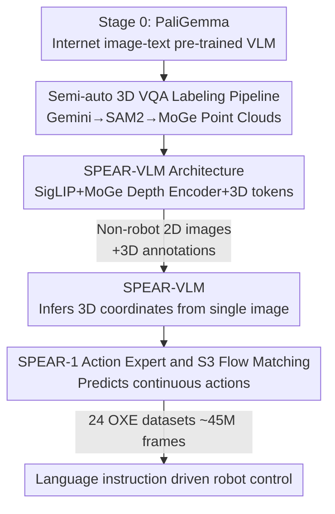

# SPEAR-1: Scaling Beyond Robot Demonstrations via 3D Understanding

**Conference**: CVPR 2026  
**Paper**: [CVF Open Access](https://openaccess.thecvf.com/content/CVPR2026/html/Nikolov_SPEAR-1_Scaling_Beyond_Robot_Demonstrations_via_3D_Understanding_CVPR_2026_paper.html)  
**Code**: spear.insait.ai (Open weights + 3D annotated data)  
**Area**: Robotics / Embodied AI (3D-aware VLA)  
**Keywords**: Robot foundation models, VLA, 3D perception, monocular depth, flow matching

## TL;DR
SPEAR-1 argues that the poor generalization of robot foundation models stems from the base VLM only understanding 2D. Therefore, the VLM is first trained into a 3D-aware **SPEAR-VLM** capable of predicting 3D coordinates using "easy-to-collect non-robot 2D images + automatically generated 3D annotations." An action expert is then trained on top of it for VLA. Ultimately, its zero-shot performance in unseen Franka (DROID) environments matches $\pi$0.5 and exceeds $\pi$0-FAST, while using $20\times$ less robot demonstration data.

## Background & Motivation
**Background**: Vision-Language-Action (VLA) models are the current mainstream paradigm for general-purpose robot control. They fuse the "common sense" of internet-pre-trained VLMs with large-scale robot demonstration data to output actions end-to-end.

**Limitations of Prior Work**: The generalization capability of such policies is highly fragmented. Models like OpenVLA, SpatialVLA, and CogAct perform well zero-shot in "toy" environments (seen camera positions, in-distribution backgrounds) but fail in real deployment scenarios (e.g., Franka/DROID with varying camera poses and OOD backgrounds), requiring fine-tuning for target environments. $\pi$0 and $\pi$0.5 rely on scaling up **closed-source** large-scale robot data for generalization, which is extremely costly.

**Key Challenge**: The authors argue that the bottleneck lies in the "foundation"—most robot foundation models are fine-tuned from VLMs trained only on 2D image-text tasks, whereas embodied control inherently occurs in a 3D world. Lacking 3D spatial reasoning, VLMs can only **implicitly** learn geometric structures from massive robot demonstrations, making them bottlenecked by expensive, embodiment-specific robot data.

**Goal**: Inject "control-related 3D spatial understanding" into VLA without increasing (and even significantly reducing) the required robot data.

**Key Insight**: 3D annotations do not necessarily need to come from robots. Ordinary 2D images combined with off-the-shelf vision foundation models (depth estimation, segmentation, detection) can **automatically** generate 3D annotations, which is much cheaper and more scalable than collecting robot demonstrations.

**Core Idea**: First, use "3D-annotated non-robot 2D images" to upgrade the VLM to SPEAR-VLM, which can infer 3D coordinates of objects from a single 2D image. Then, attach an action expert to it, ensuring 3D geometric priors are embedded in the representation before robot training—"replacing" part of the expensive robot demonstrations with cheap non-robot data.

## Method

### Overall Architecture
The training of SPEAR-1 is a three-stage pipeline, where data becomes scarcer but more control-oriented in later stages: Stage 0 uses an existing general VLM (PaliGemma, pre-trained on internet image-text data). Stage 1 transforms it into a 3D-aware **SPEAR-VLM**—adding a monocular depth encoder, expanding the vocabulary with 3D tokens, and learning embodied-style VQA tasks such as "predicting 3D bounding boxes / distances between objects" on automatically annotated non-robot 2D images. Stage 2 attaches a **flow-matching action expert** on top of SPEAR-VLM, trained on 24 Open X-Embodiment (OXE) datasets (approx. 45M frames) into a functional robot foundation model SPEAR-1.

### Key Designs

**1. SPEAR-VLM: Equipping 2D VLM with Depth Vision and 3D Vocabulary**

To address the lack of geometry in 2D VLMs, SPEAR-VLM applies two modifications to PaliGemma. Architecturally, PaliGemma consists of a SigLIP vision encoder, a linear projection, and a Gemma language model; the authors integrate a **MoGe** monocular depth encoder as a second visual backbone. MoGe is chosen for its affine-invariant modeling, outputting 3D point clouds/depth even without camera intrinsics. Specifically, the last four layers of MoGe ViT intermediate features are channel-concatenated and projected into the LLM embedding space via a randomly initialized linear layer, then **averaged** with the SigLIP projection output as visual tokens. For representation, the authors expand the PaliGemma tokenizer with $N=1024$ "3D tokens" to encode continuous 3D coordinates into discrete symbols. Thus, the VLM no longer just describes "what is in the image" but can answer "what are the eight vertices of the carrot's 3D bounding box."

**2. Semi-automatic 3D VQA Labeling Pipeline: Generating 3D Supervision from 2D Images**

This is the key to turning non-robot data into usable 3D supervision. The pipeline uses only 2D images and off-the-shelf vision foundation models: ① Gemini detects 2D bounding boxes and semantic labels; ② these boxes are fed into SAM2 for instance-level segmentation masks; ③ MoGe predicts the 3D point cloud for the entire image. To construct training samples, a templated text prompt and several objects are randomly sampled. The object masks filter the MoGe point cloud to obtain object-specific 3D points, from which oriented 3D bounding boxes are calculated. Tasks include 3D object detection, relative spatial relationships, camera-to-object distance, and object keypoints—all proxy embodied capabilities for VLA. The data focuses on indoor scenes, annotating 200,000 images from EgoExo4D "cooking" and "repair" clips, supplemented by 30,000 frames from Bridge-V2 (robot demonstrations, 10% of the mix) to increase visual diversity. Notably, using only **200,000 non-robot 2D images**, SPEAR-1 outperforms models trained on over 900 million robot frames.

**3. SPEAR-1 Action Expert and S3 Flow Matching: Connecting 3D Representations to Continuous Control**

A 3D-aware VLM is insufficient without generating robot actions. SPEAR-1 adopts the $\pi$0 architecture: a flow-matching action expert processes proprioception (end-effector pose + gripper state) and attends to the VLM's intermediate key-value pairs to predict an action sequence $A_t=[a_t,\dots,a_{t+H-1}]$. Each action consists of translation, rotation, and gripper state $a_t=[x_t,q_t,g_t]$. The key improvement is **treating rotation as unit quaternions and performing flow matching on the $S^3$ manifold**, rather than treating $\mathbb{R}^4\to S^3$ as a linear problem. During training, a timestep $\tau$ and noise are sampled; translation uses linear interpolation, while rotation uses spherical linear interpolation (slerp):

$$q^\tau_t=\frac{\sin\big((1-\tau)\theta\big)}{\sin\theta}\,q_\epsilon+\frac{\sin(\tau\theta)}{\sin\theta}\,q_t,\quad \theta=\cos^{-1}(q_\epsilon\cdot q_t)$$

Translation uses a MSE-style conditional flow matching loss $L_{\mathbb{R}^3}$. For rotation, a combination of cosine loss for velocity prediction and geodesic loss for the integrated quaternion forms $L_{S^3}$. The total loss is $L(\theta)=\mathbb{E}[L_{\mathbb{R}^3}+L_{S^3}]$. During inference, Euler integration is used to push the vector field from $\tau=0$ to $\tau=1$. This $S^3$ manifold formulation proves more stable and accurate than Euler angles or linear flow matching.

**4. The Engineering Recipe: When to Train/Freeze Encoders**

Systematic ablations show that 3D priors are sensitive to training schedules. The conclusion: during VLM pre-training, both SigLIP and MoGe should be **trainable**, but during the VLA stage, **MoGe must be frozen**. Robot training tends to degrade pre-trained visual representations (the ReVLA phenomenon). Since MoGe learns dense depth—essential for manipulation—training it during the VLA phase destroys its 3D capabilities (average success rate dropped from 35.4% to 18.8% in ablations). Other details include: center-cropping/padding images instead of stretching (to preserve aspect ratios for depth estimation); using 280×210 resolution for external cameras and 112×112 for wrist cameras; action chunks of $H=5$ at 5Hz; and using **Global Quantile Normalization** across datasets to encourage learning "motion" rather than dataset-specific bias. EMA checkpoints significantly stabilized final performance.

### Loss & Training
SPEAR-VLM is trained in two stages like LLaVA: Stage 1 initializes from PaliGemma+MoGe weights, training only the MoGe projection, 3D token embeddings, and SigLIP projection while freezing the rest. Stage 2 is longer, freezing only SigLIP and MoGe encoders, while amplifying the 3D token next-token-prediction loss by $\lambda=2$. VLM training uses batch 512 for 12k steps (16×H200, ~18 hours). VLA pre-training starts from SPEAR-VLM + random action expert, batch 2048 for 300k steps (32×H200, ~6 days) on 24 OXE datasets. It is then fine-tuned for 50k steps each on WidowX/Franka to obtain SPEAR-1 (Bridge) and SPEAR-1 (DROID).

## Key Experimental Results

### Main Results
Evaluation on SIMPLER WidowX simulation against open-weight VLAs (SpatialVLA data from original paper):

| Model | Carrot on Plate | Eggplant in Basket | Spoon on Towel | Stack Block | Average SR |
|------|----------------|--------------------|----------------|-------------|-----------|
| OpenVLA | 0% | 4.1% | 0% | 0% | 1.0% |
| SpatialVLA | 25.0% | 100.0% | 16.7% | 29.2% | 42.7% |
| **SPEAR-1 (Ours)** | 58.3% | 62.5% | 62.5% | 45.8% | **57.3%** |

On real hardware: For Franka (DROID), SPEAR-1 significantly outperforms $\pi$0-FAST and matches $\pi$0.5 **without any fine-tuning in the target environment**, despite the baselines using $20\times$ more robot demonstration data.

### Ablation Study
Trained on Bridge-V2 subset and evaluated on SIMPLER WidowX to verify 3D pre-training components:

| Configuration | Key Difference | Average SR | Description |
|------|---------|-----------|------|
| no 3D (PaliGemma) | No 3D task | 20.8% | Original 2D VLM |
| no OBJ | Random pixel 3D coords, no object-level task | 20.8% | Supervision without object context is ineffective |
| no MoGe | Object 3D task, but no depth encoder | 26.0% | Limited gain |
| no VLA-MF | Train MoGe during VLA phase | 18.8% | Worse than baseline; degraded 3D |
| **SPEAR-VLM (Full)** | Object tasks + MoGe, freeze MoGe during VLA | **35.4%** | Optimal configuration |

### Key Findings
- **Object-level 3D tasks + MoGe are both indispensable**: Neither random pixel coordinates nor removing the depth encoder yields significant gains; combining them jumps success from 20.8% to 35.4%.
- **MoGe must be frozen in VLA phase**: Training it during VLA drops performance to 18.8%, confirming that robot training degrades dense depth representations.
- **High Data Efficiency**: 200,000 non-robot 2D images yield generalization equivalent to 900 million robot frames; total robot data usage is $1/20$ of $\pi$0.5.

## Highlights & Insights
- **Decoupling 3D Priors from Control**: Effectively shifting the burden of "learning 3D geometry" from expensive robot demos to automatically annotated 2D images.
- **Off-the-shelf Model Pipeline**: Using Gemini, SAM2, and MoGe in sequence allows scaling 3D supervision without manual labeling or specialized hardware.
- **Precision in Training Recipes**: Treating "when to freeze encoders" as a primary research question provides a transferable insight for dual-backbone VLAs.
- **Geometrically Grounded Flow Matching**: Implementing flow matching on the $S^3$ manifold for rotations is a clean, effective detail for pose prediction.

## Limitations & Future Work
- **Geometric Complexity**: Oriented 3D bounding boxes do not capture the geometry of deformable or complex-shaped objects well.
- **Depth Scale**: MoGe provides affine-invariant depth, meaning 3D labels are not in metric space, which may impact precision.
- **Remaining Fine-tuning**: It still requires fine-tuning on the target embodiment for optimal performance, leaving "zero-shot cross-embodiment" as a future challenge.
- **Scaling Laws**: The relationship between the volume/quality of 3D pre-training data and downstream control performance remains to be studied.

## Related Work & Insights
- **vs. SpatialVLA**: SpatialVLA also adds a depth encoder but does not perform 3D VLM pre-training, forcing the model to learn 3D implicitly and purely from robot data.
- **vs. $\pi$0 / $\pi$0.5**: SPEAR-1 proves that "3D VLM pre-training on non-robot data" is a more scalable route—matching the performance of $\pi$0.5 while using $20\times$ less robot data.
- **vs. Gemini Robotics 1.0**: Shares the 3D pre-training idea, but SPEAR-1 is an open-weight, much smaller model that explicitly demonstrates the utility of non-robot data.

## Rating
- Novelty: ⭐⭐⭐⭐⭐ (Decoupling 3D geometry from robot data is a clear, scalable path).
- Experimental Thoroughness: ⭐⭐⭐⭐ (Solid sim/real and ablation results, though task sets are primarily indoor tabletop).
- Writing Quality: ⭐⭐⭐⭐ (Logical structure; clear 3-stage diagram; minor typos in text).
- Value: ⭐⭐⭐⭐⭐ (Open weights and 3D data provide high utility to the embodied AI community).

<!-- RELATED:START -->

## Related Papers

- [\[CVPR 2026\] Beyond Mimicry: Learning Whole-Body Human-Humanoid Interaction from Human-Human Demonstrations](beyond_mimicry_learning_whole-body_human-humanoid_interaction_from_human-human_d.md)
- [\[CVPR 2026\] Beyond Success: Refining Elegant Robot Manipulation from Mixed-Quality Data via Just-in-Time Intervention](beyond_success_refining_elegant_robot_manipulation_from_mixed-quality_data_via_j.md)
- [\[CVPR 2026\] Structural Action Transformer for 3D Dexterous Manipulation](structural_action_transformer_for_3d_dexterous_manipulation.md)
- [\[CVPR 2026\] RoboWheel: A Data Engine from Real-World Human Demonstrations for Cross-Embodiment Robotic Learning](robowheel_a_data_engine_from_real-world_human_demonstrations_for_cross-embodimen.md)
- [\[CVPR 2026\] GeoPredict: Leveraging Predictive Kinematics and 3D Gaussian Geometry for Precise VLA Manipulation](geopredict_leveraging_predictive_kinematics_and_3d_gaussian_geometry_for_precise.md)

<!-- RELATED:END -->
