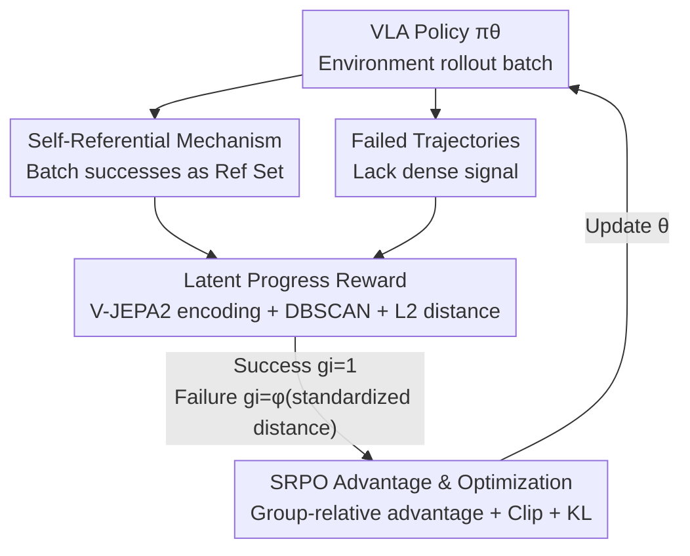

# SRPO: Self-Referential Policy Optimization for Vision-Language-Action Models

**Conference**: CVPR 2026  
**Paper**: [CVF Open Access](https://openaccess.thecvf.com/content/CVPR2026/html/Fei_SRPO_Self-Referential_Policy_Optimization_for_Vision-Language-Action_Models_CVPR_2026_paper.html)  
**Code**: None  
**Area**: Robotics / Embodied AI / Reinforcement Learning  
**Keywords**: VLA, RL, Sparse Reward, World Model, Process Reward

## TL;DR
SRPO uses **self-generated successful trajectories** within the same training batch as references and measures "how close a failed trajectory is to success" via world model latent representations. This converts the 0/1 sparse rewards of GRPO into dense process rewards without extra demonstrations or manual reward engineering, improving OpenVLA* on LIBERO from 48.9% to 99.2% (within 200 steps).

## Background & Motivation

**Background**: Vision-Language-Action (VLA) models transfer large-scale pre-trained VLMs to robot manipulation. However, training relies heavily on expert demonstrations, causing models to overfit on small downstream datasets and suffer from "demonstration bias"—the model's performance is capped by the expert and rarely surpasses it. Recently, Reinforcement Learning (especially group-based methods like GRPO) has been used for post-training to break this ceiling.

**Limitations of Prior Work**: The core pain point of RL in VLA is **extreme reward sparsity**. GRPO uses only binary success signals (success 1 / failure 0) at the end of episodes for advantage estimation, while multi-turn robot rollouts are expensive. Consequently, a vast number of failed trajectories that are "almost successful" contain significant progress information but are discarded, leading to extremely low training efficiency.

**Key Challenge**: Assigning dense process rewards (PRM) to failed trajectories requires knowing "at which step the task is." Existing process rewards either rely on expert demonstrations to label milestones or require manual task decomposition (hand-crafted stages). This conflicts with the goal of "autonomous learning and scalability" by reintroducing manual priors. Another path involves modeling dynamics with world models, but traditional **pixel-level** world models generalize poorly across domains and often require task-specific fine-tuning.

**Goal**: To provide a dense, generalizable, and task-agnostic process reward for failed trajectories without introducing external demonstrations or manual reward engineering.

**Key Insight**: Two key observations are made: First, in each training batch, the **model itself** generates some successful trajectories, which naturally serve as reference standards for "doing it right." Second, the compressed representations in the **latent space** of a world model can capture behavior progress patterns across environments without requiring pixel-level reconstruction or in-domain fine-tuning. The supervision problem is reframed from "how to obtain expert labels" to "how to extract process rewards from our own successes."

**Core Idea**: Use self-produced successful trajectories within a batch as self-references, measure behavior similarity via world model latent representation distances to assign process rewards to failed trajectories, and optimize the policy using GRPO-style advantage estimation.

## Method

### Overall Architecture
SRPO integrates "self-referential process rewards" into the GRPO training loop. In each training iteration, the policy $\pi_\theta$ rolls out a batch of trajectories in the environment, containing both successes and failures. Successful trajectories are collected into a **reference set**. For every trajectory, a world model (V-JEPA 2) pre-trained on large-scale robot videos acts as an encoder to map the observation sequence into latent representations. The "progress" of a failed trajectory is modeled as its L2 distance to the cluster of successful representations—the closer it is, the higher the progress and reward. This progress reward is then fed into GRPO-style advantage estimation to update the policy under KL regularization.

The pipeline forms a closed loop of "rollout → collect references → world model encoding → distance-based reward → advantage estimation → policy update," as shown below:

### Key Designs

**1. Self-Referential Reward: Using self-generated batch successes as "ground truth"**

To address the need for dense supervision without expert labels, SRPO bypasses external supervision entirely. Within each training batch, trajectories with a terminal reward $R(z_{0:T}, l)=1$ are categorized into the success reference set $S=\{o^{(i)}_{0:T}; R(z^{(i)}_{0:T}, l)=1\}$. For failed trajectories, the process reward $\hat{R}(o_{0:T}, S)$ is derived from how similar they are to the successful references. This reframes the problem as "how to extract progress-wise reward from our own successes." The reference standard evolves alongside the policy, requires no external data, and is inherently scalable. Unlike GRPO, which wastes failure information, SRPO utilizes the entire batch more effectively. Trajectory-level rewards are preferred over fine-grained reward shaping to prevent artificial signals from leading the policy to sub-optimal solutions.

**2. Latent Progress Reward: Quantifying "distance to success" via V-JEPA 2 latent distance**

Measuring "behavioral similarity" using raw pixels is ineffective because pixel-level models lack cross-domain generalization and are sensitive to visual noise, while general vision models (e.g., ImageBind) lack robotic physical concepts. SRPO uses a world model encoder $W$ pre-trained on robot videos to encode trajectories into latent space $h_i = W(o^{(i)}_{0:T})$. This compressed, transferable representation captures progress patterns across environments. The calculation involves three steps: first, DBSCAN clustering on successful embeddings to identify representative centers $C=\mathrm{DBSCAN}(S)$; second, calculating the distance from a failed trajectory to the nearest center $d_i = \min(\{\lVert h_i - h_j\rVert_2; h_j \in C\})$; and finally, standardizing and mapping the distance to $(0,1)$ via an activation function:

$$g_i = \begin{cases} 1.0 & \text{Success trajectory} \\ \phi\!\left(\dfrac{d_i - \bar{d}}{\sigma_d}\right) & \text{Failure trajectory} \end{cases}$$

where $\bar{d}$ and $\sigma_d$ are the mean and standard deviation of distances for all failed trajectories, and $\phi(\cdot)$ squashes the result into $(0,1)$. Smaller distances indicate closer proximity to success, resulting in higher rewards. This identifies and rewards "productive segments" in failed trajectories.

**3. Self-Referential Policy Optimization (SRPO): Integrating process rewards into GRPO objectives**

The process reward $g_i$ is integrated into group-based optimization. Following GRPO, with the probability ratio $r_{i,t}(\theta)=\dfrac{\pi_\theta(a^{(i)}_t|o^{(i)}_t, l)}{\pi_{\theta_{old}}(a^{(i)}_t|o^{(i)}_t, l)}$, the advantage is given by **group-normalized** process rewards:

$$\hat{A}_i = \frac{g_i - \mu_g}{\sigma_g}$$

Standardizing within the training group allows the policy to learn "relative performance"—reinforcing behaviors that are closer to success than others in the same batch. The clipped surrogate objective follows PPO/GRPO:

$$L^{CLIP}_{t,i}(\theta) = \min\!\big(r_{i,t}(\theta)\hat{A}_i,\ \mathrm{clip}(r_{i,t}(\theta), 1-\epsilon, 1+\epsilon)\hat{A}_i\big)$$

The total objective is the expectation over time steps $t$ and samples $i$ with KL regularization $\omega(\theta)=\beta D_{KL}(\pi_\theta \Vert \pi_{ref})$:

$$L^{SRPO}(\theta) = \mathbb{E}_{t,i}\,L^{CLIP}_{t,i}(\theta) + \omega(\theta)$$

The essential difference is that while GRPO advantages stem from binary outcomes, SRPO advantages stem from dense world-progress rewards.

### Loss & Training
The pipeline consists of "single demonstration SFT → online SRPO RL post-training." A single demonstration per task is used for supervised fine-tuning to obtain an initial checkpoint, followed by online RL. The framework is based on SiiRL, with V-JEPA 2 for latent representations and OpenVLA* (with action chunking and parallel decoding) as the policy backbone.

## Key Experimental Results

### Main Results
Success rate comparison across four LIBERO suites (Spatial / Object / Goal / Long). SRPO is built on the one-shot SFT baseline; arrows indicate Gain relative to the one-shot baseline:

| Model | Spatial | Object | Goal | Long | Avg |
|------|---------|--------|------|------|-----|
| OpenVLA | 84.7 | 88.4 | 79.2 | 53.7 | 76.5 |
| Pi0 | 96.8 | 98.8 | 95.8 | 85.2 | 94.2 |
| SimpleVLA-RL (GRPO) | 98.2 | 98.7 | 98.8 | 91.7 | 96.9 |
| RIPT-VLA (GRPO) | 99.0 | 98.6 | 98.6 | 93.8 | 97.5 |
| RLinf (GRPO) | 99.4 | 99.8 | 98.8 | 94.0 | 98.0 |
| OpenVLA\*-Full (Full SFT) | 91.6 | 95.3 | 90.6 | 86.5 | 91.0 |
| OpenVLA\*-One (One-shot SFT) | 63.6 | 54.9 | 59.6 | 17.3 | 48.9 |
| **+ Online SRPO** | **98.8** | **100.0** | **99.4** | **98.6** | **99.2** |
|  | ↑35.2 | ↑45.1 | ↑39.8 | ↑81.3 | ↑50.3 |

Starting from a 48.9% baseline, SRPO reaches 99.2% (a 103% relative improvement) within 200 steps, with the most significant gain in the Long suite (17.3 → 98.6).

### Key Findings
- **Reward design is the differentiator**: SRPO outperforms methods relying on sparse outcome rewards (SimpleVLA-RL / RLinf) and those using manual stage rewards (TGRPO), proving that self-reference + world model progress rewards are more effective than heuristic stage partitioning.
- **Latent vs. Pixel/General Vision**: Pixel-level rewards converge slowly due to sensitivity to visual noise. ImageBind plateaus around 85% as it lacks robotic physical concepts. Only world model latent representations provide smooth, monotonic, and physically grounded progress curves.
- **Training Efficiency**: Convergence across the four suites occurred in 79 / 59 / 103 / 219 steps, significantly fewer than the thousands of steps required for SFT. SRPO shows a steeper efficiency slope on long-horizon tasks because it extracts signals from "near-success" failures that GRPO discards.

## Highlights & Insights
- **"Self-Reference" reframes supervision**: Instead of asking "where to find expert labels," it asks "how to extract rewards from our own successes." The standard evolves with the policy, uses zero external data, and is applicable to any online RL with sparse signals.
- **Latent space over pixels**: Latent representations capture cross-environment progress patterns, avoiding pixel reconstruction while gaining physical grounding. This explains the stability of progress curves even in repetitive sub-tasks.
- **Intentional avoidance of fine-grained shaping**: The choice of trajectory-level rewards enhances stability, as overly detailed manual signals can bias the policy toward sub-optimal solutions.

## Limitations & Future Work
- **Dependence on initial successes**: If the initial success rate is zero, the reference set is empty. SRPO requires one-shot SFT to establish a non-zero starting point; it may fail on extremely difficult tasks without a cold start.
- **Reward quality tied to World Model**: Progress estimation depends entirely on V-JEPA 2 latent quality. Its effectiveness in scenarios significantly different from the pre-training distribution (different morphologies or scenes) remains to be verified.
- **Real-world scale**: While effective in simulation, real-world experiments require more detail regarding scalability and reproducibility.

## Related Work & Insights
- **vs GRPO / SimpleVLA-RL / RLinf**: These use binary outcome rewards and waste failed trajectories. SRPO uses the same group optimization framework but replaces sparse outcomes with dense world-progress rewards.
- **vs Manual Stage Rewards (TGRPO)**: These rely on expert demos or manual milestone definitions, which are hard to scale. SRPO uses self-generated successes and task-agnostic latent representations.
- **vs Pixel-level World Models**: Pixel models require task-specific fine-tuning and generalize poorly; SRPO only uses the latent encoder for comparison, requiring no reconstruction or in-domain training.

## Rating
- Novelty: ⭐⭐⭐⭐⭐ "Self-reference + Latent progress reward" reframes sparse reward problems cleanly without external supervision.
- Experimental Thoroughness: ⭐⭐⭐⭐ Extensive validation on LIBERO/LIBERO-Plus and reward quality, though real-world data is limited.
- Writing Quality: ⭐⭐⭐⭐ Clear logic from motivation to method to experiments.
- Value: ⭐⭐⭐⭐⭐ Reaches SOTA in 200 steps with zero extra supervision, providing a scalable paradigm for autonomous VLA-RL.

<!-- RELATED:START -->

## Related Papers

- [\[ICLR 2026\] WMPO: World Model-based Policy Optimization for Vision-Language-Action Models](../../ICLR2026/robotics/wmpo_world_model-based_policy_optimization_for_vision-language-action_models.md)
- [\[CVPR 2026\] MoEActok: A MoE-based Action Tokenizer for Vision-Language-Action Models](moeactok_a_moe-based_action_tokenizer_for_vision-language-action_models.md)
- [\[CVPR 2026\] ACoT-VLA: Action Chain-of-Thought for Vision-Language-Action Models](acot-vla_action_chain-of-thought_for_vision-language-action_models.md)
- [\[CVPR 2026\] QuantVLA: Scale-Calibrated Post-Training Quantization for Vision-Language-Action Models](quantvla_scale-calibrated_post-training_quantization_for_vision-language-action_.md)
- [\[CVPR 2026\] AT-VLA: Adaptive Tactile Injection for Enhanced Feedback Reaction in Vision-Language-Action Models](at-vla_adaptive_tactile_injection_for_enhanced_feedback_reaction_in_vision-langu.md)

<!-- RELATED:END -->
