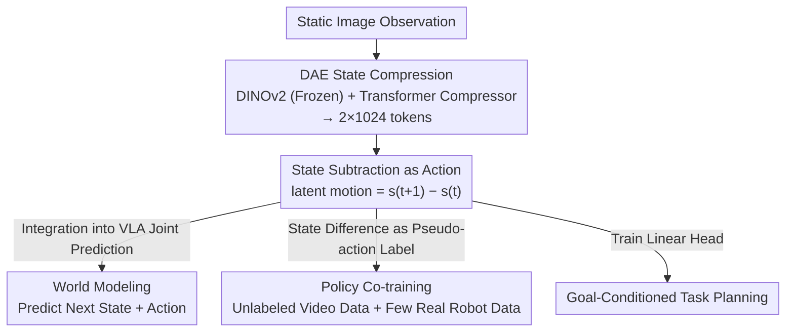

# StaMo: Unsupervised Learning of Generalizable Robot Motion from Compact State Representation

**Conference**: CVPR 2026  
**Paper**: [CVF Open Access](https://openaccess.thecvf.com/content/CVPR2026/html/Liu_StaMo_Unsupervised_Learning_of_Generalizable_Robot_Motion_from_Compact_State_CVPR_2026_paper.html)  
**Code**: https://aim-uofa.github.io/StaMo/ (Project Page)  
**Area**: Robotics / Embodied AI  
**Keywords**: Compact State Representation, Latent Action, Diffusion Autoencoder, World Model, VLA

## TL;DR
StaMo utilizes a lightweight encoder and a pre-trained DiT decoder to unsupervisedly compress a static image into a compact state representation of only two 1024-dimensional tokens. It proves that the "difference between two state tokens" naturally serves as an executable robot action (latent action). Without any video or temporal modeling, it improves VLA performance on LIBERO by 11.6% and increases the success rate on real robots by 31%.

## Background & Motivation

**Background**: In embodied AI, Vision-Language-Action (VLA) models require a "state representation" for world modeling and intermediate reasoning. This is distinct from visual features used for perception—state representations are closer to the action generation end and serve to "predict the future and bridge visual planning to action execution." The current mainstream approach to learning motion is from **video**: extracting variations between consecutive frames using complex temporal models as action signals.

**Limitations of Prior Work**: This approach faces two fundamental contradictions. First, while low-dimensional action representations (trajectories, optical flow, end-effector poses, latent actions) are compact and can express dynamics via simple differentiation, they lack semantic richness and cannot encode goal states, interaction dynamics, or structured spatial relationships. Conversely, high-dimensional state representations (raw image features, dense DINOv2 features, depth/segmentation maps) are expressive but redundant, computationally heavy, and do not inherently contain dynamic information about "how states transition." Second, learning actions from video is expensive, requiring complex temporal models, and the high variance of motion within video segments often leads to "averaged" blurry actions that are sensitive to frame intervals and lack interpretability.

**Key Challenge**: There is a trade-off between being compact and expressive, while dynamic information is strictly tied to the paradigm of "extraction from video temporal sequences."

**Goal**: To learn a state representation that is **both compact and expressive**, so compact that the "difference between two states" can directly serve as an action, thereby liberating action learning from video dependencies.

**Key Insight**: The authors question—if the ultimate goal of using video is just to capture "inter-frame changes as actions," why must a complex motion extractor be trained on suboptimal state representations? If the state representation itself is sufficiently expressive, would the subtraction of states from two static frames naturally contain a meaningful latent action?

**Core Idea**: Use a Diffusion Autoencoder (DAE) with "DINOv2 + Pre-trained DiT decoder" to compress a single-frame image into a compact state of 2 tokens. Action is no longer modeled explicitly but emerges as the **vector difference between two state tokens** in the state space. In short: use "sufficiently good static state representation + subtraction" to replace "learning complex motion extractors from video."

## Method

### Overall Architecture

The core of StaMo is a state encoder capable of extreme compression (down to 2 tokens) with high-fidelity reconstruction, allowing actions to "emerge." The pipeline consists of three stages: ① **Static Compressor Training**: A DAE encodes images into two 1024-dimensional compact state tokens, with reconstruction quality guaranteed by the generative prior of a pre-trained DiT decoder; ② **Motion Interpolation**: Once trained, subtracting two state tokens yields latent motion; linear interpolation in the state space decodes continuous, reasonable motion trajectories without any action supervision; ③ **Downstream Utilization**: Integrating compact states into VLA for world modeling (joint prediction of next state + action) or using state differences as pseudo-action labels for strategy co-training. It can also be used for goal-conditioned task planning.

### Key Designs

**1. DAE Compressing 2-token Compact State: Generative Priors Withstand Information Loss from Extreme Compression**

The pain point is straightforward: using the output of a pre-trained image encoder as a state results in massive feature maps (e.g., 256×1024), which are redundant and slow down real-time execution. However, a single `[CLS]` token is too coarse for precise manipulation. StaMo trains a **Diffusion Autoencoder**: the encoder $E$ consists of a frozen DINOv2 extractor and a Transformer-based compressor, mapping observations to an extremely short token sequence (2 tokens of 1024-dim). The decoder $D$ is a DiT that reconstructs the original image conditioned on these tokens. Based on Stable Diffusion 3, only the compressor and DiT decoder are trained. The training uses the Flow Matching objective:

$$z_0 = \tau(x_0), \quad \mathcal{L}_{DAE} = \mathbb{E}_{z_0,t}\,\lVert D(z_t, E(x_0), t) - u(z_t)\rVert_2^2$$

Where $\tau$ is the VAE encoder of the pre-trained diffusion model that converts image $x_0$ to latent $z_0$, and $z_t = (1-\sigma_t)z_0 + \sigma_t\epsilon$ is the linear interpolation between noise and $z_0$. To reconstruct pixels from only 2 tokens, the decoder must **implicitly understand** key state information like robot pose and object interactions, forcing the tokens to encode "task-critical information" rather than redundant visual details.

**2. State Subtraction as Action: Emergence of Latent Action from Static State Space**

StaMo defines action directly as the vector difference between adjacent compact state tokens:

$$a_t = s_{t+1} - s_t$$

Since the state space is compact and semantically structured, performing **linear interpolation** between two state tokens (start and goal frames) and decoding them results in a smooth, reasonable, and dynamically consistent motion trajectory. This suggests that motion is a geometric property of this representation space. Compared to learning from video, it saves training costs and avoids representation blurring caused by intra-video motion variance. Furthermore, this latent motion is highly transferable (sim-to-sim / sim-to-real).

**3. Integration into VLA for World Modeling: Using "Next State Prediction" as an Auxiliary Task**

StaMo integrates the encoder into VLAs like OpenVLA with a lightweight MLP head to jointly predict "next state + corresponding action." The loss is:

$$\mathcal{L}_{total} = \lambda_{action}\mathcal{L}_{action} + \lambda_{future}\big(\mathcal{L}_{mse}(s_{pred}, s_{gt}) + \mathcal{L}_1(s_{pred}, s_{gt})\big)$$

Predicting "what happens next" regularizes the policy and improves action prediction quality. Since only 2 tokens are predicted during inference without full image decoding, the overhead is minimal (OpenVLA-OFT drops from 18.24Hz to only 17.82Hz).

**4. State Difference as Pseudo-action Label for Co-training: Turning Unlabeled Video into Action Data**

To verify latent motion, the authors use co-training: calculating $m_t = E(o_{t+1}) - E(o_t)$ as pseudo-labels for unlabeled video frames and training with a small amount of labeled real robot data. Experiments show that 1 part real data + 4 parts StaMo pseudo-labels increased success rate from 62.9% to 84.6%, nearing the 86.2% achieved with all real data.

## Key Experimental Results

### Main Results

LIBERO World Modeling Main Results (Success Rate %):

| Method | Spatial | Object | Goal | Long | Average |
|------|---------|--------|------|------|---------|
| OpenVLA | 84.7 | 88.4 | 79.2 | 53.7 | 76.5 |
| OpenVLA* + DINOv2 Feat | 88.6 | 90.4 | 83.5 | 61.4 | 80.9 |
| OpenVLA* + StaMo state | 92.3 | 94.8 | 88.1 | 75.2 | 87.6 |
| OpenVLA* + StaMo motion | 93.1 | 95.1 | 87.4 | 76.9 | **88.1** |
| OpenVLA-OFT | 93.7 | 94.2 | 89.7 | 91.3 | 92.2 |
| OpenVLA-OFT* + StaMo state | 96.8 | 98.9 | 95.0 | 96.3 | **96.8** |

Compared to OpenVLA, StaMo gains +11.6% (76.5→88.1). Long-horizon improvements are particularly significant.

Real Robot (Success Rate):

| Method | Short Mean | Long Mean | Total Mean |
|------|---------|---------|--------|
| OpenVLA | 0.30 | 0.20 | 0.25 |
| UniVLA | 0.40 | 0.25 | 0.33 |
| OpenVLA + StaMo state | 0.60 | 0.52 | 0.56 |
| OpenVLA-OFT + StaMo state | 0.65 | 0.63 | **0.64** |

Real-world success rate increased from 0.25 to 0.56 (+31 points).

### Ablation Study

| Configuration | Key Metric | Description |
|------|---------|------|
| Token Dim 256/512/1024 | PSNR/SSIM nearly constant | Dimension has minimal impact on reconstruction |
| Pre-trained DiT Decoder | LIBERO Mean 87.6% | Full setting |
| Decoder Trained from Scratch | LIBERO Mean 85.7% | Slower convergence and lower performance |

**Action Linear Probing**: StaMo's MSE is lower than Pooled Delta Image or Delta DINOv2 Features across horizons, proving state difference is an informative, linearly separable action representation.

### Key Findings
- **Horizon determines state vs motion usage**: Short-term (single-step) benefits from **motion** (similar to delta pose), while long-term (multi-step) benefits from **state** (as a stable goal condition). 
- **Pre-trained priors are vital**: Training from scratch dropped performance, showing reconstruction from 2 tokens relies on implicit state understanding from natural image pre-training.
- **Negligible inference overhead**: Predicting 2 tokens is much faster than decoding full images (17.82Hz vs ~2-3Hz for WorldVLA).

## Highlights & Insights
- **"Static is Dynamic" perspective**: The core insight is that motion does not necessarily need to be learned from video temporal sequences—as long as the state representation is good enough, subtraction yields action.
- **Reconstruction as Information Distiller**: Using the ability to reconstruct pixels from 2 tokens forces the representation to encode task-critical information rather than visual redundancy.
- **Linearized Dynamics Manifold**: Linear interpolation in state space producing reasonable motion suggests that large vision models implicitly learn a linearized dynamics structure.

## Limitations & Future Work
- **Latent motion is abstract**: It is difficult to compare quantitatively and relies on indirect validation via co-training.
- **Dependency on strong generative priors**: Entirely built on pre-trained DiT/SD3; performance drops without it, implying potential hurdles for modalities without strong priors.
- **Boundary of 2 tokens**: It is unclear if extreme compression loses critical information in highly complex multi-object tasks.
- **Future directions**: Adapting token counts based on task complexity and imposing physical consistency constraints on interpolated trajectories.

## Related Work & Insights
- **vs Video-based Latent Action (LAPA / ATM)**: These require complex temporal models and are sensitive to sampling. StaMo is more efficient, interpretable, and transferable (84.6% vs ~74%).
- **vs Dense Vision World Models (UniVLA / WorldVLA)**: These suffer from slow inference (2-3Hz) and limited generalization. StaMo provides an order of magnitude higher frequency.
- **vs Low-dimensional Action Representations**: These lack semantics. StaMo occupies the sweet spot of being both compact and expressive.

## Rating
- **Novelty**: ⭐⭐⭐⭐⭐ Challenging the video-based latent action paradigm with state subtraction is highly novel.
- **Experimental Thoroughness**: ⭐⭐⭐⭐⭐ Comprehensive validation via sim/real, co-training, linear probing, and scaling.
- **Writing Quality**: ⭐⭐⭐⭐ Clear motivation and complete logic.
- **Value**: ⭐⭐⭐⭐⭐ High practical value for robot learning by enabling the use of unlabeled video data with zero inference overhead.

<!-- RELATED:START -->

## Related Papers

- [\[CVPR 2026\] CoMo: Learning Continuous Latent Motion from Internet Videos for Scalable Robot Learning](como_learning_continuous_latent_motion_from_internet_videos_for_scalable_robot_l.md)
- [\[CVPR 2026\] HiF-VLA: Hindsight, Insight and Foresight through Motion Representation for Vision-Language-Action Models](hif-vla_hindsight_insight_and_foresight_through_motion_representation_for_vision.md)
- [\[CVPR 2026\] Rethinking Intermediate Representation for VLM-based Robot Manipulation](rethinking_intermediate_representation_for_vlm-based_robot_manipulation.md)
- [\[CVPR 2026\] Chain of World: World Model Thinking in Latent Motion (CoWVLA)](chain_of_world_world_model_thinking_in_latent_motion.md)
- [\[CVPR 2026\] Language-Grounded Decoupled Action Representation for Robotic Manipulation (LaDA)](lada_robotic_manipulation.md)

<!-- RELATED:END -->
## Related Papers

- [\[CVPR 2026\] CoMo: Learning Continuous Latent Motion from Internet Videos for Scalable Robot Learning](como_learning_continuous_latent_motion_from_internet_videos_for_scalable_robot_l.md)
- [\[CVPR 2026\] HiF-VLA: Hindsight, Insight and Foresight through Motion Representation for Vision-Language-Action Models](hif-vla_hindsight_insight_and_foresight_through_motion_representation_for_vision.md)
- [\[CVPR 2026\] Rethinking Intermediate Representation for VLM-based Robot Manipulation](rethinking_intermediate_representation_for_vlm-based_robot_manipulation.md)
- [\[CVPR 2026\] DAWN: Pixel Motion Diffusion is What We Need for Robot Control](dawn_pixel_motion_diffusion_robot_control.md)
- [\[CVPR 2026\] Chain of World: World Model Thinking in Latent Motion (CoWVLA)](chain_of_world_world_model_thinking_in_latent_motion.md)

<!-- RELATED:END -->
