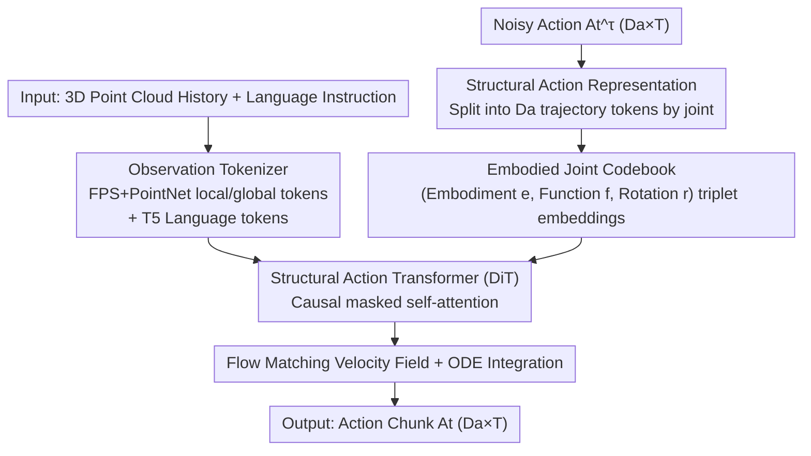

# Structural Action Transformer for 3D Dexterous Manipulation

**Conference**: CVPR 2026  
**Paper**: [CVF Open Access](https://openaccess.thecvf.com/content/CVPR2026/html/Lei_Structural_Action_Transformer_for_3D_Dexterous_Manipulation_CVPR_2026_paper.html)  
**Code**: None (Project Page: [SAT](https://xiaohanlei.github.io/projects/SAT))  
**Area**: Robotics / Embodied AI (3D Dexterous Manipulation)  
**Keywords**: Dexterous Manipulation, Cross-Embodiment Transfer, Action Representation, Flow Matching, Point Cloud Strategy

## TL;DR
SAT flips dexterous action chunks from "temporally ordered action vectors $(T,D_a)$" to "joint-ordered trajectory sequences $(D_a,T)$." This allows the Transformer to naturally handle heterogeneous embodiments by treating the number of joints as a variable sequence length. Coupled with an Embodied Joint Codebook describing kinematic roles and Flow Matching to generate actions from 3D point clouds, the model outperforms 2D/3D baselines on 11 simulation and 6 real-world bimanual tasks with only 19.36M parameters.

## Background & Motivation

**Background**: Imitation learning from large-scale human/robot demonstrations is the mainstream approach for teaching robots dexterous skills. Current policy learning typically utilizes "action chunking," predicting a future sequence of actions $(T,D_a)$, where $T$ is the prediction horizon and $D_a$ is the action dimension. Each time step's $D_a$-dimensional vector is treated as a token in a temporal sequence for Diffusion Policies or Transformers. This "temporal-centric" perspective works well for low-DoF systems like 7-DoF arms.

**Limitations of Prior Work**: When transitioned to high-DoF dexterous hands (e.g., 24-DoF Shadow Hand), temporal-centric representations fail. Models must implicitly learn complex coupling between dozens of joints within a high-dimensional vector. More critically, these "fixed-dimension" representations lack a **natural mechanism for cross-embodiment transfer**: different hand morphologies and joint counts cannot be directly aligned, preventing skills learned on Hand A from transferring to Hand B. Furthermore, most VLA models rely on 2D inputs, losing fine-grained 3D spatial relations necessary for dexterous tasks.

**Key Challenge**: When actions are represented as "sequences of temporal snapshots," the joint dimension is collapsed into an indivisible whole, blocking both "high-DoF scalability" and "cross-embodiment transferability"—preventing the model from recognizing that the index finger MCP joints of two different hands perform similar functions.

**Goal**: (1) Find an action representation that allows a single policy to naturally process heterogeneous embodiments with various joint counts; (2) Learn directly from 3D point clouds to preserve spatial geometry; (3) Achieve parameter and sample efficiency on high-DoF hands.

**Key Insight**: The core advantage of Transformers is handling **variable-length, unordered** sequences. By slicing action chunks along the "joint dimension"—where each token represents the trajectory of a specific joint over the entire horizon—differences in embodiment simply equate to differences in "sequence length $D_a$." This is natively handled by Transformers, while self-attention can learn functional correspondences between joints of different embodiments in the representation space.

**Core Idea**: Replace "temporal-centric" $(T,D_a)$ representations with "structural-centric" $(D_a,T)$ representations. Treat joints as tokens and time as features, then use an Embodied Joint Codebook to disambiguate joint roles, enabling both high-DoF scalability and cross-embodiment transfer.

## Method

### Overall Architecture
SAT is a conditional generative policy: the input consists of the last $T_o$ frames of raw 3D point cloud history $\mathbf{P}_t=(P_{t-T_o+1},\dots,P_t)$ (where $P_k\in\mathbb{R}^{N\times3}$) and a natural language instruction $L$. The output is a future action chunk $A_t\in\mathbb{R}^{D_a\times T}$. The pipeline has three components: an **observation tokenizer** encoding point cloud history and language into a condition sequence; a **structural action tokenizer** slicing noisy actions into $D_a$ joint tokens and adding Embodied Joint Codebook priors; and a **Structural Action Transformer (DiT)** performing causal masked self-attention to predict the Flow Matching velocity field, solved via an ODE solver to produce clean action chunks.

### Key Designs

**1. Structural-Centric Action Representation: Flipping Temporal to Structural**

Traditional $(T,D_a)$ representations treat the full action at each time step as a token, collapsing joint coupling. SAT defines $A_t\in\mathbb{R}^{D_a\times T}$, where the $i$-th row $j_i\in\mathbb{R}^T$ is the complete trajectory of the $i$-th joint. This creates an **unordered, variable-length sequence of $D_a$ joint trajectories**. This flip provides two benefits: first, embodiment heterogeneity becomes a "variable sequence length" problem, handled natively by Transformers to support Shadow Hand and xHand simultaneously. Second, time $T$ becomes a feature dimension, allowing the model to learn compressed motion primitives per joint and discover functional similarities across hands via self-attention. Ablations show flipping back to temporal-centric drops success rates from 0.71 to 0.64 (Table 4).

**2. Embodied Joint Codebook: An "ID Card" for Unordered Joint Tokens**

Slicing actions into joint sequences introduces ambiguity: since sequences are unordered, the Transformer needs to know which joint a token belongs to. A codebook derived from morphology solves this. For any joint $j$, a triplet $J_j=(e,f,r)$ is defined: $e$ is the **Embodiment ID** (e.g., ShadowHand, XHand), $f$ is the **Functional Category** (e.g., CMC, MCP, PIP, DIP), and $r$ is the **Rotation Axis** (e.g., Flexion/Extension, Abduction/Adduction). Each component indexes a learnable embedding table; the final codebook embedding $C_j\in\mathbb{R}^{d_{feat}}$ is their sum, added to the joint trajectory token: $\text{tok}_{input\ act}=\text{tok}_{act}+E$. This is crucial for transfer: different hands sharing the same function and axis receive similar codebook embeddings. Removing the codebook causes **catastrophic failure** (0.71 to 0.01, Table 4).

**3. Hierarchical Point Cloud Encoding + DiT Causal Mask**

To preserve 3D spatial relations, the tokenizer hierarchically encodes each frame $P_k$: Farthest Point Sampling (FPS) selects $M$ local centers, each grouped with $K$ neighbors then processed by a shared PointNet to get local features $f_{k,i}$. Global scene tokens are also extracted via a separate PointNet. These are combined with T5 language tokens $\text{tok}_{lang}$ as the condition $\text{tok}_{obs}$. A **causal mask** ensures observation tokens only attend to observations, while action tokens attend to both observations and other action tokens, preventing noise contamination.

**4. Continuous Normalizing Flow + One-Step ODE Inference**

SAT models $p(A_t|o_t)$ using Continuous Normalizing Flow (CNF). It learns a conditional velocity field mapping Gaussian noise $\mathcal{N}(0,I)$ to the action distribution. The Flow Matching objective is:

$$\mathcal{L}(\theta)=\mathbb{E}_{\tau\sim U(0,1),\,A_t^0\sim\mathcal{N}(0,I),\,A_t^1\sim\mathcal{D}}\big[\,\lVert\epsilon_\theta(A_t^\tau,\tau,o_t)-(A_t^1-A_t^0)\rVert^2\,\big]$$

where $A_t^1$ is the ground truth, $A_t^0$ is noise, and $A_t^\tau=(1-\tau)A_t^0+\tau A_t^1$. Inference involves solving the ODE $\frac{dA_t^\tau}{d\tau}=\epsilon_\theta(A_t^\tau,\tau,o_t)$ from $\tau=0$ to $1$. SAT achieves probability flow recovery with as few as 10 Euler steps.

### Loss & Training
The objective is the Flow Matching loss. Training involves two stages: large-scale pre-training on heterogeneous data (Human: HOI4D; Robot: Fourier ActionNet; Sim: Adroit RL trajectories) followed by fine-tuning on specific downstream tasks. AdamW optimizer is used with a peak learning rate of $1\times10^{-4}$ and cosine decay.

## Key Experimental Results

### Main Results
SAT achieves the highest average success rate across 11 tasks in Adroit, DexArt, and Bi-DexHands with significantly fewer parameters than baselines.

| Method | Params (M) | Modality | Adroit (3) | DexArt (4) | Bi-DexHands (4) | Avg Success |
| :--- | :--- | :--- | :--- | :--- | :--- | :--- |
| Diffusion Policy | 266.8 | 2D | 0.32 | 0.49 | 0.42 | 0.42 |
| HPT | 13.99 | 2D | 0.45 | 0.53 | 0.44 | 0.47 |
| UniAct | 1053 | 2D | 0.49 | 0.55 | 0.47 | 0.50 |
| 3D Diffusion Policy | 255.2 | 3D | 0.68 | 0.69 | 0.55 | 0.63 |
| 3D ManiFlow Policy| 218.9 | 3D | 0.70 | 0.70 | 0.59 | 0.66 |
| **SAT (Ours)** | **19.36** | 3D | **0.75** | **0.73** | **0.67** | **0.71** |

Real-world experiments on dual xArm + xHand platforms (6 bimanual tasks) also show SAT's dominance:

| Task | HPT | 3DDP | SAT (Ours) |
| :--- | :--- | :--- | :--- |
| Uncap Pen | 0.10 | 0.25 | **0.30** |
| Handover Baymax | 0.50 | 0.75 | **0.85** |
| Push-then-Grasp | 0.05 | 0.15 | **0.35** |
| Block to Tray | 0.60 | 0.85 | **0.90** |
| Scrubbing Cup | 0.10 | 0.30 | **0.45** |
| Grasp Basketball | 0.65 | 0.80 | **0.95** |

### Ablation Study

| Model Variant | Avg Success | Description |
| :--- | :--- | :--- |
| SAT (Full) | 0.71 | Full model |
| w/o Global PC Token | 0.68 | Missing global context |
| w/o Local PC Token | 0.69 | Missing local geometry |
| w/o Causal Mask | 0.68 | Condition corrupted by noise |
| w/o Codebook | **0.01** | Unordered sequence fails |
| w. Temporal Action | 0.64 | Switched to $(T,D_a)$ |

Further decomposition shows removing the **Functional Category** $f$ is the most damaging (0.02), highlighting functional correspondence as the key to cross-body gaps.

### Key Findings
- **Codebook is the Anchor**: Without the codebook, specifically functional categories, the model fails completely (0.02) because unordered sequences lose their physical grounding.
- **Structural > Temporal**: Simply switching the representation to structural-centric gains 7 points (0.64 to 0.71).
- **Human Data is Potent**: Pre-training on human data alone (0.68) outperforms robot data (0.66).
- **Efficiency**: 19.36M parameters is an order of magnitude smaller than 2D baselines, with 1-NFE inference FLOPs around 0.99G.

## Highlights & Insights
- **The "Transpose" Trick**: Flipping $(T,D_a)$ to $(D_a,T)$ at zero cost solves both scalability and transferability by leveraging Transformer's native handling of variable lengths.
- **Combinatorial Transfer**: Visualization suggests transfer comes not from embedding similarity but from the "combinatorial structure" of the codebook triplets.
- **Hardware Insights**: Morphology stats show MCP/CMC/PIP flexion joints are the most frequent, suggesting these as the core functional set for dexterous hardware design.

## Limitations & Future Work
- **Occlusion**: Single-view perception remains a bottleneck in dense bimanual tasks; multi-view or wrist cameras are needed.
- **Morphological Mismatch**: Drastic kinematic or contact geometry differences can lead to joint assignment errors, requiring force/tactile feedback.
- **Imitation Paradigm**: Method relies on expert demonstrations and does not explore online discovery.
- **Manual Codebook**: The $(e,f,r)$ mapping still requires anatomical priors; automated functional categorization for non-humanoid forms remains open.

## Related Work & Insights
- **vs. Temporal-centric Chunking**: Diffusion Policy uses fixed $D_a$, preventing cross-body alignment. SAT's structural approach handles heterogeneous joints natively.
- **vs. Modular Stem/Trunk**: Methods like UniAct use per-embodiment stems. SAT requires no embodiment-specific modules; the identity is emergent from sequence length and codebook.
- **vs. 3D Policies**: While both use point clouds, SAT's architectural gain (0.63 to 0.71) proves the structural representation itself is the primary performance driver.

## Rating
- Novelty: ⭐⭐⭐⭐⭐ First successful "structural-centric" paradigm in policy learning.
- Experimental Thoroughness: ⭐⭐⭐⭐ Extensive sim + real tasks; deep multidimensional ablations.
- Writing Quality: ⭐⭐⭐⭐⭐ Excellent motivation and clear conceptual diagrams.
- Value: ⭐⭐⭐⭐⭐ Provides a scalable, efficient path for universal dexterous policies.

<!-- RELATED:START -->

## Related Papers

- [\[CVPR 2026\] AdaDexTrack: Dynamic Modulation for Adaptive and Generalizable Dexterous Manipulation Tracking](adadextrack_dynamic_modulation_for_adaptive_and_generalizable_dexterous_manipula.md)
- [\[ICLR 2026\] EquAct: An SE(3)-Equivariant Multi-Task Transformer for 3D Robotic Manipulation](../../ICLR2026/robotics/equact_an_se3-equivariant_multi-task_transformer_for_3d_robotic_manipulation.md)
- [\[CVPR 2026\] Dexterous World Models](dexterous_world_models.md)
- [\[CVPR 2026\] ActiveVLA: Injecting Active Perception into Vision-Language-Action Models for Precise 3D Robotic Manipulation](activevla_injecting_active_perception_into_vision-language-action_models_for_pre.md)
- [\[CVPR 2026\] Localizing, Structuring, and Rendering: Bridging 3D and 2D Vision-Language-Action Models for Robotic Manipulation](localizing_structuring_and_rendering_bridging_3d_and_2d_vision-language-action_m.md)

<!-- RELATED:END -->
