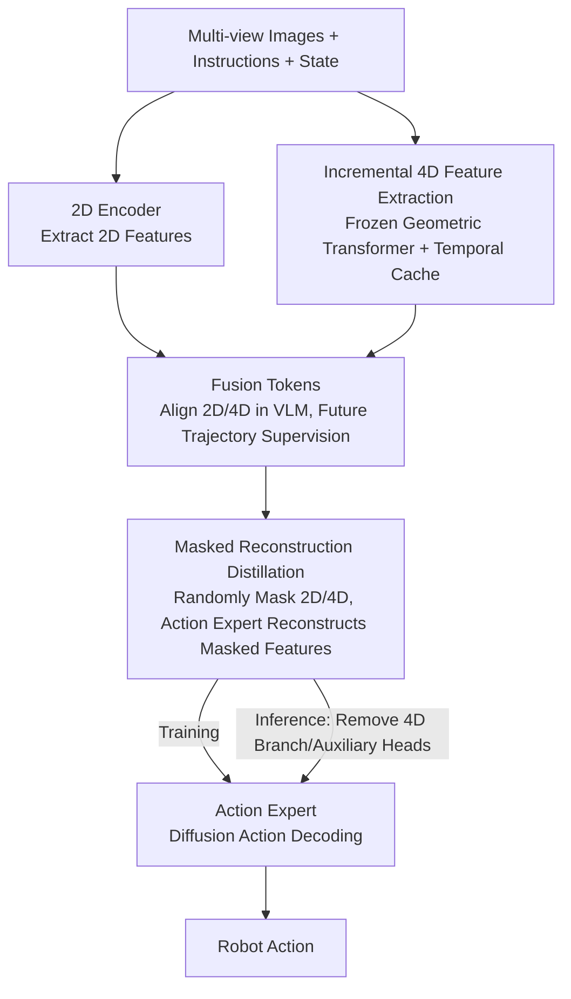

# SwiftVLA: Unlocking Spatiotemporal Dynamics for Lightweight VLA Models at Minimal Overhead

**Conference**: CVPR 2026  
**Paper**: [CVF Open Access](https://openaccess.thecvf.com/content/CVPR2026/html/Ni_SwiftVLA_Unlocking_Spatiotemporal_Dynamics_for_Lightweight_VLA_Models_at_Minimal_CVPR_2026_paper.html)  
**Code**: None (Project page only: https://Swiftvla.github.io)  
**Area**: Robotics / Embodied AI  
**Keywords**: VLA, Lightweight, 4D Spatiotemporal Features, Masked Reconstruction, Edge Deployment

## TL;DR
SwiftVLA enables a 0.45B lightweight VLA to "borrow" 4D spatiotemporal features during training to learn geometric and dynamic reasoning. These insights are distilled into the 2D branch via masked reconstruction, allowing the 4D module to be discarded at inference. On edge devices, it runs $18\times$ faster and saves $12\times$ VRAM compared to $\pi0$, while achieving success rates comparable to models with $7\times$ more parameters.

## Background & Motivation
**Background**: Vision-Language-Action (VLA) models map the reasoning capabilities of pretrained VLMs directly to robotic actions, serving as the current mainstream paradigm for embodied manipulation (e.g., OpenVLA, $\pi0$). However, these backbones typically range from 3B to 7B parameters, making real-time control difficult on resource-constrained platforms like robotic arms due to high inference latency and VRAM consumption.

**Limitations of Prior Work**: To enable edge deployment, researchers have attempted to downsize VLMs (e.g., SmolVLA reduced to 0.5B by skipping layers). However, as the backbone shrinks, spatial reasoning capabilities collapse. As shown in Fig.1 of the paper, while PaliGemma-3B correctly identifies the color of the leftmost bowl, SmolVLM-0.5B fails. Small models lack accurate 3D geometric perception, leading to precise grasping failures and coarse trajectories, resulting in significantly lower success rates than larger models.

**Key Challenge**: Injecting 3D/4D information could restore spatial awareness, but existing methods conflict with "lightweight" goals. One approach is **direct fusion** (3D-VLA, SpatialVLA, Evo-0), which feeds 3D features into the VLM. However, the domain gap between 2D pixels and 3D geometry is too large for small VLMs to align, necessitating large backbones. Another is **decoupled branches** (PointVLA, GeoVLA), which introduce a separate 3D expert branch, significantly increasing parameter overhead. Neither solves the fundamental tradeoff between "lightweight design $\leftrightarrow$ robust spatiotemporal perception." Furthermore, most neglect the temporal dimension; while 4D-VLA addresses this, it requires multi-frame sampling, further increasing inference overhead.

**Goal**: Inject 4D (3D space + time) spatiotemporal information into small VLMs while incurring zero additional 4D computational cost during inference.

**Key Insight**: 4D features can serve as "teachers during training" and do not need to be present during inference. If the 2D branch can internalize the geometric and dynamic knowledge inherent in 4D data during training, the entire 4D branch and its auxiliary heads can be removed at inference time.

**Core Idea**: Use a frozen 4D Geometric Transformer + temporal cache to incrementally extract 4D features as supervision signals. Use Fusion Tokens to align 2D/4D within the small VLM, and apply **masked reconstruction** to distill 4D knowledge into the model. At inference, only the 2D path remains with minimal performance degradation.

## Method

### Overall Architecture
SwiftVLA consists of two concatenated components: a lightweight VLM (SmolVLM-0.5B) and an action expert (a diffusion-based continuous action decoder, approx. 100M parameters, total model ~450M). At each timestep $t$, the robot receives a language instruction $l$, multi-view observations $o_t=\{o_t^v\}_{v \in S}$ (view order $S=[\text{left, right, front}]$), and proprioceptive state $s_t$.

The pipeline flows as follows: ① An image encoder extracts 2D features $F_{2D}^t$ from all views; ② A frozen pretrained 4D Geometric Transformer + temporal cache incrementally extracts 4D features $F_{4D}^t$; ③ A set of learnable Fusion Tokens $Q_f$ performs cross-attention with 2D/4D features and state/language embeddings within the VLM to produce a unified representation $Z_f^t = V(Q_f, E_s^t, E_l^t, F_{4D}^t, F_{2D}^t)$; ④ The Fusion Token outputs are decoded to predict future end-effector trajectories (providing supervision), while the VLM intermediate hidden states $\{h_V^{(i)}\}$ serve as hierarchical conditions for the action expert $A$ to generate actions. During training, **random masking** is applied: 2D or 4D features are randomly masked, and the action expert must reconstruct the masked features while generating actions. At inference, the 4D extractor, reconstruction heads, and trajectory heads are removed, leaving only the VLM and action expert.

### Key Designs

**1. Incremental 4D Feature Extraction: Rolling streaming frames into 4D via temporal cache without extra sensors**

The pain point is that while 3D/4D info aids spatial perception, existing methods rely on depth cameras/LiDAR or ignore time. SwiftVLA uses a **frozen** pretrained 4D visual geometric Transformer (encoder + spatiotemporal decoder + temporal cache) to incrementally extract 4D features from standard RGB images. At each step, views are encoded as $F_e^{t,v}=\text{Encoder}(o_t^v)$ and fed into the decoder: spatial attention captures intra-view geometry, while temporal attention allows the current features to cross-attend with the **temporal cache** to inject historical context. Decoding proceeds per view $k \in \{1,2,3\}$: $(F_{4D}^{t,v}, C^{t,k}) = \text{Decoder}(\text{CrossAttn}(F_e^{t,v}, C^{t,k-1}))$, where the cache is initialized as $C^{t,0}=C^{t-1}$ and updated to $C^t=C^{t,3}$ after all views. The cache uses **FIFO** to retain only the last $K$ 4D representations. To save training cost, only front-view 4D features $F_{4D}^t=F_{4D}^{t,\text{front}}$ are fed to the VLM; left/right views are used only to update the cache for richer spatiotemporal context. This step is the "knowledge source" for subsequent distillation.

**2. Fusion Tokens: Leveraging tokens + future trajectory supervision to drive 2D/4D fusion in small VLMs**

Small VLMs struggle to naturally merge 2D and 4D into a 3D-aware latent space; previous works feeding 3D into VLMs assumed a large backbone for alignment. SwiftVLA introduces learnable Fusion Tokens $Q_f$ that perform cross-attention with the aggregated multimodal sequence (2D features $F_{2D}^t$, 4D features $F_{4D}^t$, language $E_l^t$, state $E_s^t$) to produce $Z_f^t$ (Eq.1). The **supervision signal** is crucial: the future trajectory of the robot end-effector is directly predicted from the Fusion Token outputs—$\hat{\tau}_t = h_{\text{traj}}(Z_f^t)$, $L_{\text{traj}}=\|\hat{\tau}_t-\tau_t\|_2^2$. This "predict where I go next" task aligns multimodal features with spatiotemporal semantics, forcing the small model to utilize 4D geometric cues rather than ignoring them as noise, thereby making the condition signals $h_V^{(i)}$ more effective for action generation. Ablations show Fusion Tokens increase Success Rate (SR) from 0.40 to 0.50.

**3. Masked Reconstruction Distillation: Borrowing 4D for training, discarding 4D for inference**

Even with Fusion Tokens, the 4D branch's parameters and computation contradict "lightweight" goals. SwiftVLA treats 4D as a training-time distillation target rather than a permanent inference input. During training, **2D or 4D features are randomly masked**. Masked modalities do not participate in action generation, but the action expert's latent variable $Z_A^t$ must reconstruct the masked features: $L_{2D}=\|h_{2D}(Z_A^t)-F_{2D}^t\|_2$, $L_{4D}=\|h_{4D}(Z_A^t)-F_{4D}^t\|_2$ (Eq.7). Action generation is supervised by diffusion noise prediction $L_{\text{action}}=\mathbb{E}_{\epsilon}\|h_{\text{action}}(Z_A^t)-\epsilon\|_2^2$ (Eq.8). The total loss is a weighted sum: $L_{\text{total}}=\lambda_{2D}L_{2D}+\lambda_{4D}L_{4D}+\lambda_{\text{action}}L_{\text{action}}+\lambda_{\text{traj}}L_{\text{traj}}$. This forces the model to **implicitly reconstruct and reason about 4D spatial structures** even without explicit 4D input, internalizing geometric and dynamic knowledge into the 2D branch. At inference, all 4D-related components are removed. Ablations (Tab.6) show that discarding 4D without this strategy drops SR to 0.02, while the full strategy achieves 0.53, nearly matching the 0.55 achieved with 4D input.

### Loss & Training
The total loss is $L_{\text{total}}=\lambda_{2D}L_{2D}+\lambda_{4D}L_{4D}+\lambda_{\text{action}}L_{\text{action}}+\lambda_{\text{traj}}L_{\text{traj}}$. The backbone is SmolVLM, totaling ~450M parameters (Action Expert ~100M). A two-stage training process was conducted on public datasets. The cache size $K$ performed best when sampled randomly from $\{3,4,5,6\}$ during training.

## Key Experimental Results

### Main Results (RoboTwin 2.0 Simulation, Success Rate SR↑ / Trajectory Length↓)

| Method | Parameters | Avg. SR ↑ | Avg. Length ↓ |
| :--- | :--- | :--- | :--- |
| $\pi0$ | 3B | 0.47 | 152 |
| GO-1 | — | 0.46 | 158 |
| TinyVLA | — | 0.07 | 220 |
| SmolVLA | 0.45B | 0.29 | 188 |
| SmolVLA† (Same Pretrain+FT) | 0.45B | 0.36 | 163 |
| **SwiftVLA (No 4D at Inference)** | 0.45B | **0.53** | **150** |
| SwiftVLA with 4D input | 1.65B | 0.55 | 143 |

SwiftVLA matches or exceeds $\pi0$ using only ~15% of its parameters. Compared to SmolVLA, it achieves an 82.76% relative gain in SR. On the LIBERO benchmark (Tab.3), SwiftVLA (0.45B) scores 94.7, outperforming $\pi0$ (94.1) and GR00T-N1 (93.9), while significantly beating SmolVLA (87.3).

### Real Robot + Edge Deployment

| Platform / Experiment | Metric | SwiftVLA | $\pi0$ | SmolVLA |
| :--- | :--- | :--- | :--- | :--- |
| AgileX Arm (Real, Avg. SR) | SR ↑ | 0.80 | 0.61 | 0.34 |
| Jetson Orin Inference Time | s ↓ | 0.167 | 2.966 | 0.166 |
| Jetson Orin VRAM | MB ↓ | 1398.4 | 16236.2 | 1397.5 |
| Jetson Orin Avg. SR | SR ↑ | 0.76 | 0.48 | 0.30 |

On edge hardware, SwiftVLA is approx. $18\times$ faster and saves $12\times$ VRAM compared to $\pi0$, with latency nearly identical to SmolVLA but with much higher SR (0.76 vs 0.30 and 0.48).

### Ablation Study

| Configuration | Avg. SR | Description |
| :--- | :--- | :--- |
| 2D Only | 0.36 | No 4D, weak spatial reasoning |
| 2D & 4D (No Fusion Tokens) | 0.40 | Small model fails to leverage 4D |
| 2D & 4D + Fusion Tokens | 0.50 | Task supervision enables 4D utility |

Masked Reconstruction Strategy (Inference using 2D only, Tab.6):

| 4D Mask | 2D Mask | Feature Recon | SwiftVLA (No 4D Inf) | with 4D |
| :---: | :---: | :---: | :---: | :---: |
| ✗ | ✗ | ✗ | 0.02 | 0.50 |
| ✓ | ✗ | ✗ | 0.40 | 0.48 |
| ✓ | ✓ | ✗ | 0.50 | 0.52 |
| ✓ | ✓ | ✓ | **0.53** | **0.55** |

### Key Findings
- **Masked reconstruction is the lifeline for "discarding 4D"**: Removing 4D without this strategy causes SR to crash from 0.50 to 0.02; the full strategy maintains 0.53.
- **Small models require task guidance to use 4D**: Simply feeding 4D only yields a +0.04 gain; adding future trajectory supervision jumps it to 0.50.
- **Moderate 2D masking enhances 4D utility**: An intuitive regularization trick that forces consistency.
- **Random cache length is superior**: Exposure to various time horizons during training improves robustness.

## Highlights & Insights
- **The "Borrow 4D for Training, Discard for Inference" paradigm is elegant**: Treating an expensive 4D Transformer as a temporary teacher to compress knowledge into a small model is a transferable strategy for any scenario where auxiliary modalities are costly at deployment.
- **Future trajectory as alignment supervision is clever**: It provides a concrete, task-relevant goal for Fusion Tokens, ensuring the small model doesn't treat 4D as noise.
- **Incremental temporal cache + FIFO** allows 4D extraction to reuse historical frames, making "time" accessible to small VLAs at a low cost.
- The most impactful observation: The jump from SR 0.02 to 0.53 demonstrates that the method is not just an incremental improvement but the key enabler for making 4D-informed lightweight VLAs viable.

## Limitations & Future Work
- **Dependency on a pretrained 4D Geometric Transformer**: The quality of this frozen module sets the distillation ceiling; its robustness in highly cluttered or dynamic environments remains underexplored.
- Hyperparameter values ($\lambda$) and two-stage training details are in the appendix, which may hinder immediate reproducibility from the main text alone.
- Real-world experiments focused on structured tasks like tabletop picking; performance in contact-rich or long-horizon tasks requires further validation.
- While inference is streamlined, training costs (running the 4D Transformer + multiple heads) remain relatively high.

## Related Work & Insights
- **vs. Direct Fusion (3D-VLA / SpatialVLA / Evo-0)**: These require large VLMs to align domain gaps; SwiftVLA distills 4D via reconstruction, allowing 4D to be discarded entirely at inference.
- **vs. Decoupled Branches (PointVLA / GeoVLA)**: These retain separate 3D expert branches (high parameter count) and often ignore time; SwiftVLA removes the branch and explicitly models the temporal dimension.
- **vs. 4D-VLA**: 4D-VLA relies on multi-keyframe sampling during inference; SwiftVLA shifts the cost of temporal information to the training side.
- **vs. Lightweight Models (SmolVLA / TinyVLA)**: These prioritize speed but sacrifice spatial reasoning; SwiftVLA recovers spatial awareness using the same parameter budget.

## Rating
- Novelty: ⭐⭐⭐⭐ The combination of masked reconstruction and distillation to allow "discarding 4D" is highly effective and cleanly executed.
- Experimental Thoroughness: ⭐⭐⭐⭐⭐ Comprehensive coverage across simulation (RoboTwin + LIBERO), real robots, and edge devices with four detailed ablation sets.
- Writing Quality: ⭐⭐⭐⭐ Clear motivation and illustrations, though some critical training details are deferred to the appendix.
- Value: ⭐⭐⭐⭐⭐ Bringing $18\times$ speedup and $12\times$ VRAM savings while matching much larger models has direct value for practical robot deployment.

<!-- RELATED:START -->

## Related Papers

- [\[CVPR 2026\] AtomicVLA: Unlocking the Potential of Atomic Skill Learning in Robots](atomicvla_unlocking_the_potential_of_atomic_skill_learning_in_robots.md)
- [\[CVPR 2026\] ACoT-VLA: Action Chain-of-Thought for Vision-Language-Action Models](acot-vla_action_chain-of-thought_for_vision-language-action_models.md)
- [\[CVPR 2026\] VLA Models Are More Generalizable Than You Think: Revisiting Physical and Spatial Modeling](vla_models_are_more_generalizable_than_you_think_revisiting_physical_and_spatial.md)
- [\[CVPR 2026\] AT-VLA: Adaptive Tactile Injection for Enhanced Feedback Reaction in Vision-Language-Action Models](at-vla_adaptive_tactile_injection_for_enhanced_feedback_reaction_in_vision-langu.md)
- [\[CVPR 2026\] Contact-Aware Neural Dynamics](contact-aware_neural_dynamics.md)

<!-- RELATED:END -->
