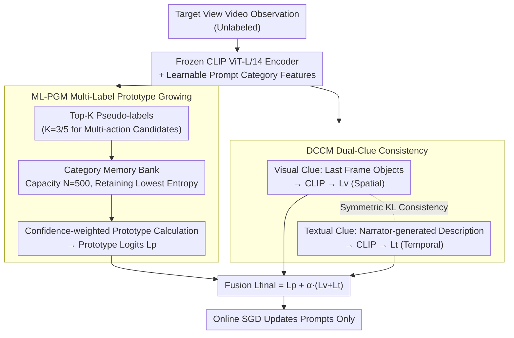

# Test-time Ego-Exo-centric Adaptation for Action Anticipation via Multi-Label Prototype Growing and Dual-Clue Consistency

**Conference**: CVPR2026  
**arXiv**: [2603.09798](https://arxiv.org/abs/2603.09798)  
**Code**: [ZhaofengSHI/DCPGN](https://github.com/ZhaofengSHI/DCPGN)  
**Area**: Robotics / Ego-Exo View Adaptation  
**Keywords**: test-time adaptation, Ego-Exo, Action Anticipation, Multi-Label, Prototype Learning, CLIP, Dual-Clue Consistency

## TL;DR

This work identifies the Test-time Ego-Exo Adaptation for Action Anticipation (TE2A3) task for the first time. It proposes the DCPGN network, which utilizes multi-label prototype growing and dual-clue (visual + textual) consistency to adapt a model trained on a source view to a target view online during inference, significantly outperforming existing TTA methods.

## Background & Motivation

1.  **Human Cross-view Capability**: Humans possess the ability to seamlessly switch between egocentric (Ego) and exocentric (Exo) perspectives to anticipate subsequent actions via mirror neurons, a capability crucial for human-robot collaboration and embodied AI.
2.  **Existing Methods Dependency**: Most Ego-Exo adaptation methods (pre-training/fine-tuning or UDA) require target view data during the training phase, incurring extra computational and data collection costs.
3.  **Cross-view Failure**: Action recognition/anticipation models trained on one perspective suffer significant performance degradation when applied to another due to substantial differences in camera angles and styles.
4.  **Opportunities for Test-time Adaptation (TTA)**: TTA methods adjust models online without target labeling. However, existing TTA methods are designed for single-label tasks and struggle with multiple action candidates.
5.  **Multi-action Candidate Challenge**: Real-world events often involve multiple atomic actions to be predicted simultaneously. Entropy-based TTA methods tend to favor a single category with the highest confidence, leading to suboptimal performance.
6.  **Ego-Exo Spatio-temporal Gap**: Significant discrepancies exist between the two views in the spatial dimension (inconsistent layouts and distracting objects) and the temporal dimension (asynchronous action progress). Simple domain adaptation struggles to bridge this gap.

## Method

### Overall Architecture

DCPGN (Dual-Clue enhanced Prototype Growing Network) adapts a pre-trained source-view action anticipation model to a target view during the test phase without any target labels. It freezes the CLIP ViT-L/14 visual encoder and only updates learnable prompts and category prototypes online. Two collaborative components are employed: ML-PGM progressively accumulates multi-label knowledge to learn unbiased prototypes, while DCCM fuses visual and textual clues for consistency constraints. Both paths produce logits that are fused into the final prediction. In the training phase, BCE loss is used on labeled source data; in the test phase, only the learnable prompts are optimized via online SGD.

### Key Designs

**1. Multi-Label Prototype Growing (ML-PGM): Ensuring Multi-action Pseudo-labels**

Real-world events often contain concurrent atomic actions, but entropy-based TTA methods naturally bias toward single high-confidence categories, causing combinations like "cutting vegetables + taking a bowl" to be compressed into one class. ML-PGM adopts multi-labeling by taking the Top-K predicted logits as pseudo-labels ($K=3$ for EgoMe-anti, $K=5$ for EgoExoLearn), preventing overconfidence. To ensure prototype reliability, a memory bank of capacity $N=500$ is maintained for each category. When full, only the $N$ samples with the lowest entropy (highest certainty) are retained, increasing sample quality over time. Prototypes are then calculated as weighted sums of features using normalized confidence $p_i^T = \sum_{k=1}^{N'} \eta(l_{i,k}^T)\cdot\bar{f}_{v,k}^T$ to suppress negative noise. Prototype logits $L_p$ are derived from the similarity between test sample features and category prototypes.

**2. Dual-Clue Consistency (DCCM): Cross-calibration via Spatial and Temporal Clues**

Ego and Exo views exhibit both spatial gaps (layout/distractor inconsistencies) and temporal gaps (asynchronous progress). DCCM utilizes two clues: visual clues from the last frame containing object information (spatial), and textual clues from a lightweight narrator (GRU+Attention, pre-trained on video-text pairs and frozen during testing) that generates descriptions as temporal indicators of action progress. Both clues are encoded via frozen CLIP to obtain similarity scores $L_v$ and $L_t$. A symmetric KL divergence $L_C = \mathrm{KL}(P_v \| P_t) + \mathrm{KL}(P_t \| P_v)$ is applied to their softmax distributions to enforce cross-modal consistency. This explicitly bridges the Ego-Exo spatio-temporal gap by aligning "what objects are seen" with "at what stage is the action."

### Loss & Training

The three paths of logits are fused for the final prediction:

$$L_{final} = L_p + \alpha \cdot (L_v + L_t), \quad \alpha = 0.5$$

During the test phase, only the learnable prompts are updated online using SGD, without requiring data augmentation.

## Key Experimental Results

### Main Results (class-mean Top-5 recall)

| Method | EgoMe-anti Exo2Ego Noun/Verb | EgoMe-anti Ego2Exo Noun/Verb | EgoExoLearn Exo2Ego Noun/Verb | EgoExoLearn Ego2Exo Noun/Verb |
|---|---|---|---|---|
| No Adaptation | 71.94 / 32.46 | 64.24 / 30.07 | 31.91 / 34.36 | 35.28 / 33.03 |
| ML-TTA | 77.11 / 36.92 | 69.46 / 34.39 | 36.35 / 37.67 | 42.96 / 40.43 |
| **DCPGN (Ours)** | **79.03 / 43.84** | **72.01 / 40.10** | **46.26 / 42.98** | **48.48 / 46.51** |

On EgoExoLearn Exo2Ego, DCPGN outperforms ML-TTA by **9.91%** on Noun and **5.31%** on Verb.

### Ablation Study

| Configuration | EgoMe-anti E2E Noun | EgoExoLearn E2E Noun |
|---|---|---|
| Full DCPGN | 79.03 | 46.26 |
| w/o $L_C$ Consistency Loss | 78.67 (-0.36) | 44.80 (-1.46) |
| w/o Visual Clues | 76.92 (-2.11) | 41.32 (-4.94) |
| w/o Textual Clues | 77.56 (-1.47) | 41.94 (-4.32) |
| w/o Entire DCCM | 76.11 (-2.92) | 38.43 (-7.83) |
| w/o Confidence Weighting | 74.63 (-4.40) | 37.76 (-8.50) |
| Single-label Assignment Only | 72.74 (-6.29) | 34.70 (-11.56) |

Key Findings: Visual clues are more critical for Noun prediction, while textual clues are more vital for Verb prediction. Multi-label assignment provides a massive improvement over single-label assignment.

### Model Complexity

| Component | FLOPs (G) | Params (MB) |
|---|---|---|
| Baseline | 367.55 | 251.18 |
| ML-PGM | +0.00 | +8.54 |
| Narrator | +0.03 | +2.38 |
| Textual Clue Encoding | +4.06 | +54.04 |

ML-PGM adds almost zero computational overhead, and the narrator is extremely lightweight.

## Highlights & Insights

1.  **Pioneering TE2A3 Task**: First to introduce TTA to Ego-Exo cross-view action anticipation, eliminating the need for target view training data.
2.  **Multi-label Prototype Growing**: Effectively balances multi-action candidates using Top-K pseudo-labeling, entropy-based priority queues, and confidence weighting.
3.  **Complementary Dual-Clue Design**: Visual clues capture spatial object information while textual clues capture temporal progress, bridging the Ego-Exo gap via KL divergence consistency.
4.  **New Benchmark EgoMe-anti**: Constructs a new benchmark suitable for this task based on the EgoMe dataset.
5.  **Significant Performance Gain**: Surpasses the second-best method by 9.91% in Noun recall on EgoExoLearn, supported by thorough experiments and in-depth analysis.

## Limitations & Future Work

1.  **Narrator Dependency**: The narrator requires pre-training on open-source video-text pairs, adding an external dependency.
2.  **Manual K Selection**: Optimal K values differ across datasets (3 vs. 5), indicating a lack of adaptive selection mechanisms.
3.  **Fixed Memory Bank Capacity**: $N=500$ is a manual setting that might be suboptimal for classes with varying data distributions.
4.  **Categorization Focus**: Evaluation is limited to Noun/Verb classification and does not address fine-grained temporal localization or complete event prediction.
5.  **Real-time Analysis Missing**: Although "online adaptation" is claimed, inference latency and practical deployment feasibility are not explicitly reported.

## Related Work & Insights

-   **vs. Traditional TTA (Tent/TPT/TDA)**: These methods target single-label tasks and over-bias toward high-confidence categories in multi-action scenarios; DCPGN's multi-label mechanism resolves this fundamental limitation.
-   **vs. ML-TTA**: ML-TTA targets image-level classification; it lacks video-level spatio-temporal modeling and the capability to handle specific Ego-Exo disparities.
-   **vs. UDA Methods (Sync, GCEAN)**: UDA methods require access to unlabeled target view data during training, whereas DCPGN adapts completely online during the test phase.
-   **vs. Pre-training & Fine-tuning (AE2, Exo2EgoDVC)**: These require labeled target view data for fine-tuning, which DCPGN avoids.

## Rating

-   Novelty: ⭐⭐⭐⭐ — Innovative introduction of the TE2A3 task and combination of multi-label prototypes with dual-clue consistency.
-   Experimental Thoroughness: ⭐⭐⭐⭐⭐ — Validated across two benchmarks and four settings with extensive ablation and visualization.
-   Writing Quality: ⭐⭐⭐⭐ — Clear problem definition, standardized methodology description, and high-quality figures.
-   Value: ⭐⭐⭐⭐ — Provides a practical paradigm for cross-view online adaptation in human-robot collaboration and embodied AI.

<!-- RELATED:START -->

## Related Papers

- [\[CVPR 2026\] Test-time Sparsity for Extreme Fast Action Diffusion](test-time_sparsity_for_extreme_fast_action_diffusion.md)
- [\[CVPR 2026\] Learning a Unified Latent Action Space from Videos with Action-centric Cycle Consistency](learning_a_unified_latent_action_space_from_videos_with_action-centric_cycle_con.md)
- [\[CVPR 2026\] Test-Time Perturbation Tuning with Delayed Feedback for Vision-Language-Action Models](test-time_perturbation_tuning_with_delayed_feedback_for_vision-language-action_m.md)
- [\[CVPR 2026\] Global Prior Meets Local Consistency: Dual-Memory Augmented Vision-Language-Action Model for Efficient Robotic Manipulation](global_prior_meets_local_consistency_dual-memory_augmented_vision-language-actio.md)
- [\[ICCV 2025\] PacGDC: Label-Efficient Generalizable Depth Completion with Projection Ambiguity and Consistency](../../ICCV2025/robotics/pacgdc_label-efficient_generalizable_depth_completion_with_projection_ambiguity_.md)

<!-- RELATED:END -->
