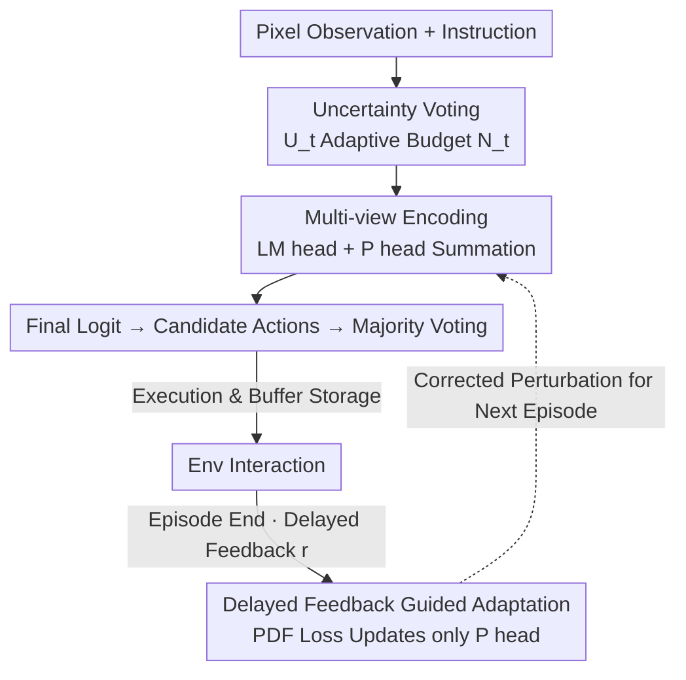

# Test-Time Perturbation Tuning with Delayed Feedback for Vision-Language-Action Models

**Conference**: CVPR 2026  
**Paper**: [CVF Open Access](https://openaccess.thecvf.com/content/CVPR2026/html/Zang_Test-Time_Perturbation_Tuning_with_Delayed_Feedback_for_Vision-Language-Action_Models_CVPR_2026_paper.html)  
**Code**: https://github.com/zhoujiahuan1991/CVPR2026-PDF  
**Area**: Robotics / Embodied AI / VLA  
**Keywords**: Vision-Language-Action Models, Test-Time Adaptation, Trajectory Overfitting, Delayed Feedback, Data Augmentation

## TL;DR
To address the "trajectory overfitting" problem where VLAs fail under minute object pose variations, this paper proposes PDF—a verifier-free test-time adaptation framework that keeps the backbone frozen. It employs uncertainty-driven adaptive data augmentation and multi-view voting to suppress spurious correlations, combined with a lightweight perturbation head trained via delayed feedback after episode completion to correct model overconfidence. PDF achieves a +7.4% success rate on LIBERO and +0.10 Human Normalized Score (HNS) on Atari.

## Background & Motivation
**Background**: Vision-Language-Action (VLA) models (e.g., OpenVLA, Gato/Jat, RT-2) jointly model vision, language, and action, translating instructions into executable actions through multimodal pre-training, representing a prototype of general embodied intelligence for robot manipulation and pixel control tasks.

**Limitations of Prior Work**: These models are exceptionally fragile to **semantically insignificant environmental changes**—such as slight shifts in object poses, which lead to sharp drops in success rates. Diagnostic experiments reveal an interesting behavioral bias: when tasked to pick up a bowl, a robot might miss but continue moving toward the plate; even if the target bowl is masked, the robot reproduces almost the same trajectory. This suggests the policy is reciting training trajectories rather than making decisions based on target observations.

**Key Challenge**: The authors identify this failure mode as **trajectory overfitting**—VLAs memorize trajectory-specific visual/contextual patterns (gripper appearance, background textures) associated with success during training. Spurious correlations between "actions" and "entities" are treated as decision cues rather than true task semantics. Once the test input resembles a historical trajectory, the model simply replicates suboptimal memorized actions.

**Limitations of Existing Solutions**: Test-Time Adaptation (TTA) is a natural mitigation. However, **verifier-based TTA** (e.g., RoboMonkey, VGPS) requires pre-training a scorer and performing repeated rollouts, which is costly and hard to generalize. **Verifier-free TTA** methods rely on self-supervised confidence metrics like entropy minimization—but when the model is miscalibrated (overconfident in incorrect actions), entropy minimization **further amplifies erroneous logits**, pushing the model toward confident but wrong decisions.

**Key Insight**: Controlled **data augmentation** on pixel observations can redirect the gripper's attention back to the target and restore correct execution (Fig.1d). This shows that perturbing the input distribution can break trajectory overfitting. Furthermore, **delayed feedback** (success/failure/cumulative reward) provided by the environment after an episode is a more reliable supervisory signal than self-supervised confidence, albeit reaching the model late.

**Core Idea**: Use "uncertainty-driven data augmentation + voting" to break spurious correlations online, followed by "training a lightweight perturbation head with delayed feedback" to retrospectively correct overconfident action logits—all while freezing the VLA backbone without fine-tuning or verifiers.

## Method

### Overall Architecture
PDF (Perturbation learning with Delayed Feedback) is a **plug-and-play, verifier-free** TTA framework that **does not update backbone parameters**. It forms a closed loop of "online decision-making + offline backtracking" via two components.

Online Phase: At each time step $t$, the VLA receives pixel observations $o_t$ and instructions $c_t$. It first estimates the **action logit uncertainty** $U_t$ to adaptively allocate an augmentation budget $N_t$. Original and augmented observations are encoded into multimodal features $f_t$ and fed into two parallel heads: the LM head generates decision logits, and the perturbation head (P head) generates logit perturbations. Their sum forms the final logits, which are detokenized into candidate actions. The final action $a_t$ is selected via **majority voting**. Features and voted logits are stored in a rollout buffer $D$.

Offline Phase: After an episode, the environment provides delayed feedback $r$. A batch is sampled from the buffer, and the PDF loss (comprising a REINFORCE term + gated KL regularization) is used to **update only the P head**. All VLA parameters (vision encoder, token embedding, causal transformer, LM head) remain frozen. This allows expensive but reliable environmental feedback to be incorporated into the next episode's decision-making at a minimal cost (9M trainable parameters, no backbone gradients).

### Key Designs

**1. Uncertainty-Driven Action Voting: Allocating budget only to "uncertain" steps**

Applying extensive data augmentation to every step suppresses overfitting but incurs significant inference overhead. Since **a single high-uncertainty action can cause task failure**, PDF quantifies step-wise prediction uncertainty as the normalized Shannon entropy of the action distribution:

$$U_t = -\frac{1}{\log K}\sum_{k=1}^{K} p(a_k \mid s_k)\log p(a_k \mid s_k)$$

where $K$ is the number of action tokens and $p(a_t = a_k \mid s_t) = \mathrm{softmax}(z_t)_k$. The augmentation budget is determined adaptively: $N_t = N_{\max}\cdot U_t$. Higher uncertainty leads to more augmented views. The original observation $o_t$ and $N_t$ augmented views $\{T_j(o_t)\}$ are encoded to produce candidate actions for majority voting. This prioritizes computational resources for uncertain steps and breaks the reliance on single memorized trajectories. $N_{\max}=3$ is sufficient; larger budgets introduce noise.

**2. Delayed Feedback-Guided P-head Adaptation: Retrospective correction of overconfidence**

To overcome the failure of entropy minimization in miscalibrated models, PDF utilizes delayed feedback $r$ from the environment. A learnable perturbation term is added to the final logits:

$$\tilde{z}_t = h_\phi(f_t) + \lambda h_\theta(f_t)$$

where $h_\phi$ is the frozen LM head and $h_\theta$ is the **trainable** perturbation head (P head). After receiving $r$, the P head is updated using:

$$L_{PDF} = -(r-b)\log\pi_\phi + \lambda_{KL}\,\mathbb{I}[r>b]\,\mathrm{KL}(\pi_\phi \,\|\, \tilde{\pi})$$

The REINFORCE-style term increases the likelihood of actions when $r$ exceed a baseline $b$. The KL regularization is **gated by the indicator function** $\mathbb{I}[r>b]$, stabilizing updates only during positive feedback. When $r \le b$, the KL constraint is disabled to allow for exploration. This ground-truth signal enables the correction of overconfidence that self-supervised signals cannot address.

*(Note: The original text notation for $\pi_\phi$ and $\tilde{\pi}$ might contain a typo; the mechanism aims to maximize the likelihood of the perturbation policy while regularizing it).*

### Loss & Training
The objective is $L_{PDF}$. Only the P head $h_\theta$ (9M parameters) is optimized at the end of each episode using batches from the buffer. All VLA parameters are frozen. For LIBERO, OpenVLA is the base; for Atari, Jat (Gato implementation) is used. Models are evaluated after 50 training episodes on a Tesla V100.

## Key Experimental Results

### Main Results (LIBERO Success Rate)

| Method | Venue | Params | Spatial | Object | Goal | Long | Avg. SR↑ | Avg. Rank↓ |
|------|------|------|---------|--------|------|------|----------|-----------|
| OpenVLA† | CoRL'24 | - | 0.85 | 0.64 | 0.76 | 0.53 | 0.69 | 5.8 |
| TraceVLA | ICLR'25 | 130M | 0.85 | 0.85 | 0.75 | 0.54 | 0.75 | 6.5 |
| OpenVLA-DPO | Arxiv'25 | 130M | 0.84 | 0.89 | 0.79 | 0.53 | 0.76 | 4 |
| SFT-4LIBERO | Arxiv'25 | 130M | 0.85 | 0.87 | 0.77 | 0.55 | 0.76 | 3.5 |
| MG-Select | Arxiv'25 | 130M | 0.82 | 0.73 | 0.73 | 0.55 | 0.71 | 6 |
| **PDF (Ours)** | - | **9M** | **0.90** | 0.72 | **0.86** | **0.59** | **0.77** | **2.5** |

PDF achieves the best average success rate (0.77) and rank (2.5) with the fewest trainable parameters (9M vs 93–130M). Long-horizon tasks show the most significant improvement (+0.04 over the strongest baseline). On Atari-57, HNS reaches 1.07 (vs. 0.97 for Jat base), with improvements in 47 out of 57 games.

### Ablation Study

**Component Ablation (DA = Data Augmentation, DF = Delayed Feedback, LIBERO)**

| Configuration | Key Performance | Note |
|------|---------|------|
| OpenVLA (baseline) | Low | No TTA |
| PDF w/o DA | Above baseline | Perturbation learning without augmentation |
| PDF w/o DF | Drop in Object (0.50) & Goal (0.77) | Voting only, significant drop |
| **PDF (Full)** | Highest Average | DA + DF Synergy |

**Loss Term Ablation (HNS / SR across benchmarks)**

| Configuration | Atari | Spatial | Object | Goal | Long |
|------|-------|---------|--------|------|------|
| OpenVLA | 0.97 | 0.85 | 0.62 | 0.82 | 0.56 |
| w/o KL | 1.04 | 0.86 | 0.65 | 0.82 | 0.57 |
| w/o RE | 0.96 | 0.89 | 0.69 | 0.85 | 0.58 |
| **PDF (Full)** | **1.07** | **0.89** | **0.72** | **0.86** | **0.59** |

### Key Findings
- **DF is critical for robustness**: Removing delayed feedback leads to sharp declines in Object and Goal tasks, suggesting that target-conditioned manipulation relies heavily on real feedback for correction.
- **KL Regularization provides stability**: Removing the KL term impacts results more significantly than removing the REINFORCE term, highlighting its role in stabilizing test-time updates.
- **Budget constraints prevent noise**: Increasing the augmentation budget beyond 3 leads to performance drops across benchmarks due to noise accumulation.

## Highlights & Insights
- **Diagnosis of "Trajectory Overfitting"**: The masking experiment (robot reproducing actions without the target) provides a solid foundation for the paper's motivation.
- **Uncertainty as a "Budget Allocator"**: Using Shannon entropy as a continuous dial for augmentation efficiently balances computational cost and decision insurance.
- **Transferable Paradigm**: The combination of delayed feedback, frozen backbone, and lightweight perturbation head is applicable to any agent scenario with sparse episode-level rewards.
- **Efficiency**: Achieving SOTA performance while freezing the backbone and training only 9M parameters is highly beneficial for resource-constrained deployments compared to 130M parameter baselines.

## Limitations & Future Work
- **Dependency on Feedback**: The method assumes success/failure rewards are available. In environments with zero or extremely noisy feedback, the DF component might revert to basic voting.
- **Weakness in "Object" Suite**: Performance on the Object suite (0.72) lags behind some baselines; possibly due to less severe spurious correlation in those specific tasks.
- **Coarse Credit Assignment**: Feedback is episode-level, which might dilute the correction signal in long-horizon tasks where only specific steps were responsible for failure.
- **Fixed Augmentations**: Augmentation types $T$ are manually set; adaptive selection of augmentation types based on tasks remains unexplored.

## Related Work & Insights
- **vs. Verifier-based TTA (RoboMonkey / VGPS)**: PDF eliminates the need for an external scorer and best-of-N rollouts, making it significantly cheaper and more generalizable.
- **vs. Verifier-free TTA (MG-Select)**: Unlike methods relying on self-supervised metrics that fail under miscalibration, PDF uses real feedback to bypass the "unreliable signal" trap.
- **vs. Fine-tuning (OpenVLA-DPO / SFT-4LIBERO)**: PDF avoids updating 130M parameters, reaching comparable or superior performance by training only a 9M parameter head.

## Rating
- Novelty: ⭐⭐⭐⭐ Trajectory overfitting diagnosis combined with delayed feedback for TTA is a fresh perspective.
- Experimental Thoroughness: ⭐⭐⭐⭐ Extensive testing on LIBERO and Atari with clear component ablations.
- Writing Quality: ⭐⭐⭐⭐ Clear motivation and diagnostic experiments; well-organized framework.
- Value: ⭐⭐⭐⭐ 9M parameter requirement and frozen backbone make it highly practical for embodied AI.

<!-- RELATED:START -->

## Related Papers

- [\[CVPR 2026\] Adaptive Action Chunking at Inference-time for Vision-Language-Action Models](adaptive_action_chunking_at_inference-time_for_vision-language-action_models.md)
- [\[CVPR 2026\] AT-VLA: Adaptive Tactile Injection for Enhanced Feedback Reaction in Vision-Language-Action Models](at-vla_adaptive_tactile_injection_for_enhanced_feedback_reaction_in_vision-langu.md)
- [\[ICML 2026\] Test-Time Training for Visual Foresight Vision-Language-Action Models](../../ICML2026/robotics/test-time_training_for_visual_foresight_vision-language-action_models.md)
- [\[ICLR 2026\] Verifier-Free Test-Time Sampling for Vision-Language-Action Models](../../ICLR2026/robotics/verifier-free_test-time_sampling_for_vision-language-action_models.md)
- [\[ICLR 2026\] VITA: Zero-Shot Value Functions via Test-Time Adaptation of Vision–Language Models](../../ICLR2026/robotics/vita_zero-shot_value_functions_via_test-time_adaptation_of_visionlanguage_models.md)

<!-- RELATED:END -->
