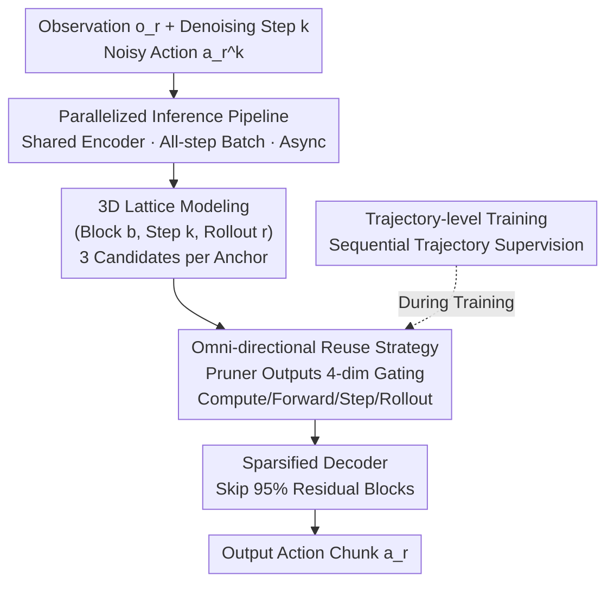

# Test-time Sparsity for Extreme Fast Action Diffusion

**Conference**: CVPR 2026  
**Paper**: [CVF Open Access](https://openaccess.thecvf.com/content/CVPR2026/html/Ji_Test-time_Sparsity_for_Extreme_Fast_Action_Diffusion_CVPR_2026_paper.html)  
**Code**: https://github.com/ky-ji/Test-time-Sparsity  
**Area**: Robotics / Embodied AI  
**Keywords**: Action Diffusion, Diffusion Policy, Inference Acceleration, Feature Reuse, Test-time Sparsity

## TL;DR
To address the slow iterative denoising issue in action diffusion policies (Diffusion Policy / VLA), this paper proposes "test-time sparsity": using a lightweight pruner to dynamically predict prunable residual blocks during each forward pass, combined with "omni-directional feature reuse" and a highly parallelized inference pipeline. It achieves lossless accuracy at 95% sparsity, reduces FLOPs by 92%, speeds up action generation by approximately 5x, and reaches an inference frequency of 47.5 Hz.

## Background & Motivation

**Background**: Action diffusion has become the primary module for generating action chunks in modern visual-motor policies (Diffusion Policy) and VLA models due to its ability to model multimodal action distributions, particularly for complex dexterous manipulation tasks.

**Limitations of Prior Work**: Diffusion inherently requires multiple iterative denoising steps, leading to low execution frequencies—Diffusion Policy runs at only 6 Hz and 3D Diffusion Policy at 5 Hz on consumer GPUs, which falls far short of the 30 Hz requirement for real-world robot tasks. Existing acceleration methods (reusing cached features) are mostly adapted from image diffusion: they either reuse partially denoised actions from the previous rollout or reuse intermediate features from the previous denoising step.

**Key Challenge**: These methods rely on **static scheduling** (e.g., updating cache at fixed intervals or using offline reuse plans), whereas policies in open environments are dynamic—multi-round interactions and changing perceptions mean that the "sparsity pattern" per forward pass is constantly evolving. Static scheduling fails to align with this dynamic evolution, resulting in either insufficient pruning or collapsed accuracy from over-pruning.

**Goal**: To make the acceleration schedule **dynamically adaptive to the policy** at test-time without introducing new overhead. Specifically, two bottlenecks must be addressed: ① repeating condition encoding and pruning prediction at each step consumes the time saved from decoder acceleration; ② under aggressive sparsity (95%), cached features from only the "previous denoising step" are insufficient to constrain massive pruning errors.

**Key Insight**: The authors observe high feature similarity between different rollout iterations (Fig. 6). Visualizing cached features from different directions relative to an anchor point shows they align well with the anchor and possess complementary advantages (different approximation angles and shorter latent distances, Fig. 7). This suggests that historical features contain much richer reusable information than a "single direction" provides.

**Core Idea**: A lightweight pruner with a shared encoder is used to **dynamically predict at test-time** whether each residual block should be computed or reused. The reuse source is expanded from "single direction" to "omni-directional" (current forward / previous timestep / previous rollout). A parallelized pipeline compresses the pruner and encoder overhead to millisecond levels.

## Method

### Overall Architecture

The action diffusion transformer consists of a condition encoder and a transformer decoder. The decoder takes noisy actions $a_r^k$ as tokens and refines them through $L$ layers (each containing Self-Attention SA, Cross-Attention CA, and Feed-Forward FFN residual blocks). The $l$-th layer update is a residual sum $h_k^l = h_k^{l-1} + \mathrm{SA}_k^l + \mathrm{CA}_k^l + \mathrm{FFN}_k^l$. Since a "block" is the smallest unit of residual computation, it serves as the **pruning target**—totaling $3L$ blocks for the decoder.

The methodology follows a "prune-then-reuse" paradigm: a parameterized pruner predicts which residual blocks to skip in each forward pass, replacing skipped blocks with cached features. Four components support this: ① A **parallelized inference pipeline** reducing non-decoder latency (encoding + pruning) to milliseconds; ② **Omni-directional reuse** constraining pruning errors at 95% sparsity using multi-source caches; ③ **3D lattice modeling** to efficiently organize vast historical features; ④ **Trajectory-level training** to supervise the learning of omni-directional reuse strategies.

### Key Designs

**1. Parallelized Inference Pipeline: Compressing pruner overhead from 182ms to 0.45ms**

The primary bottleneck in naive pruning is redundant operations within the auto-regressive denoising loop. While test-time pruning reduces decoder latency from 705ms to 95ms (at 95% sparsity), the pruner itself consumes 182ms per step, exceeding the savings. While "encoding all steps at once" decouples the loop, experiments (Fig. 5 loss curve) show pruner accuracy degrades significantly under all-step encoding, revealing a fundamental trade-off between efficiency and per-step accuracy.

Ours solves this by **bypassing the trade-off through batch parallelism**: the pruner is designed for a single step $k$ but implemented as a large-batch operation during inference. It first calculates sinusoidal position embeddings for all $K$ steps, then folds the time dimension $K$ into the batch dimension $N$ to feed an $N\times K$ tensor to the pruner in one forward pass, generating pruning masks for all steps simultaneously. This converts $K$ serial loops into one full-batch forward pass. Three additional techniques are used: ① The pruner **shares the condition encoder** with the diffusion transformer, saving 40ms; ② the pruner is a lightweight transformer decoder block where block indices are queries conditioned on the encoder output, followed by an MLP head for masks $M\in\{0,1\}^{3L}$; ③ **Asynchronous pipeline**: condition embeddings and masks are pre-calculated and stored in buffers, allowing the denoising loop to run only the decoder. Analysis shows the pruner skips almost all early steps after the first iteration (Fig. 4), so parallel threads for pruner and decoder overlapping further reduce overhead to 0.45ms.

**2. Omni-directional Reuse + 3D Lattice Modeling: Mitigating pruning error at 95% sparsity**

Reusing only the "previous timestep" cache leads to significant performance drops at high sparsity. Ours models the historical feature space as a **3D lattice** defined by three orthogonal axes: block index $b$, timestep $k$, and rollout iteration $r$. Each anchor feature sits at coordinates $(b,k,r)$. The "latest update" feature along each axis is retained—e.g., the cache from the previous rollout is at $(b,k,r-1)$. Thus, each anchor has three candidate caches (forward direction, timestep direction, and rollout direction). Globally, only three lightweight buffers are maintained, avoiding storage of 50k-200k raw historical features.

The choice of reuse is handled by the pruner: for block $b$ and step $k$, it outputs a 4D gating vector $p_{b,k}=(p^C_{b,k}, p^F_{b,k}, p^T_{b,k}, p^R_{b,k})$ representing confidence for "recompute / reuse forward / reuse timestep / reuse rollout." During inference, $M_{b,k}$ is obtained via $\arg\max$. The residual update is:

$$h_k^{\lfloor b/3\rfloor} = h_k^{\lfloor b/3\rfloor-1} + M^C_{b,k}d_{b,k} + M^F_{b,k}\delta^F_b + M^T_{b,k}\delta^T_b + M^R_{b,k}\delta^R_{b,k}$$

where $d_{b,k}$ is the newly computed feature and $\delta^F_b,\delta^T_b,\delta^R_{b,k}$ are caches from the three directions. If "compute" is selected ($M^C_{b,k}=1$), caches are updated via $\delta \leftarrow (1-M^C_{b,k})\delta + M^C_{b,k}d_{b,k}$. This multi-directional complementarity is key; different caches provide different approximation angles and shorter distances to the anchor, preserving action fidelity at 95% sparsity.

**3. Trajectory-level Training: Supervising rollout-direction reuse strategies**

Since $\arg\max$ is non-differentiable, the **Straight-Through Estimator (STE)** is used during training. Crucially, single-forward supervision cannot teach rollout-level reuse because rollout similarities emerge across iterations. Ours **samples action trajectories and supervises the sparsified diffusion output sequentially along rollout iterations**: for each round $r$, the pruner predicts mask $M_r$, the sparsified diffusion outputs action $\hat a_r$, and gradients are backpropagated after each step. The objective is $L = L_f + L_s$, where $L_f = \mathbb{E}_{(o_r,a_r^*)\sim D_{ref}}\big[\|\pi(o_r, M_r) - a_r^*\|\big]$ aligns sparse actions with reference $a_r^*$, and $L_s = \big|\frac{1}{BK}\sum_{b}\sum_{k} p^c_{b,k} - (1-\rho)\big|$ constrains the computation ratio to target sparsity $\rho$.

### Loss & Training
The pruner is trained for 20 epochs with a learning rate of $1\mathrm{e}{-4}$ and weight decay of $1\mathrm{e}{-4}$. Batch sizes are 16 for Diffusion Policy and 1 for RDT-1B. Sparsity levels $\rho$ are set at 80% / 90% / 93% / 95%.

## Key Experimental Results

### Main Results

Comparison of acceleration methods on Proficient Human (PH) data (Diffusion Policy + DDPM 100 steps). Ours achieves lossless performance at 95% sparsity:

| Method | Sparsity (%) | Avg. Success Rate (%) | Avg. Speedup | GFLOPs↓ |
|------|-----------|--------------|----------|---------|
| Dense | 0 | 83 | 1× | 7.88 |
| EfficientVLA | 86 | 72 | 3.46× | 1.24 |
| L2C | 26 | 56 | 1.28× | 5.87 |
| BAC | 90 | 79 | 3.68× | 1.07 |
| **Ours** | 93 | **86** | 4.86× | 0.68 |
| **Ours** | 95 | **84** | **5.18×** | **0.42** |

Generalization across models/samplers/multi-stage tasks (Lossless success rates with higher speedup):

| Setting | Model / Sampler | Sparsity | Speedup | Note |
|------|--------------|--------|------|------|
| Kitchen (Multi-stage) | Diffusion Policy / DDPM | 93% | 5.90× | 100% SR, 6.33× @ 95% |
| DDIM 40 steps | Diffusion Policy | 80% | >2.9× | Lossless |
| VLA | RDT-1B / DPM-Solver 50 steps | 90% | >2.5× | Flat or improved SR |

### Ablation Study

Single-direction vs. Omni-directional reuse on PH data at 93% sparsity (Success Rate %):

| Reuse Direction | Can | Transport | Tool | Square | Note |
|----------|-----|-----------|------|--------|------|
| Forward Only | 86 | 4 | 50 | 18 | Transport collapses |
| Timestep Only | 86 | 78 | 0 | 80 | Tool collapses to zero |
| Rollout Only | 10 | 70 | 32 | 80 | Can collapses to 10 |
| **Omni-directional** | **94** | **92** | **56** | **90** | Optimal across all |

### Key Findings
- **Single-direction reuse leads to catastrophic failure on specific tasks**: "Forward Only" fails on Transport (4%), "Timestep Only" on Tool (0%), and "Rollout Only" on Can (10%). The tasks that fail vary, proving the directions are **complementary** and omni-directional aggregation is essential for stability.
- **Pruner overhead is the true hidden bottleneck**: While pruning reduced decoder time to 95ms, the pruner's 182ms overhead dominated. The parallelized pipeline reduced this to 0.45ms, translating sparsity theoretical gains into wall-clock speedup.
- **Masks vary significantly across rollouts** (Fig. 8): Pruning masks for different rollout iterations of the same task differ greatly, and each direction constitutes a significant portion of the gating. This validates that "test-time sparsity" must be dynamic rather than static.
- VLA (RDT-1B) speedup (>2.5×) is lower than Diffusion Policy (~5×) because the heavy vision/language encoders in RDT-1B limit the end-to-end acceleration ratio.

## Highlights & Insights
- **Decoupling "test-time sparsity" into "error constraint" and "overhead hiding"**: By using omni-directional reuse for accuracy and a parallel pipeline to hide pruner latency, the paper addresses two orthogonal bottlenecks to achieve 5x gain. This systematic decomposition of latency sources is highly insightful.
- **3D Lattice + 4-way Gating** provides a clean abstraction: it unifies historical feature selection into fetching the latest cache across three orthogonal axes, allowing the pruner to simultaneously decide "recompute/reuse" and "which direction" with minimal memory footprint (only 3 buffers for 100k+ historical features).
- **Bypassing trade-offs via batch parallelization**: When a per-step module becomes a bottleneck in a loop, folding the time dimension into the batch dimension to process it once preserves per-step accuracy while eliminating loop overhead—a technique applicable to any iterative inference with per-step auxiliary networks.

## Limitations & Future Work
- End-to-end acceleration is limited by the rest of the backbone: on models like RDT-1B with heavy encoders, the 2.5x speedup indicates encoder latency remains a bottleneck.
- Omni-directional reuse introduces a training flow with STE and trajectory-level supervision, requiring pruner training (20 epochs) for each sparsity level. The generalization of the pruner to OOD environments/new tasks without retraining remains to be fully explored.
- Extreme tasks (e.g., Tool Hang) only reach 56% success rate even with omni-directional reuse, leaving room for improvement. Whether retaining more than the "latest" cache would help is worth investigating.

## Related Work & Insights
- **vs. EfficientVLA / BAC (reuse-based static caching)**: These use fixed intervals or block-level rules and cannot adapt per rollout. On Kitchen, EfficientVLA drops to 3% SR; Ours uses dynamic pruners to maintain high accuracy at the same sparsity.
- **vs. L2C (learned image diffusion acceleration)**: L2C requires computing features before deciding to reuse them, limiting speedup to 1.28x. Ours targets the multi-rollout nature of action diffusion and truly skips computation.
- **vs. One-Step / Consistency Policy (distillation-based)**: Those methods distill many steps into one, changing the model. Ours is a training-free (for the base model), plug-and-play sparsity method that is orthogonal and theoretically stackable with distillation.

## Rating
- Novelty: ⭐⭐⭐⭐⭐ Bringing "Dynamic Test-time Sparsity + Omni-directional Reuse" to action diffusion is a fresh perspective.
- Experimental Thoroughness: ⭐⭐⭐⭐⭐ Covers Diffusion Policy/VLA, multiple samplers, and multi-stage tasks with clear ablations.
- Writing Quality: ⭐⭐⭐⭐ Excellent decomposition of bottlenecks and latency, though some notations (3D lattice update) require careful reading.
- Value: ⭐⭐⭐⭐⭐ Lossless 47.5 Hz action diffusion has immediate practical implications for real-time robot control.

<!-- RELATED:START -->

## Related Papers

- [\[CVPR 2026\] Test-Time Perturbation Tuning with Delayed Feedback for Vision-Language-Action Models](test-time_perturbation_tuning_with_delayed_feedback_for_vision-language-action_m.md)
- [\[CVPR 2026\] Adaptive Action Chunking at Inference-time for Vision-Language-Action Models](adaptive_action_chunking_at_inference-time_for_vision-language-action_models.md)
- [\[CVPR 2026\] GraspGen-X: Cross-Embodiment 6-DOF Diffusion-based Grasping](graspgen-x_cross-embodiment_6-dof_diffusion-based_grasping.md)
- [\[CVPR 2026\] Test-time Ego-Exo-centric Adaptation for Action Anticipation via Multi-Label Prototype Growing and Dual-Clue Consistency](test-time_ego-exo-centric_adaptation_for_action_anticipation_via_multi-label_pro.md)
- [\[CVPR 2026\] Fast-ThinkAct: Efficient Vision-Language-Action Reasoning via Verbalizable Latent Planning](fast-thinkact_efficient_vision-language-action_reasoning_via_verbalizable_latent.md)

<!-- RELATED:END -->
