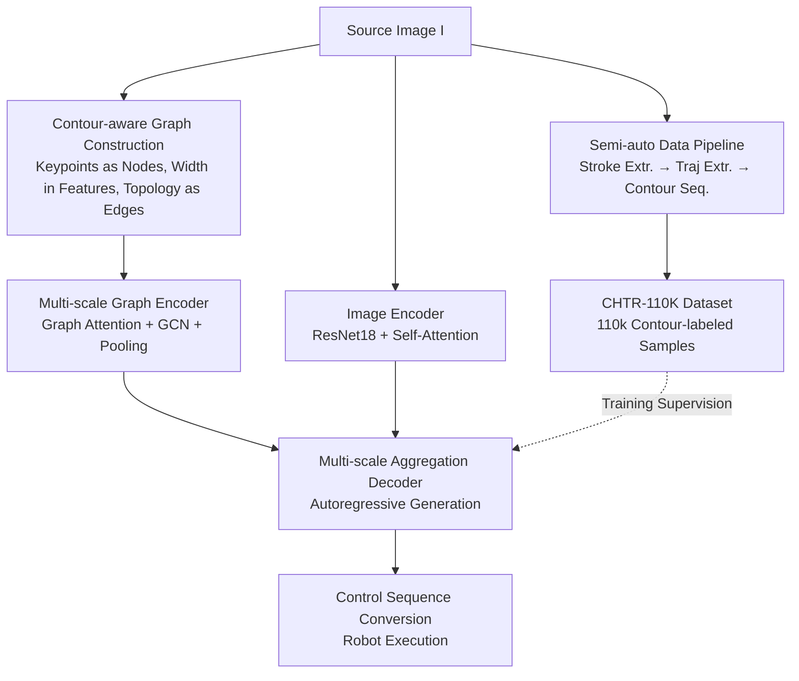

# Towards Human-Like Robot Handwriting via Contour-Aware Generation

**Conference**: CVPR 2026  
**Paper**: [CVF Open Access](https://openaccess.thecvf.com/content/CVPR2026/html/Qin_Towards_Human-Like_Robot_Handwriting_via_Contour_Aware_Generation_CVPR_2026_paper.html)  
**Code**: https://github.com/RittoQin/CHTR  
**Area**: Robotics / Embodied AI  
**Keywords**: Robot Handwriting, Trajectory Reconstruction, Stroke Contour, Graph Neural Network, Calligraphy Robot

## TL;DR
To enable writing robots to produce characters with human-like stroke thickness variations, this paper proposes a new task "Contour-aware Handwriting Trajectory Reconstruction (CHTR)" and builds the CHTR-110K dataset with 110,000 samples. It introduces the G-HTR method based on multi-scale character graphs to reconstruct character images into "trajectory sequences with stroke width," significantly surpassing SOTAs such as TrajFormer across multiple metrics and successfully deploying to real calligraphy robots.

## Background & Motivation

**Background**: To enable robots to write, existing methods follow two paths. One is **offline generation** (generating characters as static images), which preserves the overall structure but yields images without dynamic "stroke order or tip movement" information, preventing direct robot execution. The other is **online generation** (directly outputting trajectories), which provides stroke order and trajectory points for robot movement.

**Limitations of Prior Work**: Online methods only reconstruct the "skeleton" of the trajectory—a sequence of coordinates and stroke orders—while completely ignoring the **stroke contour**, i.e., the variation in thickness at different positions. Consequently, robots can only trace this skeleton with a fixed brush width, resulting in characters that look like mechanical print, losing the calligraphic beauty of varied pen pressure and stylistic flourishes (as indicated by the red box in Figure 1(c) of the paper).

**Key Challenge**: Human writing simultaneously maintains two elements: ① an **overall glyph structure** composed of topological connections of multiple strokes; ② a **fine contour with varying thickness** for each stroke. Existing methods either preserve only the structure (offline images) or provide only the skeleton trajectory (online), and no prior work has **simultaneously** recovered both from a single static image. The underlying reason is that current methods utilize pixel-level image encoders for feature extraction, which are inherently adept at modeling local relationships of adjacent pixels but fail to capture the intrinsic topological structure of characters or low-level features reflecting stroke curvature and junction details in shallow networks.

**Goal**: To define and solve the new task CHTR—given a character image, reconstruct a trajectory sequence $P=\{p_i\}_{i=1}^n$ that follows natural stroke order, preserves the overall glyph structure, and carries point-wise stroke width, enabling robots to produce human-style writing with stylistic flourishes. This breaks down into two practical obstacles: **data gap** (no dataset labels trajectory points, stroke order, and contours simultaneously) and **technical difficulty** (jointly recovering structure and contour from a single image is challenging).

**Core Idea**: Explicitly represent characters as a **contour-aware character graph** (nodes = trajectory keypoints with width, edges = topological connections). Use Graph Neural Networks (GNNs) instead of pure pixel encoders to model the topological structure, and employ **multi-scale graph learning** to capture both the "coarse glyph structure" and "fine stroke details," finally decoding the contour-aware trajectory sequence autoregressively.

## Method

### Overall Architecture

This paper provides two relatively independent outputs: a **data construction pipeline** (semi-automatically annotating character images into contour-aware trajectory sequences to create CHTR-110K), and a **reconstruction model G-HTR** (which takes a character image as input and outputs the contour-aware trajectory sequence during inference). Both share the same representation for the "contour-aware trajectory sequence"—each trajectory point is a six-dimensional vector $p=(x,y,w,s_1,s_2,s_3)$: 2D coordinates $(x,y)$, stroke width $w$, and three mutually exclusive one-hot stroke states $s_1$ (pen down), $s_2$ (pen up), and $s_3$ (end).

On the inference side, G-HTR consists of three components: **Image Encoder** → **Multi-scale Graph Encoder** → **Multi-scale Aggregation Decoder**. Starting from the source character image $I$, a contour-aware character graph $G$ is constructed and fed into the multi-scale graph encoder to extract multi-scale graph features $F_g$; meanwhile, the image encoder extracts global image features $f_i$. Finally, the decoder fuses the graph features $f_g$ from each scale with the image features $f_i$ to autoregressively generate the contour-aware trajectory sequence point by point. The generated trajectory is then converted into robot control sequences using CalliRewrite [27]'s brush model and reinforcement learning pipeline (adding execution details like pressure, anisotropy, and dwell time) for execution by the calligraphy robot.

### Key Designs

**1. CHTR-110K and Semi-automatic Labeling Pipeline: Translating Images to Contour Trajectories via "Stroke and Trajectory Extractors"**

The CHTR task was hindered by a lack of data—mainstream character sets like IAM/ICDAR/CASIA either provide only static images (no stroke order or points) or "contour-less" trajectory sequences. The authors created a semi-automatic pipeline to generate annotations from font libraries and handwritten images: first, a UNet-based stroke detector SDNet serves as the **stroke extractor** $F_{\text{stroke}}$ to detect foreground regions, stroke types, and order from image $I$, $\{S_i,t_i,o_i\}_{i=1}^M=F_{\text{stroke}}(I)$, where types are inferred from 25 categories and order is determined by matching spatial positions and predicted types with standard stroke components. Then, a CNN-LSTM **trajectory extractor** $F_{\text{traj}}$ decomposes each stroke region $S_i$ into a contour-aware trajectory $P_i=F_{\text{traj}}(S_i)$, concatenated into a full sequence $P=[P_1,\dots,P_M]$. Finally, 5 undergraduate volunteers performed manual error correction for approximately 1500 person-hours. Quality was measured by the IOU between rendered trajectories $\hat S_i$ and ground truth $S_i$, reaching an average IOU of 0.972. CHTR-110K contains 110,540 samples, 1,080 styles, and 9,837 character classes.

**2. Contour-aware Character Graph: Embedding "Stroke Width" into Node Features to make Topology Learnable**

Pure pixel encoders only see local relationships of adjacent pixels and fail to capture the topological skeleton or learn geometric quantities like stroke width. This paper uses a graph to explicitly represent character structure. During construction, the input image $I$ is thinned to extract a skeleton $I_s$, and dense skeleton points are clustered into a simplified set of keypoints $\{p_i\}_{i=1}^N$. The stroke width $w_i$ for each keypoint is estimated by the shortest distance to the character contour—this step is the source of "contour awareness," directly encoding thickness into the graph. An undirected graph $G=(V,E)$ is constructed where nodes $v_i$ are keypoints with feature vectors $f_g(v_i)=[x_{i}, y_{i}, w_{i}]$ including 2D coordinates and width; the edge set $E$ models topological connections between adjacent keypoints, with self-loops added.

**3. Multi-scale Graph Encoder: Graph Attention for Global Structure and GCN for Local Details**

Reconstruction requires both global glyph integrity and local stroke detail. The encoder consists of stacked graph blocks, each containing a multi-head **Graph Attention Layer** and a **Graph Convolutional Layer (GCN)**. Graph attention allows all nodes to interact to capture global relationships, calculated as $Y=\text{Softmax}(QK^\top/\sqrt{D})V$ after linear projections. The GCN aggregates neighbors to capture local topology with the update rule:

$$\tilde f(v_i)=f(v_i)+\frac{1}{|\mathcal N(v_i)|}\sum_{v_j\in\mathcal N(v_i)}w_{ij}f(v_j)$$

**Multi-scale Graph Learning (MGL)** outputs different scales of graph features $f_g\in\mathbb R^{N\times D}$ from various blocks—shallow blocks provide fine-grained stroke details, while deep blocks provide coarse-grained glyph structures.

**4. Multi-scale Aggregation Decoder: Adaptive Fusion via Cross-Attention for Autoregressive Generation**

The decoder generates the trajectory $\hat P=\{\hat p_j\}_{j=1}^L$ autoregressively. At step $t$, a query vector $Q_t$ formed from image features $f_i$ and previously generated points $\{p_j\}_{j=1}^{t-1}$ passes through aggregation modules using cross-attention to attend to multi-scale graph features $F_g$. This adaptively aggregates structural information across scales to output the 6D $O_t$—stroke parameters $(\hat x_t,\hat y_t,\hat w_t)$ and pen states $(\hat s^1_t,\hat s^2_t,\hat s^3_t)$. This design allows the model to prioritize fine-scale graphs for details and coarse-scale graphs for overall structure.

### Loss & Training

The total loss is composed of a stroke prediction loss $L_{\text{pre}}$ and a stroke state classification loss $L_{\text{cls}}$, $L=\lambda L_{\text{pre}}+L_{\text{cls}}$, with $\lambda=0.5$. L1 regression is used for coordinates and width:

$$L_{\text{pre}}=L_1(\hat x_t-x_t)+L_1(\hat y_t-y_t)+L_1(\hat w_t-w_t)$$

Stroke states use cross-entropy $L_{\text{cls}}=-\sum_{i=1}^3 s_i\log\hat s_i$. Images are resized to $256\times256$ (or $64\times64$ for CASIA). The image encoder uses ResNet18 + 3 self-attention layers, and the graph encoder has 4 graph blocks ($c=512$, 8 heads). Training was conducted for 300,000 steps on an RTX 4090 (batch size 48, learning rate $10^{-4}$, gradient clipping 2.0).

## Key Experimental Results

### Main Results

On the CHTR-110K test set, G-HTR leads across all metrics for Font, Handwriting, and All scenarios. The table below shows representative metrics for "All" (full test set). mIOU measures contour fidelity (higher is better), DTW measures trajectory distance, and LPIPS/FID/HWD measure visual quality (lower is better).

| Dataset | Metric | Ours (G-HTR) | Prev. SOTA (TrajFormer) | Gain |
|--------|------|------|----------|------|
| CHTR-110K (All) | mIOU ↑ | 0.641 | 0.552 | +16.1% |
| CHTR-110K (All) | DTW ↓ | 12.765 | 18.277 | −27.7% |
| CHTR-110K (All) | LPIPS ↓ | 0.066 | 0.092 | −22.8% |
| CHTR-110K (All) | FID ↓ | 1.228 | 1.475 | −16.8% |
| CHTR-110K (All) | HWD ↓ | 1.218 | 1.525 | −20.1% |
| CASIA-OLHWDB | mIOU ↑ | 0.530 | 0.445 | +19.1% |
| CASIA-OLHWDB | DTW ↓ | 16.264 | 23.892 | −31.9% |

On the traditional CASIA-OLHWDB, G-HTR also outperforms Cross-VAE, DED-Net, PEN-Net, and TrajFormer, proving the effectiveness of graph modeling for standard trajectory recovery.

### Ablation Study

Impact of Graph Encoder ($\varepsilon_G$) and Multi-Scale Graph Learning (MGL) on CHTR-110K (All):

| Configuration | mIOU ↑ | DTW ↓ | FID ↓ | Description |
|------|---------|------|------|------|
| Base | 0.532 | 19.228 | 1.642 | Image-only baseline |
| Base + $\varepsilon_G$ | 0.596 | 15.512 | 1.346 | Adding Graph Encoder |
| Base + $\varepsilon_G$ + MGL | 0.641 | 12.765 | 1.228 | Full G-HTR |

### Key Findings

- **Graph Encoder is the primary contributor**: Adding $\varepsilon_G$ improved mIOU by +12.03% (0.532→0.596) and reduced DTW by -19.33%, proving that explicitly modeling topology as a graph is superior to pure pixel encoding.
- **Multi-scale learning provides further gains**: Adding MGL on top of the graph encoder increased mIOU by +7.55% and reduced DTW by -17.70%, confirming that the multi-scale strategy effectively balances coarse structure and fine stroke details.
- **Baseline modification was critical**: The authors modified comparison methods to support width modeling. TrajFormer's mIOU jumped from 0.104 to 0.552 after modification; G-HTR still outperforms these "enhanced baselines."
- **Failures occur in rare characters**: G-HTR occasionally predicts incorrect stroke orders for rare characters outside the GB2312-80 set due to insufficient training samples of complex topologies.
- **Real-robot effectiveness**: When deployed, unlike CalliRewrite which may fail due to unnatural stroke orders, G-HTR's trajectories follow natural orders and preserve thickness, allowing the robot to produce human-like handwriting.

## Highlights & Insights

- **The "Width = distance to contour" mapping is ingenious**: It translates abstract "stroke thickness" into a pure geometric quantity, embedding contour awareness directly into the graph node features without auxiliary networks.
- **Clear division between GAT and GCN**: One handles the global view while the other handles local neighbors. The multi-scale stacking aligns with the intuition of balancing global and local focus during writing.
- **The dataset itself is a major contribution**: CHTR-110K is the first set with simultaneous contour and stroke order labels. The semi-automatic pipeline is transferable to other scripts like Japanese or Arabic.
- **Landing on real hardware**: Deploying the reconstructed trajectories to a physical robot via CalliRewrite shows a complete loop from "reconstruction" to "embodied execution," relevant for AI calligraphy and education.

## Limitations & Future Work

- **Ordering errors in rare characters**: Inadequate coverage of complex topologies leads to stroke order errors for characters outside the GB2312-80 set.
- **Heavily dependent data pipeline**: Labeling requires SDNet, CNN-LSTM, and 1500 person-hours of correction, which limits automation when migrating to new character systems.
- **Execution details handled by third parties**: Parameters like pressure and anisotropy rely on CalliRewrite's brush model rather than being jointly optimized within the G-HTR model.
- **Coverage**: The experiments primarily focus on Chinese characters; the effectiveness on cursive English or continuous scripts like Arabic remains to be evaluated.

## Related Work & Insights

- **vs TrajFormer [24]**: TrajFormer uses Transformers for long-range dependencies but only outputs skeleton trajectories. Ours uses explicit character graphs and multi-scale learning to preserve both topology and thickness.
- **vs PEN-Net / DED-Net / Cross-VAE [6,3,38]**: These end-to-end networks lack explicit contour modeling and often fail to preserve overall structure; Ours ensures structural integrity through graph-based topology.
- **vs Offline/Online Generation**: Offline methods lack dynamic order; online methods lack contour. CHTR fills this gap by producing trajectory points, order, and contour simultaneously.
- **vs Handwriting Generation (Style-Content) [7-9,32]**: Those methods require content and reference styles; Ours requires only a single character image for reconstruction, fitting practical scenarios.

## Rating
- Novelty: ⭐⭐⭐⭐⭐ Proposes the CHTR task and solves it via multi-scale character graphs.
- Experimental Thoroughness: ⭐⭐⭐⭐ Solid validation on custom and public sets with real-robot deployment, though comparison SOTAs were limited.
- Writing Quality: ⭐⭐⭐⭐ Clear motivation and complete formulas, despite minor symbol inconsistencies.
- Value: ⭐⭐⭐⭐⭐ High practical value for calligraphy robots and embodied AI, with a valuable new dataset.

<!-- RELATED:START -->

## Related Papers

- [\[AAAI 2026\] Towards Affordance-Aware Robotic Dexterous Grasping with Human-like Priors](../../AAAI2026/robotics/towards_affordance-aware_robotic_dexterous_grasping_with_human-like_priors.md)
- [\[CVPR 2026\] IGen: Scalable Data Generation for Robot Learning from Open-World Images](igen_scalable_data_generation_for_robot_learning_from_open-world_images.md)
- [\[CVPR 2026\] Spatial-Aware VLA Pretraining through Visual-Physical Alignment from Human Videos](spatial-aware_vla_pretraining_through_visual-physical_alignment_from_human_video.md)
- [\[CVPR 2026\] GeoDexGrasp: Geometry-aware Generation for Data-efficient and Physics-plausible Dexterous Grasping](geodexgrasp_geometry-aware_generation_for_data-efficient_and_physics-plausible_d.md)
- [\[CVPR 2026\] Beyond Mimicry: Learning Whole-Body Human-Humanoid Interaction from Human-Human Demonstrations](beyond_mimicry_learning_whole-body_human-humanoid_interaction_from_human-human_d.md)

<!-- RELATED:END -->
