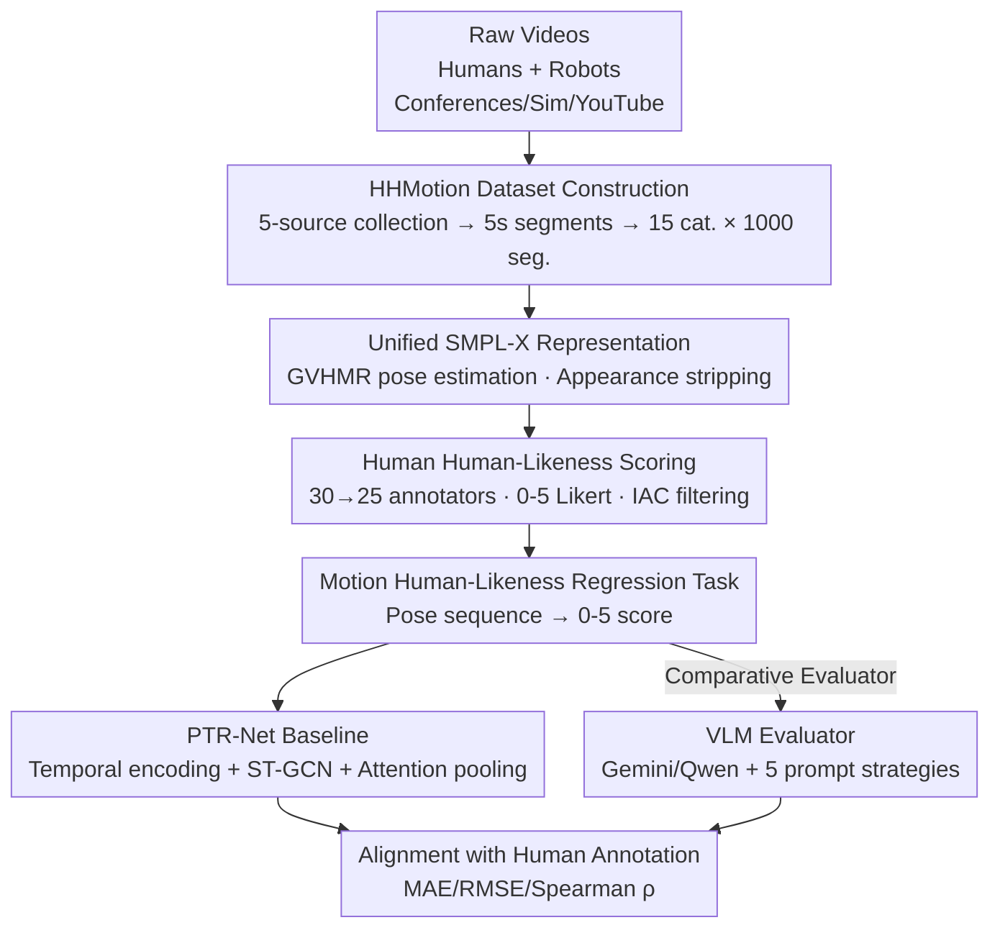

# Towards Motion Turing Test: Evaluating Human-Likeness in Humanoid Robots

**Conference**: CVPR 2026  
**Ours**: [CVF Open Access](https://openaccess.thecvf.com/content/CVPR2026/html/Li_Towards_Motion_Turing_Test_Evaluating_Human-Likeness_in_Humanoid_Robots_CVPR_2026_paper.html)  
**Code**: http://www.lidarhumanmotion.net/mtt/ (Commitment to open-source dataset + code + benchmark)  
**Area**: Robotics / Embodied AI (Humanoid Robot Motion Evaluation)  
**Keywords**: Humanoid Robot, Human-Likeness Evaluation, Motion Turing Test, SMPL-X, Benchmark

## TL;DR
Inspired by the Turing Test, the authors propose the "Motion Turing Test" (MTT), which evaluates whether a human can distinguish between pose sequences of humans and humanoid robots based solely on motion (stripping away appearance). They release the HHMotion dataset containing 1,000 segments across 15 action categories from 11 robot types and humans (annotated with 0–5 human-likeness scores). A regression baseline, PTR-Net, is provided. Results indicate a significant gap between current robot motion and humans, and even SOTA multimodal large models fail to score these motions accurately.

## Background & Motivation
**Background**: Humanoid robots have progressed rapidly in motion generation (imitation learning, diffusion models, retargeting) and motion control (reinforcement learning + physical simulation). At major conferences like WRC, WAIC, and WHRG, they can now walk, run, dance, and even perform gymnastics, appearing increasingly "natural and human-like."

**Limitations of Prior Work**: However, there is no unified, quantifiable standard for "human-likeness." Existing motion datasets (AMASS, Human3.6M, Motion-X, etc.) almost exclusively collect human actions without robot data. Current robot motion evaluations focus on task-oriented metrics—success rate, efficiency, robustness, and end-effector trajectory accuracy—while "completing a task" does not equate to "moving like a human." Naturalness, smoothness, and anthropomorphism, which are crucial for human-robot interaction, have been overlooked.

**Key Challenge**: Robot appearance (metal shells, exposed joints) serves as a strong "non-human" cue. If shown raw videos, humans can distinguish them instantly based on appearance, making it impossible to evaluate the "motion" itself. To fairly evaluate human-likeness, appearance must be entirely stripped away, leaving only kinematic information.

**Goal**: (1) Construct a dataset comparing humans and robots with stripped appearance and human-likeness scores. (2) Define "human-likeness evaluation" as a trainable regression task to see if existing models (especially VLMs) can approximate human judgment.

**Key Insight**: The authors use Human Pose Estimation (HPE) to convert all videos—human or robot—into untextured SMPL-X human models. Evaluators see only the skeleton/pose, ensuring judgments rely solely on motion.

**Core Idea**: Frame the problem using the "Motion Turing Test"—if human evaluators cannot reliably distinguish whether a pose sequence comes from a human or a robot based on body motion alone, the robot motion "passes" the test. This intuition is transformed into a quantifiable, trainable benchmark through large-scale manual annotation and a regression baseline.

## Method
As a benchmark/dataset paper, the "Method" encompasses the entire evaluation design: data collection, unified representation for stripping appearance, human scoring, task formulation, and the PTR-Net baseline.

### Overall Architecture
The pipeline consists of three stages: **Data Collection & Segmenting** → **Unified SMPL-X Conversion + Human 0–5 Scoring** (resulting in the labeled HHMotion dataset) → **Regression Task Definition & PTR-Net Training** (with VLMs as comparative evaluators). The final product is a benchmark capable of predicting human-likeness scores from pure motion sequences.

### Key Designs

**1. Motion Turing Test: Decoupling Appearance from Motion for Decidable Evaluation**

Directly viewing robot videos leads to appearance-based bias. The authors apply the Turing Test's "indistinguishability" principle to motion: a pose sequence "passes" if humans cannot reliably judge the source based on body motion (without face, text, or color). All videos are converted to SMPL-X—an untextured, parametric human model. This strips away visual cues like metal shells and joints, forcing evaluators to focus purely on kinematics.

**2. HHMotion Dataset: Five-Source Collection + Human-Robot Categorical Comparison**

The authors collected 21.7 hours of raw video from five sources: real robots at conferences (257 segments), simulated robots (recorded via LAFAN1 Retargeting, 243 segments), 10 volunteers performing identical actions (365 segments), volunteers **deliberately mimicking robots**, and YouTube videos (135 segments). The dataset covers 1,000 segments, 15 action categories, and 11 robot models (e.g., Unitree G1, ENGINEAI PM01). A key design includes human-robot comparisons for the same categories and a subset of "humans mimicking robots" to create ambiguous samples that challenge the Motion Turing Test.

**3. Large-Scale 0–5 Human Scoring + IAC Filtering: Reliable Continuous Labels**

Human judgment is the gold standard. 30 annotators scored the SMPL-X sequences on a 0–5 Likert scale (0=completely mechanical, 5=indistinguishable from human). To prevent bias, 500 human and 500 robot segments were randomized. Quality control involved two layers: manual cross-verification of SMPL-X reconstructions and an Inter-Annotator Consistency (IAC) check. The average scores from 25 high-consistency annotators serve as the final labels.

**4. PTR-Net: Defining Human-Likeness Evaluation as a Regression Task**

The task is defined as predicting a scalar score $s = f_\theta(X)$ from a normalized SMPL-X pose sequence $X$, where $s \in [0,5]$. The **Pose-Temporal Regression Network (PTR-Net)** consists of: **Temporal Encoder** (Bi-LSTM for long-term dependencies), **Spatio-Temporal Graph Convolution (ST-GCN)** with a parameter-free adjacency matrix to adaptively capture joint-frame patterns, and **Attention Pooling + Regression Head** to highlight key motion segments. The loss function includes an L2 regression loss and a temporal smoothness regularizer:

$$L = \lVert \hat{s} - s^* \rVert_2^2 + \lambda\, L_{reg}$$

where $s^*$ is the human score and $L_{reg}$ penalizes abrupt temporal fluctuations in predicted scores.

**5. VLM Evaluators + Five Prompt Strategies: Testing Large Models as Scorer**

The study investigates whether SOTA VLMs (Gemini 2.5 Pro, Qwen3-VL-Plus) can replace human scorers. Five strategies were tested: Direct Evaluation (DE), Context-Guided Evaluation (CGE), Prototype-Driven Evaluation (PDE), DE-CoT, and the proposed **Posture-Aware CoT (PA-CoT)**, which mimics human logic by analyzing action type, pose smoothness, coordination, and stability before scoring.

### Metrics
Alignment with human judgment is measured using Mean Absolute Error (MAE↓), Root Mean Square Error (RMSE↓), and Spearman’s Rank Correlation (ρ↑).

## Key Experimental Results

### Main Results

Performance of different models on the Motion Turing Test benchmark (`*` indicates zero-shot VLM):

| Model | MAE ↓ | RMSE ↓ | Spearman ρ ↑ |
|-------|-------|--------|--------------|
| Gemini 2.5 Pro (DE)* | 1.3105 | 1.5873 | 0.1609 |
| Gemini 2.5 Pro (PDE)* | 1.2616 | 1.5397 | 0.2188 |
| Gemini 2.5 Pro (PA-CoT)* | 1.2682 | 1.5214 | 0.2303 |
| Qwen3-VL-Plus (shot)* | 1.7714 | 2.1018 | – (Near constant output) |
| MotionBERT (Frozen) | 0.6846 | 0.9025 | 0.5315 |
| MotionBERT (Fine-tuned) | 0.6252 | 0.8465 | 0.6142 |
| Transformer (Lightweight) | 0.6387 | 0.8259 | 0.5728 |
| **PTR-Net (Ours)** | **0.5813** | **0.7926** | **0.6841** |

Human-robot gap across action categories (Real robot stats, 25-annotator average):

| Category | Human | Robot | Gap |
|----------|-------|-------|-----|
| stand (Min gap) | 3.80 | 1.97 | 1.83 |
| walk | 3.92 | 2.61 | 1.31 |
| dance | 3.47 | 2.26 | 1.21 |
| jump (Max gap) | 4.43 | 1.20 | 3.23 |
| boxing | 3.76 | 1.23 | 2.53 |
| run | 3.73 | 1.47 | 2.26 |

### Ablation Study

Ablation of PTR-Net components (Table 4):

| Configuration | MAE ↓ | RMSE ↓ | ρ ↑ |
|---------------|-------|--------|-----|
| w/o Temporal Encoder | 0.7631 | 0.9691 | 0.3610 |
| w/o Attention Pooling | 0.6185 | 0.8203 | 0.6255 |
| w/o $L_{reg}$ | 0.5983 | 0.7958 | 0.6215 |
| Full Model | 0.5813 | 0.7926 | 0.6841 |

### Key Findings
- **Temporal encoding is most critical**: Removing it nearly halves the correlation (ρ), suggesting human-likeness depends heavily on long-term temporal dynamics rather than single-frame poses.
- **Gaps are widest in dynamic/reactive actions**: Jump (3.23 gap), boxing (2.53), and run (2.26) show large disparities, while walk and stand are more human-like. This indicates robots struggle with fine-grained fluidity and balance control.
- **Simulation exceeds reality**: Simulated robot motion scores higher than real-world robot motion, highlighting a sim-to-real gap in human-likeness.
- **VLMs fail as scorers**: Even with PA-CoT, Gemini's ρ is only 0.23, and Qwen's output is nearly constant. Current VLMs are insensitive to fine-grained motion differences.
- **OOD Generalization**: PTR-Net's prediction (4.25) aligns closely with human scores (4.36) on the unseen XPeng IRON robot. In the "human mimicking robot" subset, human and robot scores overlap, suggesting human-likeness also involves intentionality.

## Highlights & Insights
- **Stripping appearance is the core strength**: Using SMPL-X eliminates "cheating" via visual cues, allowing evaluation to focus strictly on kinematics. This approach is transferable to action generation quality or sports/dance assessment.
- **"Humans mimicking robots" is a brilliant addition**: It pushes the benchmark to its discriminative boundary and reveals that human-likeness involves intentionality and adaptability beyond mere smoothness.
- **VLM-as-judge is refuted**: Experimental evidence shows that specialized regression networks outperform VLMs for fine-grained motion evaluation, cautioning against the universal application of LLM-based evaluators.
- **PTR-Net as a Potential Reward Model**: The evaluator can serve as a metric or reward model for reinforcement learning, creating a loop for improving motion generation.

## Limitations & Future Work
- **Baseline performance gap**: PTR-Net's RMSE (~0.79) indicates the task is far from solved, and regression accuracy needs improvement.
- **Subjectivity of labels**: Human-likeness is inherently subjective. Despite IAC filtering, potential systematic biases across different cultures/populations remain unverified.
- **HPE Reconstruction Quality**: The benchmark relies on GVHMR's accuracy. Reconstruction errors due to occlusion or fast motion can contaminate scores, especially for robots with non-human morphology.
- **Limited Scope**: The 15 categories and 11 robots are a start, but the real-world action space is much larger. Some network and IAC details are relegated to the Supplementary material.

## Related Work & Insights
- **Comparison with Human Datasets**: Unlike AMASS or Motion-X which focus on generation, this is the first human-robot comparative dataset designed for **evaluation**.
- **Task-Oriented vs. Perception-Oriented**: Traditional metrics focus on task success; this work argues that "success $\neq$ human-likeness" and provides a standard for naturalness.
- **Counter-example to VLM Paradigm**: The work provides empirical evidence that general VLMs are unsuitable for fine-grained motion judgment, necessitating specialized time-series modeling.

## Rating
- Novelty: ⭐⭐⭐⭐⭐ 
- Experimental Thoroughness: ⭐⭐⭐⭐ 
- Writing Quality: ⭐⭐⭐⭐ 
- Value: ⭐⭐⭐⭐⭐ 

<!-- RELATED:START -->

## Related Papers

- [\[CVPR 2026\] Beyond Mimicry: Learning Whole-Body Human-Humanoid Interaction from Human-Human Demonstrations](beyond_mimicry_learning_whole-body_human-humanoid_interaction_from_human-human_d.md)
- [\[CVPR 2026\] Humanoid Generative Pre-Training for Zero-Shot Motion Tracking](humanoid_generative_pre-training_for_zero-shot_motion_tracking.md)
- [\[CVPR 2026\] Iterative Closed-Loop Motion Synthesis for Scaling the Capabilities of Humanoid Control](iterative_closed-loop_motion_synthesis_for_scaling_the_capabilities_of_humanoid_.md)
- [\[ICLR 2026\] From Language to Locomotion: Retargeting-free Humanoid Control via Motion Latent Guidance](../../ICLR2026/robotics/from_language_to_locomotion_retargeting-free_humanoid_control_via_motion_latent_.md)
- [\[NeurIPS 2025\] Adversarial Locomotion and Motion Imitation for Humanoid Policy Learning](../../NeurIPS2025/robotics/adversarial_locomotion_and_motion_imitation_for_humanoid_policy_learning.md)

<!-- RELATED:END -->
