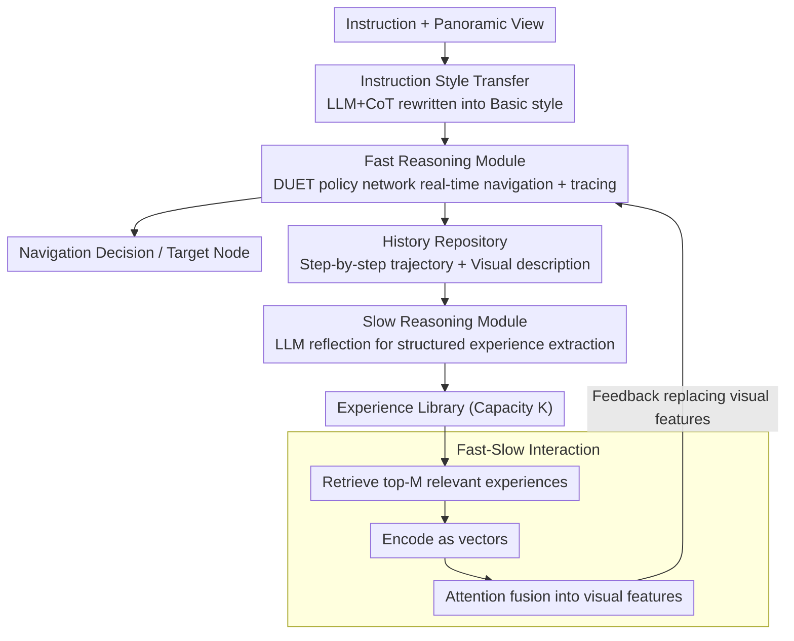

# Towards Open Environments and Instructions: General Vision-Language Navigation via Fast-Slow Interactive Reasoning

**Conference**: CVPR 2026  
**arXiv**: [2601.09111](https://arxiv.org/abs/2601.09111)  
**Code**: None  
**Area**: Robotics / Embodied AI / Vision-Language Navigation  
**Keywords**: Vision-Language Navigation, Fast-Slow Reasoning, Experience Library, Scene Generalization, Instruction Style Transfer

## TL;DR

Addressing the General Vision-Language Navigation (GSA-VLN) task in open environments, this paper proposes the slow4fast-VLN framework, inspired by the human dual-process cognitive system. The fast reasoning module performs real-time navigation and accumulates historical memory based on an end-to-end policy network. The slow reasoning module utilizes LLMs to reflect on and generate structured generalization experiences. These experiences are fed back to enhance the fast reasoning network through attention fusion, achieving continuous adaptation in unseen environments and under diverse instructions. The framework consistently outperforms the previous SOTA (GR-DUET) on the GSA-R2R dataset.

## Background & Motivation

1. **Background**: Vision-Language Navigation (VLN) is a fundamental task in embodied AI. Traditional methods like DUET follow the closed-set assumption, where training and testing data share the same environmental styles and instruction formats. Recently, GR-DUET introduced the GSA-VLN task, incorporating 150 scenes and 20 building types, distinguishing between in-distribution (ID) and out-of-distribution (OOD) scenes, and designing three instruction styles (Basic, Scene, User), which initially addressed scene adaptation at the visual level.

2. **Limitations of Prior Work**: (a) When transitioning from familiar training environments to OOD scenarios, agents often generate spurious reasoning paths (similar to hallucinations) and struggle to recognize their own limitations. (b) Existing fast-slow dual-system methods treat the two as independent parallel systems, where slow-reasoning experiences cannot be integrated into the fast-reasoning policy network. Consequently, fast reasoning remains at its initial level and must repeatedly invoke slow reasoning in similar scenarios. (c) GR-DUET focuses only on visual scene adaptation, ignoring the issue of instruction style diversity.

3. **Key Challenge**: In the open world, generalized experiences cannot be compressed into low-latency intuitive response patterns. The lack of interaction between fast and slow systems means agents always behave as "novice drivers" in OOD scenarios, weakening their generalization and adaptation capabilities.

4. **Goal**: (1) How to implement dynamic interaction between fast and slow reasoning so that "slow thinking" experiences continuously enhance "fast thinking"? (2) How to adapt to heterogeneous instruction styles?

5. **Key Insight**: Inspired by the System 1/System 2 theory in Kahneman's *Thinking, Fast and Slow*, the true value of slow thinking lies not only in solving complex problems once but in generating generalized strategies to strengthen the fast-thinking system.

6. **Core Idea**: Construct a dynamic interaction framework for fast and slow reasoning. The slow reasoning module reflects on navigation history to extract structured experiences stored in an experience library. These experiences are fused into the visual features of the fast reasoning network via an attention mechanism, enabling experience-driven navigation decisions.

## Method

### Overall Architecture

The core problem this paper addresses is how to enable a navigation agent to learn while working and become more proficient as it moves when entering an unseen environment with unfamiliar instruction styles. The authors introduce a dual-system "Fast Thinking (Intuition) / Slow Thinking (Reflection)" framework into VLN, with the key modification being a closed-loop interaction rather than independent operation. The framework is formalized as $\mathcal{F}=\langle\pi,R,M,A\rangle$: $\pi$ is the fast reasoning policy network (based on DUET) responsible for real-time navigation; $R$ is the slow reasoning reflection function; $M$ extracts structured experiences from reflection results and stores them; and $A$ feeds these experiences back into the fast reasoning network.

A complete episode operates as follows: the policy network performs normal navigation and records the entire trajectory (observations, paths, success/failure) in a history repository. After the episode, the slow reasoning module reviews this history, reflects on generalization rules for that scene type, and stores them in the experience library. In the next episode, when encountering a similar scene, the fast reasoning network retrieves relevant experiences from the library and integrates them into its visual features for decision-making. Thus, fast reasoning evolves with the accumulated number of navigations. On the instruction side, an additional style transfer module translates unfamiliar instructions into the model's familiar format.

### Key Designs

**1. Fast Reasoning Module: Enabling end-to-end policy networks to trace while navigating**

The fast reasoning module utilizes DUET as the policy network $\pi$, processing instructions, panoramic observations (panoramic images, GPS, neighbor nodes), and historical navigation data. A topological mapping module dynamically maintains the map of visited, navigable, and current nodes. Global action planning performs dual-scale encoding (coarse-scale for global scores, fine-scale for local actions), and a dynamic fusion module calculates weights to select the highest-scoring node. While fast, this design lacks explicit slow cognitive modeling for OOD scenarios. Its additional responsibility here is "tracing": for each node, Llama3.2-Vision generates a visual text description. The entire trajectory $\mathcal{L}(t_j)$, along with timestamps, step indices, viewpoints, local topology, instructions, actions, and step metrics, is recorded in the history repository as raw material for slow reasoning.

**2. Slow Reasoning Module: Compressing fragmented history into reusable structured experiences**

Directly storing raw trajectories as memory is too fragmented for effective retrieval—a point proven by experiments showing SR < 25% for naive memory augmentation methods like TourHAMT or OVER-NAV. The key to slow reasoning is "extraction" rather than just "memorization." The authors define a fixed-structure experience entry $\mathcal{E}=[S_t, C_s, R_s, T_n, \eta_s, f]^{\top}$, containing fields for scene type, spatial context, spatial rules, navigation strategy, historical success rate, and frequency. A structured CoT reflection prompt template $\mathcal{P}$ (comprising role definition, context filling, task decomposition, and output format constraints) drives the LLM to analyze a navigation history $\mathcal{X}$ into an experience:

$$\mathcal{E} = \mathcal{F}_{LLM}(\mathcal{P}(\mathcal{X}))$$

Experiences are stored in a library with capacity $K$. This step constrains LLM free-text into fixed-length, searchable, and vectorizable knowledge.

**3. Fast-Slow Interaction: "Welding" experience into visual features via attention**

This is the most critical link of the framework. Unlike traditional dual systems where fast and slow processes work in parallel, this mechanism allows experiences to reconstruct fast-reasoning decisions. The process follows three steps: During retrieval, a key $\mathcal{K}=[S_t^{cur}, C_s^{cur}, T_n^{cur}]$ is extracted from the current context $\mathcal{X}_{cur}$ to compute similarity with library entries, selecting the $M$ most relevant experiences above a threshold $\tau_{retrieve}$. During encoding, an encoder $G_{enc}$ converts these discrete fields into vectors $F_e(k) \in \mathbb{R}^d$. During fusion, the current visual feature $F_v$ serves as the Query, while experience features $F_e^{exp}$ act as Key/Value in a multi-head attention layer to produce $F_{att}$. Finally, $F_v$ is concatenated with $F_{att}$ and mapped back to the original dimension via a linear layer to obtain $F_{fused}$, which replaces the original visual feature output.

**4. Instruction Style Transfer: Translating unfamiliar instructions into the model's "native" language**

While GR-DUET focuses on scene adaptation, it overlooks instruction styling. The authors use LLM with CoT prompts to identify and rewrite Scene and User-style instructions into the model's familiar Basic style in real-time. A confidence score is calculated during rewriting; the conversion is only adopted if the score exceeds a threshold, otherwise the original instruction is kept to prevent semantic errors.

### Key Experimental Results

#### Main Results

**GSA-R2R Basic Instructions (Environment Adaptation)**:

| Method | Test-R-Basic SR↑ | SPL↑ | Test-N-Basic SR↑ | SPL↑ |
|------|-------------------|------|-------------------|------|
| DUET (Baseline) | 57.7 | 47.0 | 48.1 | 37.3 |
| GR-DUET | 69.3 | 64.3 | 56.6 | 51.5 |
| **slow4fast-VLN** | **70.8** | **65.0** | **58.4** | **52.9** |

**GSA-R2R Scene Instructions**:

| Method | Test-N-Scene SR↑ | SPL↑ | nDTW↑ |
|------|-------------------|------|-------|
| GR-DUET | 48.1 | 42.8 | 53.7 |
| **slow4fast-VLN** | **50.7** | **46.6** | **57.8** |

#### Ablation Study

| FSR | ISC | Test-R-Basic SR | Test-N-Basic SR | Test-N-Scene SR |
|-----|-----|-----------------|-----------------|-----------------|
| × | × | 64.0 | 53.7 | 42.4 |
| × | ✓ | 64.0 | 53.7 | 46.1 |
| ✓ | × | 69.1 | 58.4 | 47.9 |
| ✓ | ✓ | **69.1** | **58.4** | **50.4** |

### Key Findings

- **FSR (Fast-Slow Reasoning) contributes the most**: Adding FSR increases the SR for Basic instructions from 64.0 to 69.1 (+5.1%), proving effective across all instruction types.
- **ISC (Instruction Style Transfer) is significant for Scene instructions**: It only affects non-Basic styles (improving Test-N-Scene SR from 42.4 to 46.1).
- **Synergy**: The best performance on Test-N-Scene (50.4) is achieved when both modules are used together.
- **Case Analysis**: In an initial navigation, the agent failed due to lack of experience, taking wrong turns in a corridor and misidentifying targets, resulting in 15s duration and 1.5m error. After 4 iterations of experience accumulation, the 5th navigation time dropped to 8s (-46.7%) and error to 0.3m (-80%).

## Highlights & Insights

- **"Closed-loop" Fast-Slow Design**: Unlike simply parallelizing the dual systems, this design allows slow-thinking experiences to "reshape" the fast-thinking decision process through attention fusion. This enables the system to evolve over time—the more it navigates, the stronger the fast reasoning becomes, reducing dependence on slow thinking.
- **Structured Experience Design**: Constraining LLM output into a vectorizable format (Scene type + Context + Rules + Strategy + Success rate + Frequency) ensures rich spatial knowledge while remaining engineering-friendly.
- **Instruction Style Transfer**: As a lightweight pre-processing step, using CoT to normalize diverse instructions is a simple yet effective practical trick transferable to any instruction-following task.

## Limitations & Future Work

- **Library Capacity**: The experience library is limited ($K=50\sim100$), which may be insufficient for extremely diverse, large-scale scenes. Hierarchical or scalable organization could be explored.
- **Inference Latency**: The reliance on LLMs (Llama3.2-vision) for slow reasoning could be a bottleneck during real-time deployment.
- **Retrieval Accuracy**: Experience retrieval based on simple feature similarity may fail in scenes that are semantically similar but structurally different.
- **Benchmark Coverage**: Experiments were only conducted on GSA-R2R; generalization to other VLN benchmarks like RxR or REVERIE remains untested.

## Related Work & Insights

- **vs GR-DUET**: GR-DUET adapts scenes visually but ignores instruction style. slow4fast-VLN enhances both using the fast-slow framework and style transfer.
- **vs TourHAMT / OVER-NAV**: Naive memory mechanisms fail in GSA-VLN tasks (SR<25%), highlighting that memory must be refined into structured experiences through reflection.
- **vs Traditional Dual Systems**: While existing methods use "parallel division of labor," slow4fast-VLN uses a "feedback enhancement" mode—the value of slow thinking lies in continuously improving fast thinking.

## Rating

- Novelty: ⭐⭐⭐⭐ The interactive fast-slow framework and the retrieval-encoding-fusion pipeline are innovative.
- Experimental Thoroughness: ⭐⭐⭐⭐ Covers various instruction styles with solid ablation, though limited to one dataset.
- Writing Quality: ⭐⭐⭐⭐ Clear structure, well-justified motivation, and intuitive case studies.
- Value: ⭐⭐⭐⭐ Provides a practical engineering implementation of fast-slow cognition for embodied agents requiring online adaptation.

<!-- RELATED:START -->

<!-- RELATED:END -->

## Related Papers

- [\[CVPR 2026\] AwareVLN: Reasoning with Self-awareness for Vision-Language Navigation](awarevln_reasoning_with_self-awareness_for_vision-language_navigation.md)
- [\[CVPR 2026\] FantasyVLN: Unified Multimodal Chain-of-Thought Reasoning for Vision-and-Language Navigation](fantasyvln_unified_multimodal_chain-of-thought_reasoning_for_vision-and-language.md)
- [\[CVPR 2026\] Fast-ThinkAct: Efficient Vision-Language-Action Reasoning via Verbalizable Latent Planning](fast-thinkact_efficient_vision-language-action_reasoning_via_verbalizable_latent.md)
- [\[CVPR 2026\] ProFocus: Proactive Perception and Focused Reasoning in Vision-and-Language Navigation](profocus_proactive_perception_and_focused_reasoning_in_vision-and-language_navig.md)
- [\[CVPR 2026\] Progress-Think: Semantic Progress Reasoning for Vision-Language Navigation](progress-think_semantic_progress_reasoning_for_vision-language_navigation.md)

<!-- RELATED:END -->
