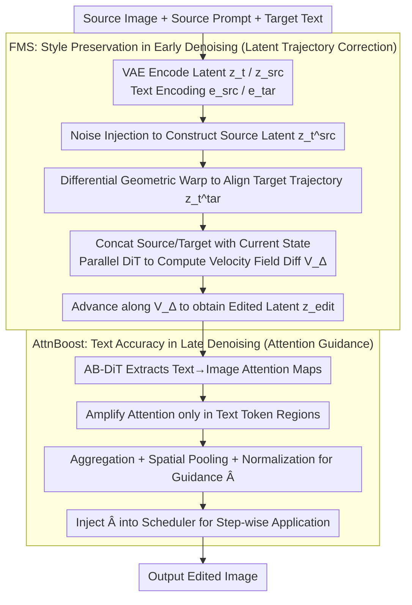

# Towards Training-Free Scene Text Editing

**Conference**: CVPR 2026  
**arXiv**: [2603.24571](https://arxiv.org/abs/2603.24571)  
**Code**: [https://github.com/lyb18758/TextFlow](https://github.com/lyb18758/TextFlow)  
**Area**: Robotics  
**Keywords**: Scene Text Editing, Training-Free, Diffusion Models, Attention Enhancement, Flow Matching

## TL;DR

TextFlow is proposed as a training-free scene text editing framework. By utilizing Flow Manifold Steering (FMS) in the early denoising stages to maintain style consistency and Attention Boost (AttnBoost) in the later stages to enhance text rendering accuracy, it achieves editing quality comparable to or even better than training-based methods without requiring task-specific training.

## Background & Motivation

1. **Background**: Scene Text Editing (STE) aims to modify or replace text content in natural images while preserving the background and visual attributes of the original text (font, color, size, geometric layout). Generative models have evolved from GANs to UNet-based diffusion models and then to Diffusion Transformers (DiT), driving the development of STE. Methods such as DiffSTE, AnyText, and textFlux have demonstrated strong text rendering performance.

2. **Limitations of Prior Work**: A fundamental trade-off exists between adaptability and editing quality. Training-based methods require large-scale, high-quality paired data (which is scarce in practice); although synthetic data can supplement this, it limits generalization to diverse real-world scenes and demands significant computational resources. Training-free methods leverage pre-trained models without fine-tuning, but most attention-manipulation-based approaches are designed for general object editing and face challenges in maintaining precise typography and structural details—frequently resulting in character repetition, omission, or deformation.

3. **Key Challenge**: The core difficulty of training-free methods lies in stage-dependent controllability—the signal-to-noise ratio (SNR) is non-uniform across different diffusion timesteps. If structure and style foundations are not maintained in the early denoising stages, the editing trajectory becomes unstable. Conversely, a lack of sufficient semantic and spatial guidance in the later stages leads to inaccurate text rendering.

4. **Goal**: How to simultaneously solve the core issues of style preservation and text accuracy in scene text editing without requiring training?

5. **Key Insight**: The complex STE task is decoupled into two complementary stages, where each stage is handled by a specialized mechanism—preserving style in the early stage and enhancing text accuracy in the later stage.

6. **Core Idea**: STE is processed in two stages: FMS is used in the early stage for style consistency via trajectory correction in the latent space, and AttnBoost is used in the later stage to improve text rendering accuracy through attention map guidance, achieving training-free end-to-end editing.

## Method

### Overall Architecture

TextFlow is built upon the flow matching architecture of FLUX-Kontext, taking the source image along with source and target text descriptions as input. The entire editing process is performed using 50 denoising steps without modifying any weights. Its core premise is that the SNR varies significantly across different timesteps of the diffusion process: early perturbations are large and determine the global structure and style, while later stages reveal details that determine character appearance. Rather than using a single mechanism throughout, the denoising trajectory is divided into two parts for a "divide and conquer" approach. The first half is managed by FMS, which encodes the source image into the latent space and "welds" the source structural constraints into the target generation trajectory via noise injection and differential geometric transformations to preserve style. The second half is managed by AttnBoost, which extracts text-to-image attention maps from the DiT dual-stream transformer blocks and amplifies them to provide precise spatial guidance for late-stage character rendering. The transition between these two stages occurs at the midpoint of the 50-step trajectory, which serves as an optimal balance between quality and efficiency—experiments show that 24 steps yield insufficient quality and 70 steps offer diminishing returns at lower speed.

### Key Designs

**1. Flow Manifold Steering (FMS): Locking Source structure in the Early Stage**

Training-free methods are most prone to failure in the early denoising steps. If the structural and style foundation of the source image is not anchored here, the subsequent editing trajectory will deviate, failing to preserve the background and font. FMS performs a trajectory correction in the latent space: first, noise injection is applied to the source latent representation $\mathbf{z}_t^{src} = (1-t_i)\cdot\mathbf{z}_{src} + t_i\cdot\epsilon$. Then, a differential geometric transformation is used to pull the target back to a position aligned with the source: $\mathbf{z}_t^{tar} = \mathbf{z}_t + (\mathbf{z}_t^{src} - \mathbf{z}_{src})$. The key is the differential term $(\mathbf{z}_t^{src} - \mathbf{z}_{src})$, which accurately captures the geometric shift introduced by noise injection, effectively embedding the "original structure" as a hard constraint into the target trajectory. Subsequently, the source and target are concatenated with the current state and fed into parallel DiT blocks to calculate the velocity field difference between the two trajectories:

$$\mathbf{V}_\Delta = \Phi(z_t^{tar,cat}, e_p^{tar}) - \Phi(z_t^{src,cat}, e_p^{src})$$

The state is then advanced along this difference: $\mathbf{z}_{edit} = \mathbf{z}_t + \mathbf{V}_\Delta\cdot(t_{i-1} - t_i)$. This is effective because it does not attempt to fit an entirely new target trajectory but instead learns only the "delta" from source to target, allowing structural information to be inherited. Removing FMS in ablation studies leads to a 1.95 drop in PSNR and a 39.2% increase in MSE, resulting in structural collapse.

**2. Attention Boost (AttnBoost): Concentrating Attention on Character Regions in the Late Stage**

Even if the style is preserved, text may still be rendered incorrectly. Common issues in general editing methods include character repetition, omission, and deformation, which stem from a lack of semantic and spatial guidance regarding where and how characters should appear during late-stage denoising. AttnBoost addresses this by extracting text-to-image attention patterns from the dual-stream transformer blocks. It first applies target amplification to the attention maps only within the indices of text tokens: $A_{enhanced}(b,h,q,k) = \mathcal{T}(A(b,h,q,k))$. Then, the text-to-image mapping $A_{t2i}$ is extracted, aggregated along the query dimension, spatially pooled, and normalized to produce a fine-grained guidance signal $\hat{A}$. Finally, this is integrated into the scheduler for step-wise application: $z_{t-1} = \mathcal{S}(z_t, \hat{A}, t)$. Essentially, this manually increases the model's focus on character regions in the later stages, forcing computational resources toward accurate character generation. This step is decisive—removing AttnBoost causes text accuracy to plummet from 79.80% to 20.35%.

### Loss & Training

TextFlow is entirely training-free, with no fine-tuning or loss functions. All capabilities are derived from the inherent behavior of the pre-trained model. In its specific configuration, it uses FLUX-Kontext as the core editing generator, T5 and CLIP for text embedding extraction, and an Overshoot + Euler scheduler for 50 denoising steps, generating at a resolution of 384×256 (aligned with the ScenePair dataset).

## Key Experimental Results

### Main Results

| Method | SSIM↑ | PSNR↑ | MSE↓ | FID↓ | ACC(%)↑ | NED↑ |
|--------|------|------|----------|------|------|------|
| DiffSTE (Training) | 22.76 | 12.26 | 7.34 | 180.15 | 71.11 | 0.907 |
| AnyText (Training) | 30.73 | 13.66 | 6.05 | 51.44 | 51.12 | 0.734 |
| TextFlux (Training) | 86.57 | 17.96 | 1.83 | 54.64 | 80.40 | 0.911 |
| Flux-Kontext | 87.08 | 20.53 | 1.58 | 15.41 | 78.72 | 0.920 |
| FlowEdit (Free) | 87.60 | 20.89 | 1.16 | 25.41 | 45.51 | 0.590 |
| **TextFlow (Ours)** | **89.03** | **22.47** | **0.91** | **13.53** | **79.98** | **0.914** |

### Ablation Study

| Configuration | SSIM↑ | PSNR↑ | MSE↓ | FID↓ | ACC(%)↑ |
|------|---------|------|------|------|------|
| FlowEdit | 87.60 | 20.89 | 1.16 | 25.41 | 45.51 |
| Ours w/o FMS | 87.09 | 20.47 | 1.35 | 16.69 | - |
| Ours w FMS | 89.04 | 22.42 | 0.97 | 13.52 | - |
| Ours w/o AttnBoost | - | - | - | - | 20.35 |
| Ours w AttnBoost | - | - | - | - | 79.80 |
| Euler Scheduler | - | - | - | - | 78.73 |
| Overshoot Scheduler | - | - | - | - | 79.90 |

### Key Findings

- TextFlow achieves superior performance across image quality metrics (SSIM, PSNR, FID), with MSE (0.91) being approximately 42% lower than the runner-up, Flux-Kontext (1.58).
- Text accuracy (79.98%) is close to the training-based method TextFlux (80.40%), but image quality metrics are significantly better—FID 13.53 vs. 54.64.
- AttnBoost is critical for text accuracy: without it, ACC drops from 79.80% to 20.35%, a decrease of approximately 75%.
- FMS is essential for structural preservation: without it, PSNR drops by 1.95 and MSE increases by 39.2%.
- 50 denoising steps represent the optimal balance: 24 steps provide insufficient quality, while 70 steps show diminishing gains and increased computational cost.
- The Overshoot scheduler consistently outperforms Euler: ACC 79.90% vs. 78.73%.

## Highlights & Insights

- The two-stage decoupling strategy handles style preservation and accuracy enhancement separately by leveraging the varying SNR characteristics across the diffusion process. This represents a versatile and elegant design philosophy.
- As a training-free method, outperforming training-based methods in every image quality metric is remarkable—FID 13.53 is drastically lower than TextFlux's 54.64, indicating that the inherent capabilities of the pre-trained model are effectively unleashed.
- The velocity field difference approach ($\mathbf{V}_\Delta$) cleverly utilizes the differentiable trajectory properties of flow matching models to perform geometric operations in latent space for structural consistency.
- The selective amplification strategy of AttnBoost for text regions can be transferred to other tasks requiring fine-grained control over the accuracy of generated content.

## Limitations & Future Work

- Acknowledged Limitations: The computational overhead of diffusion models limits real-time high-resolution applications.
- Difficulties in handling multi-line text and complex layouts make it hard to maintain spatial and typographic consistency.
- On the ScenePair Random dataset, text accuracy (74.52%) is lower than Flux-Kontext (76.63%), suggesting slightly weaker adaptability to randomized target text.
- Currently evaluated only on cropped text regions; performance and utility for full-image editing require verification.
- The stage transition point is currently fixed; an adaptive stage-switching strategy might further improve performance.

## Related Work & Insights

- **vs. TextFlux**: TextFlux is a training-based method with slightly higher text accuracy (80.40% vs. 79.98%), but its image quality metrics are significantly inferior to TextFlow (FID 54.64 vs. 13.53)—suggesting that training may overfit to synthetic data and compromise visual naturalness.
- **vs. Flux-Kontext**: Flux-Kontext performs well in style preservation but lacks text accuracy; TextFlow introduces the dual enhancement of FMS and AttnBoost on top of this.
- **vs. FlowEdit**: As a general training-free editing method, FlowEdit's accuracy in text scenarios is only 45.51%; TextFlow specifically addresses STE challenges through stage-aware guidance.
- **Insights**: Stage-aware training-free guidance strategies can be transferred to other fine-grained control editing tasks, such as logo editing or handwriting generation.

## Rating

- Novelty: ⭐⭐⭐⭐ The combination of two-stage decoupling, manifold steering, and attention enhancement is innovative for training-free STE.
- Experimental Thoroughness: ⭐⭐⭐⭐ Comprehensive evaluation on the ScenePair dataset with ablations covering every module and hyperparameter.
- Writing Quality: ⭐⭐⭐⭐ The method description is mathematical and clear, complemented by intuitive diagrams.
- Value: ⭐⭐⭐⭐ Represents a milestone where training-free methods reach the performance level of training-based ones, offering high practical utility.

<!-- RELATED:START -->

## Related Papers

- [\[CVPR 2026\] Parse, Search, and Confirmation: Training-Free Aerial Vision-and-Dialog Navigation with Chain-of-Thought Reasoning and Structured Spatial Memory](parse_search_and_confirmation_training-free_aerial_vision-and-dialog_navigation_.md)
- [\[CVPR 2026\] DemoFunGrasp: Universal Dexterous Functional Grasping via Demonstration-Editing Reinforcement Learning](demofungrasp_universal_dexterous_functional_grasping_via_demonstration-editing_r.md)
- [\[CVPR 2026\] Cross from Left to Right Brain: Adaptive Text Dreamer for Vision-and-Language Navigation](cross_from_left_to_right_brain_adaptive_text_dreamer_for_vision-and-language_nav.md)
- [\[CVPR 2026\] QuantVLA: Scale-Calibrated Post-Training Quantization for Vision-Language-Action Models](quantvla_scale-calibrated_post-training_quantization_for_vision-language-action_.md)
- [\[CVPR 2026\] Memory-Augmented Scene Understanding and Exploration for Open-World Aerial Object-Goal Navigation](memory-augmented_scene_understanding_and_exploration_for_open-world_aerial_objec.md)

<!-- RELATED:END -->
