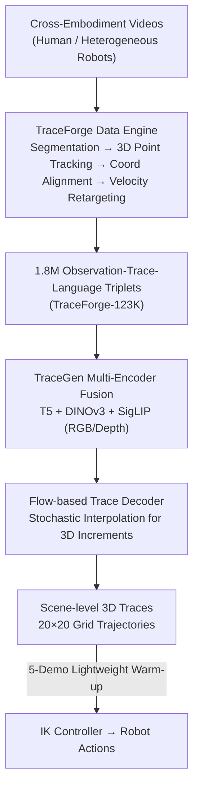

# TraceGen: World Modeling in 3D Trace Space Enables Learning from Cross-Embodiment Videos

**Conference**: CVPR 2026  
**Paper**: [CVF Open Access](https://openaccess.thecvf.com/content/CVPR2026/html/Lee_TraceGen_World_Modeling_in_3D_Trace_Space_Enables_Learning_from_CVPR_2026_paper.html)  
**Area**: Robotics / Embodied AI  
**Keywords**: World Models, Cross-Embodiment Learning, 3D Traces, Flow Matching, Few-Shot Manipulation

## TL;DR
TraceGen shifts "world modeling" from pixel space to a compact scene-level 3D trace space. Accompanied by the TraceForge data engine, it unifies 123,000 human and robot videos into consistent 3D traces to pre-train a cross-embodiment motion prior. Consequently, it achieves an 80% success rate on new robots/tasks with only 5 target demonstrations while inferring 50–600 times faster than video-generative world models.

## Background & Motivation
**Background**: Enabling robots to operate on new platforms and scenarios primarily relies on collecting massive demonstration data for specific embodiments, followed by training vision-language-action models or multi-task policies. However, target embodiment demonstrations are slow and expensive, whereas internet-scale human videos and diverse robot datasets are abundant.

**Limitations of Prior Work**: Cross-embodiment videos are "plentiful but unusable"—differences in embodiment, cameras, and scenes prevent direct reuse. Existing "pre-trained world model" routes have flaws: ① Video generation models predict future frames in pixel space, wasting computation on control-irrelevant backgrounds/textures and hallucinating incorrect geometry or grippers, with extremely slow inference. ② VLM-based planners output discrete tokens with coarse spatial/temporal resolution, failing to capture fine-grained object motion. ③ Previous trace prediction models, while efficient, are mostly trained on static lab demos and limited to 2D traces; a few 3D variants (e.g., 3DFlowAction) focus only on manipulated objects and rely on object detectors or heuristics, introducing cascading errors and failing to capture robot embodiment motion.

**Key Challenge**: Pixel space is expressive but contains too much control-irrelevant information, leading to computational waste and poor invariance. Trace space is compact and efficient, but previous versions were either 2D or dependent on specific detectors, making them unscalable and unable to cover cross-embodiment videos.

**Goal**: To find a unified representation that erases appearance/camera differences while preserving the geometric structure necessary for manipulation, allowing models to learn from cross-embodiment, cross-environment, and cross-task videos and quickly adapt to new robots with minimal data.

**Key Insight**: The authors observe that despite vast differences in kinematics and scale across embodiments, the motions of manipulated objects and end-effectors share a scene-centric 3D structure. Extracting this structure as a symbolic representation provides natural invariance to cameras and environments.

**Core Idea**: Propose **trace-space**—a sequence of scene-level 3D trajectories that only record "where and how" things move, discarding appearance and background. Let the world model, TraceGen, directly predict future motion in this space instead of generating pixels.

## Method

### Overall Architecture
TraceForge and TraceGen together form a unified world modeling framework. **TraceForge is the data engine**, converting heterogeneous human/robot videos into consistent 3D trace annotations, paired with multi-modal observations and language to produce {observation, trace, language} triplets. **TraceGen is the world model**, trained on these large-scale triplets to learn a scene-level motion prior, predicting future trajectories directly in the 3D trace space. The predicted 3D traces are then translated into robot actions by a lightweight low-level controller (Inverse Kinematics, IK).

TraceForge employs a four-step pipeline: event segmentation and instruction generation, raw trace generation via 3D point tracking with camera pose/depth estimation, world-to-camera coordinate transformation for viewpoint unification, and velocity retargeting to align demonstrations of varying durations/speeds. TraceGen uses a "multi-encoder feature extraction + flow-based trace decoder" architecture: frozen T5, DINOv3, and SigLIP encode language/RGB/depth into condition tokens, feeding a flow model adapted from CogVideoX to predict velocity-based 3D keypoint increments, finally de-patched into a $20\times20$ grid of 3D trajectories.

### Key Designs

**1. 3D Trace-space Representation: Replacing pixels with scene-level 3D trajectories.**

To address the inefficiency of pixel space, the coarseness of token space, and the limitations of 2D/object-only traces, TraceGen defines its output space as trace-space: a uniform $20\times20$ grid of keypoints $K$ on the reference frame, tracking their motion over the next $L$ steps. Each trace point is represented as $(x, y, z)$, where $(x, y)$ are image plane coordinates and $z$ is the depth. This "screen-aligned" design is crucial—it allows 3D and 2D traces to share the same format, enabling joint training and shared supervision (roughly 20% of the corpus is pure 2D traces to increase data scale).

Unlike prior 3D trace work that relies on detectors, TraceGen tracks the **entire scene grid**. Both the robot and objects are modeled together without bounding boxes or segmentation masks, avoiding cascading errors and providing a complete physical motion representation. This "geometric-only, scene-wide" compact representation serves as a bridge for reusing in-the-wild videos across embodiments.

**2. TraceForge Data Engine: Compressing heterogeneous videos into consistent 3D traces.**

TraceForge solves the problem of automated extraction from messy videos in four steps: ① **Event Segmentation & Instruction Generation**: Segments tasks based on motion and uses VLMs to generate three types of instructions (short imperative, multi-step, natural language) to reduce sensitivity to phrasing. ② **3D Point Tracking**: Tracks the $20\times20$ grid using TAPIP3D + CoTracker3, utilizing a SpatialTrackerV2-fine-tuned VGGT for depth/pose prediction to improve speed without losing accuracy. ③ **World-to-Camera Transformation**: Transforms world-coordinate traces into the reference camera frame $\mathrm{cam}_{\mathrm{ref}}$, combined with intrinsics to create screen-aligned 3D traces $T_{\mathrm{ref}}^{t:t+L} = [x_i, y_i, z_i]_{i=t}^{t+L}$, neutralizing camera motion. ④ **Velocity Retargeting**: Normalizes duration and speed across human/robot demos by re-sampling along the 3D path based on arc length, ensuring length alignment without distorting local motion patterns. The resulting dataset includes 123,000 videos and 1.8M triplets—15x larger than previous works.

**3. Flow-based Trace Decoder: Predicting velocity-driven 3D increments.**

TraceGen is built on the CogVideoX architecture with a multi-encoder fusion strategy: RGB is processed by frozen DINOv3 (geometry) and SigLIP (semantics); depth is processed by SigLIP with a learnable stem adapter; language uses T5-base. The visual stream is concatenated $F_{\text{vis}} = \text{Concat}(F_{\text{dino}}, F_{\text{siglip}}, F_{\text{depth}})$ and projected to dimension $D$ to form conditions $F_{\text{cond}}$ with text tokens.

The decoder predicts velocity increments rather than absolute coordinates. 3D traces are reconstructed via temporal differences: $\Delta T_{\mathrm{ref}}^{t} = T_{\mathrm{ref}}^{t+1} - T_{\mathrm{ref}}^{t}$. Using the Stochastic Interpolant framework, the interpolation path between data $X^1$ and noise $\varepsilon \sim \mathcal{N}(0, I)$ is defined as:

$$I_\tau = \alpha_\tau X^1 + \sigma_\tau \varepsilon, \quad \tau \in [0, 1],$$

With a linear schedule $\alpha_\tau = \tau,\ \sigma_\tau = 1-\tau$, the training target is to regress the constant velocity field $\dot{X}^\tau = X^1 - X^0$:

$$\mathcal{L}_{\text{SI}} = \mathbb{E}_{\tau, X^0, X^1}\left[\|v_\theta(X^\tau, \tau, F_{\text{cond}}) - (X^1 - X^0)\|^2\right].$$

At inference, 100-step ODE integration samples the trajectories. Spatial $2\times2$ patching is applied to the keypoints for efficiency.

**4. Lightweight Warm-up: 5 demonstrations to bridge embodiment-agnostic priors.**

Pre-training yields an embodiment-agnostic motion prior. To execute this on specific hardware, the model undergoes a minimal warm-up (5 demonstrations). The performance gain primarily stems from pre-training (reaching 80% with 5 demos, vs. 25% from scratch), indicating that the warm-up serves to "align" the prior to specific task configurations rather than learning movement from zero.

## Key Experimental Results

### Main Results
Evaluation on a Franka Research 3 robot across four tasks: Clothes (folding), Ball (placing in box), Brush (sweeping), and Block (moving to zone).

| Setting | Method | Parameters | Success Rate (4 Tasks) | Inference Efficiency |
|---------|--------|------------|------------------------|---------------------|
| Zero-shot | Baselines <10B | <10B | 0% (No valid trace) | — |
| Zero-shot | NovaFlow (Wan2.2/Veo3.1) | >10B | Low but non-zero | Very slow (>600x latency) |
| 5-demo warm-up | TraceGen | 0.67B | **80%** | 3.8x faster than trace baselines; >50x faster than video gen |

### Ablation Study

Pre-training vs. From Scratch (Impact of warm-up volume):

| Warm-up | Pre-train | Clothes | Ball | Brush | Block | Avg Success |
|---------|-----------|---------|------|-------|-------|-------------|
| 5 robot videos | None | 10/10 | 0/10 | 0/10 | 0/10 | 25.0% |
| 5 robot videos | TraceGen | 10/10 | 6/10 | 8/10 | 8/10 | **80%** |
| 15 robot videos | None | 10/10 | 0/10 | 0/10 | 0/10 | 25.0% |
| 15 robot videos | TraceGen | 10/10 | 9/10 | 8/10 | 6/10 | **82.5%** |

Source of Pre-training Data (with 5-demo warm-up):

| Task | From Scratch | SSV2 only | Agibot only | TraceForge-123K |
|------|--------------|-----------|-------------|-----------------|
| Ball | 0/10 | 3/10 | 4/10 | 6/10 |
| Block| 0/10 | 2/10 | 5/10 | 8/10 |
| Avg Success | 0% | 25% | 45% | **70%** |

**Human→Robot**: Using only 5 uncalibrated smartphone human videos for warm-up, the model achieves **67.5%** success, whereas from-scratch training yields 0%.

### Key Findings
- **Performance comes from Pre-training**: With 5 demos, pre-trained success is 80% vs 25% from scratch. Increasing demos to 15 only slightly raises success to 82.5%, proving warm-up is for "alignment."
- **Cross-Embodiment Data is Essential**: Single-source pre-training (human SSV2 25% / robot Agibot 45%) is significantly inferior to full data (70%), showing both embodiment alignment and heterogeneous motion coverage are vital.
- **Overwhelming Efficiency**: Predicting in trace-space makes TraceGen >50x faster than high-end video generation models.
- **Human→Robot Feasibility**: Despite differences in embodiments and camera intrinsics, the pre-trained prior achieves 67.5% with just 5 uncalibrated human videos.

## Highlights & Insights
- **"Change Representation, Not Just Model"**: Shifting the arena to scene-level 3D traces simultaneously solves invariance, precision, and efficiency. This representation choice is the primary innovation.
- **Joint 2D/3D Training via Screen-Alignment**: Treating depth as the third dimension of screen coordinates allows the model to leverage massive 2D tracking data (the "20% pure 2D" trick), scaling the supervision significantly.
- **Velocity-based Increments + Flow Matching**: Regressing constant velocity increments in trace-space is stable and fast, requiring only 100 ODE steps.
- **Scene Grid Tracking**: By tracking the entire scene instead of just objects, it eliminates detector dependency and captures the motion of the robot embodiment itself.

## Limitations & Future Work
- **Reliance on Simple IK**: The execution end uses a basic tracking controller. More complex policies for contact-rich or force-controlled tasks may require going beyond IK.
- **Perception Stack Dependency**: Accuracy depends on external models (TAPIP3D, CoTracker3, VGGT). Environments with heavy occlusion or no-texture surfaces may produce noisy supervision signals.
- **Evaluation Scale**: Real-world experiments are currently limited to four tabletop tasks. Generalization to long-horizon, bimanual, or highly deformable object tasks remains to be verified.

## Related Work & Insights
- **vs. Video Generative World Models (NovaFlow/AVDC)**: These waste computation on textures and suffer from high latency (600x). TraceGen predicts directly in 3D trace-space, being 50-600x faster and easier to warm-up.
- **vs. VLM Token Planners**: Tokens lack the spatio-temporal resolution for fine-grained motion. TraceGen's continuous 3D traces are much closer to control requirements.
- **vs. 2D/Object-centric Trace Methods**: 3DFlowAction focuses only on objects and introduces cascading errors from detectors. TraceGen tracks the full scene grid and utilizes 15x more training data.

## Rating
- Novelty: ⭐⭐⭐⭐⭐ 
- Experimental Thoroughness: ⭐⭐⭐⭐ 
- Writing Quality: ⭐⭐⭐⭐⭐ 
- Value: ⭐⭐⭐⭐⭐ 

<!-- RELATED:START -->

## Related Papers

- [\[CVPR 2026\] RoboWheel: A Data Engine from Real-World Human Demonstrations for Cross-Embodiment Robotic Learning](robowheel_a_data_engine_from_real-world_human_demonstrations_for_cross-embodimen.md)
- [\[CVPR 2026\] VideoWorld 2: Learning Transferable Knowledge from Real-world Videos](videoworld_2_learning_transferable_knowledge_from_real-world_videos.md)
- [\[CVPR 2026\] Learning a Unified Latent Action Space from Videos with Action-centric Cycle Consistency](learning_a_unified_latent_action_space_from_videos_with_action-centric_cycle_con.md)
- [\[CVPR 2026\] GraspGen-X: Cross-Embodiment 6-DOF Diffusion-based Grasping](graspgen-x_cross-embodiment_6-dof_diffusion-based_grasping.md)
- [\[CVPR 2026\] SemanticVLA: Towards Semantic Reasoning over Action Memorization via Synergistic Explicit Trace and Latent Action Planning](semanticvla_towards_semantic_reasoning_over_action_memorization_via_synergistic_.md)

<!-- RELATED:END -->
