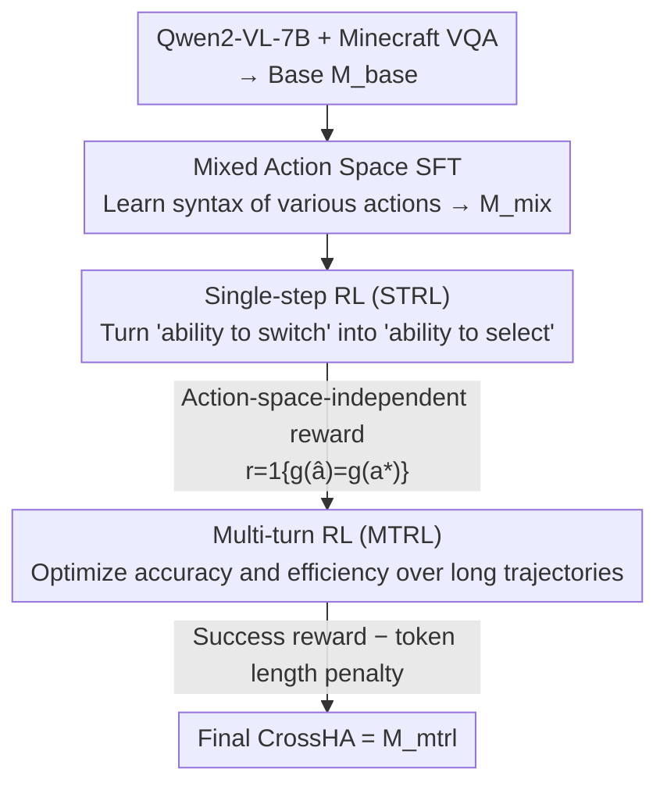

# Training One Model to Master Cross-Level Agentic Actions via Reinforcement Learning

**Conference**: CVPR 2026  
**arXiv**: [2512.09706](https://arxiv.org/abs/2512.09706)  
**Code**: https://github.com/CraftJarvis/OpenHA (Available)  
**Area**: Embodied AI / Agent / Reinforcement Learning  
**Keywords**: Heterogeneous Action Spaces, Action Space Selection, Multi-turn GRPO, Embodied Game Agent, Minecraft

## TL;DR
CrossHA unifies heterogeneous action spaces including "language, grounding, motion, atomic, and latent" into a single VLM agent. It employs a three-stage GRPO pipeline—"Mixed SFT → Single-step RL → Multi-turn RL"—to train the agent to **autonomously select the most suitable action space at each step** of a trajectory. Trained on only 30 Minecraft tasks, it generalizes to over 800 tasks and achieves SOTA performance (54.6% ASR across all tasks).

## Background & Motivation

**Background**: Native agentic models are shifting from "hand-crafted workflows around pretrained LLMs/VLMs" to "directly training action-capable models via post-training." However, current native agents are largely defined by a **single action space**: GUI agents issue mouse/keyboard events, Deep Research agents call APIs, Tool-Calling agents use MCP, and VLA models outputs robot commands.

**Limitations of Prior Work**: Hard-coding action spaces leads to two major flaws. First, specific action strategies or translation layers are fragile—an API-based `read_url` might be blocked by a CAPTCHA, or a robot policy might be imprecise; failure in a single interface caps the agent's overall success rate. Second, manually assigning action spaces to tasks limits flexibility in complex scenarios requiring multi-modal interaction.

**Key Challenge**: The authors observe that the **optimal action space varies not only by task but also at the step-level within the same task**. A Deep Research agent is most efficient using search APIs for information gathering, but must switch to fine-grained GUI operations when encountering a CAPTCHA. High-level interfaces are convenient but imprecise, while low-level primitives are precise but verbose and inefficient. There is an efficiency-precision trade-off that shifts dynamically.

**Goal**: Train a **single** generalist agent that autonomously decides "which action space to use + specific action content" at each step without hard-coded rules, balancing success rate and execution efficiency.

**Key Insight**: Since choosing the action space is essentially a context-dependent decision, it should be treated as a **learnable policy variable** optimized via reinforcement learning rather than heuristic rules. This allows the model to learn from experience when to switch grains.

**Core Idea**: Train a native agent, CrossHA, using RL (Multi-turn GRPO) to master heterogeneous action spaces. The "step-wise action space selection" is modeled as a policy learning problem. By adding a token length penalty to the success reward, the model is incentivized to prefer more concise (high-level) action spaces provided success is maintained.

## Method

### Overall Architecture
CrossHA models the task as an MDP with a **composite** action space $\mathcal{A}=\bigcup_{x=1}^{N}\mathcal{A}_x$, where each subspace $\mathcal{A}_x$ corresponds to a category of actions (ranging from low-level motor control to high-level motion primitives), each equipped with an interface/controller $C_x$ for environment execution. The agent determines both the subspace and the action content at each step. The optimization objective subtracts execution costs from immediate rewards:

$$J=\mathbb{E}\Big[\sum_t\big(r_t-\lambda_x\,\text{cost}(a_t)\big)\Big]$$

Where $\lambda_x\,\text{cost}(a_t)$ penalizes the computational or operational overhead (e.g., token length or execution time) of different granularities. The challenge is that "naive training" on a unified space rarely yields reliable context-dependent selection. Consequently, the authors design a **three-stage progressive curriculum**: Mixed SFT for basic syntax/semantics of multiple actions, Single-Step RL (STRL) to turn "switching capability" into "selection capability," and Multi-Turn RL (MTRL) to refine selection for both accuracy and efficiency over long trajectories. The model evolves as $M_{base}\to M_{mix}\to M_{cs1}\to M_{strl}\to M_{cs2}\to M_{mtrl}$ (CrossHA).

### Key Designs

**1. Unifying Heterogeneous Action Spaces: Learning Interface Selection as an Action Variable**

Addressing the fragility of hard-coded interfaces, CrossHA incorporates multiple **string-level** action spaces $\{\mathcal{A}_k\}_{k=1}^{K}$ into a single VLM output. These span a spectrum from high to low level: LanguageHA (language instructions), GroundingHA (visual grounding via SAM labels), MotionHA (motion primitives via MineCLIP), RawHA (atomic mouse/keyboard actions), and LatentHA (latent codes). Critically, each abstract action string is mapped via a **deterministic parser** $g:\mathcal{A}\to\mathcal{R}$ back to a canonical action in the original representation space $\mathcal{R}$. This aligns different interface expressions of the same physical action to a single judgment standard, enabling RL to focus on the validity of the executed action regardless of the space used.

**2. Mixed-Space SFT (Stage-1): Learning Format without Selection**

To prevent training issues where the model fails to learn selection behaviors in a unified space, the first stage focuses on "syntactic alignment" rather than "decision making." Using SAM grounding pipelines and fine-tuned MineCLIP modules, the authors auto-label VPT data and contractor trajectories with grounding/motion truths to form $D_{mix}$. SFT yields $M_{mix}$, which learns to generate syntax and semantics for various actions without interference. At this stage, $M_{mix}$ does **not yet autonomously select the optimal space**; its selection is passive. Decoupling action generation from policy selection provides a clean starting point for downstream RL.

**3. Single-step RL (STRL): Transforming Random Selection into Strategic Selection**

$M_{mix}$ exhibits **stochastic rather than strategic** selection. STRL begins with Diversity-Enhanced SFT: the model generates candidate actions across **all** available spaces for given contexts. Rejection sampling filters these, keeping only actions validated by the environment/parser as "success" as ground truths. After re-balancing, the model is fine-tuned to $M_{cs1}$. Subsequently, each sample is treated as a **single-step decision** optimized via GRPO. Unlike PPO, GRPO samples a group of outputs $\{o_1,\dots,o_G\}$ per query and uses group statistics to estimate the baseline:

$$J_{\text{GRPO}}(\theta)=\mathbb{E}\Big[\tfrac{1}{G}\sum_{i}\tfrac{1}{|o_i|}\sum_t \min\big(\rho_{i,t}\hat{A}_{i,t},\text{clip}(\rho_{i,t},1-\epsilon,1+\epsilon)\hat{A}_{i,t}\big)-\beta D_{\text{KL}}[\pi_\theta\|\pi_{\text{ref}}]\Big]$$

The reward is **action-space-independent**: $r(\hat a,a^\star)=\mathbb{1}\{g(\hat a)=g(a^\star)\}$. Regardless of the surface form, the model receives credit if the parsed primitive action matches the truth. This compels the model to **ignore prior biases and autonomously select the space that most reliably produces the correct action**, resulting in $M_{strl}$.

**4. Multi-turn RL (MTRL): From Single-step Accuracy to Long-term Efficiency**

$M_{strl}$ has high single-step precision but may over-concentrate its probability distribution, hindering long-term exploration. MTRL utilizes episodic success rates. First, Self-Training initialization is performed: $M_{strl}$ performs inference on the original dataset and labels are updated—if the predicted action's semantics match the truth ($g(\hat a)=g(a^\star)$), **the space chosen by $M_{strl}$ is adopted**; otherwise, the original label is kept:

$$a'(x)=\begin{cases}\hat a(x),&\text{if }g(\hat a(x))=g(a^\star(x))\\ a^\star(x),&\text{otherwise}\end{cases}$$

SFT on $D_{strl}$ yields $M_{cs2}$, providing MTRL with a strong prior for aligned space preferences. Multi-turn GRPO is then conducted on 30 tasks using a binary episodic reward $r(\tau)=\mathbb{1}\{\text{success}(\tau)\}$, while subtracting the total token count $l_\theta(\tau)$ of the trajectory:

$$J(\theta)=\mathbb{E}_{x\sim\mathcal{T}}\,\mathbb{E}_{\tau\sim\pi_\theta(\cdot|x)}\big[r(\tau)-\lambda\,l_\theta(\tau)\big]$$

The token penalty forces the model to **prefer concise, high-level action spaces** when both API and primitive approaches can succeed, leading to the emergence of efficiency-optimization behaviors. The resulting $M_{mtrl}$ is CrossHA.

### Loss & Training
The base Qwen2-VL-7B-Instruct is fine-tuned on Minecraft-specific VQA/captioning data to create $M_{base}$. STRL and MTRL both utilize GRPO. During MTRL, **30 tasks** (10 each from craft_item, kill_entity, mine_block) are used for online RL training over **80+ iterations**, with **6400+ environment interactions** per iteration until convergence. The $\lambda l_\theta(\tau)$ term in the MTRL objective is the core trick for mapping "token saving" to "high-level action preference."

## Key Experimental Results

The environment is Minecraft 1.16.5, with observations being 360×640×3 RGB (20Hz, no privileged state) and actions utilizing human-like mouse/keyboard interfaces. Evaluation uses the OpenHA benchmark's 800+ tasks across Mine Blocks (navigation + interaction), Kill Entities (combat), and Craft Items (complex GUI). Two metrics are used:

- **FT (Finished Tasks)**: The ratio of unique tasks successfully completed at least once in a category.
- **ASR (Average Success Rate)**: The average success rate across all tasks in a category.

### Main Results (800+ Tasks)

| Method | All FT ↑ | All ASR ↑ | Mine FT | Craft FT |
|------|---------|-----------|---------|----------|
| JARVIS-VLA | 63.8 | 24.5 | 55.3 | 74.3 |
| GroundingHA | 59.5 | 23.4 | 61.0 | 27.5 |
| OpenHA | 62.8 | 31.5 | 67.3 | 58.8 |
| Game-TARS | - | 42.2 | - | - |
| CrossHA (w/o STRL) | 44.9 | 41.6 | 35.1 | 55.7 |
| **Ours (CrossHA)** | 58.7 | **54.6** | **94.7** | **83.3** |

CrossHA leads significantly in ASR (54.6 vs OpenHA's 31.5 and Game-TARS's 42.2), peaking in Mine Blocks (FT 94.7) and Craft Items (FT 83.3). Single-space models have specific strengths but lack balance: GroundingHA excels in Kill Entity (FT 90.1), MotionHA in Mine Block, and RawHA in Craft Item due to fine control. No single-space baseline achieves cross-category balance, highlighting the value of dynamic selection.

### Ablation Study (ID vs OOD, All Tasks ASR)

| Method | ID-All | OOD-All | OOD-Craft |
|------|--------|---------|-----------|
| RawHA-RL | 70.1 | 42.4 | 69.8 |
| GroundingHA-RL | 52.6 | 39.4 | 57.2 |
| MotionHA-RL | 61.9 | 39.1 | 49.0 |
| CrossHA (w/o STRL) | 54.5 | 39.7 | 58.0 |
| **Ours (CrossHA)** | **68.8** | **49.1** | **78.8** |

### Key Findings
- **STRL stage is indispensable**: Removing STRL (using $D_{bal}$ directly to initialize MTRL) causes OOD All Tasks ASR to drop from 49.1 to 39.7. STRL improves sampling efficiency, final performance, and generalization with low computational cost.
- **Mixed action spaces boost RL data efficiency**: Compared to single-space baselines (grounding-only or motion-only), CrossHA converges faster and reaches higher asymptotic performance.
- **Dynamic selection mitigates overfitting**: RawHA-RL achieves a high ID-Craft (96.2) but drops sharply in OOD. CrossHA maintains a smaller ID-OOD gap, demonstrating that step-wise selection better transfers environmental knowledge.
- **Extreme generalization**: RL fine-tuning on only 30 tasks generalizes to 800+ tasks, with the most significant gains in fine-grained control domains (Craft Item).

## Highlights & Insights
- **Interface selection as a first-class learnable policy variable**: Unlike previous works that hard-code spaces or use fragile switching pipelines (e.g., OpenHA), CrossHA optimizes switching as a part of the policy. This marks a paradigm shift from "engineering assembly" to "learned decision-making."
- **Action-space-independent reward + Deterministic parser $g$**: By aligning different surface forms to the same deterministic outcome, RL signals focus on "what" was achieved rather than "how" it was formatted. This is the foundation for unifying heterogeneous spaces.
- **Token penalty as the engine of emergent efficiency**: By subtracting token length from the reward, the model learns "use high-level if possible, avoid verbose primitives." The efficiency-precision balance is discovered by data rather than manual rules.
- **Three-stage "Syntax → Selection → Efficiency" Curriculum**: Decoupling action learning from space selection, followed by single-step and then multi-turn refinement, provides a blueprint for training complex composite behaviors.

## Limitations & Future Work
- **Evaluation restricted to Minecraft**: While 800+ tasks are diverse, they are within one game. Expansion to real-world robotics (safety, latency) or digital domains (GUI/Deep Research) remains to be validated.
- **High Multi-turn RL costs**: 80+ iterations with 6400+ interactions each is expensive. Improving long-horizon RL efficiency is a future goal.
- **Predefined action space set**: The five spaces and their labeling pipelines (SAM, MineCLIP) require manual setup. The model does not yet discover or construct new action spaces.
- **Cost Approximation**: The implementation uses token length as a proxy for execution cost, which may not linearly correlate with actual time or failure risk in all scenarios.

## Related Work & Insights
- **Comparison with OpenHA / Computer-Use Agents (Operator, CoAct)**: These models support multiple spaces but lack optimized switching as a learnable decision variable, relying instead on in-context orchestration. CrossHA's RL optimization leads to more robust switching.
- **Comparison with Single-Space Experts (VPT, JARVIS-VLA, etc.)**: These are strong in niche areas but suffer from high variance and weak OOD transfer. CrossHA achieves balance and lower generalization gaps through dynamic selection.
- **Comparison with UI-TARS2 (Unified Action Spaces)**: While such works merge heterogeneous trajectories during SFT, CrossHA adds RL on top to truly *learn* the selection of the optimal interface at every step.

## Rating
- Novelty: ⭐⭐⭐⭐⭐ Modeling step-level space selection as an RL problem with action-independent rewards is a powerful design.
- Experimental Thoroughness: ⭐⭐⭐⭐ Extensive 800+ task evaluation and deep ablations; limited by the single-environment (Minecraft) setting.
- Writing Quality: ⭐⭐⭐⭐ Clear progression of the model stages and notation; the motivation is well-articulated.
- Value: ⭐⭐⭐⭐⭐ The paradigm of "interfaces as learnable variables + token-driven efficiency" is highly applicable to general agents across API, GUI, and physical domains. Code and models are open-sourced.

<!-- RELATED:START -->

## Related Papers

- [\[CVPR 2026\] Learning to Act Robustly with View-Invariant Latent Actions](learning_to_act_robustly_with_view-invariant_latent_actions.md)
- [\[CVPR 2026\] From Manuals to Actions: A Unified VLA Model for Chain-of-Thought Manual Generation and Robotic Manipulation](from_manuals_to_actions_a_unified_vla_model_for_chain-of-thought_manual_generati.md)
- [\[CVPR 2026\] MergeVLA: Cross-Skill Model Merging Toward a Generalist Vision-Language-Action Agent](mergevla_cross-skill_model_merging_toward_a_generalist_vision-language-action_ag.md)
- [\[ICLR 2026\] Cross-Embodiment Offline Reinforcement Learning for Heterogeneous Robot Datasets](../../ICLR2026/robotics/cross-embodiment_offline_reinforcement_learning_for_heterogeneous_robot_datasets.md)
- [\[CVPR 2026\] Video2Robo: 3DGS-based Synthetic Data from One Video Enables Scalable Robot Learning](video2robo_3dgs-based_synthetic_data_from_one_video_enables_scalable_robot_learn.md)

<!-- RELATED:END -->
