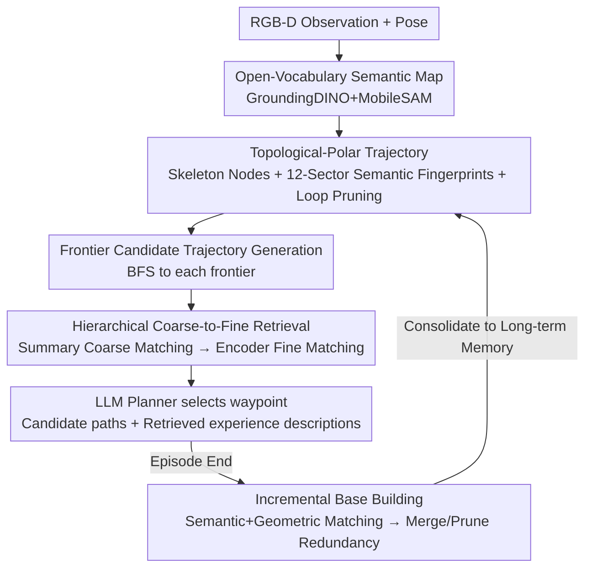

# TrajRAG: Retrieving Geometric-Semantic Experience for Zero-Shot Object Navigation

**Conference**: CVPR 2026  
**arXiv**: [2605.01700](https://arxiv.org/abs/2605.01700)  
**Code**: To be confirmed  
**Area**: Robotics / Embodied Navigation  
**Keywords**: Zero-Shot Object Navigation, Retrieval-Augmented Generation, Topological-Polar Trajectories, Lifelong Memory, LLM Planning

## TL;DR
TrajRAG compresses historical navigation trajectories into a "topological-polar" structure stored in a lifelong cumulative RAG knowledge base. During navigation, each candidate frontier generates a hypothetical trajectory to retrieve similar historical experiences in a coarse-to-fine manner. These experiences are then fed into an LLM planner to select the next waypoint, achieving new SOTA results across three zero-shot ObjectNav benchmarks: MP3D, HM3D-v1, and HM3D-v2.

## Background & Motivation
**Background**: Zero-shot object goal navigation (ObjectNav) requires an agent to find objects of specified categories in unseen environments using only first-person RGB-D observations. Current mainstream approaches leverage large model commonsense reasoning: either feeding current observations to LLM/VLMs for direct action (single-step context) or structuring episodic observations into similarity maps, scene graphs, or 3D language feature fields as "episodic memory" for reasoning.

**Limitations of Prior Work**: There are two fundamental disconnects in these methods. First, LLM knowledge stems from internet-scale text and is "scene-agnostic" general common sense, whereas the knowledge of "where beds are in bedrooms" or "kitchens following living rooms" is **embodied 3D spatial experience**—which LLMs lack. Second, episodic memory is "scene-specific" but **disposable**: observations accumulated during an episode are discarded after completion, preventing the formation of cross-scene, transferable lifelong experience. Consequently, agents repeatedly fail in similar layouts, explore redundantly, and revisit known areas.

**Key Challenge**: A gap exists between scene-agnostic commonsense reasoning (LLMs) and scene-specific spatial experience (episodic memory), combined with a lack of a carrier for lifelong episodic memory accumulation. Human navigation relies on both short-term memory (current details) and long-term memory (retrieved experiences), where short-term memory gradually consolidates into long-term memory—a "systemic internal representation" currently missing in embodied agents.

**Goal**: Construct a "long-term memory" that can (1) continuously accumulate episodic memory and (2) retrieve geometric-semantic experiences to enhance LLM reasoning.

**Key Insight**: Transfer Retrieval-Augmented Generation (RAG) from the text domain to the embodied world. However, raw trajectories (RGB-D sequences) are highly redundant within trajectories (revisits, local loops) and across trajectories (spatial overlap in the same scene). Storing them directly leads to memory explosion and retrieval inefficiency. The key lies in designing a **compact yet spatially accurate** trajectory representation.

**Core Idea**: Use "topological-polar trajectories" to compress raw observations into structural skeletons with polar semantic fingerprints, forming hierarchical RAG chunks. During navigation, candidate frontiers generate hypothetical trajectories to retrieve similar historical experiences from the library, which are injected into LLM planning. New trajectories are consolidated into the library after each episode for lifelong experience accumulation.

## Method

### Overall Architecture
TrajRAG solves how to allow an LLM planner to utilize past embodied navigation experiences. The pipeline consists of two paths: **Offline/Incremental Base Building**—converting historical trajectories into topological-polar representations, merging them by geometric-semantic similarity, and training a trajectory encoder for fine-grained retrieval indexing; and **Online Navigation**—where the agent builds a semantic map on the fly, generates candidate trajectories from frontiers, retrieves similar experiences from the library, and feeds descriptions of these experiences along with candidate paths to the LLM to select the optimal waypoint.

Specifically, the input is first-person RGB-D observations and poses, and the output is the next waypoint. The process includes: ① Incrementally building an open-vocabulary semantic map using GroundingDINO + MobileSAM; ② Skeletonizing traversable areas, extracting topological nodes, and assigning 12-dimensional polar sector semantic vectors to each node to obtain topological-polar trajectories; ③ Generating multiple candidate trajectory hypotheses from frontiers; ④ Performing coarse-to-fine retrieval in the hierarchical chunk library (coarse matching via summaries, fine matching via trained encoders); ⑤ Feeding retrieved experience descriptions + candidate paths → LLM planner to select $\pi^*$, with a local policy using A* to move.

### Key Designs

**1. Topological-Polar Trajectory: Compressing Redundant RGB-D Sequences into Structured Fingerprints**

Addressing trajectories that are redundant and hard to match, this process involves two steps. First, **Topological Skeletonization**: The explored free area $m_t^{free}$ in the semantic map is refined using morphological operations to a one-pixel skeleton $\mathcal{G}_{\text{skel}}=\mathcal{S}(m_t^{free})$. Pixels with $\geq 3$ connected components in an 8-neighborhood are selected as candidate nodes $\mathcal{V}_{\text{cand}}=\{v\in\mathcal{G}_{\text{skel}}\mid|\mathcal{N}_8(v)|\ge 3\}$ (junctions/forks), and nearby nodes are merged. Second, **Polar Semantic Encoding**: 12 polar rays are cast from each node $v_k$ every $\Delta\theta=30^\circ$. Each ray records the semantic of the first non-free pixel hit within radius $R$:

$$\phi_k(\theta)=\begin{cases}c,&\text{hit object }c\\\text{obstacle},&\text{hit obstacle}\\\text{unknown},&\text{hit unknown}\\\text{free},&\text{no hit within }R \end{cases}$$

The sector vector $\mathbf{s}_k=[\phi_k(\theta_1),\dots,\phi_k(\theta_{12})]$ forms the geometric-semantic fingerprint. Polar coordinates are used because absolute coordinates vary across episodes, while polar encoding captures **relative** spatial relationships. Finally, raw observation segments are assigned to the nearest node $v_t^*=\arg\min_{v_k}\|\mathbf{p}_t-\mathbf{p}_k\|_2$. Consecutive identical nodes are merged, and loops are pruned using $f_{\text{PL}}$ to obtain a loop-free topological-polar trajectory $\mathcal{T}_{\text{tp}}=(\mathcal{V},\mathcal{E})$.

**2. Hierarchical Chunk Base + Coarse-to-Fine Retrieval: Indexing Layout Groups and Trajectories**

To handle the complexity of matching many trajectories, the library is hierarchical: each **chunk** $\chi_i$ includes a trajectory $\mathcal{T}_{\text{tp}}^i$, its description $L(\mathcal{T}_{\text{tp}}^i)$, and an embedding $\mathbf{z}_i=f_E(\mathcal{T}_{\text{tp}}^i)$. Similar chunks are merged into a **Topological-Polar Summary** $\mathcal{G}_{\text{sum}}=(\mathcal{V}_{\text{uni}},\mathcal{E}_{\text{mrg}})$ as a coarse index. Retrieval first matches queries against summaries to lock onto relevant layout groups, filtering out irrelevant scenes, before performing fine-grained retrieval.

A specialized **Trajectory Encoder** $f_E$ serves as the fine index. Sector vectors $\mathbf{s}_k$ pass through an encoder-only transformer (e.g., DistilBERT) to produce node embeddings $\mathbf{h}_k$. These are sequenced through a decoder-only transformer (DistilGPT2) $\mathcal{D}_{\text{traj}}$ to capture temporal correlations. The final token representation is concatenated with the target semantic embedding $\mathbf{h}_g$ to form the trajectory embedding $\mathbf{z}=f_E(\mathcal{T}_{\text{tp}})=\mathbf{h}_L'\oplus\mathbf{h}_g$. Top-K nearest neighbors are retrieved in this embedding space.

**3. Incremental Base Building: Semantic/Geometric Matching and Redundancy Elimination**

This mechanism enables lifelong accumulation. New trajectories are first **semantically matched** with existing summaries by calculating a similarity matrix $S_{ij}=\max_{\Delta\theta}\text{sim}(\text{Rot}(\mathbf{s}_i,\Delta\theta),\mathbf{s}_j)$, where $\text{Rot}$ performs cyclic rotation to compensate for heading differences. Then, **Geometric Matching** uses RANSAC to estimate an $SE(2)$ transformation $\mathbf{T}=\arg\min_{\mathbf{T}}\sum\rho(\|\mathbf{T}\mathbf{p}_i-\mathbf{p}_j\|)$ to align the trajectory. If a valid $\mathbf{T}$ is found, the trajectory is merged; otherwise, it forms a new summary. **Redundancy Elimination** discards short trajectories that are sub-sequences of others with the same goal.

### Loss & Training
The trajectory encoder $f_E$ is trained using contrastive learning:

$$\mathcal{L}_{\text{contrast}}=-\log\frac{\exp(\text{sim}(\mathbf{z}_i,\mathbf{z}_j^+)/\tau)}{\sum_k\exp(\text{sim}(\mathbf{z}_i,\mathbf{z}_k)/\tau)}$$

Positive pairs $(\mathbf{z}_i,\mathbf{z}_j^+)$ are sampled from the same topological group or trajectories sharing a goal, while negative pairs are sampled randomly. The encoder-only transformer is initialized with pretrained weights and frozen. Training data includes 200k+ trajectories from HM3D-v1 and 150k+ from MP3D. Qwen3-32B is used for the LLM planner.

## Key Experimental Results

### Main Results
Evaluation on three zero-shot ObjectNav benchmarks for success rate (SR) and success weighted by path length (SPL). "OV" indicates support for open-vocabulary goals.

| Dataset | Metric | TrajRAG | Prev. SOTA (OV) | Gain |
|--------|------|---------|--------------|------|
| MP3D | SR / SPL | **42.6 / 18.0** | 41.0 / 17.8 (UniGoal / ApexNAV) | +1.6 / +0.2 |
| HM3D-v1 | SR / SPL | **62.5 / 33.9** | 61.4 / 33.0 (BeliefMapNav / ApexNAV) | +1.1 / +0.9 |
| HM3D-v2 | SR / SPL | **78.1 / 40.2** | 76.2 / 38.0 (ApexNAV) | +1.9 / +2.2 |

TrajRAG achieves new SOTA results across all benchmarks, attributed to using historical embodied experience from an external knowledge base to inform decision-making.

### Ablation Study

**Node Representation Ablation (HM3D-v1, Tab.1)**: TNA = Text Neighbor Aggregation; TPS-G = Topological-Polar Sector Geometry; TPS-S = Sector Semantics.

| Config | SR(%) | SPL(%) | Note |
|------|-------|--------|------|
| TNA | 53.9 | 25.7 | Aggregating text without spatial order |
| TPS-G | 48.1 | 22.3 | Geometry only, lack of semantic clues |
| TPS-S | 57.3 | 30.6 | Semantics only, exceeds TNA |
| TPS-G + TPS-S | **61.7** | **33.2** | Geometric + Semantic complementarity |

**Retrieval Strategy Ablation (HM3D-v1, Tab.2)**: TE = Text Embedding; SE = Our Sequence Embedding.

| Coarse | Fine | SR(%) | SPL(%) | Note |
|--------|------|-------|--------|------|
| ✗ | SE | 54.3 | 25.6 | No coarse matching |
| ✓ | TE | 57.8 | 29.7 | Coarse matching + standard text model |
| ✓ | SE | **61.7** | **33.2** | Full coarse-to-fine |

**Comparison with Other RAG Forms (HM3D-v1, Tab.3)**:

| Method | Retrieval / Content | SR(%) | SPL(%) |
|------|-------------|-------|--------|
| TrajTextRAG | Text Embedding / Descriptions | 53.3 | 25.6 |
| GraphRAG | Graph Embedding / Scene Graph | 55.2 | 30.7 |
| TrajRAG (Ours) | Hierarchical / Topological-Polar | **61.7** | **33.2** |

### Key Findings
- **Geometry and Semantics are Complementary**: Neither alone achieves optimal performance; geometry provides layout skeletons while semantics provide identities.
- **Scene-level Coarse Retrieval is Essential**: Removing coarse matching drops SR by 7.4%, highlighting the importance of filtering out irrelevant context.
- **Specialized Sequence Encoder > General Text Embeddings**: Pretrained text models fail to capture the temporal/sequential relations of trajectories.
- **Experience is Cross-Scene Transferable**: Cross-dataset performance drops only slightly, proving that topological-polar representations capture universal navigation clues.

## Highlights & Insights
- **Applying RAG to Embodied Navigation**: Solved the "chunk" definition problem by using topological-polar trajectories to handle compression and cross-execution matching.
- **Polar Sector + Cyclic Rotation**: A clever way to achieve rotation-invariant local layout matching, allowing identical layouts to be matched regardless of the agent's initial heading.
- **Bridging Commonsense and Experience**: LLMs handle general reasoning while the RAG library provides embodied experience, creating a systematic paradigm for lifelong learning.
- **Consolidation Mechanism**: The multi-level matching mechanism (semantic → geometric → redundancy) prevents the knowledge base from exploding, mimicking human memory consolidation.

## Limitations & Future Work
- **Dependency on Perception Quality**: Retrieval quality depends on the accuracy of GroundingDINO and MobileSAM; perception errors directly pollute the semantic fingerprints.
- **Small Marginal Gains**: Compared to previous SOTA, SR gains are around 1-2 points, raising questions about whether the complex pipeline is worth the absolute performance increase.
- **Frozen Test-Time Memory**: The library was frozen during testing to prevent leakage, meaning the "dynamic update" benefit was not directly quantified in main experiments.
- **Data Dependency**: Re-building the library for new platforms or real-world environments requires large-scale trajectory data.

## Related Work & Insights
- **vs VoroNav / CogNav (LLM-based)**: These convert scene info into text for LLM reasoning but lack real scene experience and lifelong accumulation. TrajRAG injects retrieved embodied experience.
- **vs VLFM / BeliefMapNav (VLM-based)**: These score frontiers based on current observations. TrajRAG uses hypothetical trajectories to look ahead at where a path usually leads based on experience.
- **vs Embodied-RAG / NavRAG (Embodied RAG)**: Prior works are often limited to single-scene retrieval or assume full map availability. TrajRAG enables cross-scene knowledge transfer and lifelong indexing.

## Rating
- Novelty: ⭐⭐⭐⭐⭐ First to systematically apply RAG to zero-shot ObjectNav using a specialized topological-polar representation.
- Experimental Thoroughness: ⭐⭐⭐⭐ Strong SOTA results and extensive ablations, though test-time accumulation was not fully explored.
- Writing Quality: ⭐⭐⭐⭐ Clear motivation and methodology, despite minor notation inconsistencies.
- Value: ⭐⭐⭐⭐ The "LLM + Cumulative Experience Base" paradigm is highly influential for lifelong embodied learning.

<!-- RELATED:START -->

## Related Papers

- [\[AAAI 2026\] PanoNav: Mapless Zero-Shot Object Navigation with Panoramic Scene Parsing and Dynamic Memory](../../AAAI2026/robotics/panonav_mapless_zero-shot_object_navigation_with_panoramic_scene_parsing_and_dyn.md)
- [\[CVPR 2026\] Bridging the 2D-3D Gap: A Hierarchical Semantic-Geometric Map for Vision Language Navigation](bridging_the_2d-3d_gap_a_hierarchical_semantic-geometric_map_for_vision_language.md)
- [\[ECCV 2024\] Prioritized Semantic Learning for Zero-shot Instance Navigation](../../ECCV2024/robotics/prioritized_semantic_learning_for_zero-shot_instance_navigation.md)
- [\[CVPR 2026\] Humanoid Generative Pre-Training for Zero-Shot Motion Tracking](humanoid_generative_pre-training_for_zero-shot_motion_tracking.md)
- [\[CVPR 2026\] Semantic Audio-Visual Navigation in Continuous Environments](semantic_audio-visual_navigation_in_continuous_environments.md)

<!-- RELATED:END -->
