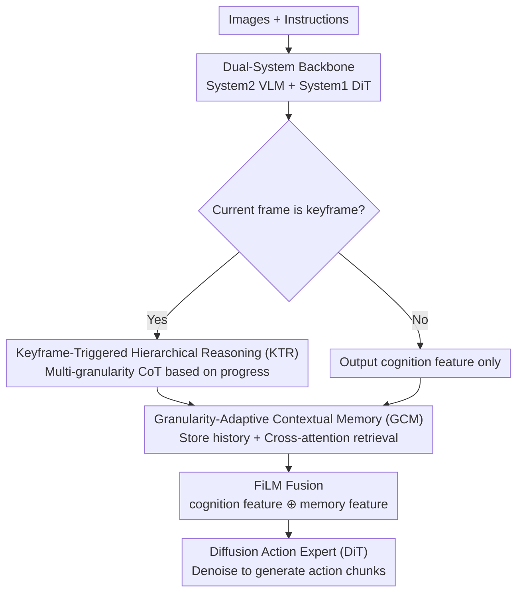

# TRM-VLA: Temporal-Aware Chain-of-Thought Reasoning and Memorization for Vision-Language-Action Models

**Conference**: CVPR 2026  
**Paper**: [CVF Open Access](https://openaccess.thecvf.com/content/CVPR2026/html/Li_TRM-VLA_Temporal-Aware_Chain-of-Thought_Reasoning_and_Memorization_for_Vision-Language-Action_Models_CVPR_2026_paper.html)  
**Code**: To be confirmed  
**Area**: Robotics / VLA / Embodied AI  
**Keywords**: VLA, Chain-of-Thought reasoning, Keyframe triggering, Contextual memory, Temporal consistency

## TL;DR
TRM-VLA enables VLA models to perform hierarchical Chain-of-Thought (CoT) reasoning only at "keyframes" and utilizes a granularity-adaptive memory buffer to retrieve historical reasoning across frames. This achieves a new state-of-the-art success rate (72.9% on SIMPLER) while reducing the CoT token count per step by approximately 4× across SIMPLER, LIBERO-90, and four real-world robot tasks.

## Background & Motivation
**Background**: Vision-Language-Action (VLA) models transfer the multimodal understanding of pre-trained VLMs to robotic control, serving as a mainstream paradigm for general-purpose manipulation policies. Recent works have integrated Chain-of-Thought (CoT) reasoning into VLAs, aiming to decompose complex tasks into intermediate steps to improve interpretability and success rates in long-horizon, compositional tasks.

**Limitations of Prior Work**: Directly applying CoT to VLA is suboptimal. The authors identify two specific issues. The first is **redundant reasoning**—existing methods generate a complete CoT trajectory at **every frame** (or at fixed intervals). However, since visual and linguistic contexts of adjacent frames are nearly identical, this results in repeated reasoning, leading to token explosions and slow inference with diminishing returns for decision-making. The second is **frame-independent reasoning**—CoTs are generated in isolation for each frame without temporal dependencies or memory, causing contradictory action plans. For instance, in a sequential task like "press red, then green, then blue," a model without memory cannot track which steps are completed from a static image, leading to repetitive actions and task failure.

**Key Challenge**: Robot manipulation is inherently **non-Markovian**—the current action depends onhistorical progress. Frame-by-frame reasoning considers only the current observation, naturally losing the temporal structure of the task. Consequently, "when to reason" and "how to carry history forward" have been neglected by existing methods.

**Goal**: (1) Sparsify reasoning—reasoning only at moments requiring a decision; (2) Enable reasoning with memory—retaining and retrieving reasoning results from past keyframes to ensure inter-frame plan consistency.

**Core Idea**: Inject explicit temporal modeling into the VLA reasoning process. This is achieved via "Keyframe-Triggered Hierarchical Reasoning (KTR)" for sparse, multi-level CoT based on task progress and "Granularity-Adaptive Contextual Memory (GCM)" to dynamically store and retrieve historical reasoning, integrating memory into the policy state to break the Markovian assumption of frame-by-frame reasoning.

## Method

### Overall Architecture
TRM-VLA is built upon CogACT, a "VLM + Diffusion Action Policy" dual-system baseline, following the System 2 / System 1 division inspired by cognitive science: **System 2** is the VLM backbone (DINOv2 + SigLIP vision encoders, LLaMA-2 language encoder, plus a learnable cognition token) responsible for slow, deliberate CoT generation; **System 1** is a Diffusion Transformer (DiT) action expert responsible for fast, reflexive action prediction.

The formalization of reasoning is key. While standard VLAs follow $a_t \sim P_\theta(a_t \mid o_t, l_t)$, and reasoning-augmented VLAs add an intermediate $r_t$ generated independently per frame, TRM-VLA conditions actions on a **memory-augmented reasoning state** $m_t$:

$$a_t \sim P_\theta(a_t \mid m_t, o_t, l_t), \quad m_t \sim P_\phi(m_t \mid r^h_1, \dots, r^h_t)$$

where $r^h_t \sim P_\theta(r^h_t \mid o_t, l_t)$ is the hierarchical CoT produced by KTR at keyframes, and $P_\phi$ (the GCM) aggregates the historical reasoning trajectory $\{r^h_1, \dots, r^h_t\}$ into a compact, temporally consistent $m_t$. At each timestep: if $t$ is a keyframe, KTR outputs a hierarchical CoT $r^h_t$ (otherwise, no reasoning occurs); simultaneously, the VLM always outputs a cognition feature $f_t$ encoding the current scene. GCM uses a learnable thinking query to retrieve relevant historical reasoning from the memory buffer via cross-attention. This retrieved feature is fused with the cognition feature via FiLM and fed as a condition to the DiT for iterative denoising to generate action chunks.

### Key Designs

**1. Keyframe-Triggered Hierarchical Reasoning (KTR)**

To address the redundancy of "full CoT per frame," KTR focuses on "thinking at the right time"—generating reasoning only at critical decision points (e.g., when the robot first grasps an object) and selecting the abstraction level of reasoning based on task progress. This is implemented via three components. First is **embodied reasoning annotation**: following the ECoT protocol, reasoning trajectories are split into semantic tags $tag \in \{\text{task, plan, perception, subtasks}\}$ covering high-level decomposition to low-level execution.

Second is **Keyframe Annotation (KBA)** to solve redundancy at the annotation level: high-level tags (e.g., plan) remain unchanged for long periods, while low-level tags (e.g., gripper position) change rapidly. Binary keyframe flags are defined for three reasoning granularities, set to 1 only when the content actually changes:

$$b^\tau_t = \begin{cases} 1, & r^\tau_t \neq r^\tau_{t-1} \\ 0, & \text{otherwise} \end{cases}, \quad \tau \in \{per, s, m\}$$

Third is the **Staged Temporal Structure (STS)**: an episode is divided into early/middle/late stages. Early stages focus on high-level planning; the middle stage triggers perception-anchored subtask decomposition only at perception keyframes; the late stage triggers low-level execution commands only at subtask/move keyframes. The training objective is standard causal next-token prediction $L_{KTR} = -\sum_{S \in D}\sum_t \log p(T_t \mid o_t, l_t; \theta)$, teaching the model *when* and *what* to reason.

**2. Granularity-Adaptive Contextual Memory (GCM)**

GCM maintains a **dictionary-style memory buffer** $C_{k_c}$ storing hierarchical CoT tokens from all prior keyframes. New reasoning $r^{tag}_{k_c}$ is inserted by **overwriting based on tag**: $C_{k_c} = C_{k_c-1} \cup \{r^{tag}_{k_c}\}$. A critical feature is **assigning different lifespans based on hierarchy**: high-level reasoning (task/plan) is retained until the task ends; mid-level reasoning is replaced when a new reasoning with the same tag appears; low-level reasoning has the shortest lifespan and is frequently updated.

Retrieval is handled via **Temporal Reasoning Integration (TRI)**: a learnable thinking query $q$ performs cross-attention over the context embeddings $f_{rc}$ in memory. $f_{rc}$ is maintained alongside $C_t$ to avoid re-running the VLM forward pass. The retrieved $f_{att}$ is fused with the current cognition feature $f_c$ via FiLM: $f_t = \text{FiLM}(f_c, f_{att})$.

**3. Dual-System Execution and Diffusion Action Expert**

The fused feature $f_t$ serves as a condition for the diffusion-based System 1 action expert (DiT), which denoises Gaussian noise into an action chunk $A = (a_1, \dots, a_{N_a})$. Training uses the standard noise MSE: $L_{MSE} = \mathbb{E}_{\epsilon \sim \mathcal{N}(0,1), i}\lVert \hat{\epsilon}_i - \epsilon \rVert^2$. Decoupling reasoning (slow, sparse, with memory) from execution (fast, continuous, diffusion-decoded) ensures System 2's deliberation does not slow down control frequency.

## Key Experimental Results

### Main Results
On SIMPLER-Bridge (real-to-sim evaluation, WidowX), TRM-VLA achieved an average success rate of 72.9%, a +21.6% improvement over the CogACT-Base baseline:

| Task/Dataset | Metric | TRM-VLA | Prev. Best | Gain |
|--------|------|------|----------|------|
| SIMPLER-Bridge | Avg SR | 72.9% | π0 69.2% / CogACT 51.3% | +21.6 vs Baseline |
| LIBERO-90 | SR | 94.8% | CogACT-ECoT 92.1% / CogACT 88.4% | +6.4 vs Baseline |

On four real robot tasks, সাফল্য rates and efficiency (CoT tokens per step) improved simultaneously:

| Model | Place Bear | Push Buttons | Clean Table | Scoop | Avg SR | Avg Tokens↓ |
|------|-----------|--------------|-------------|-------|--------|-------------|
| OpenVLA | 6/20 | 3/20 | 2/20 | 6/20 | 21.0% | 7.0 |
| CogACT-Base | 10/20 | 9/20 | 7/20 | 14/20 | 50.0% | 1.0 |
| ECoT | 7/20 | 5/20 | 3/20 | 7/20 | 28.0% | 26.8 |
| **TRM-VLA** | **15/20** | **12/20** | **11/20** | **17/20** | **69.0%** | **4.3** |

On Push Buttons (which requires remembering sequence), TRM-VLA achieved 67% vs CogACT-ECoT 45%. Tokens per step were reduced to 4.3, approximately 4× less than ECoT's 26.8.

### Ablation Study
Decomposing KTR and GCM on SIMPLER:

| ID | KTR(KBA/STS) | GCM(DRC/TRI) | Avg SR | Description |
|------|------|------|------|------|
| (a) | ✗/✗ | ✗/✗ | 0.54 | Without both |
| (c) | ✓/✓ | ✗/✗ | 0.65 | Full KTR, +11% |
| (f) | ✓/✓ | ✓/✓ | **0.73** | Full Model |

### Key Findings
- **Both modules are indispensable**: Removing GCM or KTR significantly drops success rates, confirming that temporal reasoning and memory are both required for long-horizon tasks.
- **Efficiency gains from sparse triggering**: Sparse reasoning allows TRM-VLA to obtain higher success rates while reducing token overhead to 4.3, helping avoid context pollution.
- **Memory provides robustness**: GCM helps the model focus on semantic/process invariants under distribution shifts (lighting, background, perspective changes).
- **Subtask specific performance**: On SIMPLER's Stack Cube, TRM-VLA (41.7%) was slightly lower than π0 (52.5%), suggesting that temporal memory provides less benefit for pure geometric tasks.

## Highlights & Insights
- **Dual sparsification of "Keyframe + Hierarchical Granularity"**: Decoupling "when to think" from "how detailed to think" is the fundamental source of token reduction.
- **Assigning lifespans based on hierarchy**: The design that high-level plans are "long-lived" while low-level actions are "short-lived" aligns naturally with physical intuition.
- **Memory retrieval reuse**: TRI reuses historical reasoning features without re-running the VLM forward pass, making memory computationally inexpensive.
- **Non-Markovian Modeling**: Explicitly modeling robotic tasks as "memory-augmented reasoning states" moves beyond the Markovian assumptions inherent in frame-by-frame CoT.

## Limitations & Future Work
- **Dependency on annotation quality**: Supervision for KBA/STS relies on multi-level temporal annotations; annotation noise directly affects the learning of "when to reason."
- **Heuristic memory lifespans**: Dividing lifespans into high/mid/low levels is a manual heuristic rather than learned.
- **Pure geometric tasks**: Advantages are concentrated in long-horizon/memory-dependent tasks; gains for pure spatial precision tasks are limited.
- **Baseline coupling**: The framework is built on CogACT; its effectiveness on non-diffusion or single-system VLAs is not yet verified.

## Related Work & Insights
- **vs ECoT**: These methods generate full, independent CoTs per frame, leading to token explosions (26+) and lack of memory. TRM-VLA uses sparse reasoning and memory retrieval.
- **vs CogACT-Base**: The baseline lacks explicit reasoning and struggles with long-horizon/memory tasks. TRM-VLA compensates for this with "inexpensive structured reasoning."
- **vs World Models**: While those methods use visual plans, TRM-VLA follows a "textual hierarchical CoT + memory" approach, which is more aligned with memory-dependent task logic without additional visual generation overhead.

## Rating
- Novelty: ⭐⭐⭐⭐ 
- Experimental Thoroughness: ⭐⭐⭐⭐ 
- Writing Quality: ⭐⭐⭐⭐ 
- Value: ⭐⭐⭐⭐ (4× token reduction is highly practical for real-time deployment.)

<!-- RELATED:START -->

## Related Papers

- [\[CVPR 2026\] ACoT-VLA: Action Chain-of-Thought for Vision-Language-Action Models](acot-vla_action_chain-of-thought_for_vision-language-action_models.md)
- [\[CVPR 2025\] CoT-VLA: Visual Chain-of-Thought Reasoning for Vision-Language-Action Models](../../CVPR2025/robotics/cot-vla_visual_chain-of-thought_reasoning_for_vision-language-action_models.md)
- [\[CVPR 2026\] FantasyVLN: Unified Multimodal Chain-of-Thought Reasoning for Vision-and-Language Navigation](fantasyvln_unified_multimodal_chain-of-thought_reasoning_for_vision-and-language.md)
- [\[CVPR 2026\] From Manuals to Actions: A Unified VLA Model for Chain-of-Thought Manual Generation and Robotic Manipulation](from_manuals_to_actions_a_unified_vla_model_for_chain-of-thought_manual_generati.md)
- [\[CVPR 2026\] Counterfactual VLA: Self-Reflective Vision-Language-Action Model with Adaptive Reasoning](counterfactual_vla_self-reflective_vision-language-action_model_with_adaptive_re.md)

<!-- RELATED:END -->
