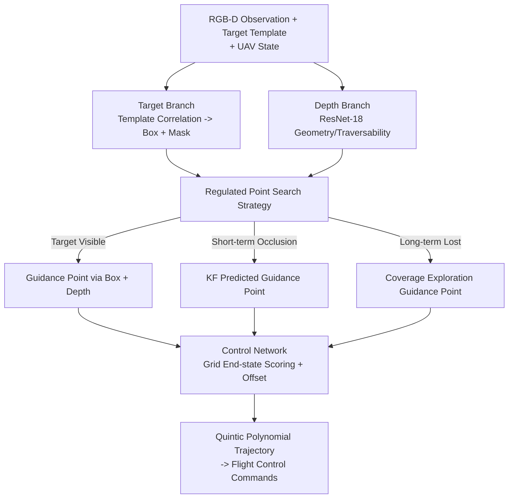

# UAST: Unified Active Search and Tracking for Arbitrary Targets with UAVs

**Conference**: CVPR 2026  
**Paper**: [CVF Open Access](https://openaccess.thecvf.com/content/CVPR2026/html/Qin_UAST_Unified_Active_Search_and_Tracking_for_Arbitrary_Targets_with_CVPR_2026_paper.html)  
**Code**: https://github.com/qinliangql/UAST  
**Area**: Robotics / Embodied AI (UAV Active Tracking and Search)  
**Keywords**: UAVs, Active Tracking, Active Search, Mapless Navigation, End-to-End Control

## TL;DR
UAST utilizes a mapless RGB-D framework to unify "active search for arbitrary targets" and "persistent tracking" into a single perception-control pipeline. A dual-branch perception combined with a regulated point search strategy adaptively switches between "Visible Tracking," "Short-term Occlusion Compensation," and "Lost Exploration" states. A lightweight control network directly outputs dynamically feasible trajectories, improving high-speed long-range tracking success rates by over 50% compared to SOTA and increasing search speed by approximately 3x in both simulation and real-world experiments.

## Background & Motivation

**Background**: Enabling UAVs to autonomously search for and persistently track arbitrary targets in cluttered environments using only onboard sensors is a core capability for inspection, surveillance, and search and rescue. Current approaches are divided into two categories: classical modular pipelines (perception → mapping → front-end path searching → back-end trajectory optimization), which are stable in structured scenes but incur significant memory and computational overhead for voxel map maintenance, making them unsuitable for high-speed or resource-constrained scenarios; and end-to-end learning controllers, which offer simple software stacks and agile flight but suffer from poor generalization and often fail with unseen targets/scenes, lacking reliable recovery mechanisms when the target is lost.

**Limitations of Prior Work**: Crucially, almost all existing work treats "search" and "tracking" as two independent tasks. Search methods (such as frontier-based exploration like FALCON and RACER) focus on covering unknown spaces, while tracking methods (visibility-constrained trajectory planning, elastic corridors) focus on keeping the target within the field of view (FOV). These systems operate separately. However, in real-world long-range tasks, targets may be occluded or turn abruptly, requiring a "seamless switch from tracking back to active search and then back to tracking," which disjointed systems cannot achieve smoothly.

**Key Challenge**: Tracking and search are essentially two phases of the same objective—tracking when confidence is high and exploring when confidence is low. However, modular pipelines split them into separate optimizations, while end-to-end controllers lack explicit priors for search or recovery behaviors. The core challenge is how to represent this "tracking-exploration" spectrum using a unified objective.

**Goal**: (1) Complete both active search and persistent tracking using a mapless, RGB-D-only framework; (2) achieve fast and smooth recovery when the target is occluded or lost; (3) ensure class-agnostic generalization for arbitrary targets with real-time deployment on hardware.

**Key Insight**: The authors unify search and tracking as a "guidance point-conditioned trajectory optimization" problem. This guidance point is derived from a regulated strategy: when the target is reliable, the guidance point points to the target (tracking); when uncertain, it points toward unexplored regions (exploration). Thus, the same optimization framework naturally generates continuous behavior from tracking to exploration.

**Core Idea**: A "Regulated Point Search Strategy" outputs unified guidance points, collapsing search and tracking into a single trajectory optimization. A lightweight control network then predicts feasible trajectories from fused perception features—without mapping or multi-stage planning.

## Method

### Overall Architecture
The input to UAST consists of RGB-D observations $I_t=\{I^{rgb}_t, I^d_t\}$, UAV motion states $s_t=\{v_t, a_t\}$, and a target template $M^{target}$. The output is a short-horizon terminal state $S^{end}_{t+T}=\{p_{t+T}, v_{t+T}, a_{t+T}\}$, from which a dynamically feasible trajectory is solved to derive control commands. The pipeline comprises four components: a **Target Branch** and a **Depth Branch** extract target appearance and geometric/traversability features, respectively. These, along with historical states, are fed into the **Regulated Point Search Strategy**, which generates a guidance point based on target visibility (pointing to the target when tracking, and an exploration point when lost). Finally, the guidance point, fused with movement stats and perception features, is used by the **Control Network** to predict terminal state offsets and fit smooth trajectories.

Theoretically, UAST formulates search-tracking as a unified trajectory optimization $f^*(t)=\arg\min_{f(t)} L_{traj}(f(t); g_t(m_t))$, where the guidance point $g_t$ is determined by the belief state $m_t$. A high $m_t$ pulls $g_t$ toward tracking, while uncertainty pulls it toward exploration.

### Key Designs

**1. Dual-branch class-agnostic perception: Decoupling target localization and environment geometry**

To solve the generalization issue where end-to-end controllers fail when targets or scenes change, UAST splits perception. The **Target Branch** uses a shared-weight AlexNet to encode the RGB frame $F^{rgb}_t$ and target template $F^{temp}$ (extracted once at initialization). Cross-correlation produces a response map, and a lightweight head predicts the bounding box and a coarse mask, which is encoded into a compact representation $F^{target}_t$. It relies on mask-level localization rather than full appearance, ensuring class-agnostic generalization. The **Depth Branch** uses ResNet-18 to encode the depth map into $F^{depth}_t$, capturing surface geometry and traversability.

**2. Regulated Point Search Strategy: Unifying tracking and search via three-state switching**

This strategy produces a coarse guidance point based on three target conditions:
- **Reliable**: If the box confidence $m_t > \tau_{det}$, the median depth $\bar z$ from the center region of the box is used to project a 3D point $g^{cam}_t=\big((u_c-c_x)\bar z/f_x,\ (v_c-c_y)\bar z/f_y,\ \bar z\big)^\top$ in the camera frame.
- **Temporarily Invisible**: A constant velocity Kalman Filter (KF) smoothes the guidance point. If the innovation residual $\eta_t$ exceeds threshold $\tau_{innov}$, the prediction prior $\hat g^{world}_t$ is used to handle noise or partial occlusion.
- **Lost**: If the target is unseen for $T_{lost}$ frames, the system switches to exploration mode. It samples the farthest point in the unexplored area surrounding the current position $p_t$ as the guidance point $g^{world}_t=\arg\max_{c_k}\lVert c_k-p_t\rVert$. If no points are available, it follows a spiral search $r(\theta)=r_0+\epsilon\theta$ and adaptively expands the radius.

**3. Control Network: Grid-based terminal state scoring + Quintic polynomial**

To avoid high-latency iterative solvers, UAST uses a single forward pass. Fused perception tensors are organized into a $V\times H$ grid. For each cell, the network predicts a terminal state offset $\Delta S^{off}_{v,h}$ and a trajectory cost score $s_{v,h}$. The cell with the minimum cost defines the optimal terminal state $S^{end}_{t+T}$, and a quintic polynomial $f(t)$ is fitted (satisfying position, velocity, and acceleration constraints at both ends) to generate smooth control commands $u_t$.

**4. Tracking-aware visibility loss + Automated data construction**

A **tracking-aware visibility loss** $L_{track}=\lambda_a L_{occ}+\lambda_f L_{fov}$ is designed to keep the target in view and unblocked. $L_{occ}$ samples Signed Distance Function (SDF) values along the line-of-sight to penalize occlusions, while $L_{fov}$ penalizes deviations from the camera's FOV. For training data, the authors use a static point cloud to render RGB-D frames and project synthetic targets (drones, people, animals) into the scene, ensuring diverse target configurations and varying levels of occlusion.

### Loss & Training
The target branch is pre-trained and frozen. The depth branch, mask encoder, and control network are trained end-to-end. The total loss is $L=\lambda_t L_{traj}+\lambda_s L_{score}$, where $L_{traj}$ includes tracking, goal, smoothness, and safety components. Training on 100k+ samples takes about 8 hours on an RTX 4090.

## Key Experimental Results

### Main Results

Tracking success rate over short-range flights at varying speeds:

| Method | 3 m/s | 4 m/s | 5 m/s | 6 m/s |
|------|-------|-------|-------|-------|
| Vis. (Mapping) [30] | 0.85 | 0.60 | 0.15 | 0.15 |
| Elas. (Elastic Corridor) [15] | 0.90 | 0.60 | 0.10 | 0.00 |
| Yopov2 (End-to-End) [25] | 1.00 | 0.90 | 0.90 | 0.80 |
| **UAST (Ours)** | **1.00** | **1.00** | **0.93** | **0.88** |

Long-range tracking success rate and latency (cluttered environment, 1–1.5 km):

| Method | 3 m/s SR | 5 m/s SR | Latency (ms) |
|------|----------|----------|---------------|
| Vis. [30] | 0.44 | 0.05 | 60.5 |
| Elas. [15] | 0.51 | 0.03 | 26.4 |
| Yopov2 [25] | 0.67 | 0.36 | 7.0 |
| **UAST** | **0.99** | **0.89** | 8.6 |

Active search comparison:

| Method | Search Time ST(s)↓ | Dist(m)↓ | Vel(m/s)↑ | Latency(ms)↓ |
|------|------|------|------|------|
| RACER [46] | 176.62 | 293.19 | 1.66 | 43.1 |
| FALCON [41] | 146.67 | 265.48 | 1.81 | 37.2 |
| **UAST** | **54.49** | 268.67 | **4.93** | **8.6** |

### Ablation Study

Ablation at 5 m/s:

| Configuration | Short-range SR↑ | Long-range SR↑ | FOV Center Dist (m)↓ | Description |
|------|---------|---------|------|------|
| W/O search | 0.88 | 0.52 | 0.57 | Lost relocalization fails |
| W/O track loss | 0.85 | 0.82 | 0.82 | Target drifts from FOV center |
| W/O guid point | 0.70 | 0.33 | 0.69 | Total system breakdown |
| **Ours** | **0.93** | **0.89** | **0.57** | Full Model |

### Key Findings
- **Removing the regulated point search strategy (W/O guid point) causes the most severe drop**, proving that unified search-tracking behavior is the system's core.
- **Exploration (W/O search) is critical for long-range success** (0.89 vs 0.52), as it enables recovery after loss.
- **The tracking-aware visibility loss improves stability**, keeping the target centered in the FOV rather than just increasing success rates.
- UAST dominates in high-speed scenarios (5 m/s) where mapping-based methods fail due to latency and data-driven methods fail due to lack of recovery.

## Highlights & Insights
- **The unification of search and tracking as a "guidance point confidence" spectrum** is a significant contribution, allowing for seamless transitions without complex switching logic.
- **The three-state rule strategy + KF** provides a robust formula for real-world failures: geometric projection for visibility, constant-velocity priors for occlusion, and adaptive coverage for total loss.
- **Grid-based terminal state scoring** enables reactive planning at 8.6 ms, making it suitable for low-power hardware like Jetson NX.
- **Differentiable visibility constraints** bake perception awareness directly into the control policy rather than applying them as runtime hard constraints.

## Limitations & Future Work
- **External Localization Dependence**: The system currently requires state estimation (e.g., Fast-LIO) to transform points to the world frame.
- **Single Target & Static Templates**: The target template is frozen after initialization, which may fail under extreme lighting changes or deformation.
- **Heuristic Exploration**: The current "farthest point + spiral" search is a greedy heuristic and might not be as efficient as information-theoretic methods in complex mazes.
- **Parameter Sensitivity**: Several thresholds ($\tau_{det}$, etc.) are manually tuned and may require re-calibration for different sensors.

## Related Work & Insights
- **Compared to modular tracking (Vis./Elas.)**: These methods suffer from mapping overhead and high latency (26–60 ms), whereas UAST's mapless 8.6 ms latency enables high-speed tracking success (0.89 vs 0.05 at 5 m/s).
- **Compared to E2E controllers (Yopov2)**: UAST adds structural priors for search and recovery, allowing it to recover when the target is lost, whereas standard E2E methods cannot.
- **Compared to active search (RACER/FALCON)**: UAST completes search tasks in about 1/3 of the time by coupling perception and movement through a reactive control loop rather than multi-stage path planning.

## Rating
- Novelty: ⭐⭐⭐⭐
- Experimental Thoroughness: ⭐⭐⭐⭐
- Writing Quality: ⭐⭐⭐⭐
- Value: ⭐⭐⭐⭐

<!-- RELATED:START -->

## Related Papers

- [\[CVPR 2026\] Instance-level Visual Active Tracking with Occlusion-Aware Planning](instance-level_visual_active_tracking_with_occlusion-aware_planning.md)
- [\[CVPR 2026\] AdaDexTrack: Dynamic Modulation for Adaptive and Generalizable Dexterous Manipulation Tracking](adadextrack_dynamic_modulation_for_adaptive_and_generalizable_dexterous_manipula.md)
- [\[CVPR 2026\] Parse, Search, and Confirmation: Training-Free Aerial Vision-and-Dialog Navigation with Chain-of-Thought Reasoning and Structured Spatial Memory](parse_search_and_confirmation_training-free_aerial_vision-and-dialog_navigation_.md)
- [\[CVPR 2026\] Motus: A Unified Latent Action World Model](motus_a_unified_latent_action_world_model.md)
- [\[CVPR 2026\] CUBic: Coordinated Unified Bimanual Perception and Control Framework](cubic_coordinated_unified_bimanual_perception_and_control_framework.md)

<!-- RELATED:END -->
