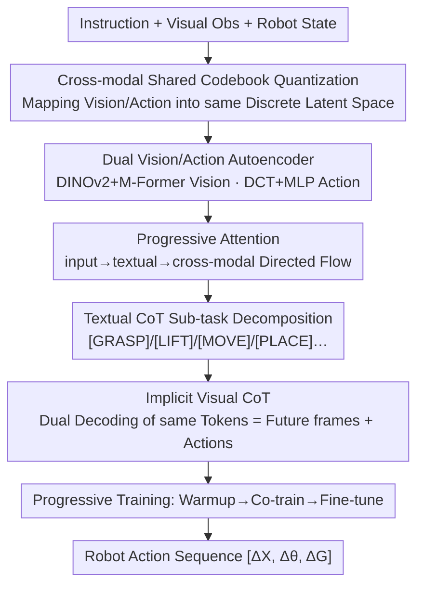

# Unifying Perception and Action: A Hybrid-Modality Pipeline with Implicit Visual Chain-of-Thought for Robotic Action Generation (VITA)

**Conference**: CVPR 2026  
**Paper**: [CVF Open Access](https://openaccess.thecvf.com/content/CVPR2026/html/Ma_Unifying_Perception_and_Action_A_Hybrid_Modality_Pipeline_with_Implicit_Visual_CVPR_2026_paper.html)  
**Code**: https://vita-cvpr26.github.io/ (Project Page)  
**Area**: Robotics / Embodied AI / Vision-Language-Action  
**Keywords**: VLA, Visual Chain-of-Thought, Shared Codebook, Forward/Inverse Dynamics, Robot Manipulation

## TL;DR
VITA proposes unifying perception and control using a "vision-action shared discrete latent space." The same sequence of tokens autoregressively generated by the VLM backbone is simultaneously decoded into "future video frames" and "robot actions." By treating visual prediction as an inductive bias for action generation (Implicit Visual CoT), the model bridges the modality gap between visual observations and low-dimensional actions while avoiding the training instability and high latency of "predict-then-act" paradigms. It achieves gains of 14.5%/9.6%/12.1% on CALVIN/LIBERO/SimplerEnv respectively, and an 80.5% average success rate across 6 real-world tasks.

## Background & Motivation

**Background**: Vision-Language-Action (VLA) models based on VLMs connect visual-semantic priors to executable motor commands via policy heads or discrete action decoders. To enhance long-horizon task reasoning and interpretability, early works decomposed high-level instructions into sub-task sequences, treated as purely textual chain-of-thought (T-CoT).

**Limitations of Prior Work**: Pure T-CoT lacks sufficient "grounding" in complex spatial scenes and suffers from semantic ambiguity, making it difficult to fully comprehend fine-grained visual context. A promising alternative is using visual dynamics as a prior to guide action generation—predicting future frames given an initial frame and instruction, then transferring these visual priors to manipulation via fine-tuning. However, this "predict-then-act" route faces two inherent challenges: (i) **Modality Gap**—the massive discrepancy between high-dimensional visual observations and low-dimensional actions; pixel-level details in generated future images are often irrelevant to action execution. (ii) **Target Competition Leading to Instability**—the optimization objectives of visual prediction proxy tasks and action generation tasks often conflict, preventing the policy from fully utilizing learned visual dynamics; furthermore, generating a full image before an action introduces high latency unsuitable for high-frequency manipulation.

**Key Challenge**: Visual prediction and action generation are treated as two independent streams. Conflicting optimization objectives cause rapid forgetting of pre-trained knowledge, while the mismatch between high-dimensional vision and low-dimensional actions makes "direct alignment of input images and output commands" inherently difficult.

**Goal**: (1) Bridge the vision-action modality gap at the representation layer; (2) Make visual prediction a true inductive bias for action generation rather than a competing independent decoding target; (3) Eliminate the serial latency of "generating a full image before acting."

**Key Insight**: Instead of explicitly simulating future visual states in the mind before acting, the human brain develops "motor intuition" based on task requirements and perception to directly drive precise commands. The authors aim to unify "perceptual prediction" and "action execution" into learning this motor intuition.

**Core Idea**: Construct a **shared discrete codebook/latent space** for vision and action. The same sequence of latent tokens generated by the VLM is simultaneously reconstructed by two decoders into future frames and actions. The visual sub-objective extracts motor intuition from the predicted future scene, while the action sub-objective inversely derives commands from the spatial evolution of motor states. This achieves dual alignment in both representation and optimization, termed "Implicit Visual CoT."

## Method

### Overall Architecture
VITA (Vision-Integrated Trajectory Alignment) is a unified VLA framework for perception and action. Its core consists of "one shared discrete codebook + dual autoencoders + VLM backbone + dual decoders." Training proceeds in three progressive stages: ① **Warmup (Cross-modal Alignment)**: Self-supervised training of the vision autoencoder, action autoencoder, and **shared quantizer/codebook** on independent video and action data. Vision and action are mapped into the same discrete latent vocabulary (**no** paired video-action data required here). ② **Co-train (Visual Priors Aligning Action)**: With a frozen codebook, the vision and action decoders are connected to the VLM backbone. The VLM and decoders are jointly trained on a mixture of "video-only" and "video-action pairs." The same tokens generated by the VLM are used to simultaneously decode future frames and actions via the shared codebook (Implicit Visual CoT). ③ **Fine-tune**: Only the action decoder is fine-tuned on specific simulation/real-world datasets, while the VLM backbone is frozen to reduce deployment latency. Inference uses only the lightweight architecture of VLM backbone + action decoder.

The VLM backbone implements a two-stage reasoning process: first, **Textual CoT** decomposes high-level instructions into symbolic sub-tasks ([GRASP]/[LIFT]/[MOVE]/[PLACE]...); then, **Internal CoT** autoregressively generates vision-action hybrid latent tokens guided by sub-task priors. These stages are coordinated by a **Progressive Attention Mechanism** (mixed bidirectional + causal), forming a directed flow from input → textual → cross-modal.

### Key Designs

**1. Cross-modal Shared Codebook Quantization: Grounding Vision and Action in the Same Latent Space**

To address the "high-dimensional vision ↔ low-dimensional action" gap, VITA uses a shared codebook $C=\{c_k\}_{k=1}^{K}\subset\mathbb{R}^d$ and a quantization operator $Q(z)=c_k,\ k=\arg\min_j\|z-c_j\|_2$. During Warmup, the vision encoding module $(E_v)$ and action encoding module $(E_a)$ are trained independently. Each only needs to minimize reconstruction loss under its respective decoder **without any cross-modal paired supervision**; however, partial gradients from the reconstruction process jointly optimize the shared quantization components. The key insight is that the shared codebook enforces **structural consistency** between vision and action in the latent space. This implicit alignment provides the foundation for "dual decoding from a single token stream" without needing explicit cross-modal labels during early stages.

**2. Dual Autoencoders: Motion Perception for Vision, Frequency Compression for Action**

Vision branch: Given a pair of adjacent frames $(I_t, I_{t+1})$, a frozen DINOv2 extracts dense spatiotemporal features, which are then compressed into a compact motion embedding $z_v$ by an M-Former with memory. After quantization, the vision decoder reconstructs the future frame $\hat I_{t+1}=D_v(f_t,\hat z_v)$ using L1 + SSIM loss: $L_v=\lambda_{L1}\|I_{t+1}-\hat I_{t+1}\|_1+\lambda_{SSIM}(1-\mathrm{SSIM}(I_{t+1},\hat I_{t+1}))$. Since the quantizer learns from massive internet video data without action labels, it captures rich motion priors. Action branch: For an action segment $a_{t:t+H}$ (including position $\Delta x$, rotation $\Delta\theta$, and gripper force $\Delta F$), the model uses **Discrete Cosine Transform (DCT)** to compress temporal dynamics into frequency coefficients, encoded into $z_a$ via a lightweight MLP. After quantization, it is decoded back to continuous trajectories via inverse DCT + MLP, supervised by MSE: $L_a=\|a_{t:t+H}-\hat a_{t:t+H}\|_2^2$ (Frequency encoding inspired by FAST). The shared codebook ensures semantic alignment between the two branches.

**3. Progressive Attention + Two-stage CoT: Decoupling Action Prediction into Collaborative Inference Streams**

To coordinate textual and cross-modal reasoning, the authors designed a progressive attention mechanism. Tokens are grouped into input (instruction + visual obs), textual, and cross-modal. During inference, bidirectional attention is first applied within the input group to capture global context and generate textual tokens **in parallel**. When generating cross-modal tokens, bidirectional attention is applied within input and textual groups for intra-chain interaction, while **causal attention** is enforced across the three groups to form a directed flow: $\text{input}\to\text{textual}\to\text{cross-modal}$ (Eq. 9). VITA thus structures action prediction into two collaborative yet decoupled processes: (1) **Textual CoT for Perceptual Understanding**—extracting structured task semantics to map high-level intent to symbolic sub-tasks (fixed sub-task vocabulary $Z_{sub}$); (2) **Internal CoT for Motion Planning**—generating low-dimensional commands aligned with future visual scene evolution under sub-task guidance. Notably, VITA trains Textual CoT generation **indirectly** through multi-modal joint optimization without relying on explicit sub-task labels, balancing scalability, stability, and interpretability.

**4. Implicit Visual CoT: Dual Decoding as an Inductive Bias**

This is the key differentiator from "predict-then-act." In the second stage, the VLM backbone autoregressively generates a sequence of latent tokens $\{\tau_i\}_{i=1}^{L}$ (each indexing the shared codebook). These are **simultaneously** routed to two parallel decoders: $\hat I_{1:T}=D_v(\{c_{\tau_i}\})$ reconstructs future frames and $\hat a_{1:H}=D_a(\{c_{\tau_i}\})$ reconstructs actions (Eq. 15). By unifying future scenes and robot actions into a single latent stream, the visual prediction task serves as an **inductive bias that regularizes action generation**, while action supervision distills only task-relevant visual dynamics, filtering out irrelevant pixel details. This solves the modality gap and target competition issues without the serial latency of explicit image generation.

### Loss & Training
Progressive three-stage strategy: **Warmup** minimizes vision loss $L_v$ (Eq. 4, frame prediction) and action loss $L_a$ (Eq. 8, action reconstruction) separately to establish a modality-agnostic discrete vocabulary without paired data. **Co-train** freezes the codebook and applies losses based on sample type: video-only samples use vision loss $L_{co}=\sum_t[\lambda_{L1}\|I_t-\hat I_t\|_1+\lambda_{SSIM}(1-\mathrm{SSIM})]$ (Eq. 18); paired samples use joint decoding: $L_{co}=\lambda_v\|I_{1:T}-\hat I_{1:T}\|_1+\lambda_a\|a_{1:H}-\hat a_{1:H}\|_2^2$ (Eq. 19). **Fine-tune** updates only the action decoder while freezing the VLM backbone. Implementation follows Pi0: SigLIP (400M) vision tokenizer + Gemma (2B) backbone, 12-layer ViT vision decoder (96M) + Transformer action decoder (228M, larger to precisely reconstruct high-dimensional temporal trajectories); 16×A100 for 300K steps (~5 days), 2.8B trainable parameters.

## Key Experimental Results

### Main Results

| Benchmark | Metric | VITA | Strongest Baseline | Note |
|------|------|------|--------------|------|
| CALVIN ABC-D | Avg. Len (Success for 5 consecutive tasks) | 4.73 | DeFI 4.51 / UniVLA 4.41 | Leading significantly in long-horizon tasks |
| LIBERO | Avg. Success Rate / % | 96.7 | UniVLA 95.5 | LIBERO-Long +36.2% over CoT-VLA |
| SimplerEnv-GoogleRobot | Avg. Success Rate / % | 57.4 | DeFI 51.2 | Visual matching setting |
| SimplerEnv-WidowX | Avg. Success Rate / % | 71.5 | UniVLA 69.8 | PutCarrot from OpenVLA 20.8 → 68.8 |
| Real World (UR-5e, 6 tasks) | Avg. Success Rate / % | 80.5 | Pi0 53.5 | Robust on OOD tasks |

On CALVIN ABC-D, VITA’s 1→5 consecutive completion rates are 99.1/94.9/91.2/87.8/84.5. The advantage is most pronounced in long-horizon scenarios (completing 3-5 tasks). In the real world, VITA remains robust on OOD tasks (Inverse Execution at 66, Conditional Decision at 71), whereas baselines like Octo drop significantly (e.g., -48% on OOD).

### Ablation Study

| Ablation Dimension | Configuration | LIBERO | LIBERO-Long | CALVIN (Avg. Num) | Conclusion |
|---------|------|--------|-------------|-----------------|------|
| CoT Paradigm | Without CoT | 53.7 | 29.8 | 1.83 | Worst performance without CoT |
| | Textual-only CoT | 56.2 | 31.5 | 2.01 | Textual alone lacks grounding |
| | Visual-only CoT | 68.9 | 42.3 | 3.25 | Visual priors are helpful |
| | Textual-Visual CoT | 72.4 | 45.8 | 3.89 | Explicit dual-stream is limited |
| | Internal CoT | 94.1 | 92.7 | 4.52 | Significant gain as internal bias |
| | **Textual-Internal CoT (VITA)** | **96.7** | **96.8** | **4.73** | Full model is best |
| Training Strategy | w/o quantization | 57.4 | 29.3 | 2.04 | Quantization is essential |
| | only action decoder (FAST) | 60.7 | 34.0 | 2.23 | Lacks fine-grained spatial capture |
| | + codebook (VQ+Patch) | 71.2 | 42.4 | 2.74 | Codebook provides clear boost |
| | + visual decoder | 82.9 | 71.8 | 3.69 | Video supervision adds more gain |
| | **+ human video (Ours)** | **96.7** | **96.8** | **4.73** | Human video provides cross-domain priors |

### Key Findings
- **Internal CoT is the main driver of performance**: Jumping from Textual-Visual CoT (LIBERO-Long 45.8) to Internal CoT (92.7) proves that "internalizing visual prediction as an inductive bias" is far superior to "explicitly decoding future frames before acting."
- **Quantization/Shared Codebook is indispensable**: Performance on LIBERO-Long drops to 29.3 without quantization, highlighting the importance of a shared discrete latent space for long-horizon control.
- **High Training Efficiency**: VITA fine-tuned on only 10% of data outperforms OpenVLA on the full dataset. Removing warmup leads to a 47.3% performance degradation on 10% data (vs. 17.9% for the full version), proving warmup learns critical cross-modal priors for few-shot learning.
- **Strong OOD Generalization**: VITA reaches 66.9%/71.3% on real-world OOD tasks where baselines typically collapse, demonstrating the stability of unified perception-action.

## Highlights & Insights
- **Ingenious "Dual Decoding from the Same Token Stream"**: By using a shared codebook, VITA transforms visual prediction from a **competing decoding target** into a **regularizing inductive bias**, simultaneously solving the modality gap, target competition, and serial latency.
- **Warmup Advantage**: The vision and action branches can be aligned into the same codebook via independent self-supervised training, allowing the model to leverage massive unlabeled human and robot videos.
- **Practical Action Encoding (DCT)**: Compressing action trajectories into frequency coefficients before quantization reduces dimensionality while preserving temporal structure, facilitating semantic alignment with visual tokens.
- **Inference Efficiency**: By only retaining the backbone and action decoder during deployment while using dual decoders for training, VITA achieves both "superior learning" and "fast execution," making it friendly for high-frequency operations.

## Limitations & Future Work
- **High Training Cost**: Requiring 16×A100 and ~5 days for 300K steps with 2.8B parameters presents a high barrier to entry. Sensitivity to hyperparameters like codebook size $K$ and horizon $H$ warrants further exploration.
- **Backbone Dependency**: Performance is tied to frozen DINOv2/SigLIP/Gemma backbones; transferability to other architectures is unverified.
- **Limited Real-world Evaluation**: Only tested on the UR-5e platform across 6 tasks; cross-embodiment (different arms/hands) generalization remains to be tested.
- **Future Directions**: Extending the shared codebook to more modalities (force/tactile), exploring larger-scale human video pre-training, and utilizing online interactive fine-tuning to further bridge the sim-to-real gap.

## Related Work & Insights
- **vs. CoT-VLA**: CoT-VLA uses **explicit** visual CoT (predict-then-act); VITA **internalizes** visual prediction as an implicit bias with dual decoding, avoiding serial latency and gaining 36.2% on LIBERO-Long.
- **vs. UniVLA / DeFI**: While both use human demonstrations for action representations, they treat vision and action generation as separate streams with different objectives. VITA unifies them into a single latent stream, outperforming them on CALVIN/SimplerEnv.
- **vs. Pi0 / OpenVLA**: These rely on direct image-to-action mapping or diffusion/flow-matching without a mechanism to use visual dynamics as an inductive bias; VITA averages 80.5% on real-world tasks vs. Pi0's 53.5%.
- **vs. GR Series / Moto / Seer / LAPA**: These rely on predicting future images for reasoning (explicit visual chains). VITA's Implicit Visual CoT compresses "imagination" into latent tokens, removing the overhead of explicit image decoding.

## Rating
- Novelty: ⭐⭐⭐⭐⭐ Implicit Visual CoT with shared codebook and dual decoding is a powerful reconfiguration of the "predict-then-act" paradigm.
- Experimental Thoroughness: ⭐⭐⭐⭐⭐ Comprehensive results across three simulation benchmarks, real-world UR-5e tasks, and multiple ablations for CoT paradigms and data efficiency.
- Writing Quality: ⭐⭐⭐⭐ Motivation and methods are clear, though symbol density is high and some hyperparameter details are scattered in the appendix.
- Value: ⭐⭐⭐⭐⭐ Unifying perception and action with the ability to consume unlabeled video and maintain a lightweight deployment makes this highly promising for general robot manipulation.

<!-- RELATED:START -->

## Related Papers

- [\[CVPR 2026\] ACoT-VLA: Action Chain-of-Thought for Vision-Language-Action Models](acot-vla_action_chain-of-thought_for_vision-language-action_models.md)
- [\[CVPR 2026\] From Manuals to Actions: A Unified VLA Model for Chain-of-Thought Manual Generation and Robotic Manipulation](from_manuals_to_actions_a_unified_vla_model_for_chain-of-thought_manual_generati.md)
- [\[CVPR 2026\] Action-Sketcher: From Reasoning to Action via Visual Sketches for Robotic Manipulation](action-sketcher_from_reasoning_to_action_via_visual_sketches_for_robotic_manipul.md)
- [\[CVPR 2026\] TRM-VLA: Temporal-Aware Chain-of-Thought Reasoning and Memorization for Vision-Language-Action Models](trm-vla_temporal-aware_chain-of-thought_reasoning_and_memorization_for_vision-la.md)
- [\[CVPR 2026\] ActiveVLA: Injecting Active Perception into Vision-Language-Action Models for Precise 3D Robotic Manipulation](activevla_injecting_active_perception_into_vision-language-action_models_for_pre.md)

<!-- RELATED:END -->
