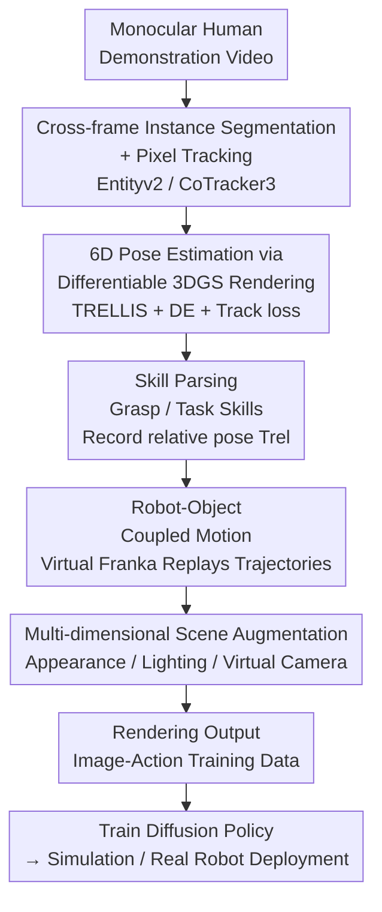

# Video2Robo: 3DGS-based Synthetic Data from One Video Enables Scalable Robot Learning

**Conference**: CVPR 2026  
**Paper**: [CVF Open Access](https://openaccess.thecvf.com/content/CVPR2026/html/Deng_Video2Robo_3DGS-based_Synthetic_Data_from_One_Video_Enables_Scalable_Robot_CVPR_2026_paper.html)  
**Code**: Project Page Video2Robo (No explicit repository link provided in the paper)  
**Area**: Robotics / Embodied AI  
**Keywords**: Robot Data Generation, 3D Gaussian Splatting, Monocular Video, Imitation Learning, Real2Sim2Real

## TL;DR
Video2Robo uses a single monocular human demonstration video recorded by a smartphone. Leveraging 3DGS, it reconstructs task-relevant objects, tracks their 6D trajectories, and parses manipulation skills. A virtual Franka robot arm then "takes over" these trajectories with multi-dimensional scene augmentation to mass-synthesize photorealistic and kinematically plausible robot training data. The resulting policy enables zero-calibration transfer to real-world robot arms.

## Background & Motivation
**Background**: The upper bound of robot imitation learning is constrained by the high cost of diverse, high-quality embodied data. Compared to the massive datasets used for training LLMs/VLMs, robot datasets are remarkably small, primarily due to the labor-intensive nature of teleoperation. Consequently, "scaling via data generation" has become a core requirement. Existing approaches include: object-centric trajectory transformation (MimicGen series), simulation data augmentation (CyberDemo, RoboSplat), human-to-robot replacement (Phantom, RwoR), and human video action imitation (R2R2R, YOTO).

**Limitations of Prior Work**: These methods almost always rely on hard-to-acquire hardware (real robots, teleoperation devices, depth cameras), depend on simulators (requiring extensive parameter tuning and prone to physical errors like interpenetration or slippage), or necessitate heavy manual labor. Crucially, the **diversity of generated data is limited**—most only augment object poses while keeping appearance, lighting, and viewpoints static, leading to failure when transferred to varied real-world scenes.

**Key Challenge**: Achieving "low-barrier input" (smartphone recording by ordinary users) and "high-quality + high-diversity output" (photorealistic, kinematically sound, covering various scenes) is a contradiction in existing paradigms. Simulation provides pose diversity but lacks visual realism, while real-world data provides realism but is expensive and scene-fixed.

**Goal**: Split the problem into two sub-problems: (I) How to extract manipulation information from 2D RGB monocular video? (II) How to generate data that is both photorealistic and kinematically plausible?

**Key Insight**: The authors observe that **the core skills of most manipulation tasks can be represented as relative motion between task-relevant objects** (e.g., pouring water = cup motion relative to the bowl). Thus, one does not need to recover fine-grained human hand movements; tracking the 6D trajectories of relevant objects is sufficient. 3DGS provides both "photorealistic rendering" and "explicit 3D editing" capabilities, precisely addressing sub-problem II.

**Core Idea**: Use 3DGS to chain "object reconstruction → 6D trajectory tracking → skill parsing → virtual robot trajectory replay → Gaussian editing for multi-dimensional augmentation → rendering training data" into a fully automated pipeline that consumes only monocular video, bypassing the need for real robots, simulators, or depth cameras.

## Method

### Overall Architecture
Video2Robo takes a **single monocular human demonstration video** as input and outputs a **batch of image-action data** for direct training of visuomotor policies. The pipeline consists of three sequential modules:

1. **Scene and Skill Parsing (Real2Sim)**: Extracts 3D models of task-relevant objects from the video, tracks their frame-by-frame 6D poses, segments trajectories into "grasp skills" and "task skills," and records critical relative poses.
2. **Scalable Data Generation**: Transfers the relative pose trajectories to a virtual 3DGS Franka arm. Through robot-object coupled motion, it generates kinematically consistent dynamic Gaussian fields while overlaying multi-dimensional augmentations (object rearrangement, randomized appearance/background/lighting, virtual camera perturbations) to render massive diverse data.
3. **Robot Learning and Deployment (Sim2Real)**: Trains a Diffusion Policy using the synthesized image-action data and evaluates it on a self-built simulation benchmark and a real Franka arm.

The following diagram illustrates the backbone from a single video to synthetic data:

### Key Designs

**1. Cross-frame Consistent Instance Segmentation + Pixel Tracking: Locking "moving objects" from 2D RGB only**

The first barrier of sub-problem I: monocular video lacks depth and embodied annotations. Video2Robo fixes object identities and trajectories at the 2D level. For each frame, Entityv2 generates instance masks; then, a TAP model generates text descriptions for each mask, encoded via SBERT. Task-relevant objects $\{obj_i\}$ and their initial masks $m^0_{obj_i}$ are identified via open-vocabulary queries. CoTracker3 then tracks pixels $\{p^t_{obj_i}\}$ sampled within the initial mask across the sequence. Results are aggregated to establish cross-frame masks $\{m^t_{obj_i}\}$. This step prepares 2D trajectories using off-the-shelf foundation models without 3D sensors.

**2. 6D Object Pose Estimation via Differentiable 3DGS Rendering: Lifting 2D masks to temporally consistent 6D models**

To lift 2D tracking to 6D, TRELLIS generates 3DGS models $\{G_{obj_i}\}$ from single-view segmentation results $C^0[m^t_{obj_i}]$. Since these models lack absolute scale, VGGT generates depth $D=\{D_t\}$ for scale alignment. **In the initial frame**, 3DGS is initialized at the depth point cloud centroid. Parameters (6D pose and scale factor) are optimized using Differential Evolution (DE) to minimize differences between rendered and observed RGB, depth, and masks:

$$\mathcal{L}_{RGB,obj_i}=\left|\mathbf{\hat{C}}^0_{obj_i}-\mathbf{C}^0_{obj_i}\right|\cdot\left(\hat{m}_{obj_i}\cup m_{obj_i}\right)$$

In **subsequent frames**, the scale factor is fixed, and 6D poses are optimized using Adam. To handle **symmetric objects**, a Track loss is introduced by projecting 3D model points back to 2D $\hat{p}^t_{obj_i}$ and measuring the distance to CoTracker3 pixels $p^t_{obj_i}$:

$$\mathcal{L}^t_{track}=\sum_i\left|\hat{p}^t_{obj_i}-p^t_{obj_i}\right|$$.

**3. Skill Parsing: Segmenting continuous trajectories into reusable skill fragments**

Video2Robo segments trajectories based on relative motion. **Grasp-related skills** (gripper open/close) are identified via object motion/stoppage patterns. **Task-related skills** are identified by object distance; when the distance between two objects is below a threshold (3 cm in experiments), the segment is parsed as a task action, and the relative pose $T_{rel}$ is recorded.

**4. Robot-Object Coupled Motion + Multi-dimensional Augmentation: Kinematically plausible replay and maximized diversity**

For sub-problem II, a Franka 3DGS model and a tabletop representation are used. Objects are randomly rearranged (position+rotation). Task objects are divided into source/target with initial poses $T_s, T_t$. Using vision-guided manual setup, a grasp pose $T_{grasp}$ and closure distance $D_{grasp}$ relative to the source object are obtained. **Coupled Motion** operates through: ① Transit (motion to pre-grasp $T_sT_{grasp}$); ② Grasp; ③ Transfer (motion to skill start $T_tT_{rel}[0]T_{grasp}$); ④ Task Execution (iterative motion to $T_tT_{rel}[n\Delta t]T_{grasp}$ where source rigidly follows). This generates a dynamic 3DGS field. Three augmentations are applied: **Appearance Randomization** (random tabletop textures, 2D/3D backgrounds), **Lighting Augmentation** (scaling/shifting diffuse colors of Gaussian ellipsoids), and **Virtual Camera Perturbations** (intrinsic/extrinsic randomization).

### Loss & Training
The pose estimation objective is $\mathcal{L}_{RGB}+\mathcal{L}_{depth}+\mathcal{L}_{mask}+\mathcal{L}_{track}$. Downstream policies use Diffusion Policy with absolute joint positions as actions. The simulation is built on Robosuite. Real-world evaluation is performed on a Franka arm **without any fine-tuning or calibration**. The entire pipeline runs sequentially on a single NVIDIA L40.

## Key Experimental Results

### Main Results
Six self-collected tasks: Attach, Drum, Place, Pour, Stack, Sweep.

6D Monocular Object Localization (BOP Average Recall):

| Method | Mean AR | Notes |
|------|---------|------|
| F.P.-O (Monocular Depth FoundationPose) | 55.36 | Degrades without GT depth |
| MegaPose | 68.13 | Struggle with asymmetric tracking |
| **Video2Robo** | **78.41** | Best temporal consistency via Track loss |

Data Generation Efficiency and Success Rate (100 demonstrations):

| Method | Avg Time (s)↓ | Success Rate (%)↑ |
|------|------------------|----------------|
| MimicGen | 17.23 | 97.40 |
| SkillGen | 8.88 | 96.98 |
| **Video2Robo** | **5.23** | **100.00** |

MimicGen and SkillGen occasionally fail due to physical simulation errors (interpenetration). Video2Robo achieves 100% success via kinematic coupling.

### Ablation Study
Policy success rate (%) in simulation:

| Configuration | Pose-only Mean | Multi-var Mean | Notes |
|------|--------------|--------------|------|
| MimicGen | 93.00 | 11.67 | Crashes under multi-variance |
| SkillGen | 91.67 | 19.67 | Crashes under multi-variance |
| **Video2Robo** | 66.67 | **63.83** | Significant lead in varied scenes |

Real-world success rate (%):

| Configuration | Pose-only Mean | Multi-var Mean |
|------|--------------|--------------|
| MimicGen-O | 18.33 | 02.50 |
| Real Collected (20 demos) | 46.67 | 27.50 |
| **Video2Robo** | **62.50** | **58.33** |

### Key Findings
- **Diversity is the key to transfer**: Baselines drop from ~90% to ~10% under scene changes. Video2Robo remains stable (66.67% to 63.83%), proving that frame-level augmentation is the root of generalization.
- **Zero-calibration real-world readiness**: Video2Robo synthetic data (62.50%) outperforms real-world human-collected data (46.67%), as the latter suffers from low diversity and overfitting in complex scenes.
- **Track loss handles symmetry**: Integrating rendering alignment with pixel tracking provides the temporal stability needed for symmetric objects, outperforming MegaPose by ~10 points.

## Highlights & Insights
- **"Object Relative Motion = Task Skill" abstraction**: This bypasses the complex human-to-robot hand mapping. By tracking 6D trajectories using 2D/3D foundation models, the pipeline becomes hardware-agnostic.
- **3DGS satisfies both Realism and Editability**: Explicit ellipsoid representations make lighting and appearance randomization cheap operations, which were previously impossible in real-world data collection.
- **Kinematic coupling over physical simulation**: By using rigid following and interpolation trajectories, the framework eliminates interpenetration and slippage, ensuring a 100% generation success rate.

## Limitations & Future Work
- **Rigid Bodies Only**: Cannot handle deformable objects as they require direct learning of dynamic models from video.
- **Manual Grasp Poses**: $T_{grasp}$ still requires manual vision-guided setting rather than automatic personalized mapping from human hands.
- **Sequential Model Dependency**: Errors in TRELLIS (reconstruction) or VGGT (depth) propagate downstream.
- **Future Directions**: Support for articulated/deformable objects, dual-arm manipulation, and automated grasp mapping.

## Related Work & Insights
- **vs MimicGen/SkillGen**: These rely on teleoperated seeds and simulators for pose augmentation. Video2Robo uses monocular video, avoids simulators, and provides far superior generalization via multi-dimensional augmentation.
- **vs RoboSplat**: RoboSplat still requires teleoperation and robot setups. Video2Robo lowers the entry barrier to a smartphone.
- **vs Phantom/RwoR**: These produce a 1:1 robot demo per human video. Video2Robo can synthesize a batch of diverse data from a single video.

## Rating
- **Novelty**: ⭐⭐⭐⭐⭐ First monocular-only pipeline to real-world deployment using 3DGS editing for augmentation.
- **Experimental Thoroughness**: ⭐⭐⭐⭐ Six tasks across 4 evaluation metrics; however, error accumulation analysis is missing.
- **Writing Quality**: ⭐⭐⭐⭐ Clear motivation and architecture; some hyperparameter justifications are brief.
- **Value**: ⭐⭐⭐⭐⭐ Lowers the barrier for embodied data collection to "one smartphone, one video," with significant practical utility for scalable learning.

<!-- RELATED:START -->

## Related Papers

- [\[CVPR 2026\] IGen: Scalable Data Generation for Robot Learning from Open-World Images](igen_scalable_data_generation_for_robot_learning_from_open-world_images.md)
- [\[CVPR 2026\] CoMo: Learning Continuous Latent Motion from Internet Videos for Scalable Robot Learning](como_learning_continuous_latent_motion_from_internet_videos_for_scalable_robot_l.md)
- [\[CVPR 2026\] InternData-A1: Pioneering High-Fidelity Synthetic Data for Pre-training Generalist Policy](interndata-a1_pioneering_high-fidelity_synthetic_data_for_pre-training_generalis.md)
- [\[CVPR 2026\] SIR: Structured Image Representations for Explainable Robot Learning](sir_structured_image_representations_for_explainable_robot_learning.md)
- [\[AAAI 2026\] Realistic Synthetic Household Data Generation at Scale](../../AAAI2026/robotics/realistic_synthetic_household_data_generation_at_scale.md)

<!-- RELATED:END -->
