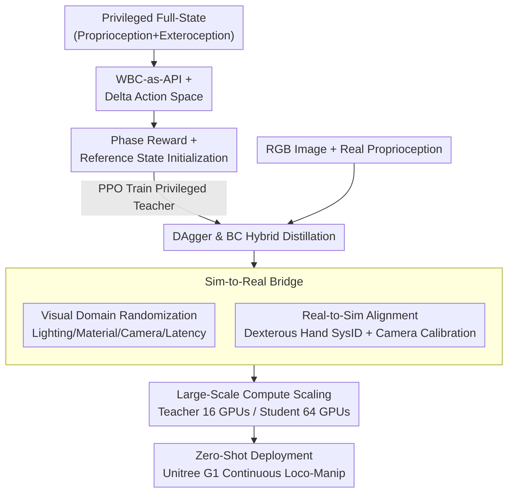

# VIRAL: Visual Sim-to-Real at Scale for Humanoid Loco-Manipulation

**Conference**: CVPR 2026  
**Paper**: [CVF Open Access](https://openaccess.thecvf.com/content/CVPR2026/html/He_VIRAL_Visual_Sim-to-Real_at_Scale_for_Humanoid_Loco-Manipulation_CVPR_2026_paper.html)  
**Code**: [viral-humanoid.github.io](https://viral-humanoid.github.io) (project page, open-source code not specified)  
**Area**: Robotics / Embodied AI  
**Keywords**: Humanoid Robot, Sim-to-Real, Visuomotor Loco-Manipulation, Teacher-Student Distillation, Domain Randomization

## TL;DR
VIRAL trains visual policies for humanoid "loco-manipulation" entirely in simulation. Through "privileged teacher $\rightarrow$ RGB student" distillation, large-scale visual domain randomization, and real-to-sim alignment, it deploys RGB-only policies zero-shot onto the Unitree G1. The robot can continuously walk, grasp, and place objects between two tables for 54 consecutive cycles, achieving performance close to expert teleoperation.

## Background & Motivation
**Background**: Humanoid robots are regarded as natural carriers of general physical intelligence, but what is truly lacking today is "autonomous loco-manipulation"—tightly coupling locomotion and manipulation under onboard perception to complete useful tasks over long horizons. Existing systems either only perform "blind locomotion" (without environmental perception), limit themselves to tabletop manipulation with a fixed base, or heavily rely on human teleoperation or external motion capture sensors. Extremely few systems can perform autonomous loco-manipulation on real hardware using only onboard sensors.

**Limitations of Prior Work**: A recent popular avenue is to copy the Large Language Model recipe: collecting massive real-world teleoperation data to train "robot foundation models." However, mobile manipulation faces far more variations than fixed tabletop setups, requiring significantly more data. When the mobile platform is a humanoid robot with high degrees of freedom, strict safety constraints, and complex teleoperation stacks, the collection cost of each data point skyrockets further. Treating humanoid mobile manipulation as "just another data problem" may be prohibitively expensive in practice due to the required scale.

**Key Challenge**: While simulation can generate massive data at low cost and sim-to-real has become the de facto standard for legged locomotion, the manipulation domain remains dominated by "imitation learning from real-world data," with visual sim-to-real successes mostly limited to tabletop, narrow tasks. Worse, sim-to-real for locomotion and manipulation are typically studied in isolation—locomotion works ignore manipulation, while manipulation works assume a fixed base. How to unify both into a single onboard RGB policy that successfully transfers remains an open question.

**Goal**: To answer an engineering question: "Can visual sim-to-real enable humanoid robots to perform useful loco-manipulation under onboard perception?" The authors explicitly state that they **do not intend to propose a new RL or sim-to-real algorithm**, but rather provide a full-stack technical recipe to make "RGB-based humanoid loco-manipulation work in practice": which designs are truly critical, where they fail, and how they interact with each other.

**Key Insight**: To re-contextualize the classic visual sim-to-real approach in the humanoid loco-manipulation setting and scale the system up to modern levels—higher simulation fidelity, larger GPU compute power, and real humanoid hardware. A recurring observation is that **compute scale is the key variable that determines success or failure**. Scaling to dozens of GPUs (up to 64) is necessary for stable teacher and student training; low compute power often leads directly to failure.

**Core Idea**: Using a teacher-student framework of "privileged teacher RL (full-state) $\rightarrow$ RGB student distillation," paired with large-scale visual domain randomization and real-to-sim hardware alignment, to deploy a policy relying only on onboard RGB + proprioception zero-shot onto real hardware.

## Method

### Overall Architecture
The goal of VIRAL is to output an end-to-end policy that **only takes RGB images + proprioception as input** and can be deployed zero-shot directly onto the Unitree G1. The entire pipeline consists of a two-stage distillation + a sim-to-real bridging layer:

**Phase 1 (Teacher)**: Train a **privileged RL teacher** in simulation with access to full state information (privileged proprioception + privileged exteroception, such as relative poses of objects/tables, grasp/place targets, and current phase). The teacher does not learn low-level motor control but instead **operates on top of a pre-trained Whole-Body Controller (WBC, using HOMIE)**, outputting high-level WBC commands (incremental walking velocity/yaw + incremental arm/finger joints). Since it does not render images, the teacher can be trained using only 16 L40S GPUs (2 nodes $\times$ 8).

**Phase 2 (Student)**: Distill the teacher into a visual student that **only sees RGB + real-device available proprioception**. Distillation uses large-scale rendering-enabled simulation (Isaac Lab's tiled rendering, with 64 GPUs / 8 nodes). The student mimics the teacher's actions through a **hybrid of online DAgger + Behavior Cloning (BC)**.

**Sim-to-Real Bridge**: During student training, large-scale randomization is applied to image quality, lighting, materials, camera intrinsics/extrinsics, and sensor latency. At the same time, **real-to-sim alignment** is performed—applying system identification (SysID) to the high-reduction ratio 3-finger dexterous hands and calibrating camera extrinsics. Finally, the student policy is deployed directly **without any real-world fine-tuning**.

### Key Designs

**1. WBC-as-API + Delta Action Space: Locking Policy Actions into a Safe and Reliable Zone**

Humanoid robots feature 29 degrees of freedom and strict safety constraints, making learning low-level motor skills from scratch difficult to train and transfer. VIRAL's approach is to have the teacher **not directly output absolute joint targets**, but instead output high-level WBC commands. Using HOMIE as the low-level whole-body controller (providing stable lower-limb walking + diverse upper-limb poses), VIRAL **extends finger movements** on top of its velocity/height/upper-limb joint command interfaces, forming the full action space $a_t = (\Delta v_t, \Delta \omega^{yaw}_t, \Delta q^{arm}_t, \Delta q^{finger}_t)$. This API layer restricts the actions the policy can produce to a "safe and reliable humanoid motion subset," significantly improving deployability. The authors also emphasize that the framework does not overfit a specific WBC and can be replaced with other controllers.

Crucially, actions use **increments (delta) rather than absolute values**: the increments output by the policy are accumulated into the WBC commands. This is contrary to the common practice in legged locomotion RL literature that uses absolute joint targets. However, empirical results show that the delta representation **significantly accelerates and stabilizes RL training**—in ablation studies, only the delta-action teacher could reliably solve the task, while the absolute-action version failed to reach high success rates (Figure 9).

**2. Phase Reward + Reference State Initialization (RSI): Feeding RL Strong Priors with Human Demonstrations**

Long-horizon "walk $\rightarrow$ place $\rightarrow$ grasp $\rightarrow$ turn" skills are extremely difficult for high-DoF humanoids to explore with pure RL. Heavy reward engineering often still leads to suboptimal or poorly transferring policies. VIRAL takes a two-pronged approach. First, it **splits tasks into phases** and defines four types of rewards: walking to the object $r_{walk}=\exp(-4(\|p_{robot}-p_{GraspObj}\|-0.45)^2)$, placing when near the tray $r_{place}=-\|f_{PlaceObj}\|\cdot\mathbb{1}(\|p_{PlaceObj}-p_{tray}\|<0.3)$, grasping (lift reward + target distance reward $r_{grasp\text{-}goal}=\exp(-10\|p_{GraspObj}-p_{goal}\|^2)$), and turning $r_{turn}=-|y_{robot}-y_{desired}|$.

Second, **Reference State Initialization (RSI)**: 200 teleoperated simulation demonstrations are collected as a "state initialization buffer." During each episode reset, a random demonstration snapshot is sampled, and the robot, object, and table are initialized accordingly. This allows the policy to **be exposed to high-reward states of various phases before it has the capability to walk to those states from scratch**. This acts as a strong prior of human grasp-and-place poses to conduct "reference-biased exploration," substantially reducing reliance on fragile reward tuning. Ablations demonstrate this trick is necessary—without RSI, the teacher's success rate quickly stagnates below 10%, while with RSI, it approaches 95% (Figure 9).

**3. Hybrid DAgger & BC Distillation: Balancing Fast Bootstrapping and Error Accumulation Resistance**

When distilling the privileged teacher into an RGB-only student, pure BC and pure DAgger both have critical drawbacks. VIRAL trains with **the same MSE objective** over a mix of "teacher-induced + student-induced" observation distributions:

$$\mathcal{L}_{distill} = \mathbb{E}_{o_t\sim d^o}\big[\|\pi_{teacher}(o^{teacher}_t)-\pi_{student}(o^{student}_t)\|_2^2\big],\quad d^o \approx \lambda\, d^o_{\pi_{teacher}} + (1-\lambda)\, d^o_{\pi_{student}}$$

The only difference between DAgger and BC lies in whose rollout the observations come from: **teacher rollouts** provide clean, near-optimal demonstrations to quickly inject a strong prior into the student (the fast initialization advantage of BC); **student rollouts** expose the student to states outside the teacher's ideal distribution, which is crucial for "error correction robustness during deployment and preventing error accumulation" (the state coverage advantage of DAgger). The mixture ratio $\lambda$ represents the proportion of environments running teacher rollouts, where $\lambda=1$ is pure BC and $\lambda=0$ is pure DAgger. Ablations find that pure BC ($\lambda=1$) enjoys fast loss reduction but yields a fragile policy that fails to correct its own errors, performing poorly in both Isaac$\rightarrow$MuJoCo and real-world trials. Introducing student rollouts ($\lambda=0.5$) is slightly slower to train but leads to a substantial boost in deployment success rates, hence $\lambda=0.5$ is chosen as the default (Figure 11). The student's visual backbone utilizes a SOTA image encoder (DINOv3), fused with proprioception before feeding into the policy head. Both the backbone and the policy head with history (MLP vs. LSTM) were ablated.

**4. Visual Domain Randomization + Real-to-Sim Alignment: Narrowing the Reality Gap from Both Ends**

The core of sim-to-real is making the simulation distribution cover the real-world distribution. VIRAL applies **large-scale randomization on the simulation side**: image quality (brightness, contrast, hue, saturation, Gaussian noise, blur), camera extrinsics (handling small pose drifts), camera latency (modeling communication delay), global lighting using dome-light, and randomized materials and colors of the ground, tables, objects, and the robot. Ablation studies focus on three dominant components—material (M), dome-light (D), and camera extrinsics (E): disabling all randomizations drops the success rate to 0.649 (a 35.1% decrease), and removing any single component leads to a performance drop, showing that these randomizations are **complementary and jointly constitute a critical pipeline for robust sim-to-real** (Figure 13).

**On the real-world side, alignment is performed** to narrow systematic biases that randomization cannot cover: ① **Dexterous hand SysID**: The 3-finger hands of the Unitree G1 use high-reduction ratio motors, resulting in a significant mismatch between simulation and reality. The authors define grasp-and-place primitives on the real robot and replay the same action sequences in simulation, performing SysID on finger armature, stiffness, and damping to align simulation joint trajectories with real measurements (Figure 5). ② **Camera extrinsics alignment**: Intrinsics are matched according to manufacturer specifications, but the extrinsics of individual G1 units differ due to mechanical tolerances and drift over time. Thus, the authors use visual matching between rendered and real images to perform lightweight real-to-sim extrinsic calibration, then overlay extrinsic randomization during training to make the student robust to hardware perspective variations (Figure 6).

**5. Compute Scale as a Key Design: Scaling Both Teacher and Student to Dozens of GPUs**

This is a heavily emphasized discovery in the paper, treated almost as a first-class citizen: vision-rendering simulation is at least an order of magnitude slower than pure physics. Based on TRL + Accelerate, the authors implement a distributed system that scales near-linearly across multiple GPUs/nodes while retaining the simplicity of single-GPU training. When scaling teacher training from 1 to 16 GPUs, it not only converges faster (even experiencing super-linear speedup early on), but more importantly, improves **asymptotic performance**—with 1–2 GPUs, the teacher stagnates far below the target success rate and never reaches high success, while 8–16 GPUs are required to stably push past 90% (Figure 14). Similarly, scaling the student from 1 to 64 GPUs yields faster convergence, smoother loss curves, and slightly higher final success rates (Figure 15). The conclusion is that large-scale compute is not just icing on the cake, but a **practical necessity** for reliably learning long-horizon visual loco-manipulation.

## Key Experimental Results

The deployment platform is a 29-DoF Unitree G1 (equipped with 7-DoF 3-finger dexterous hands). Perception uses an Intel RealSense D435i, and inference runs on a workstation under an Intel Core i9-14900K and an NVIDIA RTX 4090.

### Main Results: Real-World Robustness and Teleoperation Comparison

The task is continuous loco-manipulation involving "repeatedly walking between two tables, placing an object, grasping a new object, and turning around."

| Comparison Target | Success Rate | Single Cycle Time | Note |
|--------|------|---------|------|
| **VIRAL (RGB Policy)** | **54/59 ≈ 91.5%** | 20.2 s | Zero-shot, no real-world fine-tuning |
| Expert Teleoperation (>1000h exp) | 100% | 21.4 s | Identical HOMIE low-level policy |
| Non-Expert Teleoperation (~1h exp) | 73% | Significantly slower | — |

VIRAL approaches expert-level success rates and is **even faster than experts** (20.2 s < 21.4 s), while significantly outperforming non-experts in reliability and efficiency, demonstrating its potential to reduce cognitive load in assisted teleoperation. Generalization experiments (Figure 8) systematically vary the starting position of the tray, the initial pose of the robot, table height/type/tablecloth colors, lighting, and object categories. VIRAL completes tasks stably without extra parameter tuning, which the authors attribute to domain randomization and the inherent robustness of RL.

### Ablation Study

| Configuration | Key Phenomenon | Conclusion |
|------|---------|------|
| Teacher w/o RSI | Success rate stagnates <10% | RSI is necessary for training (vs. ~95% full setup) |
| Teacher absolute action | Fails to reach high success rate | Delta action space is necessary |
| Student $\lambda=1$ (Pure BC) | Loss drops quickly but policy is fragile and fails to self-correct | Pure BC is not viable |
| Student $\lambda=0.5$ (DAgger+BC) | Major boost in deployment success rate | Selected as default |
| Visual Randomization All Off | Normalized success rate drops to 0.649 (-35.1%) | Randomization is key to robust transfer |
| Remove any single M / D / E | Performance drops across all | Three randomizations are complementary |
| Teacher 1–2 GPUs | Stagnates far below target | Low compute fails directly |
| Teacher 8–16 GPUs | Stable >90% success | Large-scale compute is necessary |
| Student single-object (cylinder only) | Success rates for all object types are lower | Multi-object training generalizes better |

### Key Findings
- **RSI and the delta action space are the two make-or-break factors for training the teacher**: without either, the teacher remains trapped in low success rates. Removing RSI directly drops performance from 95% to below 10%, making it the single most damaging factor.
- **The fragility of pure BC is a hidden killer of sim-to-real**: though BC loss looks promising, the policy cannot correct its own errors, collapsing in Isaac$\rightarrow$MuJoCo and on the real robot; student rollouts (DAgger) are essential to bridge the state coverage.
- **Compute power is a hard constraint on asymptotic performance, not just speed**: low compute is not a matter of "getting there slower," but failing to reach high success rates at all—this is the most counter-intuitive and emphasized finding.
- **Multi-object training yields true generalization**: training only on cylinders leads to worse performance across all ten testing categories, whereas multi-object training performs better across every single category.

## Highlights & Insights
- **Treating the WBC as an API layer** is a highly reusable engineering approach: the policy only learns high-level commands, leaving low-level control to a stable controller. This shrinks the action space into a safe zone and decouples the controller choice (allowing WBC replacement), majorly increasing sim-to-real deployability.
- **Honestly positioning "compute scaling" as a first-class design**: while most papers hide scaling details in the appendix, VIRAL directly labels "low compute leads to failure" as a core takeaway, demonstrating via 1$\rightarrow$16 and 1$\rightarrow$64 GPU tuning curves that asymptotic performance depends on compute—providing a valuable warning for reproduction.
- **Attacking the reality gap from both ends**: the division of labor between simulation-side randomization (saving the policy from overfitting to specific visuals) and real-robot-side SysID/extrinsics alignment (fixing systematic error) is clear and highly transferable to any visual sim-to-real task.
- **The delta action space counter-intuitively outperforms absolute actions** and is decisive for humanoid loco-manipulation—contrary to legged RL conventions, suggesting that "action parameterization" in high-DoF coupled tasks deserves re-evaluation.

## Limitations & Future Work
- **Limitations acknowledged by the authors**: Relying solely on simulation to cover real distributions has an upper bound. Future work aims to introduce offline datasets to improve data efficiency, automate reward and curriculum design for more complex tasks, and combine sim-to-real with real-world imitation learning and foundation models, rather than relying exclusively on simulation.
- **Self-identified limitations**: ① The paper positions itself as a "technical recipe" rather than a new algorithm; most components (teacher-student, DAgger, domain randomization, RSI) are combinations of existing ideas, making the contribution primarily system integration and large-scale validation; ② The evaluation task is relatively simple (walk-grasp-place-turn between two tables); although generalization experiments are extensive, they remain within this task family, leaving cross-task transfer unverified; ③ The compute barrier is extremely high (64 L40S GPUs), making it difficult for average teams to replicate, and the "low compute failure" conclusion indicates high resource sensitivity; ④ Dexterous hand SysID and camera extrinsic alignment are robot-specific/hardware-specific engineering overheads, implying high cost for large-scale deployment.
- **Ideas for improvement**: Expand the demonstration source for RSI from teleoperation to automatically generated trajectories to lower manual effort; explore efficient alternatives under constrained compute (e.g., less render-heavy representations, learning vision progressively); introduce real-world data for minor fine-tuning to push beyond pure sim-distribution coverage limits.

## Related Work & Insights
- **vs. Legged Sim-to-Real (blind walk / depth / RGB navigation)**: Blind walking policies are robust but lack environmental perception, depth/LiDAR options improve footholds but lack semantics, and RGB + language navigation relies on high-latency VLA models. VIRAL distills a compact visual-motor RGB policy to achieve real-time, goal-conditioned locomotion without sacrificing sim-to-real scalability.
- **vs. Manipulation Sim-to-Real (e.g., OpenAI Dactyl, tabletop teacher-student distillation)**: Domain randomization-driven visual sim-to-real for manipulation has seen major progress, but **mostly remains limited to fixed-base tabletop settings**. VIRAL extends this "privileged teacher $\rightarrow$ RGB student distillation + randomization" paradigm to mobile humanoid loco-manipulation.
- **vs. Prior Work in Loco-Manipulation (modular decoupling / end-to-end whole-body / imitation learning VLA)**: Existing methods either decouple limbs and legs control or heavily rely on large-scale real-world datasets and VLA models (which are costly and potentially non-robust). VIRAL unifies all layers with an end-to-end RGB policy trained entirely in simulation, achieving zero-shot humanoid loco-manipulation without real-world demonstrations or large models.

## Rating
- **Novelty**: ⭐⭐⭐⭐ Does not propose a new algorithm, but is the first to scale and successfully demonstrate a full-stack visual sim-to-real pipeline on actual humanoid loco-manipulation, presenting a solid system-level contribution.
- **Experimental Thoroughness**: ⭐⭐⭐⭐⭐ 59 real-world trials + 9 ablation groups (RSI, action space, backbone, DAgger ratio, history, randomization, teacher compute, student compute, object generalization), uncovering the failure modes of every single design.
- **Writing Quality**: ⭐⭐⭐⭐ Clear positioning as a "technical recipe," honest motivation, and precise mapping between equations and ablations; some components are described in a somewhat engineering report-like style.
- **Value**: ⭐⭐⭐⭐⭐ Provides an applicable full-stack blueprint for "making RGB-based humanoid loco-manipulation work in practice," offering direct reference value for the deployment of embodied AI.

<!-- RELATED:START -->

## Related Papers

- [\[CVPR 2026\] Opening the Sim-to-Real Door for Humanoid Pixel-to-Action Policy Transfer](opening_the_sim-to-real_door_for_humanoid_pixel-to-action_policy_transfer.md)
- [\[CVPR 2026\] GeCo-SRT: Geometry-aware Continual Adaptation for Cross-Task Sim-to-Real Transfer](geco-srt_geometry-aware_continual_adaptation_for_cross-task_sim-to-real_transfer.md)
- [\[ICLR 2026\] HWC-Loco: A Hierarchical Whole-Body Control Approach to Robust Humanoid Locomotion](../../ICLR2026/robotics/hwc-loco_a_hierarchical_whole-body_control_approach_to_robust_humanoid_locomotio.md)
- [\[ICLR 2026\] D-REX: Differentiable Real-to-Sim-to-Real Engine for Learning Dexterous Grasping](../../ICLR2026/robotics/d-rex_differentiable_real-to-sim-to-real_engine_for_learning_dexterous_grasping.md)
- [\[CVPR 2026\] Towards Motion Turing Test: Evaluating Human-Likeness in Humanoid Robots](towards_motion_turing_test_evaluating_human-likeness_in_humanoid_robots.md)

<!-- RELATED:END -->
