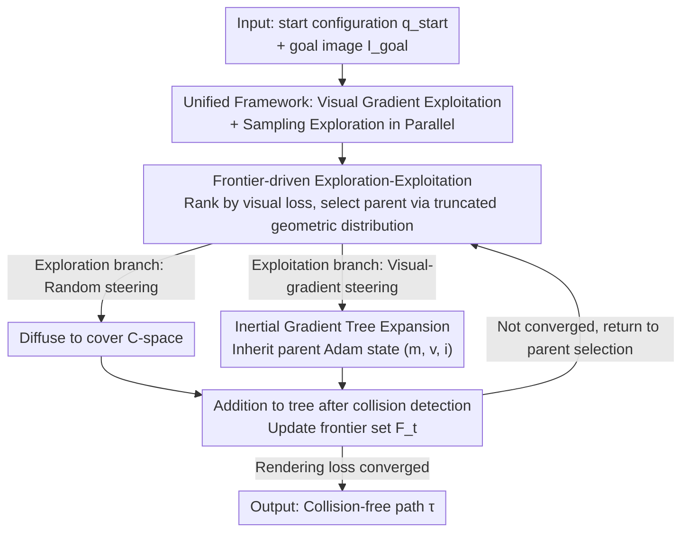

# Visual-RRT: Finding Paths toward Visual-Goals via Differentiable Rendering

**Conference**: CVPR 2026  
**Paper**: [CVF Open Access](https://openaccess.thecvf.com/content/CVPR2026/html/Lee_Visual-RRT_Finding_Paths_toward_Visual-Goals_via_Differentiable_Rendering_CVPR_2026_paper.html)  
**Code**: https://sgvr.kaist.ac.kr/Visual-RRT (Project Page)

**Area**: Robotics / Motion Planning  
**Keywords**: Motion Planning, RRT, Differentiable Rendering, Visual Goals, Sampling-based Planning

## TL;DR
This work integrates "visual gradient utilization" based on differentiable robot rendering into the "sampling exploration" framework of RRT. This allows robotic arms to plan collision-free motion paths given **only a single goal image without goal joint angles**, improving success rates on Franka / UR5e / Fetch from the ~20% range to ~75%.

## Background & Motivation
**Background**: RRT (Rapidly-exploring Random Tree) is a cornerstone method for robotic motion planning. It incrementally expands a search tree from a start configuration $q_{\text{start}}$ toward randomly sampled configurations. By exploring the C-space (Configuration Space) via sampling, it can bypass local minima and possesses theoretical guarantees such as probabilistic completeness and asymptotic optimality. Subsequent works have continuously improved its path quality, convergence speed, and sampling efficiency.

**Limitations of Prior Work**: All RRT variants assume that the **goal configuration is known**, typically provided as numerical joint angles $q_{\text{goal}}$. however, in increasing numbers of practical scenarios, goals are specified through **visual observations**—an image or a demonstration video—where precise goal joint angles are unavailable. The "exploitation" components of RRT (goal biasing, bidirectional search, potential field guidance) all rely on $q_{\text{goal}}$; without it, the algorithm degrades to purely random exploration, which is highly inefficient.

**Key Challenge**: Another line of research, "differentiable robot rendering" (e.g., Dr.Robot, Prof.Robot), addresses the "visual goal" problem. It models the robot as a differentiable self-model (Gaussian Splatting + Forward Kinematics + Implicit Linear Blend Skinning), allowing rendering losses to be backpropagated to joint angles for direct configuration optimization via visual gradients. However, this is a **single-path optimization** approach that follows a gradient trajectory and can easily get stuck in local minima caused by self-occlusion or scene obstacles. One side (RRT) has multi-branch resistance to local minima but lacks visual guidance, while the other (differentiable rendering) has visual guidance but is prone to failure due to its single-path nature.

**Goal**: To combine the strengths of both—facilitating tree expansion toward "promising" configurations pointed to by visual gradients (exploitation) while maintaining the global coverage of random sampling (exploration), thereby planning high-quality collision-free paths using only a goal image.

**Core Idea**: Use **rendering loss as an implicit "goal proximity" metric** to guide RRT tree growth. The authors inject visual gradients from differentiable rendering directly into a sampling-based planner (claimed as the first work to do so). Two mechanisms are introduced: frontier-driven exploration/exploitation scheduling and inertial gradient tree expansion, allowing gradient optimization to accumulate momentum across the multi-branch structure of the tree.

## Method

### Overall Architecture
vRRT incrementally grows a search tree in C-space from $q_{\text{start}}$, aiming for the robot pose rendered by some leaf node $q_T$ to visually match the goal image $I_{\text{goal}}$. In each iteration, the tree expands in two complementary ways: **Exploration** maintains global C-space coverage via random steering, while **Exploitation** pushes promising nodes toward $I_{\text{goal}}$ via visual-gradient steering. Both are executed in parallel on a batch of parent nodes (expanding a batch of 32 nodes per iteration).

To prevent inefficiency from indiscriminate expansion, the authors add two layers of scheduling: (1) **Frontier-driven Exploration-Exploitation Strategy**—nodes are ranked by visual loss, and a truncated geometric distribution is used to prioritize "low loss = near goal" frontier nodes as parents, bringing classical RRT goal biasing into the visual domain; (2) **Inertial Gradient Tree Expansion**—each node inherits the Adam optimization state (first/second moments, iteration step) from its parent, allowing gradient exploitation to accumulate momentum across tree branches rather than starting from zero at each step.

### Key Designs

**1. Visual-Gradient Steering: Using Rendering Loss Gradients as RRT "Exploitation Signals"**

Exploitation in classical RRT relies on biasing toward a known $q_{\text{goal}}$, which is unavailable for visual goals. The authors utilize differentiable robot rendering: given a parent node $q_p$, the robot image $I(q_p)=\pi(\text{FK}(q_p))$ is rendered via forward kinematics and a differentiable renderer $\pi$. The rendering loss $\mathcal{L}_{\text{render}}(q_p)=\|I(q_p)-I_{\text{goal}}\|$ is then calculated against the goal image. Backpropagation yields $\nabla_q \mathcal{L}_{\text{render}}(q_p)$, and the child node is generated along the negative gradient:

$$q_{\text{new}} = q_p - \alpha \cdot \nabla_q \mathcal{L}_{\text{render}}(q_p)$$

Where $\alpha$ is the gradient step size. In parallel, the "exploration" branch performs standard RRT random steering: $q_{\text{new}} = q_p + \epsilon \cdot \frac{q_{\text{rand}}-q_p}{\|q_{\text{rand}}-q_p\|}$. Child nodes from both branches must pass collision detection before joining the tree. Thus, the tree grows both by "broad searching" (exploration) and "directional seeking" (exploitation), grafting visual guidance onto a multi-branch structure.

**2. Frontier-Driven Exploration-Exploitation: Goal Biasing in the Visual Domain via Truncated Geometric Distribution**

Blindly expanding every node in the tree wastes computation on unpromising regions. Classical RRT uses goal biasing—prioritizing growth toward a known goal; however, there is no explicit goal to bias toward in visual tasks. The authors' key insight is that **rendering loss itself is an implicit measure of goal proximity**; nodes with lower loss are closer to the visual goal. Thus, a frontier set $F_t$ is maintained, ranking nodes by ascending visual loss $\{q_0,\dots,q_{M-1}\}$ where $\mathcal{L}_{\text{render}}(q_i)\le \mathcal{L}_{\text{render}}(q_{i+1})$. Parent nodes are sampled according to their "rank $k$" using a truncated geometric distribution:

$$p_{\text{frontier}}(k) = \frac{(1-\kappa)\kappa^{k}}{1-\kappa^{M}}, \quad k\in\{0,1,\dots,M-1\}$$

$\kappa\in[0,1)$ controls the biasing strength toward low-loss nodes (the paper uses $\kappa=0.9$). Lower-ranked (lower loss) nodes have a higher probability of being selected, while higher-ranked nodes still receive some probability mass to preserve exploration. The elegance of this design is that the distribution parameter $\kappa$ remains fixed, but $F_t$ evolves as the tree discovers lower-loss nodes, so the same distribution **automatically** directs more computation to goal-relevant regions without needing to manually adjust the sampling strategy.

**3. Inertial Gradient Tree Expansion: Propagating Adam Momentum across Tree Branches**

While visual-gradient steering enables exploitation, performing gradient descent directly in a tree structure has a drawback: traditional gradient descent follows a **single trajectory with accumulated momentum**, whereas tree planning deploys multiple paths simultaneously. Conventional RRT states are not designed to store optimization history. Consequently, every gradient step acts as a "reset," leading to slow convergence and sensitivity to local minima. The authors allow **each node to maintain its own optimization trajectory**: child nodes inherit and update the Adam state from their parents—the first moment $m_p$, second moment $v_p$, and iteration step $i_p$. When a child is created, the iteration step is $i_{\text{new}}=i_p+1$, and moments are updated via Adam:

$$m_{\text{new}} = \beta_1 m_p + (1-\beta_1)\nabla_q \mathcal{L}_{\text{render}}(q_p), \quad v_{\text{new}} = \beta_2 v_p + (1-\beta_2)(\nabla_q \mathcal{L}_{\text{render}}(q_p))^2$$

The exploitation step is then taken using bias-corrected moments:

$$q_{\text{new}} = q_p - \alpha\cdot \frac{\hat{m}_{\text{new}}}{\sqrt{\hat{v}_{\text{new}}}+\delta}$$

Where $\hat{m}_{\text{new}}=m_{\text{new}}/(1-\beta_1^{i_{\text{new}}})$ and $\hat{v}_{\text{new}}=v_{\text{new}}/(1-\beta_2^{i_{\text{new}}})$. This inheritance provides descendants of "promising nodes" with ready-made momentum to accelerate convergence **without breaking exploration**: child nodes generated by random steering **do not inherit** optimization states, allowing different branches to maintain independent trajectories. Ablations show that $\beta_1=0.5$ yields only 29.6% success, while $\beta_1=0.9$ increases it to 79.8%, proving momentum accumulation is vital.

### Loss & Training
The planning method itself requires no training. The differentiable robot self-models are pre-trained using MuJoCo rendered images (5k–10k Gaussian primitives per robot, 480×480 resolution, L2 loss). Planning hyperparameters: random step $\epsilon=0.04$, gradient step $\alpha=0.04$, geometric parameter $\kappa=0.9$, exploration radius $\rho=0.7$, momentum $\beta_1=\beta_2=0.9$. 32 nodes are expanded per iteration. Initialization ends when the loss change over 100 iterations is <0.0001. RRT* tree rewiring, standard path shortcutting, and MuJoCo collision detection are utilized. All experiments were conducted on a single RTX 4090.

## Key Experimental Results

### Main Results: Visual-Goal Motion Planning
Evaluated across Franka, UR5e, and Fetch robotic arms in both simulation and real-world settings. Six scenes were constructed for each robot with 5–10 random obstacles. Tasks were divided into 5 difficulty levels based on C-space distance $\|q_s-q_g\|_2$ (0.5–2.5 rad), with 100 tasks per level. Metrics: Success Rate (SR, final mean joint error <0.05 rad and collision-free), Path Length (PL), and planning time. Average SR for each robot:

| Robot | Dr.Robot | Prof.Robot | Dr.Robot+RRT* | vRRT (Ours) |
|--------|----------|------------|---------------|------------|
| Franka | 19.3% | 23.6% | 23.8% | **75.2%** |
| UR5e | 25.9% | 28.0% | 28.1% | **79.8%** |
| Fetch | 18.7% | 21.9% | 22.4% | **73.4%** |

The advantage becomes more pronounced as difficulty increases—for Franka at the 2.5 rad level, the single-path baseline SR is only 1.5–2.0%, while vRRT maintains 44.7%. The two-stage Dr.Robot+RRT* outperforms Dr.Robot alone but still falls far short of vRRT due to error propagation: if the first stage estimates the wrong goal configuration, the second stage RRT* optimizes toward an incorrect target. In terms of path quality, vRRT trajectories are geometrically similar to RRT* reference solutions, whereas single-path baselines often get stuck in local minima due to occlusions.

### Visual-Goal Pose Reconstruction + Real-World Benchmark
The pose reconstruction task isolates the difficulty of "recovering a configuration that matches the goal image." vRRT outperforms Dr.Robot across all distance levels in SR, joint error, and PSNR (Franka average SR 78.8% vs 35.8%, joint error 0.142 vs 0.588 rad). Notably, PSNR—visual similarity, the primary objective—remains high even at long distances (Franka far-range 27.82 vs 21.29). On the real Panda-3CAM-Azure benchmark, direct sim-to-real was compared against feedforward pose regressors RoboPEPP and HoRoPose:

| Method | Avg. per-joint error (rad) | Occluded J7 error |
|------|---------------------|---------------|
| RoboPEPP | 0.184 | 0.579 |
| HoRoPose | 0.154 | 0.355 |
| Dr.Robot | 0.164 | 0.617 |
| vRRT (Ours) | **0.083** | **0.094** |

vRRT significantly leads in error for the heavily occluded end-effector joint (J7), as exploration resolves the visual ambiguities caused by occlusion.

### Ablation Study

| Configuration | Key Observation | Conclusion |
|------|---------|------|
| Exploration ratio $r=0.9$ | SR drops severely across all levels | Pure random sampling cannot leverage visual guidance |
| Exploration ratio $r=0.1$ | Acceptable at close range, drops at far | Insufficient exploration causes local minima |
| Exploration ratio $r=0.3$ | Optimal across all distance levels | Exploration/Exploitation balance is required |
| Frontier sampling $\eta=0.0$ | SR nearly 0 | Uniform selection wastes computation |
| Frontier sampling $\eta=0.6$–$0.8$ | Optimal | Adaptive prioritization + diversity preservation |
| $\beta_1=0.5$ | 29.6% | Low-momentum exploitation is weak |
| $\beta_1=0.9$ | 79.8% | Standard momentum is optimal |

### Key Findings
- **Frontier Sampling is the linchpin**: Without it ($\eta=0$), the success rate drops to near zero, indicating that "using rendering loss as implicit goal proximity for prioritized selection" is the core reason the method works, rather than just an optimization.
- **Momentum must be accumulated**: The jump from 29.6% to 79.8% when increasing $\beta_1$ from 0.5 to 0.9 proves that the "cross-branch inheritance of optimization states" in inertial gradient expansion is highly effective.
- **Superiority increases with difficulty**: Single-path baselines nearly fail (<2%) at the 2.5 rad distance level, while vRRT still achieves 44–62%, validating the effectiveness of multi-branch tree search against local minima.
- **Robustness to noisy goals**: Even when fed noisy goal configuration estimates ($\sigma$ up to 0.20), visual feedback compensates for C-space errors, maintaining an SR of around 89%.

## Highlights & Insights
- **"Rendering Loss = Implicit Goal Proximity" is a powerful mapping**: It resolves the fundamental obstacle that "goal biasing cannot be performed without $q_{\text{goal}}$" by using visual similarity as a proxy for ranking nodes, effectively implementing goal biasing in the visual domain.
- **The "fixed distribution, evolving set" design is elegant**: There is no need to manually tune the sampling strategy over time; the automatic updates to the frontier set $F_t$ focus computational resources naturally.
- **Attaching Adam states to tree nodes is a transferable trick**: In any scenario requiring node-wise gradient optimization over a tree/graph structure, inheriting momentum through contributing edges while resetting it for exploration helps speed up convergence without sacrificing diversity.
- **First to inject differentiable rendering gradients into a sampling planner**, opening a new application for differentiable rendering in robotic planning and bridging the gap between vision-centric robotics and classical motion planning.

## Limitations & Future Work
- **Visual ambiguity remains a challenge**: The authors admit that while exploration helps with occlusions, symmetric or occluded robot parts may render nearly identical images for different joint configurations, which pure visual goals cannot distinguish.
- **Dependence on high-quality differentiable self-models**: Each robot requires pre-modeling with 5k–10k Gaussian primitives on MuJoCo images. Changing robot morphologies requires re-modeling, and sim-to-real visual domain gaps can exacerbate ambiguities.
- **Longer planning times**: vRRT planning times are generally higher than single-path baselines (e.g., Franka 21.64s vs Dr.Robot 10.25s), trading computation for success rate, requiring consideration for real-time applications.
- **Future Directions**: Incorporating multi-view or temporal observations to break symmetry-induced ambiguity, or integrating semantic priors (e.g., joint reachability constraints) into frontier ranking to mitigate visual shortcomings.

## Related Work & Insights
- **vs. Dr.Robot / Prof.Robot (Differentiable Robot Rendering)**: These perform **single-path** optimization along the rendering loss gradient in C-space, often getting stuck or taking circuitous paths due to occlusions. vRRT reuses their differentiable rendering pipeline for gradients but embeds them into RRT's multi-branch tree to bypass local minima via exploration.
- **vs. Dr.Robot + RRT* (Two-stage baseline)**: This baseline estimates the goal configuration with Dr.Robot and then plans toward it with RRT*. The sequential nature leads to error propagation—if the first stage fails, the second stage plans toward a wrong goal. vRRT fuses the two into a single process with online visual guidance.
- **vs. Classical / Learning-guided RRT**: Traditional RRTs and learning-based versions (e.g., planning in latent space or neural samplers) still rely on explicit goal configurations. vRRT is the first to replace the explicit goal with visual gradient guidance.
- **vs. Pose Regressors (RoboPEPP / HoRoPose)**: These provide feedforward joint angle predictions but suffer high errors on occluded joints. vRRT's optimization + exploration approach yields much lower errors on occluded J7 joints at the cost of higher computation.

## Rating
- Novelty: ⭐⭐⭐⭐⭐ First to integrate differentiable rendering gradients into a sampling planner; the implicit goal biasing and Adam state inheritance are ingenious.
- Experimental Thoroughness: ⭐⭐⭐⭐⭐ Tested on three robots, two tasks, five difficulty levels, across simulation, real robots, and benchmarks.
- Writing Quality: ⭐⭐⭐⭐ Motivation and methods are clear with good illustrations; logic is consistent.
- Value: ⭐⭐⭐⭐ Provides a practical planner for "image-only" vision-centric robot manipulation; the logic for node-wise optimization on trees/graphs is highly valuable.

<!-- RELATED:START -->

## Related Papers

- [\[CVPR 2026\] CLiViS: Unleashing Cognitive Map through Linguistic-Visual Synergy for Embodied Visual Reasoning](clivis_unleashing_cognitive_map_through_linguistic-visual_synergy_for_embodied_v.md)
- [\[CVPR 2026\] Rethinking Visual Rearrangement from A Diffusion Perspective](rethinking_visual_rearrangement_from_a_diffusion_perspective.md)
- [\[CVPR 2026\] Semantic Audio-Visual Navigation in Continuous Environments](semantic_audio-visual_navigation_in_continuous_environments.md)
- [\[CVPR 2026\] Diagnose, Correct, and Learn from Manipulation Failures via Visual Symbols](diagnose_correct_and_learn_from_manipulation_failures_via_visual_symbols.md)
- [\[CVPR 2026\] EgoRoC: Towards Egocentric Robotic Control via Task-Agnostic Visual Alignment](egoroc_towards_egocentric_robotic_control_via_task-agnostic_visual_alignment.md)

<!-- RELATED:END -->
