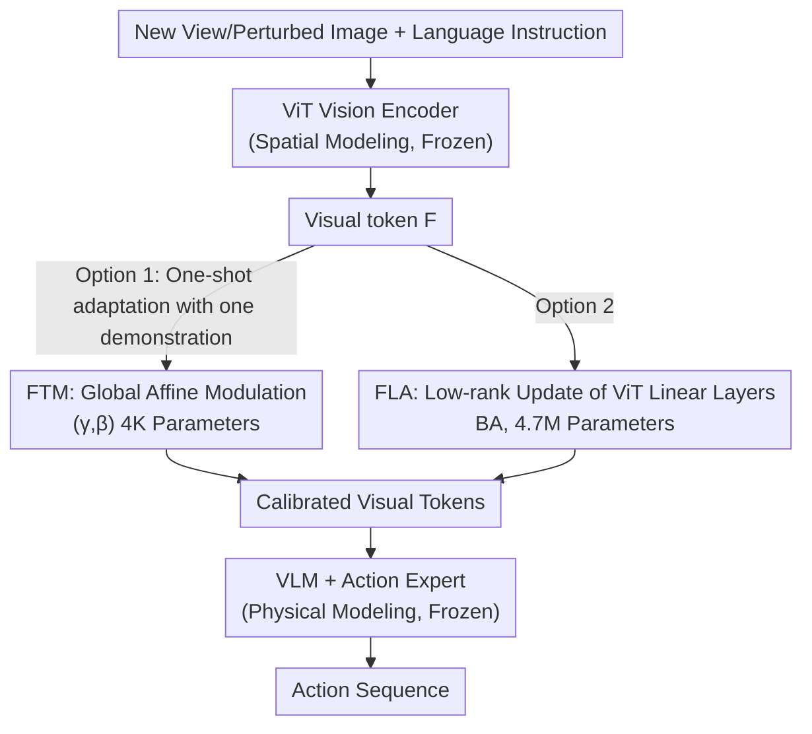

# VLA Models Are More Generalizable Than You Think: Revisiting Physical and Spatial Modeling

**Conference**: CVPR 2026  
**Paper**: [CVF Open Access](https://openaccess.thecvf.com/content/CVPR2026/html/Li_VLA_Models_Are_More_Generalizable_Than_You_Think_Revisiting_Physical_CVPR_2026_paper.html)  
**Code**: None  
**Area**: Robotics / Embodied AI (VLA Robustness Analysis)  
**Keywords**: VLA, Viewpoint Robustness, Parameter-Efficient Adaptation, Spatial Modeling, One-shot Adaptation

## TL;DR
This paper decomposes pre-trained VLA models into "Spatial Modeling (Vision Encoder)" and "Physical Modeling (VLM + Action Expert)". It demonstrates that the failure of VLAs under new viewpoints or visual perturbations is caused by representation drift in spatial modeling rather than the loss of physical modeling capabilities. By using two extremely lightweight one-shot adaptations—Feature Token Modulation (FTM) with 4K parameters for affine modulation and Feature Linear Adaptation (FLA) with 4.7M parameters for ViT low-rank updates—the success rate on LIBERO's new viewpoints is increased from 48.5% to 90.8%, matching or exceeding full LoRA fine-tuning with only 1% of the parameters.

## Background & Motivation
**Background**: Vision-Language-Action (VLA) models extend pre-trained vision-language bases to robot control. After pre-training on large-scale robot data, they exhibit strong performance in "in-distribution" manipulation tasks, serving as the current mainstream route for embodied AI (e.g., RT-2, π0, OpenVLA, Octo).

**Limitations of Prior Work**: These models suffer a cliff-like drop in success rate when encountering unseen camera viewpoints, lighting changes, background textures, or sensor noise. This study finds that π0.5 achieves only a 48.5% zero-shot success rate under LIBERO new viewpoints. Even after training on millions of demonstrations, this fragility persists, severely limiting real-world deployment.

**Key Challenge**: Previous attempts to improve robustness are expensive and miss the core issue. The data-driven approach (e.g., Libero-Plus) relies on massive multi-view data to increase visual diversity, but collection costs are prohibitive for continuous adaptation. The representation-driven approach uses geometric consistency or 3D-aware architectures for robust backbones, but remains sensitive to task-irrelevant visual factors like background clutter or lighting. Both camps assume robustness requires "more data" or "3D architectures," yet few have questioned whether the failure stems specifically from the spatial representation itself.

**Goal**: To decompose the broad question of "why VLAs fail under viewpoint changes" into localizable sub-problems: is it a failure to "understand space" or a failure in "reasoning/control"? If it is only the former, can it be "calibrated" at a minimal cost without altering the entire policy?

**Key Insight**: The authors propose a conceptual framework that splits VLA into two functional modules: Spatial Modeling (visual encoder, constructing spatial relationships like object position/orientation/contact/occlusion from images) and Physical Modeling (VLM + action expert, integrating language, spatial representations, and action history for high-level reasoning and action generation). A key observation is that viewpoint changes primarily alter the "spatial configuration of the observed scene" but **do not change the task semantics or action dynamics**. Therefore, degradation likely originates from representation misalignment in spatial modeling, while physical modeling remains functional—the high-level policy still reasons and controls, but it receives visually distorted spatial embeddings.

**Core Idea**: Since the bottleneck lies in spatial modeling, perform only a one-shot, lightweight, learnable "calibration" on the visual side (token-level affine modulation or low-rank updates within ViT). This realigns drifted visual embeddings back to a distribution usable by the physical modeling module, without fine-tuning the entire VLA.

## Method

### Overall Architecture
This work does not invent a new model but rather validates and leverages a thesis: **the fragility of VLA under visual perturbations is essentially a systematic embedding drift of the visual tokens produced by spatial modeling relative to physical modeling, rather than a lack of visual-motor capability in physical modeling**. Thus, the approach is to "freeze the entire VLA backbone and only insert a minimal learnable transformation $A_\phi$ on the vision side to calibrate visual tokens."

Formally, the base is π0.5: the vision encoder $f_v(\cdot)$ maps images to token embeddings $z=f_v(v)$, the language encoder $f_\ell(\cdot)$ provides $\ell=f_\ell(l)$, and the multi-modal decoder $g(\cdot)$ autoregressively predicts action tokens on the concatenated sequence $[z;\ell]$. Ours separates pre-trained parameters $\theta$ and adaptation parameters $\phi$. Adaptation acts only on the vision side, while decoder $g$ and language encoder $f_\ell$ remain frozen. The predictive distribution after adaptation becomes:

$$P_{\theta,\phi}(a_t\mid a_{<t}, o_{\le t}) = g\big(a_{<t};\,[A_\phi(f_v(v));\,\ell]\big)$$

where $A_\phi(\cdot)$ is one of the two lightweight transformations described below. The adaptation is **one-shot**—requiring only a single human demonstration per task for the new visual domain. The authors categorize existing/potential solutions into three types (full LoRA/PEFT of the whole backbone, robust vision backbones with re-trained policies, prompt learning with learnable tokens), which either have high parameter overhead or require re-training. In contrast, ours argues that "adjusting only the visual pathway is sufficient."

### Key Designs

**1. Decoupling Diagnosis of Spatial vs. Physical Modeling: Pinpointing "VLA Failure" to Visual Representation**

This is the foundational argument of the paper, justifying why only the vision side needs modification. The pain point is that prior work treated viewpoint fragility as a lack of robustness in the "entire VLA," leading to full fine-tuning or backbone replacement. The authors perform a controlled diagnosis: by separating spatial modeling ($f_v$) and physical modeling ($g$), and noting that viewpoint changes only affect spatial configuration, they conclude that if failures stem from spatial modeling, then **calibrating visual tokens alone, without touching $g$ or $f_\ell$, should suffice to restore robustness**. FTM is designed as a "probe"—if adjusting a single pair of global $(\gamma,\beta)$ can pull 48.5% up to 87%, it proves that fragility results from embedding misalignment rather than insufficient model capacity. The experimental result (FLA slightly outperforming LoRA with only 1% of the parameters) is the strongest evidence for this claim.

**2. Feature Token Modulation (FTM): Using Global Affine Parameters to Pull Back Drifted Visual Distributions**

FTM addresses the issue that "viewpoint changes cause the feature distribution of visual tokens to shift or scale systematically." It adds a global affine correction to the visual encoder's output tokens $F\in\mathbb{R}^{N\times D_{ViT}}$, introducing two learnable vectors $\gamma, \beta \in\mathbb{R}^{D_{ViT}}$:

$$\hat F = (1+\gamma)\odot F + \beta$$

This essentially performs "rescaling + recentering" in the visual embedding space to calibrate dimensions distorted by the viewpoint, while the VLA backbone remains frozen. Unlike conditional modulations that generate parameters dynamically per input, these $\gamma, \beta$ are **globally shared but learnable**, optimized during adaptation. The parameter count is only $2D_{ViT}$—with $D_{ViT}=2048$ for π0.5, totaling only approx. 4K trainable parameters. That such a minimalist intervention can raise the new viewpoint success rate from 48.5% to 87.1% suggests that pre-trained VLAs possess latent robustness "locked" by embedding misalignment.

**3. Feature Linear Adaptation (FLA): Low-rank Updates within ViT for Deeper Feature Realignment**

While FTM only modifies output tokens, FLA asks if one can "repair directly within the vision backbone." It applies LoRA-style low-rank updates to the linear layers of the ViT (specifically the SigLIP backbone in π0.5). For a frozen linear transformation $h=Wx$, it introduces a low-rank decomposition:

$$W' = W + \Delta W,\quad \Delta W = BA$$

where $A\in\mathbb{R}^{r\times d_{in}}$, $B\in\mathbb{R}^{d_{out}\times r}$, and $r\ll\min(d_{in},d_{out})$. Only $(A,B)$ are trained. This allows the ViT to adjust its feature extraction with minimal parameter overhead. It serves as a "second type of minimal intervention" for spatial modeling to test if repairing internal layers is comparable to or better than adjusting output tokens. FLA uses 4.7M parameters in total and pushes the average success rate to 90.8%, surpassing the 90.3% of π0.5 One-Shot LoRA (which uses 467M parameters). Using less than 1% of the parameters to outperform full-model LoRA provides powerful evidence that fragility is rooted in spatial representation.

### Loss & Training
Adaptation is one-shot: only one human demonstration per task is used. All experiments were conducted on a single A100 (80GB). For fair comparison, FLA and LoRA baselines were both trained for 2000 steps using Adam with a batch size of 32. Policies receive both wrist and third-person camera observations to provide complementary visual information. FTM's $\gamma, \beta$ correspond to the vision encoder hidden dimension $D_{ViT}=2048$, resulting in only 4K parameters. FLA only fine-tunes the linear layers within the SigLIP backbone.

## Key Experimental Results

### Main Results
The evaluation benchmark is **Libero-V (Visual)**, constructed by the authors. It overlays four types of visual perturbations from Libero-Plus (camera viewpoint, lighting, background/table texture, sensor noise) onto the four original LIBERO suites (Spatial/Object/Goal/Long, each with 10 tasks and 50 trials per task) to evaluate robustness under distribution shift.

**Success Rate under LIBERO New Viewpoints (Table 1)**:

| Model | Parameters | Average SR (%) |
|------|--------|-----------|
| OpenVLA-OFT (Zero-shot) | — | 50.3 |
| OpenVLA-OFT-m (Libero-Plus FT) | — | 65.2 |
| GeoAware-VLA (BAKU) | — | 82.6 |
| π0 (One-Shot LoRA) | 468M | 83.6 |
| π0.5 (One-Shot LoRA) | 467M | 90.3 |
| **π0.5 + FTM (Ours)** | **4K** | **87.2** |
| **π0.5 + FLA (Ours)** | **4.7M** | **90.8** |

FTM with only 4K parameters exceeds the π0 LoRA baseline (468M parameters); FLA with 4.7M parameters outperforms π0.5 LoRA (467M), reducing parameters by approximately 99×.

**Libero-V Four Visual Perturbations (Table 3)**:

| Model | Camera | Light | Texture | Noise | Average |
|------|------|------|------|------|------|
| π0.5 (Zero-shot) | 48.5 | 96.2 | 96.0 | 93.5 | 83.6 |
| π0.5 (One-Shot LoRA) | 90.3 | 96.5 | 97.2 | 94.5 | 94.6 |
| **π0.5 + FTM (Ours)** | 87.1 | 96.0 | 96.0 | 93.6 | 90.5 |
| **π0.5 + FLA (Ours)** | 90.8 | 96.8 | 97.1 | 94.6 | **94.8** |

The zero-shot collapse occurs almost entirely in the "Camera Viewpoint" dimension (48.5), while lighting/texture/noise already achieve 93+. This confirms that viewpoint change is the primary pathological factor. FLA brings the camera dimension to 90.8, matching or slightly exceeding LoRA's overall average.

### Ablation Study

**Parameter Efficiency Comparison (Table 4)** and **Adaptation Rank / Backbone Ablation (Table 5)**:

| Config | Parameters | SR (%) | Description |
|------|--------|-------|------|
| Prompt Learning | 0.13M | 75.1 | Shallow conditioning is insufficient for realignment |
| FTM | 0.004M | 90.5 | Modulating tokens directly is much more effective |
| FLA (rank=16) | 4.7M | 90.8 | Matches LoRA with 99× fewer parameters |
| FLA (rank=32) | 9.4M | 91.2 | Higher rank yields slight gains |
| π0 + FLA (rank=16) | 4.7M | 84.0 | Comparable to π0 LoRA (83.6) |
| LoRA (π0.5) | 467M | 90.3 | Full fine-tuning baseline |

### Key Findings
- **Failures are highly concentrated in the viewpoint dimension**: Zero-shot π0.5 performs at 93+ for light/texture/noise but drops to 48.5 for camera viewpoint, validating the "spatial modeling misalignment" hypothesis.
- **Token-level modulation ≫ prompt learning**: FTM (4K params, 90.5%) significantly outperforms Prompt Learning (0.13M params, 75.1%), showing that affine correction on visual tokens is more effective than shallow conditioning.
- **Lightweight adaptation outperforms full LoRA**: FLA surpasses LoRA with 1% of the parameters, which **proves that physical modeling is intact**—otherwise, modifying the vision side alone would not restore performance to full fine-tuning levels.
- **Stable against viewpoint perturbation magnitude**: FLA maintains steady performance (94.6/90.0/87.9) as viewpoint shift moves from Small to Large (Table 2), verifying that "latent robustness can be efficiently activated without re-training."
- **Cross-backbone generic**: FLA performance is approximately equal to respective LoRA levels for both π0 and π0.5.

## Highlights & Insights
- **"Diagnosis before repair" research paradigm**: The paper's strength lies in its falsifiable hypothesis (decoupling spatial/physical), the use of FTM as a probe, and the realization of performance through FLA.
- **4K parameters moving 48.5% → 87.1% is a true "Aha!" moment**: It demonstrates that pre-trained VLAs hide significant untapped robustness. The bottleneck is not capacity or data volume, but the "alignment" between visual embeddings and the downstream policy.
- **Transferable Insight**: One can treat "OOD degradation as representation drift in a specific submodule." Instead of blind full fine-tuning, identify the drifting module and use minimal intervention (global affine or low-rank correction) to calibrate it—applicable to scenarios like multi-modal retrieval or cross-domain segmentation.

## Limitations & Future Work
- **Limited to LIBERO Simulation**: All experiments were conducted on LIBERO/Libero-V simulation suites and a single backbone family (π0/π0.5). Performance in more complex real-world visual conditions remains an open question.
- **Limited gains in Light/Texture/Noise dimensions**: Since zero-shot performance is already 93+ in these three dimensions, the claim of "robustness to four types of perturbations" mostly refers to solving the viewpoint problem.
- **Ceiling of Global Affine**: FTM's $(\gamma, \beta)$ parameters are globally shared, which might be insufficient for perturbations causing non-linear or local spatial distortions, explaining why the deeper FLA is needed to fully match LoRA.
- **Dependency on a "Correct" One-Shot Demonstration**: Adaptation relies on one human demo per task; if the demo is non-representative, adaptation quality may degrade, which is not fully discussed.

## Related Work & Insights
- **vs. Data-scaling (Libero-Plus, etc.)**: These rely on expensive multi-view data collection; ours uses one-shot calibration with a single demonstration. FLA (94.8) also outperforms OpenVLA-OFT-m (86.0) fine-tuned on Libero-Plus.
- **vs. Representation-centric (GeoAware-VLA)**: GeoAware-VLA replaces the backbone with geometric-aware (VGGT) units and re-trains the policy. Ours keeps the architecture and re-trains nothing, simply inserting low-rank updates in the existing SigLIP backbone, achieving better SR (90.8 vs 82.6) and parameter efficiency.
- **vs. LoRA Full Fine-tuning**: While both use low-rank ideas, LoRA fine-tunes the entire VLA (467M params), whereas ours **restricts updates to the vision encoder** (4.7M). This validates the "visual-side pathology" hypothesis and achieves 99× efficiency.
- **vs. Prompt Learning**: Prompt learning concatenates learnable tokens into the sequence (75.1%). Ours demonstrates that affine/low-rank correction on visual tokens directly is a much more effective adaptation pathway (90.5%/94.8%).

## Rating
- Novelty: ⭐⭐⭐⭐ The methods (Affine Modulation + ViT-LoRA) are not new, but the insight that VLA fragility can be pinpointed to spatial modeling and corrected via minimal intervention is highly insightful.
- Experimental Thoroughness: ⭐⭐⭐⭐ Compared against strong baselines (GeoAware, OpenVLA-OFT, LoRA, Prompt) on LIBERO/Libero-V with multiple ablations. Lacks real-world robot experiments.
- Writing Quality: ⭐⭐⭐⭐ Clear arguments and persuasive figures (parameter-performance, four-perturbation analysis).
- Value: ⭐⭐⭐⭐⭐ Provides a counter-intuitive but actionable conclusion for the embodied AI field: robustness often doesn't require more data, but rather minimal calibration of drifting modules.

<!-- RELATED:START -->

## Related Papers

- [\[CVPR 2026\] Spatial-Aware VLA Pretraining through Visual-Physical Alignment from Human Videos](spatial-aware_vla_pretraining_through_visual-physical_alignment_from_human_video.md)
- [\[ICLR 2026\] When a Robot is More Capable than a Human: Learning from Constrained Demonstrators](../../ICLR2026/robotics/when_a_robot_is_more_capable_than_a_human_learning_from_constrained_demonstrator.md)
- [\[CVPR 2026\] SwiftVLA: Unlocking Spatiotemporal Dynamics for Lightweight VLA Models at Minimal Overhead](swiftvla_unlocking_spatiotemporal_dynamics_for_lightweight_vla_models_at_minimal.md)
- [\[CVPR 2026\] ACoT-VLA: Action Chain-of-Thought for Vision-Language-Action Models](acot-vla_action_chain-of-thought_for_vision-language-action_models.md)
- [\[ICLR 2026\] VLM4VLA: Revisiting Vision-Language-Models in Vision-Language-Action Models](../../ICLR2026/robotics/vlm4vla_revisiting_vision-language-models_in_vision-language-action_models.md)

<!-- RELATED:END -->
