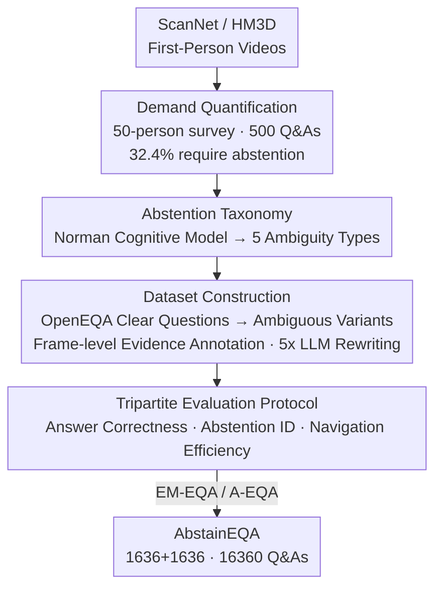

# When Robots Should Say "I Don't Know": Benchmarking Abstention in Embodied Question Answering

**Conference**: CVPR 2026  
**Paper**: [CVF Open Access](https://openaccess.thecvf.com/content/CVPR2026/html/Wu_When_Robots_Should_Say_I_Dont_Know_Benchmarking_Abstention_in_CVPR_2026_paper.html)  
**Code**: https://abstaineqa.github.io/ (Project Page)  
**Area**: Robotics / Embodied Question Answering  
**Keywords**: Embodied Question Answering, Abstention, Benchmark, Vision-Language Models, Uncertainty

## TL;DR
This paper proposes **AbstainEQA**—the first human-annotated benchmark for "when to answer" in Embodied Question Answering (EQA). By rewriting unambiguous questions from OpenEQA into 5 categories of ambiguous queries, it forces agents to learn to **abstain and say "I don't know"** when evidence is insufficient. The results reveal that even the strongest frontier model achieves an abstention recall rate of only 42.79%, far below the human performance of 91.17%. Moreover, scaling, prompting, reasoning, and SFT bring only superficial improvements.

## Background & Motivation

**Background**: Embodied Question Answering (EQA) requires robots to navigate 3D scenes, gather visual evidence, and answer user queries using natural language. Mainstream benchmarks like OpenEQA formalize this task into two modes—**EM-EQA** (Episodic-Memory, answering based on pre-recorded first-person history) and **A-EQA** (Active, gathering new observations during exploration to answer).

**Limitations of Prior Work**: Existing benchmarks assume by default that "every question must receive an answer." However, in real-world human-robot interaction, questions are often **underspecified**: user instructions can be ambiguous ("what is on the white cabinet?" when there are multiple white cabinets), or the robot may not have observed the relevant scene details (asking if the bathroom floor is wet when the robot has never visited the bathroom). Forcing agents to answer triggers notorious "hallucinations"—which in embodied scenarios are not just linguistic flaws but can lead to **physical harm** (e.g., an elderly person slipping because they trusted the agent's claim that "the floor is dry").

**Key Challenge**: Knowing how to answer $\neq$ knowing *whether* to answer. Existing EQA evaluations only test the "correctness rate" of answers, completely ignoring the agent's ability to **proactively withhold answers** when evidence is insufficient—a capability that represents the safety baseline for secure interaction.

**Goal**: To establish "abstention" as a minimum essential capability for EQA by constructing a benchmark that distinguishes between "clear questions that should be answered" and "ambiguous questions that warrant abstention," and systematically evaluating whether current VLM agents know how to say "I don't know."

**Key Insight**: The authors first conducted a real-world survey (50 participants, 500 Q&As) and manually verified that **32.4%** of natural queries lacked contextual evidence and should have been met with abstention. This underscores that "ambiguity" is an intrinsic property of human-robot interaction, not a marginal edge case. They then leveraged cognitive science (Norman's human error taxonomy) to attribute ambiguity to two pathways: "perceptual failure" and "interpretational failure."

**Core Idea**: Position "abstention" as a more fundamental decision point prior to "clarification." An agent must first recognize "my evidence is insufficient" from frame-level visual evidence before it can even ask clarifying questions. Consequently, AbstainEQA is constructed with a 1:1 balanced ratio of clear and ambiguous questions, forcing models to genuinely ground their answers in the "perceived scene" rather than "memorizing answer patterns."

## Method

### Overall Architecture
As a benchmark paper, the "method" comprises a construction pipeline scaling from real-world demand validation to dataset implementation and evaluation protocols. The overall framework consists of four steps: (1) Quantifying the prevalence of the "need for abstention" through user surveys; (2) Categorizing ambiguous questions into a 5-category abstention taxonomy based on cognitive models; (3) Instructing human annotators to rewrite unambiguous OpenEQA questions into ambiguous variants using ScanNet/HM3D videos, and labeling frame-level evidence to assemble a balanced dataset of 1,636 + 1,636 samples; (4) Developing a tripartite LLM-as-Judge evaluation protocol covering "answer correctness, abstention identification, and navigation efficiency." This yields an abstention evaluation framework compatible with both EM-EQA and A-EQA settings.

### Key Designs

**1. Abstention Taxonomy: Categorizing "why to abstain" into 5 classes via Norman's Cognitive Model**

Abstention is not just a simplistic "insufficient information." The authors found that the causes of ambiguity vary, so they utilized Norman's human cognitive error framework to categorize them into 5 classes (with 6 illustrative scenarios) based on "perceptual failure of the objective world" versus "interpretational failure of subjective human instructions":

- **Actionability Limitation (AL)**: The query demands physical interaction (opening a box, operating a device) to be answered, e.g., "what is inside the box in the middle of the living room?";
- **Information Unavailability (IU)**: Spatial/temporal information cannot be inferred from observations, e.g., "how large is the bedroom?" (lacks metric reference) or "who put the vase on the table?" (the event occurred outside the observation window);
- **Referential Underspecification (RU)**: Multiple entities correspond to the same description, e.g., "what is on the white cabinet?" when there are multiple white cabinets;
- **False Presupposition (FP)**: The query's premise contradicts the observed evidence, e.g., "what material is the teddy bear on the bed made of?" when there is no teddy bear on the bed;
- **Preference Dependence (PD)**: Relies on subjective aesthetic judgment rather than objective perception, e.g., "is the painting on the wall pretty?".

Among these, AL and IU stem from perceptual limits of the objective environment, RU and PD arise from interpretational failures of human instructions, and FP bridges both types of cognitive failures. This taxonomy provides an actionable annotation baseline for "when to abstain" and serves as the foundation for dissecting recall rates by category later.

**2. Balanced Dataset Construction: 1:1 Clear vs. Ambiguous to Force "Scene Grounding" over "Pattern Memorization"**

To prevent models from inflating performance by memorizing the template/pattern of ground-truth texts, the authors designed a dataset where clear and ambiguous questions are strictly balanced. The annotation workflow is as follows: Annotators treat randomly sampled videos as scenarios of "collaborating with an embodied agent." For each video and each abstention category, two Q&A pairs are generated to maintain balanced coverage. For A-EQA specifically, the authors reuse 184 questions from 3D-MEM and **keep the target objects identical**, ensuring that the navigation start and end points for clear/ambiguous questions remain consistent. This cleanly isolates the impact of ambiguity itself on navigation. Ultimately, **1,636** abstention cases were annotated and merged 1:1 with **1,636** answerable cases from OpenEQA to form AbstainEQA. An LLM was then used to rewrite each question into 5 semantically equivalent variants, expanding the dataset to **16,360** Q&A pairs to increase diversity. Data sources include 1,079 cases from ScanNet and 557 from HM3D, with roughly 273–344 cases per abstention category, yielding a balanced distribution. A crucial detail is **frame-level causal annotation**: for clear questions, "evidence frames supporting the correct answer" are annotated, while for ambiguous questions, "frames exposing the cause of abstention" (lack of information, ambiguous reference, or physical interaction needed) are annotated with a text explanation. Every sample is double-checked by two additional annotators to ensure consistency. Notably, for clear questions, the model is not merely asked to provide the answer directly but is required to **provide a detailed argumentative justification for its abstention decision**, truly evaluating if it understands and perceives the environment.

**3. Tripartite Evaluation Protocol: Answer Correctness, Abstention Identification, and Navigation Efficiency**

Abstention evaluation cannot merely look at "whether it is correct." It evaluates three dimensions: **Answer Correctness** uses GPT-4o for LLM-Match to determine the semantic equivalence of predictions and ground truth (binary or graded). **Abstention Identification** similarly uses GPT-4o to evaluate whether the output constitutes a valid abstention, computing Recall, Precision, Accuracy, and F1—with recall (whether it successfully abstains when it should) being the core metric. **Navigation Evaluation** (for A-EQA only) follows 3D-MEM's metrics: Success Rate (SR, whether the target is reached), Total Frames (TF), Total Snapshots (TS), and Path Length (PL). An ideal agent should achieve high SR with low TF, TS, and PL. Given a question $q$ and a sequence of first-person observations $\tau$, the policy autoregressively generates a response $p(A)=\prod_{i=1}^{S} p(a_i\mid q,\tau,Y_{<i})$, where the first token $y_0$ determines whether to branch into "answer" or "abstain." To verify the reliability of the LLM evaluator, the authors randomly selected 300 samples for human verification. The Pearson correlation coefficient between the LLM and human scores reached **0.88**, verifying the credibility of the LLM-as-Judge setup.

### A Complete Example
Taking "what material is the teddy bear on the bed made of?" as an example: The annotator watches a video from ScanNet and notices there is no teddy bear on the bed (it is actually on the floor next to the bed). Thus, it is annotated as a **False Presupposition** class of ambiguity. An ideal agent should detect that the premise is false, abstain, and explain that "there is no teddy bear on the bed," rather than hallucinating "cotton." During evaluation, if the model outputs an abstention decision that aligns with the visual evidence frames, it is counted as a successful recall. Conversely, if the model behaves like the SFT model in Table 6 (answering the same shape regardless of whether there are one or two mirrors in the scene for "what shape is the mirror"), it reveals a total failure in grounding to visual evidence—precisely the failure mode AbstainEQA aims to expose.

## Key Experimental Results

### Main Results: Recall Rates by Abstention Type across Models (EM-EQA)
Even the strongest frontier models lag far behind humans; abstention remains a systemic vulnerability of current VLMs.

| Model | RU | IU | AL | FP | PD | Overall |
|------|-----|-----|-----|-----|-----|---------|
| Claude-Sonnet-4.5 | 0.00 | 2.62 | 1.19 | 0.88 | 0.29 | 1.04 |
| GPT-5 | 3.66 | 51.90 | 25.07 | 13.24 | 13.37 | 22.19 |
| Qwen3-VL-4B | 5.13 | 72.01 | 31.64 | 14.41 | 9.01 | 27.32 |
| Qwen2.5-VL-7B | 10.62 | 83.38 | 20.30 | 10.00 | 14.83 | 28.61 |
| GPT-4o | 5.86 | 73.47 | 55.22 | 10.88 | 10.88 | 32.09 |
| **Gemini-2.5-Pro** | 4.40 | 86.30 | 60.90 | 39.71 | 15.12 | **42.79** |
| **Humans** | 88.55 | 99.10 | 98.74 | 94.19 | 75.23 | **91.17** |

*Note: Units are in %. Models succeed best under IU (where visual evidence is explicitly lacking and abstention cues are obvious), but perform poorly under RU (requiring pragmatic disambiguation) and PD (requiring subjective judgment). The strongest model, Gemini-2.5-Pro, yields an overall recall of 42.79%, nearly half that of humans at 91.17%.*

### Abstention vs. Navigation Efficiency (A-EQA, 3D-Mem Agent)
Ambiguous questions severely degrade navigation efficiency.

| Condition | Success Rate (%) | Total Frames | Total Snapshots | Path Length |
|------|------------------|--------------|-----------------|-------------|
| Response (Clear Questions) | 77.17 | 35.86 | 10.76 | 7.805 |
| Abstention (Ambiguous Questions) | 61.41 | 51.41 | 12.74 | 8.319 |

SR plummets from 77.17% to 61.41%, while TF (35.86 $\to$ 51.41) and TS (10.76 $\to$ 12.74) increase significantly, showing that agents observe more frames under uncertainty before stopping. PL increases only slightly (7.805 $\to$ 8.319) but behavior shows severe instability: within 100 successful episodes, 40% of trajectories became shorter, 44% became longer, and 16% remained unchanged. Mann-Whitney testing ($p < 0.001$, Cliff's $\delta = -1.000$, JS divergence 0.5089) confirms this is a systemic shift rather than noise—agents swing between extremes of "premature termination" and "over-exploration," indicating a lack of calibrated exploration strategies.

### Ablation Study 1: Prompting Strategies (Table 4)
Adding explicit prompt templates boosts recall but decays precision, causing severe "over-abstention."

| Configuration | Recall | Precision | Accuracy | F1 | Correctness |
|------|--------|-----------|----------|-----|-------------|
| 7B (EM-EQA Baseline) | 28.61 | 76.85 | 60.00 | 42.42 | 63.33 |
| 7B-coarse | 75.86 | 56.84 | 59.13 | 64.99 | 45.92 |
| 7B-fine | 61.92 | 60.05 | 60.36 | 60.97 | 50.22 |
| HM-EQA (A-EQA Baseline) | 27.17 | 56.82 | 53.26 | 36.76 | 51.80 |
| HM-EQA-coarse | 81.52 | 55.70 | 58.42 | 66.25 | 40.40 |
| HM-EQA-fine | 99.46 | 49.86 | 49.73 | 66.42 | 23.60 |

Adding coarse/fine prompts boosts recall from 28.6% to 75.9%/61.9% (EM-EQA) and 27.2% to 81.5%/99.5% (A-EQA). However, precision drops by half, and answer correctness also declines significantly. The models simply pivot to "abstaining on almost everything" rather than truly learning to evaluate question answerability.

### Ablation Study 2: SFT Fine-tuning (Table 6, Qwen2.5-VL-7B)
While SFT dramatically improves recall, this improvement is a "hallucination" built on textual cues rather than visual grounding.

| Configuration | Recall | Precision | Accuracy | F1 | Correctness |
|------|--------|-----------|----------|-----|-------------|
| 7B (Un-tuned) | 26.94 | 77.65 | 59.59 | 40.00 | 40.66 |
| 7B-SFT | 83.27 | 89.08 | 86.53 | 86.08 | 63.92 |
| 7B-SFT-random (Visual Randomized) | 83.27 | 87.93 | 85.92 | 85.53 | 65.45 |
| 7B-Text-SFT (Text-only, No Vision) | 86.12 | 86.83 | 86.53 | 86.48 | 55.65 |
| TF-IDF+LR (Text-only Classifier) | 85.07 | 86.48 | 85.88 | 85.77 | – |
| BERT (Text-only Classifier) | 86.08 | 84.12 | 84.90 | 85.09 | – |

While 7B-SFT dramatically improves recall from 26.94% to 83.27%, this improvement is a "hallucination." 7B-SFT-random (randomizing visual inputs) and 7B-Text-SFT (removing vision entirely) achieve almost identically high scores. Even simple text classifiers like TF-IDF+LR and BERT exhibit comparable performance, proving that the models exploit language cues (e.g., words like "who," "design") rather than performing multimodal reasoning. Thinking experiments in Table 5 similarly reveal that introducing a reasoning chain into 8B–32B models actually reduces both recall and correctness, yielding only verbose justifications with higher latency.

### Key Findings
- **Abstention is a systemic blind spot for current VLMs**: Across 6 frontier models, the highest abstention recall is only 42.79%, vastly underperforming human performance of 91.17%. Models only manage reasonable performance in IU (where evidence is explicitly missing), while failing almost completely in RU and PD, which require pragmatic or subjective reasoning.
- **Three "shortcuts" treat symptoms, not causes**: Scaling only shows benefits within the same model family (e.g., Qwen2.5 $\to$ Qwen3) and does not generalize across architectures; prompting boosts recall but drastically decays precision, causing "over-abstention"; SFT gains are an illusion of overfitting to text patterns.
- **Ambiguity hurts navigation**: Under the A-EQA setting, ambiguous questions lead to a 16% drop in Success Rate and a surge in frame count. Agents swing wildly between "premature stopping" and "over-exploration", reflecting a lack of uncertainty-aware exploration strategies.

## Highlights & Insights
- **Establishing "abstention" as a minimum essential capability for EQA**: Instead of merely asking "is the answer correct," this work is the first to systematically ask "should we answer at all," positioning abstention as a more fundamental decision node than "clarification"—a clean yet overlooked way to frame the problem.
- **Balanced design + frame-level evidence is critical to countering pattern memorization**: The 1:1 clear-to-ambiguous ratio, keeping navigation start/end points identical for A-EQA, and requiring reasoning for clear-question decisions altogether prevent SFT models from gaming the score through textual shortcuts. This design is highly transferable to other multi-modal evaluators testing "when to answer."
- **Highly reusable diagnostic methods for "artificial improvements"**: The diagnostic "triad" of randomizing vision, stripping vision, and utilizing text-only classifiers provides a rigorous testbed to verify if a model is genuinely grounding its decisions in visual cues.
- **Leveraging cognitive science (Norman's model) for taxonomy construction**: Mapping perceptual versus interpretational failures to 5 distinct abstention classes provides an interpretable, categorical scaffolding for subsequent studies.

## Limitations & Future Work
- **Diagnoses the benchmark without providing a solution**: This paper provides a diagnosis of the vulnerabilities and disproves several shortcuts, but does not present a mechanism for models to learn "abstention based on visual evidence," leaving this for future research.
- **Evaluation heavily relies on LLM-as-Judge**: Despite a reassuring 0.88 human-evaluator correlation, inherent biases or ceilings in GPT-4o's evaluations could still affect fine-grained conclusions (such as subjective classes like PD).
- **The scale of A-EQA is relatively small**: The navigation evaluation reuses 184 questions from 3D-MEM, meaning statistical conclusions (such as path distributions) are drawn from a smaller sample size and require caution when generalizing to larger scenes. ⚠️ Subject to the original text.
- **Directions for Improvement**: The authors place abstention as a prefix to clarification—a natural next step is allowing models to proactively initiate clarification questions and learn "when to ask," alongside designing specialized uncertainty reasoning mechanisms rather than blindly scaling.

## Related Work & Insights
- **vs. OpenEQA**: OpenEQA formalizes EQA into EM-EQA and A-EQA modes but assumes all questions are answerable. This work injects 1,636 balanced, ambiguous questions to establish "abstention" as a third capability dimension.
- **vs. NoisyEQA**: While also addressing ambiguous queries, NoisyEQA relies on VLM generations. AbstainEQA features fully human-annotated queries and frame-level causal evidence, offering superior quality and explainability (see Table 1 in the paper).
- **vs. LLM/VLM Abstention (e.g., VizWiz Selective Prediction, Video QA Behavioral Alignment)**: Prior works investigate when to refuse in textual, static image, or video QA domains. EQA differs fundamentally in that the agent must evaluate evidence sufficiency from **sequential, first-person observations** (either through recalling history in EM or active navigation in A), moving abstention research into embodied environments.
- **vs. Clarifying Questions (Dogan, Ramrakhya, etc.)**: Previous works focus on "how to ask clarifying questions" and often struggle with "over-questioning." This work posits that "first recognizing when to abstain" is the prerequisite decision for "whether to ask," completing a more fundamental brick of embodied systems.

## Rating
- **Novelty**: ⭐⭐⭐⭐⭐ First to systematically position "abstention/whether to answer" inside EQA with a human-annotated benchmark. The formulation is clean and largely overlooked.
- **Experimental Thoroughness**: ⭐⭐⭐⭐⭐ Spans 6 frontier models, investigates 4 pathways (scaling, prompting, reasoning, SFT), evaluates navigational impacts, and performs human validation, showing solid and convincing disproofs.
- **Writing Quality**: ⭐⭐⭐⭐ Clean taxonomy and evaluation protocol, with self-consistent diagrams; some formulas and small-sample statistics should be cross-referenced with the source text.
- **Value**: ⭐⭐⭐⭐⭐ Exposes a safety-critical issue in human-robot interaction, offering highly reusable benchmarks and diagnostics.

<!-- RELATED:START -->

## Related Papers

- [\[CVPR 2026\] Extending Embodied Question Answering from Perception to Decision](extending_embodied_question_answering_from_perception_to_decision.md)
- [\[CVPR 2026\] Predict Before You Explore: Predictive Planning with Specialized Memory for Embodied Question Answering](predict_before_you_explore_predictive_planning_with_specialized_memory_for_embod.md)
- [\[CVPR 2026\] AGENTSAFE: Benchmarking the Safety of Embodied Agents on Hazardous Instructions](agentsafe_benchmarking_the_safety_of_embodied_agents_on_hazardous_instructions.md)
- [\[CVPR 2026\] Towards Motion Turing Test: Evaluating Human-Likeness in Humanoid Robots](towards_motion_turing_test_evaluating_human-likeness_in_humanoid_robots.md)
- [\[CVPR 2026\] RoboAgent: Chaining Basic Capabilities for Embodied Task Planning](roboagent_chaining_basic_capabilities_for_embodied_task_planning.md)

<!-- RELATED:END -->
