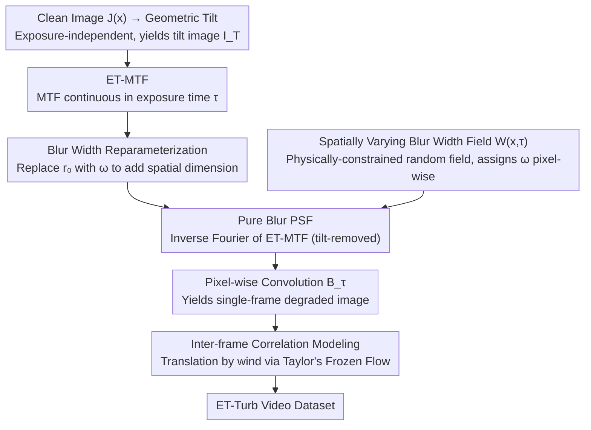

# Continuous Exposure-Time Modeling for Realistic Atmospheric Turbulence Synthesis

**Conference**: CVPR 2026  
**arXiv**: [2603.01398](https://arxiv.org/abs/2603.01398)  
**Code**: [Available](https://github.com/Jun-Wei-Zeng/ET-Turb)  
**Area**: Scientific Computing  
**Keywords**: Atmospheric Turbulence Synthesis, Exposure-Time Modeling, Modulation Transfer Function (MTF), Point Spread Function (PSF), Turbulence Image Restoration  

## TL;DR

Ours proposes the Exposure-Time dependent Modulation Transfer Function (ET-MTF), modeling exposure time as a continuous variable. A large-scale synthetic turbulence dataset, ET-Turb (5,083 videos, 2 million frames), is constructed, significantly improving the generalization of turbulence restoration models on real-world data.

## Background & Motivation

Atmospheric turbulence introduces geometric distortion (tilt) and exposure-time-related blur through random fluctuations in the refractive index, severely affecting long-range imaging applications such as remote sensing, video surveillance, and astronomical observation. The performance of learning-based methods highly depends on the realism of training data, yet acquiring large-scale paired real-world turbulence data is extremely expensive, making synthetic datasets essential.

Existing synthesis methods suffer from coarse handling of exposure time:

- **Fixed Exposure**: Many methods use a single exposure setting for all samples, resulting in uniform blur statistics that fail to reflect temporal variability in real imaging.
- **Binary Exposure**: Some methods only distinguish between "Short Exposure" (SE) and "Long Exposure" (LE) modes using $\text{MTF}_{\text{SE}}$ and $\text{MTF}_{\text{LE}}$, ignoring the smooth transitions occurring at intermediate exposure times.
- **Physical Simulation**: Devices like gas stoves are limited by short optical paths, and multi-step phase screen methods involve massive computational overhead.

These limitations lead to a significant domain gap between synthetic data and real turbulence, restricting the generalization of trained models.

## Method

### Overall Architecture

The paper models turbulence degradation as $I(\mathbf{x}) = \mathcal{B}_\tau(\mathcal{T}(J(\mathbf{x})))$: first applying an exposure-time-independent geometric tilt operator $\mathcal{T}$ to the clean image $J$ to obtain a tilt image $I_T$, then applying an exposure-time-dependent blur operator $\mathcal{B}_\tau$. While tilt follows existing random displacement field modeling, the contribution focuses on making $\mathcal{B}_\tau$ **continuously vary with exposure time, vary with spatial position, and extend to video**.

The blur synthesis pipeline consists of four core designs: ① Deriving the **Exposure-Time dependent MTF (ET-MTF)** from Azoulay’s finite exposure theory, connecting the discrete "SE/LE" states into a continuous knob; ② **Blur width reparameterization** of ET-MTF, replacing the Fried parameter $r_0$ with local blur width $\omega$ to introduce a pixel-wise spatial dimension; ③ Using a **spatially varying blur width field** $\mathcal{W}(\mathbf{x},\tau)$, constrained by optical turbulence statistics, to assign local $\omega$ and perform pixel-wise convolution; ④ Employing **Taylor’s Frozen Flow** for inter-frame correlation modeling to extend single frames into coherent videos. Finally, this pipeline generates the ET-Turb dataset.

### Key Designs

**1. Exposure-Time dependent MTF (ET-MTF): Turning the binary "SE vs LE" switch into a continuous knob**

Existing methods only provide extremal states $\text{MTF}_{\text{SE}}$ and $\text{MTF}_{\text{LE}}$, leaving intermediate exposures without a physical model or relying on empirical interpolation. This work returns to Azoulay’s finite exposure MTF theory using the concept of effective coherence length $\rho_p(\tau)$. In SE, turbulence is almost "frozen" within the aperture $D$; in LE, the sensor accumulates multiple states, equivalent to an aperture "stretched" by wind to $D + v_w \tau$. The MTF is:

$$\text{MTF}_{\text{ET}}(\boldsymbol{\xi}, \tau) = e^{-\left(\frac{\lambda \|\boldsymbol{\xi}\|}{\rho_p(\tau)}\right)^{5/3}}, \qquad \rho_p(\tau) = 1 + 0.35 \left(\frac{r_0}{D + v_w \tau}\right)^{1/3}$$

where $r_0$ is the Fried parameter, $v_w$ is wind speed, and $\boldsymbol{\xi}$ is spatial frequency. As $\tau$ increases, the effective aperture grows, $\rho_p(\tau)$ smoothly decreases, and high-frequency attenuation accelerates—making the transition from weak to strong blur continuous and physically grounded.

**2. Blur Width Reparameterization: Making the MTF vary spatially and temporally**

Since $\rho_p(\tau)$ only depends on $\tau$, the entire image would have uniform blur intensity. Real turbulence blur is spatially non-uniform due to local refractive index fluctuations. To introduce the spatial dimension, the authors define local blur width $\omega \approx \frac{0.49 \lambda f}{r_0}$ using PSF Full-Width at Half-Maximum (FWHM). Solving for $r_0$ and substituting it back:

$$\rho_p(\omega, \tau) = 1 + 0.28 \left(\frac{\lambda f}{\omega(D + v_w \tau)}\right)^{1/3}$$

After reparameterization, ET-MTF is determined by both local blur width $\omega$ (space) and exposure time $\tau$ (time), making $\omega$ a pixel-wise adjustable "blur knob."

**3. Spatially Varying Blur Width Field: Upgrading scalar $\omega$ to a physically-constrained random field**

The blur width is modeled as a spatially correlated random field $\mathcal{W}(\mathbf{x}, \tau)$, with mean and standard deviation constrained by optical turbulence theory:

$$\mathcal{W}(\mathbf{x}, \tau) = \max\!\big(\epsilon,\; \bar{\omega}(\tau) + \sigma_\omega(\tau)\, \mathcal{R}(\mathbf{x})\big)$$

where $\bar{\omega}(\tau)$ and $\sigma_\omega(\tau)$ are functions of $\tau$, and $\mathcal{R}(\mathbf{x})$ is a zero-mean, unit-variance Gaussian random field processed by a low-pass filter to ensure smooth transitions. The final spatially varying blur operation applies the local PSF to the tilt-corrected image:

$$\mathcal{B}_\tau(I_T(\mathbf{x})) = \text{PSF}_{\text{ET}}(\mathbf{x}, \mathcal{W}(\mathbf{x}, \tau), \tau) * I_T(\mathbf{x})$$

This enables the synthetic images to exhibit realistic "clear foreground, blurry background, and local fluctuations" characteristics within a single frame.

**4. Inter-frame Correlation Modeling: Extending single frames to videos via Taylor's Frozen Flow**

To ensure temporal consistency, Taylor’s Frozen Flow hypothesis assumes a quasi-static refractive index field translated by mean wind:

$$\mathcal{H}(J_t(\mathbf{x})) = \mathcal{H}\!\left(J_0\!\left(\mathbf{x} - \frac{f \mathbf{v}_w t}{L}\right)\right)$$

By sampling from a degradation field larger than the frame and translating the window according to wind direction, the method generates temporally correlated frames with consistent drifting effects.

### Loss & Training

The core contribution is dataset construction. ET-Turb includes 12 configurations covering various optical and atmospheric conditions:

- **Parameter Space**: Distance 30-1000m, focal length 0.1-1m, F-number 2.8-24, $C_n^2$ from $0.5 \times 10^{-14}$ to $300 \times 10^{-14}$ m$^{-2/3}$, wind speed 1-10 m/s, exposure time 0.5-40ms.
- **Scale**: 5,083 videos, 2,005,835 frames (3,988 training / 1,095 testing).
- **Real Data**: ET-Turb-Real contains 74 videos from 3 different imaging devices.

## Key Experimental Results

### Main Results

Evaluation of models trained on different synthetic datasets using real-world turbulence (no-reference metrics, lower is better):

| Training Dataset | TSR-WGAN NIQE↓ | TSR-WGAN BRISQUE↓ | TMT NIQE↓ | TMT BRISQUE↓ | DATUM NIQE↓ | DATUM BRISQUE↓ | MambaTM NIQE↓ | MambaTM BRISQUE↓ |
|---|---|---|---|---|---|---|---|---|
| TMT-dynamic | 4.231 | 52.502 | 4.361 | 58.581 | 4.219 | 54.921 | 4.217 | 55.062 |
| ATSyn-dynamic | 4.224 | 54.462 | 4.483 | 59.707 | 4.308 | 59.126 | 4.247 | 56.876 |
| **ET-Turb** | **4.190** | **50.981** | **4.221** | **56.691** | **4.204** | **54.070** | **4.212** | **55.050** |

ET-Turb achieved the best results in 7 out of 8 evaluations (4 models × 2 metrics).

### Ablation Study

Comparison of exposure modeling strategies (using MambaTM):

| Exposure Strategy | NIQE↓ | BRISQUE↓ |
|---|---|---|
| Fixed Exposure τ=1ms | 4.355 | 55.457 |
| Binary MTF_SE/LE | 4.297 | 55.123 |
| **Continuous ET-MTF** | **4.212** | **55.050** |

### Key Findings

1. **Fixed exposure models** struggle to restore strong blur as they lack exposure variation in training data.
2. **Binary MTF models** show improvement but retain residual blur, indicating insufficient coverage of intermediate exposures.
3. **Continuous ET-MTF** yields the most natural and visually consistent results, proving the necessity of continuous modeling.
4. Models trained on ET-Turb avoid common artifacts like text distortion or utility pole warping seen with other datasets during zero-shot transfer to real data.

## Highlights & Insights

1. **Physical Modeling Elegance**: Naturally bridges SE/LE MTF via the intuitive "effective aperture = physical aperture + wind × exposure" concept.
2. **Reparameterization Trick**: Swapping $r_0$ for $\omega$ elegantly introduces spatial variability.
3. **Dataset Design**: Systematic sampling of 12 configurations × 7 physical parameters covers real-world diversity better than random sampling.
4. **Rational Evaluation**: Testing on real data with no-reference metrics avoids the circular reasoning of testing synthetic data with synthetic models.

## Limitations & Future Work

1. **Taylor’s Frozen Flow** validity is limited to short exposure scales and might fail in extreme conditions.
2. Only isotropic turbulence is considered; real near-ground atmospheres may be anisotropic.
3. Synthetic data lacks other effects like scattering or chromatic dispersion.
4. Exposure time is limited to 0.5-40ms; ultra-long exposures (e.g., astronomy) may require different modeling.
5. Future work could integrate learnable exposure scheduling for end-to-end degradation-aware training.

## Rating

⭐⭐⭐⭐ 4/5

Solid physical modeling contribution to the specialized field of turbulence synthesis. ET-MTF derivation is grounded in physics, and the dataset is well-designed with thorough validation (cross-validation across 4 SOTA models). The minor drawback is the focus on data/simulation rather than architectural innovation, with metric improvements (NIQE 4.297→4.212) being subtle despite clear visual gains.

<!-- RELATED:START -->

## Related Papers

- [\[CVPR 2026\] EHETM: High-Quality and Efficient Turbulence Mitigation with Events](high-quality_and_efficient_turbulence_mitigation_with_events.md)
- [\[CVPR 2026\] NESTOR: A Nested MOE-based Neural Operator for Large-Scale PDE Pre-Training](nestor_a_nested_moe-based_neural_operator_for_large-scale_pde_pre-training.md)

<!-- RELATED:END -->
