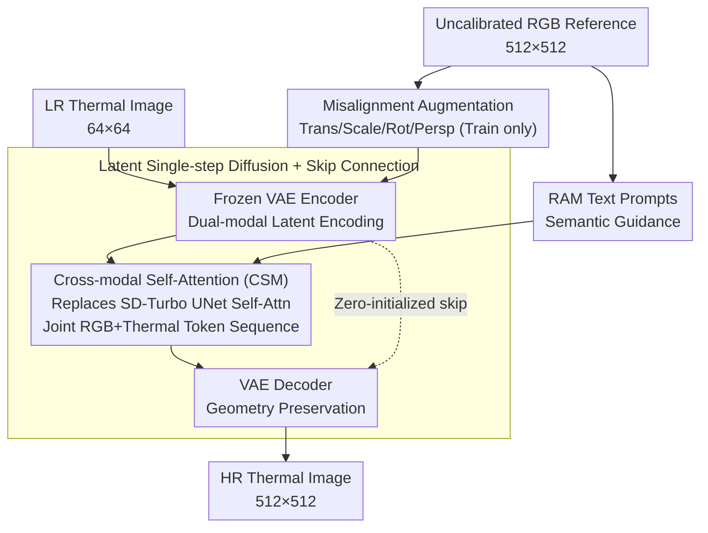

# 3M-TI: High-Quality Mobile Thermal Imaging via Calibration-free Multi-Camera Cross-Modal Diffusion

**Conference**: CVPR 2026  
**arXiv**: [2511.19117](https://arxiv.org/abs/2511.19117)  
**Code**: [GitHub](https://github.com/work-submit/3MTI)  
**Area**: Image Segmentation  
**Keywords**: Thermal image super-resolution, cross-modal diffusion, calibration-free fusion, RGB guidance, mobile thermal imaging

## TL;DR

Ours proposes 3M-TI, a **calibration-free** multi-camera cross-modal diffusion framework. It automatically aligns and fuses uncalibrated RGB-thermal image pairs in the VAE latent space via Cross-modal Self-Attention (CSM). Combined with a misalignment augmentation strategy, it achieves SOTA on mobile thermal super-resolution tasks and significantly improves downstream object detection and semantic segmentation performance.

## Background & Motivation

**Hardware bottlenecks of mobile thermal imaging**: Miniaturization of thermal sensors on mobile platforms leads to reduced apertures and limited pixel sizes, resulting in blurry outputs with insufficient information (typical resolution is only $96 \times 96$).

**Insufficient information in single-image SR**: A single thermal image lacks sufficient high-frequency information to recover fine structures, especially at large magnification factors.

**Calibration dependence of RGB-guided methods**: Existing RGB-guided thermal SR methods require precise pixel-level cross-camera calibration. In practical deployment, the calibration process is cumbersome and lacks robustness.

**Large cross-modal domain gap**: The imaging principles of RGB and thermal infrared are fundamentally different. Directly merging features easily introduces unrealistic texture details.

**Limited scale of thermal datasets**: Compared to the RGB domain, thermal datasets are smaller with less scene diversity, limiting network training and generalization.

**Spatiotemporal misalignment in real scenarios**: Multi-camera systems inevitably face disparity and unsynchronized timing in practical use; existing methods lack robustness to these issues.

## Method

### Overall Architecture

3M-TI aims to solve a practical problem: mobile thermal cameras produce blurry images (typically $96 \times 96$), and a single image lacks enough high-frequency info for detail recovery. While using high-definition RGB as guidance is a solution, it typically requires pixel-level calibration. Ours offloads "alignment" to the network itself, with the entire pipeline running in the latent space. Inputs consist of a low-resolution (LR) thermal image ($64 \times 64$) and an **uncalibrated** high-resolution (HR) RGB reference image ($512 \times 512$). Both are encoded into the latent space using a frozen VAE encoder. In the UNet of SD-Turbo, the original self-attention layers are replaced with Cross-modal Self-Attention (CSM), allowing RGB and thermal tokens to align and fuse within the same sequence. During training, misalignment augmentation is applied to the RGB image to force the model to adapt to real-world disparity and desynchronization. Additionally, a zero-initialized skip connection passes structural information from the encoder directly to the decoder, while a RAM module extracts text prompts from the RGB image for semantic guidance. Finally, only the UNet (rank=16) and VAE decoder (rank=4) are fine-tuned via LoRA, generating the image in a single diffusion step.

### Key Designs

**1. Cross-modal Self-Attention (CSM): Calibration-free latent alignment**

Traditional RGB-guided thermal SR requires precise pixel-level calibration, which is brittle. The core insight of 3M-TI is treating alignment as an implicit operation within attention. Latent tokens of RGB and thermal images are concatenated into a joint sequence $\{z_{RGB}, z_{th}\} \in \mathbb{R}^{B \times (M \times H \times W) \times C}$. Self-attention simultaneously models intra-modal (thermal-thermal) dependencies for spatial context and inter-modal (RGB-thermal) dependencies for structure borrowing. Compared to standard Cross-Attention, CSM models both relationships; unlike static projections (Concat + FC), it is content-adaptive, with attention weights dynamically determining what to borrow. This approach is inspired by joint self-attention in video/multi-view diffusion models.

**2. Misalignment Augmentation: Forcing alignment learning via geometric perturbations**

Existing RGB-thermal datasets are mostly pixel-aligned. Models trained on them overfit to specific calibrations and fail on real devices. 3M-TI applies controlled translation, scaling, rotation, and perspective distortion to RGB references during training. This simulates geometric offsets caused by disparity and timing issues. CSM is thus forced to learn cross-modal correspondences under the premise that "the two images are naturally misaligned." This bridges the gap between training distributions and real-world deployment. Removing this during ablation dropped MUSIQ from 36.66 to 34.94.

**3. Latent Single-step Diffusion + Skip Connection: Recovering details without distorting geometry**

Due to scarce thermal data, pure CNN/Transformer models often output over-smoothed results under heavy degradation. Diffusion priors synthesize realistic high-frequency details. 3M-TI uses SD-Turbo for single-step latent diffusion to fill this gap. To prevent generative priors from drifting (e.g., distorting circular wheels), a zero-initialized skip connection transfers feature maps from the VAE encoder to the decoder to lock in structural consistency. Diffusion "grows" the details, while the skip connection "frames" the shapes. Ablations show PSNR drops from 30.09 to 29.86 without the skip connection.

### Loss & Training

The training objective includes pixel-level L2 loss and perceptual loss (LPIPS): $\mathcal{L} = \mathcal{L}_2 + \lambda \cdot \mathcal{L}_{\text{LPIPS}}$, where $\lambda = 1$. It uses the Adam optimizer with a learning rate of $2 \times 10^{-5}$, batch size of 4, and runs for 8,000 iterations (approx. 4 hours) on a single A800 (80GB). Fine-tuning is limited to LoRA (UNet rank=16, VAE decoder rank=4). The training set comprises 10,922 RGB-thermal pairs from IRVI, LLVIP, M3FD, and PBVS 2025 datasets.

## Key Experimental Results

**Main Results: Quantitative Comparison on Public Datasets**

| Method | PSNR↑ | SSIM↑ | LPIPS↓ | MANIQA↑ | MUSIQ↑ |
|------|-------|-------|--------|---------|--------|
| CoReFusion | 30.11 | 0.8588 | 0.3214 | 0.2771 | 28.35 |
| CoRPLE | 30.47 | 0.8642 | 0.3206 | 0.2833 | 30.46 |
| SwinFuSR | 29.85 | 0.8549 | 0.3085 | 0.2740 | 29.86 |
| SeeSR | 29.41 | 0.8495 | 0.1828 | 0.4278 | 35.22 |
| OSEDiff | 28.05 | 0.8422 | 0.2113 | 0.4014 | 36.30 |
| DifIISR | 27.48 | 0.7905 | 0.3484 | 0.4214 | 36.74 |
| **3M-TI (Ours)** | **30.09** | **0.8610** | **0.1787** | **0.4443** | **36.66** |

3M-TI achieves the best performance across all perceptual metrics (LPIPS, MANIQA, MUSIQ) while outperforming other diffusion-based methods in fidelity metrics (PSNR, SSIM).

**Downstream Object Detection Performance Comparison**

| Method | Precision↑ | Recall↑ | F1↑ | IoU↑ |
|------|-----------|---------|-----|------|
| SwinPaste | 0.1800 | 0.2109 | 0.1765 | 0.1941 |
| SeeSR | 0.3832 | 0.4637 | 0.3849 | 0.3022 |
| **3M-TI** | **0.4565** | **0.5455** | **0.4724** | **0.3427** |
| Reference RGB | 0.4322 | 0.5708 | 0.4643 | 0.3359 |
| GT Thermal | 0.4582 | 0.5793 | 0.4887 | 0.3494 |

The detection performance of 3M-TI slightly exceeds the RGB reference and approaches the level of GT thermal images.

**Ablation Study Key Findings**

- **Remove RGB Reference**: Reconstruction becomes blurry; LPIPS worsens from 0.1787 to 0.2106.
- **Remove Misalignment Augmentation**: MUSIQ drops from 36.66 to 34.94; high-frequency details degrade significantly.
- **Remove Skip Connection**: Structural fidelity drops (PSNR from 30.09 to 29.86), and geometric shapes like wheels suffer distortion.
- **CSM** outperforms standard Cross-Attn (LPIPS 0.1787 vs 0.1953) and feature concatenation (0.1787 vs 0.2164).

## Highlights & Insights

1. **Calibration-free cross-modal fusion** is the core practical value—achieving implicit alignment via attention in the VAE latent space completely bypasses deployment hurdles.
2. **CSM design is concise and effective**: It captures both intra- and inter-modal dependencies by token concatenation, representing a clever transfer of multi-frame video diffusion logic.
3. **Misalignment Augmentation** is a novel strategy using simple geometric transforms to replace complex physical simulations, effectively improving generalization.
4. **Comprehensive downstream verification**: Validation on object detection and segmentation proves the substantive utility of SR beyond just perceptual quality.
5. **Real-world hardware verification**: A system built with a <$100 HIKVISION P09 module and a Xiaomi 15 smartphone demonstrates strong engineering feasibility.

## Limitations & Future Work

1. **Quality ceiling of single-step diffusion**: While efficient, SD-Turbo based one-step inference may lack the refinement of multi-step diffusion methods.
2. **RAM-dependent semantic guidance**: Requires high-quality RGB input; degraded references (low light, motion blur) may lead to incorrect semantic prompts.
3. **Insufficient handling of FOV differences**: RGB and thermal cameras have different FOVs ($74^\circ \times 59^\circ$ vs $50^\circ \times 50^\circ$); robustness to larger FOV gaps is unverified.
4. **Limited upscaling factor**: Only $8 \times$ SR ($64 \to 512$) is verified; applicability to other factors needs discussion.
5. **Inference overhead**: The sequence length in CSM is $2HW$, warranting attention to computational complexity in high-resolution scenarios.

## Related Work & Insights

- **CoReFusion / SwinFuSR / SwinPaste**: Traditional RGB-guided thermal SR methods focus on fidelity and require calibration but lack high-frequency details.
- **SeeSR / OSEDiff**: Diffusion-based SR generates high-frequency content but lacks cross-modal guidance, easily introducing artifacts.
- **DifIISR**: Thermal-specific diffusion SR but relies on strictly aligned data.
- **Stable Video Diffusion**: Joint self-attention for multiple frames is the direct inspiration for CSM.
- **Insight**: Calibration-free fusion can extend to other pairs (Depth-RGB, SAR-Optical), and the misalignment strategy is universally applicable.

## Rating

- **Novelty**: ⭐⭐⭐⭐ — CSM and misalignment strategies are novel; calibration-free setting is practical.
- **Experimental Thoroughness**: ⭐⭐⭐⭐ — Covers public datasets, real phone systems, downstream tasks, and ablations.
- **Writing Quality**: ⭐⭐⭐⭐ — Clear structure, well-articulated motivation, and rich visualizations.
- **Value**: ⭐⭐⭐⭐⭐ — High engineering utility due to calibration-free, low-cost hardware, and mobile deployment support.

<!-- RELATED:START -->

## Related Papers

- [\[CVPR 2026\] Towards Robust Multi-Modal Semantic Segmentation with Teacher-Student Framework and Hybrid Prototype Distillation](towards_robust_multi-modal_semantic_segmentation_with_teacher-student_framework_.md)
- [\[CVPR 2026\] Cross-Domain Few-Shot Segmentation via Multi-view Progressive Adaptation](cross-domain_few-shot_segmentation_via_multi-view_progressive_adaptation.md)
- [\[CVPR 2026\] Towards High-Quality Image Segmentation: Improving Topology Accuracy by Penalizing Neighbor Pixels](towards_high-quality_image_segmentation_improving_topology_accuracy_by_penalizin.md)
- [\[CVPR 2026\] Making Training-Free Diffusion Segmentors Scale with the Generative Power](making_training-free_diffusion_segmentors_scale_with_the_generative_power.md)
- [\[CVPR 2026\] V²-SAM: Marrying SAM2 with Multi-Prompt Experts for Cross-View Object Correspondence](v2-sam_marrying_sam2_with_multi-prompt_experts_for_cross-view_object_corresponde.md)

<!-- RELATED:END -->
