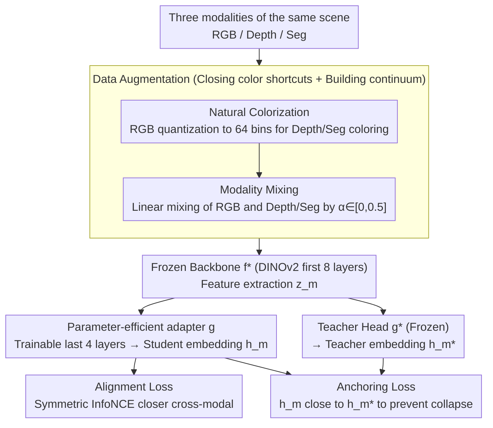

# A Mixed Diet Makes DINO An Omnivorous Vision Encoder

**Conference**: CVPR2026  
**arXiv**: [2602.24181](https://arxiv.org/abs/2602.24181)  
**Code**: TBD  
**Area**: Semantic Segmentation  
**Keywords**: Cross-modal alignment, DINOv2, Vision Foundation Models, modality-agnostic encoder, parameter-efficient fine-tuning, contrastive learning

## TL;DR

An Omnivorous Vision Encoder is proposed, which performs cross-modal alignment distillation training (RGB/Depth/Segmentation) on top of a frozen DINOv2 via a lightweight adapter. This enables a single encoder to produce consistent embeddings for diverse visual modalities while preserving original discriminative semantics.

## Background & Motivation

**Severe cross-modal feature misalignment**: Experiments reveal that the cosine similarity between features of an RGB image and its corresponding depth map in DINOv2 is nearly identical to that between two unrelated RGB images. This indicates that cross-modal representations in existing vision encoders are highly fragmented.

**Inspiration from NLP success**: Natural Language Processing evolved from language-specific models to multilingual shared representations (e.g., mBERT), significantly boosting performance for low-resource languages. The vision field faces a similar turning point, needing to align RGB (abundant) with depth/segmentation (scarce but structurally rich) into a unified space.

**Naive alignment leads to representation collapse**: Simply maximizing cross-modal similarity may compress the feature space into trivial solutions, destroying the encoder's discriminative ability. Existing methods like CMC rely on massive negative samples, which are difficult to collect sufficiently during modality imbalance.

**High cost of full training**: Methods such as Omnivore and ImageBind require joint training of the entire backbone from scratch, which is expensive. Industry applications necessitate achieving cross-modal capabilities on top of existing powerful unimodal models (DINOv2) with minimal cost.

**Shortcuts introduced by standard colormaps**: Grayscale or jet color mapping for depth/segmentation maps allows the model to achieve alignment via low-level color statistic shortcuts rather than structural content.

**Insufficient robustness in discrete modality training**: Treating RGB/Depth/Seg as discrete states makes it difficult for the model to learn invariance across the cross-modal continuum, leading to fragility when faced with blurred inputs or mixed modalities.

## Method

### Overall Architecture

The Omnivorous Vision Encoder addresses a specific pain point: the feature similarity between RGB and depth maps of the same scene in frozen DINOv2 is negligible. It employs a parameter-efficient teacher-student framework: the teacher is a fully frozen DINOv2 ($f_T = g^* \circ f^*$) acting as a stable anchor; the student shares the frozen early 8 layers of the backbone $f^*$, with only the last 4 layers fine-tuned as a trainable adapter $g$, i.e., $f_S = g \circ f^*$. When any modality $x_m$ enters, it first undergoes data augmentation (natural colorization + modality mixing) to eliminate color shortcuts and create a modality continuum. Features $z_m = f^*(x_m)$ are extracted by the frozen part, and the adapter maps them into a unified space $h = g(z_m)$. During training, an alignment loss pulls cross-modal embeddings closer, while an anchoring loss ties student embeddings back to the teacher, aligning different modalities without destroying original discriminative semantics.

### Key Designs

**1. Parameter-efficient teacher-student adapter: Tuning only a few layers on a frozen foundation model to "install" cross-modal alignment into DINOv2**

Methods like Omnivore and ImageBind require joint training of the entire backbone from scratch. Instead, the authors use a teacher-student framework to distill alignment capabilities into pre-existing models. For ViT-B with 12 blocks, the authors freeze the first 8 layers as a shared backbone $f^*$ and fine-tune only the last 4 layers as adapter $g$ (~1/3 parameters). The student is $f_S = g \circ f^*$, while the teacher is the fully frozen original DINOv2 $f_T = g^* \circ f^*$ serving as a stable anchor. Lower layers retain universal visual priors while higher layers learn modality alignment. This "freeze bottom, tune top" structure is the foundation for low-cost cross-modal upgrading.

**2. Natural colorization: Closing the shortcut of "alignment based on color histograms"**

Depth/segmentation maps often use grayscale or jet palettes, allowing models to take shortcuts via low-level color statistics without learning structure. The authors first apply standard photometric augmentation to the RGB (brightness/contrast/hue/saturation perturbations). They then quantize the pixels of the augmented RGB into 64 bins and use the resulting palette to color the depth/segmentation maps of the same scene, making them look visually like RGB. This constructs "hard positive samples": once color distributions are aligned, the network is forced to match based on structural content, extracting true cross-modal semantic correspondence.

**3. Modality mixing: Training on the Depth↔RGB↔Seg continuum to enhance robustness against modality ambiguity**

Training RGB, depth, and segmentation as discrete states prevents the model from learning invariance across a continuum, making it fragile to blurred inputs. Modality mixing linearly blends RGB with depth/segmentation using a random ratio $x_s^{mixup} = (1-\alpha_s)x_s + \alpha_s x_r^{aug}$ ($\alpha \in [0, 0.5]$, sampled independently per sample). This places training samples in the transition zone between modalities. Theoretically, $M_s$ and $M_d$ together span a continuous Depth↔RGB↔Seg modality space, ensuring the encoder remains stable for ambiguous inputs like "half RGB, half depth."

### Loss & Training

**Symmetric cross-modal alignment loss**: InfoNCE is calculated for all modality pairs $(m_1, m_2)$:

$$\mathcal{L}_{\text{align}} = \frac{1}{3}\sum_{k_1}\sum_{k_2>k_1} \mathcal{L}_{\text{InfoNCE}}(m_{k_1}, m_{k_2})$$

Three combinations: (RGB_aug, Seg_mixup), (Seg_mixup, Depth_mixup), (Depth_mixup, RGB_aug), with a learnable temperature $\tau$.

**Anchoring loss**: Prevents representation drift by constraining student output $h_m$ to stay close to teacher output $h_m^*$:

$$\mathcal{L}_{\text{anchor}} = \frac{1}{|M|}\sum_{m \in M}(1 - \text{sim}(h_m, h_m^*))$$

**Total Objective**: $\mathcal{L}_{\text{total}} = \mathcal{L}_{\text{align}} + \lambda_{\text{anchor}} \mathcal{L}_{\text{anchor}}$, with default $\lambda_{\text{anchor}}=10$. Calculations are performed for CLS tokens and dense tokens (64 randomly sampled), with dense token masks excluding those within the same image as negatives.

## Key Experimental Results

### main Results: Cross-modal Retrieval (Table 1)

| Dataset | Model | R@1 ↑ | R@5 ↑ | mAP ↑ | MedR ↓ |
|--------|------|-------|-------|-------|--------|
| MOVi (GAP) | DINOv2 ViT-B/14 | 15.5 | 33.1 | 25.2 | 19.3 |
| MOVi (GAP) | **Omnivorous** | **86.2** | **96.5** | **90.9** | **1.0** |
| ScanNet (GAP) | DINOv2 ViT-B/14 | 4.6 | 10.8 | 8.1 | 401.8 |
| ScanNet (GAP) | **Omnivorous** | **46.1** | **71.4** | **57.7** | **2.0** |
| TartanAir (GAP) | DINOv2 ViT-B/14 | 46.6 | 68.5 | 57.1 | 1.8 |
| TartanAir (GAP) | **Omnivorous** | **90.6** | **99.2** | **94.6** | **1.0** |

On ScanNet, R@1 increased from 4.6% to 46.1%, and MedR dropped from 401.8 to 2.0, showing extremely significant cross-modal alignment gains.

### Main Results: Downstream Tasks (Table 2 & 3)

| Task | Dataset | Readout | DINOv2 | Omnivorous |
|------|--------|---------|--------|------------|
| Depth $\delta_1$ ↑ | NYUv2 | Linear | 0.875 | **0.896** |
| Depth RMSE ↓ | NYUv2 | Linear | 0.405 | **0.377** |
| Seg mIoU ↑ | ADE20k | Linear | 0.463 | **0.475** |
| Seg mIoU ↑ | Cityscapes | Linear | 0.622 | **0.632** |
| Class Acc ↑ | ImageNet | Linear (TOK&GAP) | 0.804 | **0.838** |

ImageNet linear classification improved from 80.4% to 83.8%, indicating that cross-modal alignment enhances the semantic density of features.

### Ablation Study

- **Pareto frontier of $\lambda_{\text{anchor}}$**: $\lambda=1$ yields good alignment but decreased discriminative power; $\lambda=100$ preserves discriminative power but limits alignment; $\lambda=10$ achieves the best balance.
- **Modality mixing $\alpha_{\max}$ ablation**: From $\alpha_{\max}=0$ to 1.0, classification/segmentation/3D correspondence continuously improve as $\alpha$ increases, while depth drops slightly after $\alpha>0.5$. Default $\alpha_{\max}=0.5$ provides a comprehensive trade-off.

### Key Findings

- **Zero-shot cross-modal transfer (Table 5)**: A depth prediction head trained with RGB inputs can directly switch to Seg maps: DINOv2 results in RMSE=1.536 (random level), while Omnivorous achieves RMSE=0.532. It also significantly outperforms the baseline on the unseen NOCS modality (0.822 vs 0.979 DPT).
- **No degradation in k-NN classification**: ImageNet k-NN remains at 81.97% (DINOv2 81.94%), confirming that anchoring loss effectively prevents representation forgetting.
- **PCA Visualization**: In frozen DINOv2 features, RGB/Depth/Seg occupy disjoint subspaces, while Omnivorous features align to a consistent color distribution.

## Highlights & Insights

- **Simple and Efficient**: Achieving cross-modal alignment on a frozen foundation model by fine-tuning only the last 4 layers of ViT (~33% parameters) with low training overhead.
- **Exquisite data augmentation design**: The combination of natural colorization and modality mixing constructs hard positive samples to prevent shortcut learning while increasing robustness through continuum training.
- **Outstanding zero-shot modality transfer**: Task heads trained on RGB can work directly on Seg or even unseen NOCS modalities.
- **Order-of-magnitude improvement in cross-modal retrieval**: ScanNet MedR dropped from 401.8 to 2.0.
- **Synergistic downstream performance**: Classification, segmentation, and depth prediction all outperform DINOv2, suggesting that cross-modal regularization itself provides generalization gains.

## Limitations & Future Work

- DINOv2 has a late-stage high-resolution fine-tuning step; whether Omnivorous requires the same has not been verified.
- The training data contains many synthetic multi-object scenes, leading to slight k-NN degradation on fine-grained datasets like iNaturalist and GLDv2.
- Only the ViT-B/14 scale was validated; the effect on larger models (ViT-L/G) and the selection of adapter layer counts remain unexplored.
- Modalities only cover RGB/Depth/Seg; more modalities like text or thermal IR were not included.

## Related Work & Insights

- **Unified Multi-modal Encoders**: Omnivore uses one ViT for image/video/3D but requires full joint training; ImageBind binds six modalities but is also trained from scratch.
- **RGB-Depth Alignment**: CLIP2Point performs image-depth contrastive pre-training; CoMAE uses contrastive then masked autoencoding; Mask3D injects 3D priors via masked RGB-D pre-training.
- **Parameter-efficient Adaptation**: ViT-Adapter injects task priors; MA-AVT performs block-wise contrastive alignment for audio-visual; modality-decoupled adapters separate modality-invariant and specific components.
- **Cross-modal Distillation**: SOCKET performs source-free cross-modal transfer; CMKD uses decoupling and contrastive terms for RGB-D segmentation distillation.
- **Novelty of Ours**: Performs **post-hoc lightweight alignment** on a frozen unimodal foundation model, balancing deployment convenience with cross-modal capabilities.

## Rating

- Novelty: ⭐⭐⭐⭐ — The data strategy of colorization + modality mixing and the idea of achieving alignment by tuning only the last few layers are simple yet effective.
- Experimental Thoroughness: ⭐⭐⭐⭐ — Comprehensive coverage across retrieval, classification, segmentation, depth, zero-shot transfer, and ablation studies involving 6 datasets.
- Writing Quality: ⭐⭐⭐⭐ — Excellent use of the NLP multilingual analogy as an entry point; clear structure and intuitive diagrams.
- Value: ⭐⭐⭐⭐ — Provides a low-cost cross-modal upgrade path for deployed vision foundation models with high practical utility.

<!-- RELATED:START -->

## Related Papers

- [\[AAAI 2026\] Empowering DINO Representations for Underwater Instance Segmentation via Aligner and Prompter](../../AAAI2026/segmentation/empowering_dino_representations_for_underwater_instance_segmentation_via_aligner.md)
- [\[CVPR 2026\] Generalizable Co-Salient Object Detection via Mixed Content-Style Modulation](generalizable_co-salient_object_detection_via_mixed_content-style_modulation.md)
- [\[ICML 2026\] What Makes Synthetic Data Effective in Image Segmentation](../../ICML2026/segmentation/what_makes_synthetic_data_effective_in_image_segmentation.md)
- [\[CVPR 2026\] GKD: Generalizable Knowledge Distillation from Vision Foundation Models for Semantic Segmentation](gkd_generalizable_knowledge_distillation_vfm.md)
- [\[CVPR 2026\] The Missing Point in Vision Transformers for Universal Image Segmentation](the_missing_point_in_vision_transformers_for_universal_image_segmentation.md)

<!-- RELATED:END -->
