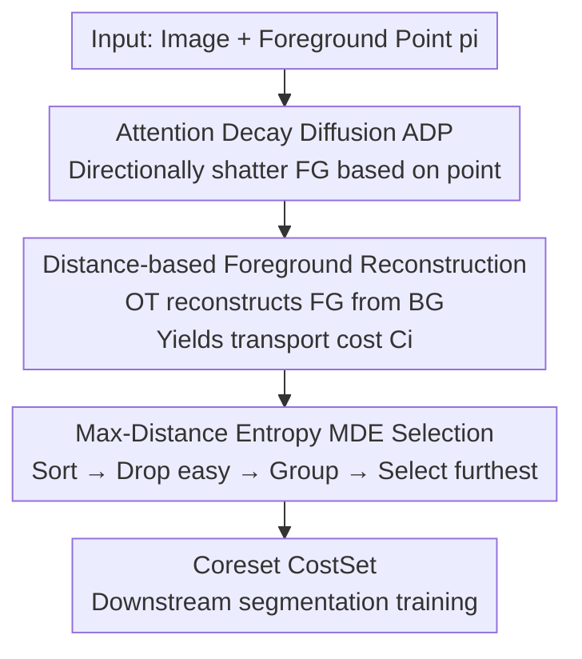

# Annotation-Efficient Coreset Selection for Context-dependent Segmentation

**Conference**: CVPR 2026  
**Paper**: [CVF Open Access](https://openaccess.thecvf.com/content/CVPR2026/html/Zhang_Annotation-Efficient_Coreset_Selection_for_Context-dependent_Segmentation_CVPR_2026_paper.html)  
**Code**: None  
**Area**: Semantic Segmentation / Data Pruning  
**Keywords**: Coreset Selection, Context-dependent Segmentation, Optimal Transport, Weak Annotation, Data Pruning

## TL;DR
Focusing on the extremely high annotation cost in "context-dependent" segmentation tasks like camouflaged objects and medical lesions, this paper assigns an "importance score" to each image via point-annotation-based Optimal Transport. A Max-Distance Entropy strategy is then used to select a coreset (CostSet) that balances coverage and diversity. At a 40% pruning rate, it only loses approximately 1% IoU compared to full training.

## Background & Motivation
**Background**: Context-Dependent (CD) tasks—such as camouflaged object detection, medical lesion segmentation, remote sensing analysis, and shadow/transparent object detection—feature foreground boundaries without fixed semantics, requiring dynamic determination based on the surrounding environment. Current mainstream methods rely on strong models like Spider and EVF trained on large datasets with **pixel-level annotations**.

**Limitations of Prior Work**: Weak supervision performs poorly in CD scenarios, forcing methods to rely on pixel-level labels. However, annotating a single CD image (e.g., camouflaged or medical) takes about 10 minutes, making it extremely costly. Worse, sample contributions within datasets are highly uneven: "low-hanging fruits" where foreground and background are easily distinguishable are fitted quickly early in training, contributing little to identifying complex targets while still consuming annotation and training resources.

**Key Challenge**: High annotation cost × Sample redundancy—there is a need to minimize labeling while allocating the precious annotation budget to truly informative samples. In CD tasks, "informativeness" is determined precisely by the foreground-background relationship, which cannot be well-captured by existing classification logit-based pruning criteria (Entropy / Forgetting / EL2N / CCS).

**Key Insight**: Using Spider across multiple CD datasets, the authors observed a pattern (Fig. 1): samples with large foreground-background differences fit quickly but offer small generalization gains, whereas samples with subtle differences fit slowly but continuously improve discriminative power. Thus, the "foreground-background distribution difference" is directly used as a measure of sample importance.

**Core Idea**: A process of "destroying foreground and reconstructing it from background" via Optimal Transport is used to quantify foreground-background differences. A larger difference (higher transport cost) indicates a simpler, less valuable sample. Then, Max-Distance Entropy selects the coreset while ensuring diversity—requiring only **point annotations** instead of pixel masks throughout.

## Method

### Overall Architecture
The method decomposes "CD dataset coreset selection" into two steps: **Sample Evaluation** and **Coreset Selection**. The input consists of an image $x_i$ and its foreground point annotation $p_i$, and the output is a small, high-quality subset, CostSet. The workflow is: first, use the Attention Decay Diffusion Process (ADP) to "shatter" the foreground into noise based on the point; then, a reconstruction network "reconstructs the foreground from the background" within an Optimal Transport framework. More difficult reconstruction signifies smaller foreground-background differences and higher sample value, yielding a transport cost $C_i$ as the importance score. Finally, the Max-Distance Entropy (MDE) strategy sorts samples by cost, discards the easiest to learn, divides them into $k$ groups, and selects the most spatially distant samples within each group to obtain a coreset balancing coverage and diversity.

### Key Designs

**1. Attention Decay Diffusion Process (ADP): Directionally destroying foreground with a single point**

To quantify foreground-background differences, the foreground must first be "perturbed" to see if the model can recover it from the background. The challenge is having only point annotations without masks: how to precisely disturb only the foreground. ADP draws on the noise injection logic of diffusion models but **applies decaying noise only around the given point**: for point $p=(m,n)$, an $\ell_2$ distance matrix $M_d(x,y)=\lVert(x,y)-(m,n)\rVert_2$ is calculated, followed by the construction of a decay matrix:

$$M_a(x,y)=\exp\!\left(-\frac{\alpha\cdot M_d(x,y)^2}{r(t)}\right),\qquad x_t(x,y)=x_{t-1}(x,y)+M_a(x,y)\cdot\epsilon_t(x,y),$$

where noise variance $\gamma(t)$ decays over time and the influence radius $r(t)$ shrinks over time, with $\alpha$ controlling the decay rate. Complex objects use denser points to cover the foreground. ADP uses adaptive stopping: a dynamic threshold $\Delta=1$ is used, and at each step, the Wasserstein distance $D_W$ measures the distribution difference between the current noisy foreground and the initial foreground, decaying as $\Delta\leftarrow\Delta-(1-\exp(-D_W))$. It stops when $\Delta<0$; a maximum step limit $T=9$ is also set to prevent excessive background contamination. Compared to global noise injection, ADP locks "destruction" precisely onto the foreground, which is the prerequisite for inferring foreground-background differences from reconstruction difficulty.

**2. Distance-based Foreground Reconstruction: Turning "reconstruction difficulty" into importance scores via Optimal Transport**

With the noisy image, Optimal Transport theory allows "reconstructing the foreground from the background distribution." The difference between the reconstructed and original image reflects the foreground-background difference. However, standard Wasserstein distance computation scales exponentially with image size. This paper adopts the **Average Projected 1D Wasserstein distance** as an approximation: high-dimensional distributions are randomly projected into several 1D subspaces and averaged. Specifically, $Q$ random projection vectors $z_i\sim\mathcal N(0,I),\ \lVert z_i\rVert=1$ are sampled to project the reconstruction distribution $\mu$ and ground truth distribution $\nu$ into 1D as $\tilde\mu_i=\mu_i\cdot z_i,\ \tilde\nu_i=\nu_i\cdot z_i$. After sorting, point-wise differences are calculated:

$$L_{\text{avgW1}}(\tilde\mu_i,\tilde\nu_i)=\frac1P\sum_{n=1}^{P}\bigl|\tilde\mu_i^{\text{sorted}}(n)-\tilde\nu_i^{\text{sorted}}(n)\bigr|.$$

After training the reconstruction network (UNet) with this objective, the transport cost for each sample $C_i=W_\tau(x_r^i,x^i)$ serves as its importance score, resulting in the CostSet. The key intuition is: **High cost ⇒ Large FG-BG difference ⇒ Simple sample ⇒ Low contribution**; Low cost ⇒ Entangled FG-BG, hard to learn, high information. This transforms the "annotation cost" problem into "automatically evaluating samples via reconstruction difficulty without labels."

**3. Max-Distance Entropy (MDE) Selection: Preserving diversity after discarding low-hanging fruits**

Selecting samples based solely on cost is insufficient: if high-contribution samples happen to be similar frames in a sequence, the coreset loses diversity. MDE (Algorithm 1) first sorts samples by transport cost $C_i$, using a discard ratio $b$ to remove the easiest (most eligible for elimination) samples to avoid model contamination. Remaining samples are divided into $k$ groups to cover the entire sample space. Inside each group, "Max-Distance Entropy" selection is performed: a default distance vector $v_d$ is maintained, and the Wasserstein distance $W_\tau(v_d,R_{i,j})$ between candidate samples and $v_d$ is iteratively calculated. Each time, the sample with the **maximum distance** is added to the candidate set $R_c$, and $v_d$ is updated as $v_d=\frac{1}{|R_c|}\sum_m r_m$ until $\lceil\hat r\cdot n/k\rceil$ samples are picked. The magnitude of the Wasserstein distance reflects spatial differences between samples, i.e., the information entropy level of the selected coreset—expanding diversity within groups while ensuring global coverage through grouping. ⚠️ The discard direction (ascending or easiest high-cost samples) follows Algorithm 1 in the original text; the author's intent is to eliminate "easy-to-learn" samples.

### Loss & Training
The reconstruction phase uses UNet + Adam, with the learning rate linearly decaying from $1\times10^{-4}$ to $1\times10^{-6}$ over 100 epochs. In ADP, $T=9$, projection dimension $P=384$, and number of groups $k=5$. Downstream validation uses UNet (ResNet50 ImageNet pre-trained backbone) for 64 epochs, with the loss being the sum of cross-entropy and IoU. For fair evaluation, **no data augmentation** is used during pruning strategy assessment.

## Key Experimental Results

Validation on 6 CD tasks: SOD, COD, MIS, RSIS, TOD, SD, using UNet for segmentation and IoU as the metric, with pruning rates from 80% to 10%.

### Main Results

The table below shows a 40% pruning rate, comparing Ours (only point annotation P) with the second-best method and full training (p=0):

| Task (Full IoU) | Ours (P) | TFDP (F, 2nd best) | Gap from Full |
|------------------|--------------|----------------|-----------|
| SOD (74.8) | **73.4** | 70.9 | −1.4 |
| COD (55.1) | **52.0** | 50.6 | −3.1 |
| MIS (54.8) | **53.8** | 52.3 | −1.0 |
| RSIS (58.9) | **57.7** | 54.2 | −1.2 |
| TOD (84.0) | **82.0** | 78.7 | −2.0 |
| SD (72.5) | **71.8** | 70.3 | −0.7 |

Key trends: The advantage grows with higher pruning rates; for SOD, the gap with competitors expands from ~0.5% at 10% pruning to ~4% at 80% pruning. Furthermore, Ours uses only point annotations (F=pixel, P=point) yet systematically outperforms competitors requiring pixel annotations.

### Ablation Study

**Different selection strategies under ADP vs GT upper bound (SOD, IoU%):**

| Strategy | 80% | 60% | 40% | 20% | 10% |
|------|-----|-----|-----|-----|-----|
| ADP(C) + TopK | 64.4 | 70.0 | 73.1 | 74.1 | 74.9 |
| ADP(C) + TailK | 63.1 | 68.3 | 72.6 | 73.6 | 74.4 |
| **ADP(C) + MDE** | 66.2 | 71.3 | 73.4 | 74.0 | 74.8 |
| GT(C_gt) + Random | 66.4 | 71.6 | 73.2 | 74.2 | 74.4 |
| GT(C_gt) + MDE (Upper) | 66.9 | 71.9 | 74.1 | 74.3 | 75.0 |

**MDE vs other selection strategies under the same transport cost C sorting (SOD, IoU%):**

| Strategy | 80% | 60% | 40% | 20% | 10% |
|------|-----|-----|-----|-----|-----|
| Entropy | 61.7 | 68.0 | 71.1 | 72.4 | 73.5 |
| EL2N | 63.9 | 67.3 | 71.7 | 72.8 | 73.8 |
| CCS | 64.3 | 65.8 | 72.0 | 72.8 | 73.5 |
| TFDP | 62.9 | 68.0 | 71.6 | 73.5 | 74.2 |
| **MDE** | **66.2** | **71.3** | **73.4** | **74.0** | **74.8** |

**Annotation efficiency (SOD)**: Point annotation takes ~2s/image, significantly lower than boxes (≈6s) and scribbles (≈7s). Foreground coverage $F_c$=75.7%, background interference $B_c$=8.3%, with minimum background contamination.

### Key Findings
- **Point annotations approach GT bounds**: ADP+MDE using point annotations (66.2%–74.8%) closely tracks the GT+MDE bound (66.9%–75.0%), proving transport cost effectively evaluates samples without masks.
- **Diversity mechanism is indispensable**: MDE outperforms TailK by 3.1% at 80% pruning, indicating that diversity from grouping + max-distance selection is critical.
- **Noisy samples hinder generalization**: GT+MDE at 10% pruning (75.0%) exceeds full training (74.8%), confirming that "eliminating low-hanging fruits" aligns with curriculum learning intuition.
- **Task-specific discard ratios**: Simpler tasks (SOD) suit higher discard ratios (0.15); MIS, containing many similar images, also prefers higher ratios. Harder tasks like COD/RSIS/TOD prefer 0.1.
- **Failure scenarios**: Transparent objects (TOD, mirror reflections) and remote sensing (RSIS) have extreme foreground-background entanglement where ADP struggle to cover well, leading to minimal gains.

## Highlights & Insights
- **Translating "Annotation Cost" to "Reconstruction Difficulty"**: Using the transport cost of Optimal Transport as a sample importance score bypasses the deadlock where weak supervision fails and foreground-background relationships must be analyzed; it is a clever problem transformation.
- **ADP requires only point annotations with directional destruction**: The decay matrix and adaptive stopping lock noise into the foreground precisely. The 2s/image cost is a magnitude-level saving compared to 10 mins/image.
- **Average Projected 1D Wasserstein is a reusable trick**: Approximating exponential complexity Wasserstein via random 1D projections + sorting differences is useful for any task requiring OT cost on image distributions.
- **Counter-intuitive Cost-Contribution relationship**: High transport cost = Simple sample = Low contribution. This empirical rule itself is an insight transferable to other data pruning scenarios.

## Limitations & Future Work
- The authors admit that in scenes with high foreground-background entanglement/clutter (TOD, RSIS), ADP cannot destroy the foreground effectively, limiting improvement.
- The selection pipeline appears complex (sequential ADP + Reconstruction Network + MDE). Training the reconstruction network itself has overhead, which is not fully discussed regarding time cost and simplification potential.
- ⚠️ The discard direction of $b$ in Algorithm 1 should be verified against the text "discard easiest samples." Discard ratios currently require manual tuning and lack an adaptive mechanism.
- Validated only on UNet+ResNet50; effectiveness on stronger segmentation backbones or SAM-like models remains unknown.

## Related Work & Insights
- **vs Classification-based Pruning (Entropy / Forgetting / EL2N / CCS)**: These rely on model logits. This paper defines scores for CD tasks as the average logit of predicted pixels. Ours scores directly from foreground-background distribution differences, fitting the essence of CD tasks while requiring only point annotations.
- **vs TFDP**: TFDP is efficient for instance segmentation pruning and was adapted here for CD segmentation as the strongest competitor. Ours outperforms it at most pruning rates, primarily because TFDP does not fully consider sample diversity coverage (Table 4, smallest gains at 60%/80% rates).
- **vs Active Learning**: This work falls under "coreset selection under weak annotation," but by using few point labels and selecting the training subset in one go, it bridges coreset selection and active learning.

## Rating
- Novelty: ⭐⭐⭐⭐⭐ The first coreset selection specifically for context-dependent tasks, with a novel use of OT reconstruction difficulty as an importance score.
- Experimental Thoroughness: ⭐⭐⭐⭐ Covers 6 CD tasks, multiple pruning rates, and ablations on annotation type/discard ratio/selection strategy, though limited to a single backbone.
- Writing Quality: ⭐⭐⭐⭐ Motivation (Fig. 1) is clear, methodology symbols are numerous but formulas are complete. Discard direction phrasing is slightly ambiguous.
- Value: ⭐⭐⭐⭐ Significant cost reduction for expensive CD task annotations, with only 1% IoU loss at 40% pruning.

## Related Papers

- [\[ICML 2026\] Refining Context-Entangled Content Segmentation via Curriculum Selection and Anti-Curriculum Promotion](../../ICML2026/segmentation/refining_context-entangled_content_segmentation_via_curriculum_selection_and_ant.md)
- [\[CVPR 2026\] INSID3: Training-Free In-Context Segmentation with DINOv3](insid3_training-free_in-context_segmentation_with_dinov3.md)
- [\[CVPR 2026\] LEMMA: Laplacian Pyramids for Efficient Marine Semantic Segmentation](lemma_laplacian_pyramids_for_efficient_marine_semantic_segmentation.md)
- [\[CVPR 2026\] Towards Context-Aware Image Anonymization with Multi-Agent Reasoning](towards_context-aware_image_anonymization_with_multi-agent_reasoning.md)
- [\[CVPR 2026\] Efficient Video Object Segmentation and Tracking with Recurrent Dynamic Submodel](efficient_video_object_segmentation_and_tracking_with_recurrent_dynamic_submodel.md)

<!-- RELATED:END -->

<!-- RELATED:START -->

## Related Papers

- [\[CVPR 2026\] LEMMA: Laplacian Pyramids for Efficient Marine Semantic Segmentation](lemma_laplacian_pyramids_for_efficient_marine_semantic_segmentation.md)
- [\[CVPR 2026\] Efficient Video Object Segmentation and Tracking with Recurrent Dynamic Submodel](efficient_video_object_segmentation_and_tracking_with_recurrent_dynamic_submodel.md)
- [\[CVPR 2026\] MixerCSeg: An Efficient Mixer Architecture for Crack Segmentation via Decoupled Mamba Attention](mixercseg_an_efficient_mixer_architecture_for_crack_segmentation_via_decoupled_m.md)
- [\[CVPR 2026\] Towards Context-Aware Image Anonymization with Multi-Agent Reasoning](towards_context-aware_image_anonymization_with_multi-agent_reasoning.md)
- [\[CVPR 2026\] CDICS: Delving Into Fine-Grained Attribute for In-Context Segmentation via Compositional Prompts and Phased Decoupling](cdics_delving_into_fine-grained_attribute_for_in-context_segmentation_via_compos.md)

<!-- RELATED:END -->
