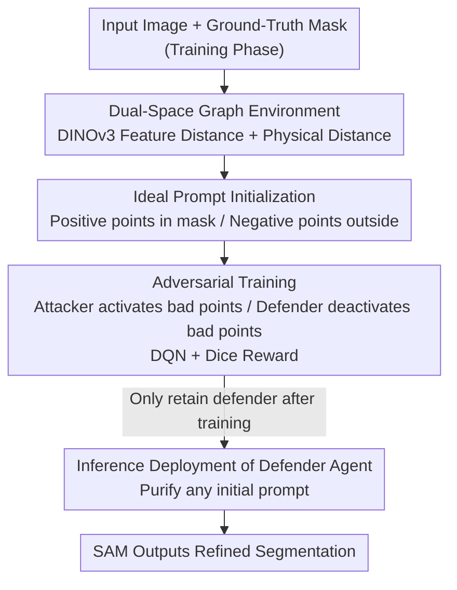

# Attack for Defense: Adversarial Agents for Point Prompt Optimization Empowering Segment Anything Model

**Conference**: CVPR 2026  
**Paper**: [CVF Open Access](https://openaccess.thecvf.com/content/CVPR2026/html/Liu_Attack_for_Defense_Adversarial_Agents_for_Point_Prompt_Optimization_Empowering_CVPR_2026_paper.html)  
**Code**: https://github.com/L-AILab/PPD  
**Area**: Segmentation / Reinforcement Learning / Vision Foundation Models  
**Keywords**: SAM, Point Prompt Optimization, Adversarial Reinforcement Learning, Dual-Space Graph, DQN

## TL;DR
PPD (Point Prompt Defender) formulates SAM's point prompt optimization as an "attack-defense" adversarial reinforcement learning game: an attacker agent specializes in activating prompt points that degrade segmentation quality, while a defender agent learns to deactivate these bad points to restore precision. After training, only the defender agent is deployed. It can purify any coarse prompt set in a plug-and-play manner without any retraining, making SAM's segmentation more accurate and robust on both natural and medical images.

## Background & Motivation

**Background**: Vision foundation models, represented by SAM, have transformed segmentation into a "prompt-driven" task—given a few points or boxes, SAM can perform zero-shot segmentation on arbitrary targets, eliminating the cost of designing specialized networks for each task. However, SAM's segmentation quality highly depends on the quality of input prompts, which are typically generated via manual clicking or heuristic rules.

**Limitations of Prior Work**: Existing routes for automatic prompt generation have severe flaws. Fine-tuning the prompt encoder (e.g., VRP-SAM) requires downstream task annotation supervision, failing when shifting domains (in the paper, VRP-SAM drops almost to 0 on medical datasets). Geometrically heuristic methods (Matcher, GBMSeg) treat prompts as static inputs, failing to assess the utility of each prompt point based on the segmentation context. The most relevant method, PPO (Point Prompt Optimizer), optimizes prompt locations iteratively via reinforcement learning, but it **optimizes prompts independently of SAM’s segmentation output**. Furthermore, its training environment lacks diversity, making the learned policy extremely sensitive to the quality and distribution of initial prompts, which leads to failure in cross-domain scenarios.

**Key Challenge**: To achieve generalization, prompt optimization must be directly coupled with SAM's segmentation feedback to determine whether "a prompt point is helping or hindering." However, coupling feedback easily leads to overfitting to the "mostly clean" initial prompt distribution seen during training, causing failure in noisy prompt scenarios. In other words, what is missing is a training mechanism that can actively construct various "bad prompt dilemmas" to force the optimizer to learn how to recover even under the worst-case scenarios.

**Goal**: Learn a task-agnostic, plug-and-play point prompt purifier that requires no retraining during inference and can refine noisy prompt sets from any source (feature matching, coarse segmentation) into high-quality, SAM-friendly prompts.

**Key Insight**: The authors adopt an adversarial training mindset—instead of passively generating or ranking prompts, they actively "attack." If there is an attacker specifically searching for and activating the prompt points that degrade SAM's performance the most, the competing defender is forced to learn to identify and eliminate these harmful points. The diverse "dilemmas" manufactured by the attacker compensate for the lack of environmental diversity in PPO training.

**Core Idea**: Optimize point prompts via a dual-agent adversarial reinforcement learning framework called "attack-for-defense"—the attacker activates bad points to lower the Dice score, and the defender deactivates bad points to raise the Dice score. Both are trained alternately using DQN driven by Dice changes as rewards. During inference, only the defender is retained.

## Method

### Overall Architecture
PPD solves the problem of "given a set of potentially noisy point prompts for SAM, automatically filter out the bad points and keep the good ones." The entire pipeline can be divided into three stages: "environment setup $\rightarrow$ adversarial training $\rightarrow$ inference deployment."

First, PPD partitions an image into several patches, treating each patch as a node in a graph. Features are extracted using DINOv3 to calculate **feature distances** and **physical distances** between patches, forming a dual-space heterogeneous graph as the reinforcement learning environment. The initial prompts of the environment are provided by "ideal prompts" generated from the ground-truth mask (sampling positive prompts uniformly inside the mask and negative prompts outside). Then, in this environment, the attacker agent selects inactive points from the prompt pool to activate, degrading SAM's segmentation. Conversely, the defender agent selects active points to deactivate, restoring the segmentation. Both agents are trained using DQN, with rewards directly driven by changes in the Dice coefficient. After training, **only the defender agent is retained**: given any initial prompt set, the defender filters out low-quality points to enhance SAM's segmentation, remaining completely task-agnostic and training-free throughout inference.

### Key Designs

**1. Dual-Space Heterogeneous Graph Environment: Enabling Prompt Optimization to "Act and Relate"**

Instead of blindly tuning points in pixel coordinates, PPD organizes the image into a graph. Given an input image $X$, it is partitioned into a set of non-overlapping or sliding patches $x=\{x_1,\dots,x_n\}$, where each patch is encoded into a feature vector $f_i$ using a DINOv3 encoder. Based on this, two distance matrices are constructed: the feature distance matrix $M_f(i,j)=\lVert f_i-f_j\rVert$ to capture semantic similarity, and the physical distance matrix $M_p(i,j)=\lVert x_i-x_j\rVert$ to capture spatial proximity. Both define the edge attributes of the dual-space graph $G=(V,E_f,E_p)$. This design seamlessly integrates "explicit prompt operations" (activating/deactivating a point) and "implicit structural relations" (how close points are in feature and physical spaces) into a single state. The agent can directly add/remove prompts and reason based on topological structures whether "activating this point is redundant/conflicts with existing points." Compared to PPO, which only considers isolated relationships between prompt points, the dual-space graph encodes both semantics and space into the environment, offering task-agnostic structural cues for cross-domain generalization (since DINOv3 features themselves are generalized representations learned self-supervised without labels).

**2. Ideal Prompt Initialization: Providing Adversarial Learning with a "High-Quality Starting Point"**

If reinforcement learning starts from purely random prompts, both the attacker and defender wander in noise, resulting in weak signals. During training, PPD leverages the ground-truth segmentation mask of each training image to generate a set of "ideal prompts": uniform sampling at fixed intervals within the mask as positive prompts, and outside the mask as negative prompts. This distribution inherently provides a high-quality, semantically rich configuration, initializing the environment to a "near-correct" state. This allows both the attacker and defender to focus their attention on **critical prompts that significantly impact segmentation** rather than wasting steps on irrelevant points. Note that ideal prompts are only used during training (the ground truth is invisible during inference); their role is to provide a clean reference baseline for the adversarial game—the attacker pushes it down, the defender pulls it up, making the changes in Dice meaningful.

**3. Dual-Agent Adversarial Training: Forcing Robust Defense via "Dilemma Construction and Mitigation"**

This is the core of PPD. At each step $t$, the attacker agent selects actions from the inactive prompt set $A^{atk}_t=\{p_i\in P\mid status_i=\text{inactive}\}$, activating bad points to feed into SAM to obtain the mask $\hat M_t$. Its reward is designed to encourage degradation in segmentation: $r^{atk}_t=-\big(\text{Dice}(\hat M_t,M)-\text{Dice}(\hat M_{t-1},M)\big)$—the larger the drop in Dice, the higher the attacker's reward. The defender agent selects points to deactivate from the active set $A^{def}_t=\{p_i\in P\mid status_i=\text{active}\}$ with the opposite reward: $r^{def}_t=\text{Dice}(\hat M_t,M)-\text{Dice}(\hat M_{t-1},M)$—the larger the increase in Dice, the higher the defender's reward. Both agents maintain their own Q-networks, trained using DQN's temporal difference loss:

$$L_t=\Big(r_t+\gamma\max_{a'}Q_{\theta^-}(s_{t+1},a')-Q_\theta(s_t,a_t)\Big)^2,$$

where the target network $Q_{\theta^-}$ is synchronized at fixed steps to stabilize training. Training follows an alternating process of "updating the attacker, then updating the defender" (see Algorithm 1): in each epoch, the attacker runs for $T$ steps to learn how to find the most vulnerable points, and then the attacked prompt set is used as the environment for the defender to learn how to repair it. Crucially, the attacker constantly constructs various "bad prompt dilemmas," which effectively expands the diversity of the training environment. This directly mitigates PPO's limitation of having a single training environment and high sensitivity to initial prompts. What the defender learns from being attacked is transferable patterns such as "which types of points are harmful," rather than memorizing a specific prompt layout. The addition and deletion of prompt sets dynamically alter the structure of graph $G$, implicitly guiding the agents to learn the most effective adversarial strategies and keeping the entire optimization process task-agnostic.

**4. Retaining Only the Defender for Inference: Turning Adversarial Outcomes into a Plug-and-Play Prompt Purifier**

While both agents coexist during training to construct dilemmas, there is no need to degrade performance during inference. Therefore, PPD **only retains the defender agent** during the inference phase. The environment is constructed entirely using task-neutral features extracted by DINOv3 (independent of any ground truth or downstream annotations during inference). Given any initial prompt source (e.g., feature matching, coarse segmentation), the defender directly filters out low-quality points to enhance SAM's segmentation. This design makes PPD a truly plug-and-play, training-free enhancement module: trained once (validated on 1,000 images from FSS-1000 in the paper), it can be directly applied to completely unseen datasets such as PASCAL VOC, ISIC, and Kvasir.

### Loss & Training
Both agents optimize the temporal difference loss using DQN, with the change in Dice served as the reward. Training is conducted on 10 V100 GPUs for 1,000 episodes. The number of environment steps per episode is randomly sampled between 50 and 300 to simulate diverse initial prompt configurations. The Q-networks are optimized using Adam (learning rate $10^{-4}$, batch size 128), and the target network is updated every 100 steps based on a global counter. Exploration uses $\epsilon$-greedy, where $\epsilon$ is linearly annealed from 1.0 to 0.1.

## Key Experimental Results

Training only uses 1,000 randomly sampled images from FSS-1000 (learning class-agnostic prompt manipulation strategies). Once trained, **no retraining/adaptation is performed**, and evaluations are conducted directly on three datasets: PASCAL VOC (natural scenes), ISIC, and Kvasir (medical scenes), in a completely one-shot, training-free manner. Evaluation metrics are mDSC and mIoU (higher is better).

### Main Results: Comparison with SAM-based One-shot Methods (Table 2)

| Method | VOC mDSC | VOC mIoU | ISIC mDSC | ISIC mIoU | Kvasir mDSC | Kvasir mIoU |
|------|----------|----------|-----------|-----------|-------------|-------------|
| PerSAM | 51.4 | 49.8 | 42.4 | 33.6 | 27.4 | 17.8 |
| PerSAM-F | 58.8 | 50.0 | 59.6 | 50.4 | 31.5 | 22.3 |
| Matcher | 69.2 | 61.5 | 65.4 | 57.7 | 33.2 | 24.1 |
| VRP-SAM | 58.2 | 49.4 | 5.9 | 3.7 | 0.0 | 0.0 |
| GBMSeg | 56.7 | 49.7 | 63.8 | 50.0 | 38.1 | 27.9 |
| FM-PPO | 61.7 | 52.9 | 69.4 | 60.4 | 42.9 | 31.5 |
| **FM-PPD (Ours)** | **73.0** | **63.3** | **76.3** | **64.2** | **64.1** | **54.9** |

FM-PPD (which uses feature matching to generate initial prompts + PPD purification) achieves the best performance across all three datasets on both metrics. While the performance gain on natural images (VOC) is relatively moderate (as most methods perform reasonably well), the advantage in domains with strong distribution shifts like ISIC and Kvasir is massive. Notably, on Kvasir, it boosts mDSC from 42.9 (the second-best FM-PPO) directly to 64.1. VRP-SAM, which relies on a prompt encoder trained on natural images, fails completely in the medical domain (5.9 on ISIC, 0.0 on Kvasir), highlighting the fragility of task-supervised approaches. Although PPO attempts to improve cross-domain generalization via prompt optimization, it is constrained by the quality of initial prompts and still lags behind PPD's adversarial dual-agent approach.

### Ablation Study (Table 1)

| Configuration | VOC mDSC | ISIC mDSC | Kvasir mDSC | Description |
|------|----------|-----------|-------------|------|
| Ideal prompts | 78.5 | 87.3 | 83.0 | Ideal prompts generated from GT masks (upper bound reference) |
| Attack ideal prompts | 34.2 (−44.3) | 56.4 (−30.9) | 59.7 (−23.3) | After attacker degrades ideal prompts |
| Defense against attacks | 83.5 (+49.3) | 81.5 (+25.1) | 76.4 (+16.7) | After defender restores prompts (relative to the attacked state) |
| Feature matching | 41.3 | 66.4 | 31.4 | Initial prompts generated by training-free feature matching |
| Feature matching + PPD | 73.0 (+31.7) | 76.3 (+9.9) | 64.1 (+32.7) | After defender purification |

The top half of the table validates the individual efficacy of the two agents: the attacker can drop the mDSC of ideal prompts by 44.3 points on VOC (indicating it indeed targets the most damaging points for SAM), and the defender successfully rescues the attacked segmentation (gaining +49.3 on VOC compared to the attacked state, slightly surpassing even the original ideal prompts). The bottom half validates practical value: on noisy feature-matched initial prompts, PPD consistently improves performance across all datasets, boosting Kvasir's mDSC from 31.4 to 64.1 (+32.7).

### Runtime Efficiency (Table 3)

| Method | Load Model (s) | Prompt Eng. (s) | Segmentation (s) |
|------|------------|------------|--------|
| Matcher | 2.135 | 8.723 | 12.77 |
| GBMSeg | 2.127 | 12.115 | 0.828 |
| FM-PPO | 6.892 | 2.768 | 0.663 |
| **FM-PPD (Ours)** | 6.486 | **1.249** | 0.615 |

The time spent on prompt engineering by FM-PPD is only 1.249 seconds, significantly lower than Matcher (which repeatedly samples and evaluates all candidate masks) and GBMSeg (handcrafted point selection rules). It is also faster than the RL-based FM-PPO, while the segmentation itself is highly efficient, introducing very little plug-and-play overhead.

### Key Findings
- The defender-restored VOC mDSC (83.5) is slightly higher than the original ideal prompts (78.5), indicating that adversarial training teaches the model not only to "revert attacks" but also to weed out suboptimal points present in the initial ideal prompts.
- Performance gains correlate positively with domain shifts: gains on natural images (VOC) are moderate, whereas improvements on medical images (ISIC/Kvasir) are massive. This demonstrates that PPD's value lies predominantly in difficult scenarios where initial prompts are highly unreliable.
- The existence of the attacker is crucial: the diverse bad prompts it generates act as training environment augmentation, which is the root cause of why PPD generalizes better across domains compared to PPO.

## Highlights & Insights
- **An Elegant "Attack-for-Defense" Adversarial Paradigm**: Treating the "dilemma-generating attacker" as a data augmenter for the defender, the adversarial game automatically synthesizes a diverse range of bad prompt scenarios. This fundamentally addresses PPO's limitation of failing to handle noisy prompts due to single training environments—representing a highly elegant adaptation of adversarial training to prompt optimization.
- **Direct Coupling with SAM's Segmentation Feedback**: Since rewards are defined by changes in the Dice score, prompt optimization is closed-loop with SAM's actual outputs rather than scoring prompts independently of SAM. This aligns the utility judgment of prompt points with downstream targets.
- **Asymmetric Train/Inference Design**: Using both attacker and defender during training to construct dilemmas, and retaining only the defender as a purifier during inference. This reaps the robustness benefits of adversarial training without incurring any extra inference overhead, offering high transferability to other peer optimization tasks that use "adversarial training, single-sided deployment."
- **Dual-Space Graphs Unify Semantics and Space into RL States**: Constructing graphs with DINOv3 task-neutral features + physical distances enables the agent to perform relational reasoning instead of isolated point manipulations, serving as a structural foundation for cross-domain generalization.

## Limitations & Future Work
- The authors acknowledge that PPD still **depends on the existence of initial prompts**: the defender can only purify existing prompts but cannot generate them out of thin air. The current reliance on feature matching/coarse segmentation as initial prompts imposes an upper bound on final segmentation quality. Future directions could integrate stronger prompt generation pathways (such as text-guided prompt generation) to address cold-start challenges.
- Initializing with ideal prompts during training requires ground-truth masks. Although this is only necessary during training, it still assumes access to a labeled training set (the paper uses FSS-1000).
- Both attacker and defender rewards are based on the Dice score. Whether a single Dice signal is sufficient to guide optimal prompt strategies in highly detailed boundaries or multi-object scenes is not deeply analyzed in the paper (⚠️ subject to the original text).
- Experiments focus primarily on single-object, one-shot segmentation. The scalability of the dual-agent framework to multi-object/complex semantic scenarios remains to be validated.

## Related Work & Insights
- **vs. PPO (Point Prompt Optimizer)**: Both use RL to optimize prompts. However, PPO optimizes prompts independently of SAM outputs with limited training environment diversity, making it highly sensitive to initial prompts. PPD couples with Dice feedback and actively manufactures diverse dilemmas via the attacker to enhance robustness, yielding significantly stronger cross-domain (especially medical) generalization.
- **vs. VRP-SAM / Prompt Encoder Approaches**: These methods fine-tune prompt encoders using task supervision and fail completely upon domain shifts (dropping to nearly 0 on medical images). PPD is task-agnostic, trained once, and runs plug-and-play without any downstream supervision.
- **vs. Matcher / GBMSeg (Geometric Heuristics)**: These approaches treat prompts as static inputs and rely on handcrafted rules for point selection, which is slow and fails to assess prompt utility relative to the segmentation context. PPD learns an adaptive "harmful point elimination" strategy with substantially lower prompt engineering latency.
- **vs. PerSAM / PerSAM-F**: PerSAM relies on a single prompt and has a limited performance ceiling, while PerSAM-F requires task-specific fine-tuning on reference images. PPD is fully training-free and consistently superior.

## Rating
- Novelty: ⭐⭐⭐⭐⭐ Introducing "attack-for-defense" adversarial games into SAM point prompt optimization, and using the attacker as a data augmenter is highly novel and self-consistent.
- Experimental Thoroughness: ⭐⭐⭐⭐ Spans three natural/medical datasets, includes ablation studies and runtime analysis, and numbers match up; however, it lacks deep analysis on multi-object scenes and reward designs.
- Writing Quality: ⭐⭐⭐⭐ The motivation-method-experiment logic is clear, and equations as well as algorithm pseudocodes are complete.
- Value: ⭐⭐⭐⭐⭐ Plug-and-play, training-free, and cross-domain robust, holding direct practical value for automating SAM pipelines.

<!-- RELATED:START -->

## Related Papers

- [\[AAAI 2026\] SAQ-SAM: Semantically-Aligned Quantization for Segment Anything Model](../../AAAI2026/segmentation/saq-sam_semantically-aligned_quantization_for_segment_anything_model.md)
- [\[AAAI 2026\] Segment and Matte Anything in a Unified Model (SAMA)](../../AAAI2026/segmentation/segment_and_matte_anything_in_a_unified_model.md)
- [\[ICLR 2026\] SAM 3: Segment Anything with Concepts](../../ICLR2026/segmentation/sam_3_segment_anything_with_concepts.md)
- [\[CVPR 2026\] The Missing Point in Vision Transformers for Universal Image Segmentation](the_missing_point_in_vision_transformers_for_universal_image_segmentation.md)
- [\[CVPR 2026\] PR-MaGIC: Prompt Refinement Via Mask Decoder Gradient Flow For In-Context Segmentation](pr-magic_prompt_refinement_via_mask_decoder_gradient_flow_for_in-context_segment.md)

<!-- RELATED:END -->
