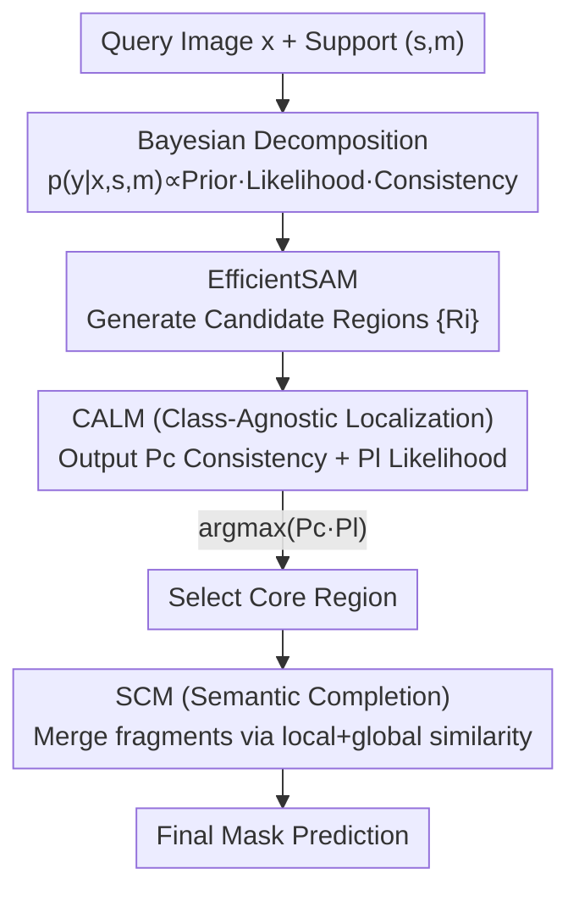

# Bayesian Decomposition and Semantic Completion for Few-shot Semantic Segmentation

**Conference**: CVPR 2026  
**Paper**: [CVF Open Access](https://openaccess.thecvf.com/content/CVPR2026/html/Shi_Bayesian_Decomposition_and_Semantic_Completion_for_Few-shot_Semantic_Segmentation_CVPR_2026_paper.html)  
**Code**: None  
**Area**: Few-shot Semantic Segmentation  
**Keywords**: Few-shot Semantic Segmentation, Bayesian Decomposition, SAM, Class-agnostic Localization, Semantic Completion

## TL;DR
The authors decompose Few-shot Semantic Segmentation (FSS) into three lightweight probabilistic terms—Prior, Likelihood, and Class Consistency—using the Bayesian formula. The method utilizes SAM to generate structured candidate regions, a small binary classification network (CALM) to estimate likelihood and consistency simultaneously, and a Semantic Completion Module (SCM) to merge regional fragments into a complete mask. It achieves SOTA performance on PASCAL-5$^i$ and COCO-20$^i$ with high efficiency.

## Background & Motivation
**Background**: FSS aims to segment new classes in a query image given only a few annotated support samples. Mainstream approaches follow two paths: metric-based methods, which extract class prototypes from support samples and calculate similarity with query features, and large model-based methods (diffusion models, MLLMs), which leverage rich priors to generate class-aware prompts or enhanced features.

**Limitations of Prior Work**: Metric-based methods rely heavily on accurate class prototypes. However, under low-data conditions, prototypes are difficult to estimate accurately and fail when appearance variation is high. While large models provide richer priors, they introduce massive computational overhead, and their performance is still bottlenecked by the quality of class representations.

**Key Challenge**: Both paradigms must explicitly and accurately model the semantic representation of a new class—a task that is fundamentally difficult to guarantee in low-data regimes. Inaccurate prototypes or class representations directly degrade downstream segmentation.

**Goal**: To perform FSS effectively without directly constructing class prototypes or performing precise pixel-wise segmentation.

**Key Insight**: The objective of FSS is the conditional probability $p(y|x,s,m)$. This can be factorized using Bayesian theorem into several "semantically lighter" sub-terms. Each sub-term does not require precise segmentation or explicit prototypes but only needs to judge weak signals such as "structural regions" and "semantic consistency."

**Core Idea**: Rewrite FSS as "Structural Prior $\times$ Likelihood $\times$ Class Consistency" through Bayesian decomposition. This transforms a difficult dense segmentation problem into a simple binary classification task (determining if the query candidate and support belong to the same class) followed by mask completion.

## Method

### Overall Architecture
The core of BPNet is to "fragment by structure, then select and complete by semantics." Given a query image $x$ and a masked support $(s,m)$, the process consists of three steps: ① Using lightweight EfficientSAM to segment the query into class-agnostic candidate regions $\{R_i\}$ (providing structural prior $p(y|x)$ with precise boundaries but no class semantics); ② Feeding each candidate and the support into the Class-Agnostic Localization Module (CALM) to simultaneously obtain class consistency probability $P^c_i$ and likelihood probability $P^l_i$, selecting the highest joint probability region as the core region; ③ Employing the Semantic Completion Module (SCM) to merge fragments semantically consistent with the core region (as SAM often over-segments objects like cars into windows and tires), outputting the final mask.

The method requires no class prototypes or precise segmentation annotations during training, using only binary labels, making it both fast and robust.

### Key Designs

**1. Bayesian Decomposition: Formulating Dense Segmentation as Three Lightweight Probabilistic Terms**

To address the bottleneck of precise prototype construction, the authors start from the probabilistic definition. The FSS objective is $p(y|x,s,m)$. Assuming support $(s,m)$ and query $(x,y)$ are independent, the Bayesian theorem expansion and factorization yield:

$$p(y|x,s,m) = \frac{p(y|x)\cdot p(m|s,x,y)\cdot p(s|x,y)}{p(s,m|x)}$$

Neglecting the normalization constant $p(s|x)$ independent of $y$, the proportional form is:

$$p(y|x,s,m) \propto p(y|x)\cdot p(m|s,x,y)\cdot p(s|x,y)$$

Each term serves a specific purpose: the **Prior** $p(y|x)$ is a structural query partition (fitting the setting where new classes are unknown, implemented by SAM); the **Likelihood** $p(m|s,x,y)$ represents whether the query hypothesis explains the support mask $m$ (requiring only coarse localization); and the **Class Consistency** $p(s|x,y)$ judges if the query region and support semantics align, without needing specific class IDs. This alleviates low-data overfitting by avoiding explicit prototypes or dense segmentation.

**2. CALM (Class-Agnostic Localization Module): A Binary Network for Likelihood and Consistency**

To minimize overhead, a lightweight binary classification network, CALM, estimates both terms. Given a query region $R_i$ and support $s$, pre-trained ResNet-18 extracts features $F_q, F_s$. The region feature is obtained by element-wise multiplication of $R_i$ and $F_q$, followed by global average pooling, concatenated with the support feature vector. An MLP+sigmoid outputs the **Class Consistency** $P^c_i$:

$$P^c_i = \sigma\big(\mathrm{MLP}(\mathrm{Vec}(R_i\otimes F_q)\oplus \mathrm{Vec}(F_s))\big)$$

**Likelihood** estimation is handled by treating $P^c_i$ as a supervision signal to backpropagate gradients to the support feature map $F_s$, generating a Class Activation Map (CAM) via LayerCAM. The CAM highlights regions in the support most semantically relevant to the query region. Calculating the IoU between the binarized CAM and the ground truth support mask $m$ yields the Likelihood $P^l_i$:

$$P^l_i = \mathrm{IoU}\big(\mathrm{Binarize}(\mathrm{CAM}(F_s, P^c_i)),\, m\big)$$

The core region is selected via $R_{core} = \arg\max_{R_i}(P^l_i\cdot P^c_i)$.

**3. SCM (Semantic Completion Module): Merging Fragments via Local and Global Similarity**

Candidate regions from SAM provide precise boundaries but are often over-segmented. SCM recovers missing parts of an object by comparing each candidate with the core region using two types of similarity. **Local similarity** uses cosine similarity between region features: $sim^{local}_i = \cos(V_i, V_{core})$. 

To capture long-range semantic associations (e.g., car windows vs. tires), **Global similarity** is introduced. Cross-attention interacts candidate features $V_i$ with the global query features $V_q$, yielding context features $V^{context}_i = \mathrm{softmax}\big(\frac{(W_q V_i)(W_k V_q)^\top}{\sqrt{d_k}}\big)(W_v V_q)$. The similarity with the core region is then weighted by consistency and likelihood: $sim^{global}_i = \cos(V^{context}_i, V_{core})\cdot P^c_i\cdot P^l_i$. The final similarity is a fusion: $sim_i = \alpha\, sim^{global}_i + (1-\alpha)\, sim^{local}_i$. Regions with $sim_i > 0.5$ are merged.

### Loss & Training
Training uses only binary labels without dense segmentation supervision. A SAM region is considered a positive sample if its overlap with the ground truth mask is $> 0.7$. BPNet is implemented in PyTorch and trained for 200 epochs on an RTX 3090. SAM results are pre-cached to save memory and accelerate training.

## Key Experimental Results

### Main Results
Mean mIoU on PASCAL-5$^i$ and COCO-20$^i$ (averaged over 10 repetitions):

| Dataset | Method | Backbone | 1-shot mean | 5-shot mean |
|--------|------|----------|-------------|-------------|
| PASCAL-5$^i$ | ABCB | ResNet | 70.6 | 73.6 |
| PASCAL-5$^i$ | LLaFS | LLM | 73.5 | 75.6 |
| PASCAL-5$^i$ | VRP-SAM | SAM | 71.9 | - |
| PASCAL-5$^i$ | **BPNet (ours)** | SAM | **75.7** | **77.1** |
| COCO-20$^i$ | LLaFS | LLM | 53.9 | 60.0 |
| COCO-20$^i$ | VRP-SAM | SAM | 53.9 | - |
| COCO-20$^i$ | **BPNet (ours)** | SAM | **54.2** | **61.6** |

BPNet achieves the best results across both benchmarks. 1-shot performance on PASCAL-5$^i$ exceeds the LLM-based LLaFS by 2.2 points.

### Ablation Study
Module ablation (PASCAL-5$^i$ mIoU):

| Configuration | 1-shot | 5-shot | Description |
|------|--------|--------|------|
| Full (Pl+Pc+SCM) | 75.7 | 77.1 | Complete model |
| w/o Pl | 61.3 | 63.8 | $-$14.4 points |
| w/o Pc | 62.9 | 64.0 | $-$12.8 points |
| w/o SCM | 69.0 | 71.3 | $-$6.7 points |
| Clustering instead of SAM | 52.8 | 55.3 | $-$22.9 points |

### Key Findings
- **Likelihood and Consistency are Indispensable**: Removing either leads to a drop of 14.4 or 12.8 points, indicating that joint modeling is essential for class consistency.
- **Candidate Quality is the Ceiling**: Replacing SAM with simple clustering causes performance to plummet from 75.7 to 52.8, proving that SAM's precise boundaries are a prerequisite for BPNet.
- **Backbone Independence**: Switching from ResNet-18 to ResNet-101 or DenseNet-121 results in minimal fluctuations, while the binary classification head remains significantly faster (5.5 FPS) than traditional segmentation heads (1.2 FPS).

## Highlights & Insights
- **Probabilistic Formulation Bypasses Prototypes**: The method avoids explicit class representations by decomposing the conditional probability and approximating sub-terms with weak signals.
- **CALM Dual-use**: Utilizing the same network for forward-pass consistency and backward-gradient likelihood provides an efficient estimation at no extra cost.
- **Structural Prior vs. Semantic Filtering**: Offloading boundary precision to SAM allow the network to focus solely on high-level semantic matching, fitting the FSS paradigm perfectly.

## Limitations & Future Work
- **Mixed-Class Regions**: If SAM groups foreground and background into a single candidate, SCM cannot separate them, leading to errors.
- **Dependency on SAM**: Performance is tied to SAM's candidate quality. Risks exist in domains where SAM underperforms (e.g., medical or remote sensing imagery).
- **Rough Likelihood Estimation**: Approximation using binarized CAM IoU depends on CAM localization quality and thresholding.

## Related Work & Insights
- **vs. Metric-based (ABCB)**: BPNet bypasses the prototype estimation difficulty, outperforming ABCB by 5.1 points in PASCAL 1-shot.
- **vs. Large Models (LLaFS)**: Lightweight Bayesian decomposition outperforms heavy LLM-based models (75.7 vs. 73.5), demonstrating that probabilistic modeling can be more effective than massive pre-training.

## Rating
- **Novelty**: ⭐⭐⭐⭐⭐ Innovative Bayesian decomposition and dual-use of CALM.
- **Experimental Thoroughness**: ⭐⭐⭐⭐ Solid benchmarks and ablations, though cross-domain testing (medical/remote sensing) is missing.
- **Writing Quality**: ⭐⭐⭐⭐⭐ Clear derivation and well-explained ablation studies.
- **Value**: ⭐⭐⭐⭐ High efficiency and SOTA performance; the "Foundation Model + Lightweight Filtering" paradigm is highly transferable.

## Related Papers

- [\[CVPR 2026\] Selective, Regularized, and Calibrated: Harnessing Vision Foundation Models for Cross-Domain Few-Shot Semantic Segmentation](selective_regularized_and_calibrated_harnessing_vision_foundation_models_for_cro.md)
- [\[CVPR 2026\] PrAda: Few-Shot Visual Adaptation for Text-Prompted Segmentation](prada_few-shot_visual_adaptation_for_text-prompted_segmentation.md)
- [\[CVPR 2026\] Cross-Domain Few-Shot Segmentation via Multi-view Progressive Adaptation](cross-domain_few-shot_segmentation_via_multi-view_progressive_adaptation.md)
- [\[ICML 2025\] Adapter Naturally Serves as Decoupler for Cross-Domain Few-Shot Semantic Segmentation](../../ICML2025/segmentation/adapter_naturally_serves_as_decoupler_for_cross-domain_few-shot_semantic_segment.md)
- [\[AAAI 2026\] Bridging Granularity Gaps: Hierarchical Semantic Learning for Cross-Domain Few-Shot Segmentation](../../AAAI2026/segmentation/bridging_granularity_gaps_hierarchical_semantic_learning_for_cross-domain_few-sh.md)

<!-- RELATED:END -->

<!-- RELATED:START -->

## Related Papers

- [\[CVPR 2026\] Selective, Regularized, and Calibrated: Harnessing Vision Foundation Models for Cross-Domain Few-Shot Semantic Segmentation](selective_regularized_and_calibrated_harnessing_vision_foundation_models_for_cro.md)
- [\[CVPR 2026\] MV3DIS: Multi-View Mask Matching via 3D Guides for Zero-Shot 3D Instance Segmentation](mv3dis_multi-view_mask_matching_via_3d_guides_for_zero-shot_3d_instance_segmenta.md)
- [\[CVPR 2026\] Cross-Domain Few-Shot Segmentation via Multi-view Progressive Adaptation](cross-domain_few-shot_segmentation_via_multi-view_progressive_adaptation.md)
- [\[CVPR 2026\] PromptMoE: A Segmentation Refinement Framework Leveraging Mixture of Experts for Improved Prompting](promptmoe_a_segmentation_refinement_framework_leveraging_mixture_of_experts_for_.md)
- [\[CVPR 2026\] Semantic Alignment in Hyperbolic Space for Open-Vocabulary Semantic Segmentation](semantic_alignment_in_hyperbolic_space_for_open-vocabulary_semantic_segmentation.md)

<!-- RELATED:END -->
